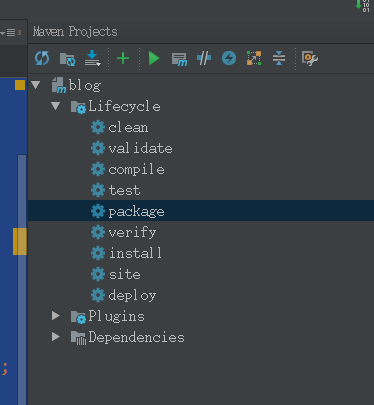

- 开发工具: IDEA
- 应用系统: ubuntu 10.04
- 项目类型: maven
- 工程名称: matrix
- 项目路径:

```
.
├── pom.xml
└── src
     └── main
          ├── java
          │   └── step1
          │         ├── Mapper1.java
          │         ├── MatrixMain.java
          │         └── Reduce1.java
          └── resources
```

### **pom.xml**

```markup
<project xmlns="http://maven.apache.org/POM/4.0.0"
         xmlns:xsi="http://www.w3.org/2001/XMLSchema-instance"
         xsi:schemaLocation="http://maven.apache.org/POM/4.0.0 http://maven.apache.org/xsd/maven-4.0.0.xsd">
    <modelVersion>4.0.0</modelVersion>

    <groupId>matrix</groupId>
    <artifactId>matrix</artifactId>
    <version>1.0-SNAPSHOT</version>

    <dependencies>
        <!-- https://mvnrepository.com/artifact/org.apache.hadoop/hadoop-common -->
        <dependency>
            <groupId>org.apache.hadoop</groupId>
            <artifactId>hadoop-common</artifactId>
            <version>2.8.1</version>
        </dependency>
        <!-- https://mvnrepository.com/artifact/org.apache.hadoop/hadoop-mapreduce-client-core -->
        <dependency>
            <groupId>org.apache.hadoop</groupId>
            <artifactId>hadoop-mapreduce-client-core</artifactId>
            <version>2.8.1</version>
        </dependency>

    </dependencies>

    <build>
        <plugins>
            <plugin>
                <groupId>org.apache.maven.plugins</groupId>
                <artifactId>maven-shade-plugin</artifactId>
                <version>1.2.1</version>
                <executions>
                    <execution>
                        <phase>package</phase>
                        <goals>
                            <goal>shade</goal>
                        </goals>
                        <configuration>
                            <transformers>
                                <transformer
                                        implementation="org.apache.maven.plugins.shade.resource.ManifestResourceTransformer">
                                    <mainClass>step1.MatrixMain</mainClass>
                                </transformer>
                            </transformers>
                        </configuration>
                    </execution>
                </executions>
            </plugin>
            <plugin>
                <groupId>org.apache.maven.plugins</groupId>
                <artifactId>maven-compiler-plugin</artifactId>
                <version>3.6.2</version>
                <configuration>
                    <source>1.8</source>
                    <target>1.8</target>
                </configuration>
            </plugin>
        </plugins>
    </build>

</project>
```

### **Mapper1.java**

```java
package step1;

import org.apache.hadoop.io.LongWritable;
import org.apache.hadoop.io.Text;
import org.apache.hadoop.mapreduce.Mapper;

import java.io.IOException;

/**
 * MapReduce中的Map扩展类
 * 
 * Mapper
 *
 * @author mao-siyu
 */
public class Mapper1 extends Mapper {

    /**
     * 输出的Key
     */
    private Text outKey = new Text();

    /**
     * 输出的Value
     */
    private LongWritable outValue = new LongWritable(1);

    /**
     * 文件中的每读取到一行数据 就会执行一次这个函数
     *
     * @param key
     * @param value
     * @param context
     * @throws IOException
     * @throws InterruptedException
     */
    @Override
    protected void map(Object key, Text value, Context context) throws IOException, InterruptedException {

        // 将每行数据按\t进行拆分
        String[] rowAndLine = value.toString().split("\t");

        for (int i = 1; i < rowAndLine.length; i++) {
            // key值的格式改为
            // 1_4 2_13 3_16 4_19 5_21 6_25 7_14
            // 1_11 2_19 3_22 4_26 5_31 6_32 7_2 .....
            outKey.set(i + "_" + rowAndLine[i] + " ");
            // 将Mapper的输出数据传给Reduce做为它的的输入数据
            context.write(outKey, outValue);
        }
    }

}
```

### **Reduce1.java**

```java
package step1;

import org.apache.hadoop.io.LongWritable;
import org.apache.hadoop.io.Text;
import org.apache.hadoop.mapreduce.Reducer;

import java.io.IOException;

/**
 * MapReduce中的Reduce扩展类
 * 
 * Reducer
 *
 * @author mao-siyu
 */
public class Reduce1 extends Reducer {

    private LongWritable result = new LongWritable();

    @Override
    protected void reduce(Text key, Iterable values, Context context) throws IOException, InterruptedException {
        // 通过value 来统计 key出现的次数
        int sum = 0;
        for (LongWritable value : values) {
            sum += value.get();
        }
        result.set(sum);
        context.write(key, result);
    }
}
```

### **WordMain.java**

```java
package step1;

import org.apache.hadoop.conf.Configuration;
import org.apache.hadoop.fs.FileSystem;
import org.apache.hadoop.fs.Path;
import org.apache.hadoop.io.LongWritable;
import org.apache.hadoop.io.Text;
import org.apache.hadoop.mapreduce.Job;
import org.apache.hadoop.mapreduce.lib.input.FileInputFormat;
import org.apache.hadoop.mapreduce.lib.output.FileOutputFormat;

/**
 * @author mao-siyu
 */
public class MatrixMain {

    /**
     * 在Hadoop中文件输入的路径
     */
    private static String inPath = "/user/msy/hadoop/input";

    /**
     * 在Hadoop中文件输出的路径
     */
    private static String outPath = "/user/msy/hadoop/output";

    /**
     * 在Hadoop上运行
     *
     * @throws Exception
     */
    public void runHadoop() throws Exception {

        // 创建job配置类
        Configuration conf = new Configuration();

        // 创建一个作业的实例
        Job job = Job.getInstance(conf, "word count");
        // 设置job的主类
        job.setJarByClass(MatrixMain.class);
        // 设置 job的Mapper和Reduce类
        job.setMapperClass(Mapper1.class);
        job.setReducerClass(Reduce1.class);

        // 设置Mapper的输出key/value类型
        job.setMapOutputKeyClass(Text.class);
        job.setMapOutputValueClass(LongWritable.class);

        // 设置Reduce的输出key/value类型
        job.setOutputKeyClass(Text.class);
        job.setOutputValueClass(LongWritable.class);

        FileSystem fs = FileSystem.get(conf);
        // 设置文件在Hadoop中的输入路径
        Path inputPath = new Path(inPath);
        // 如果路径不存在就创建一个
        if (!fs.exists(inputPath)) {
            fs.mkdirs(inputPath);
        }
        FileInputFormat.addInputPath(job, inputPath);

        // 设置文件在Hadoop中的输出路径
        Path outputPath = new Path(outPath);
        fs.delete(outputPath, true);
        FileOutputFormat.setOutputPath(job, outputPath);

        // 等待完成退出
        System.exit(job.waitForCompletion(true) ? 0 : 1);
    }

    public static void main(String[] args) throws Exception {

        new MatrixMain().runHadoop();
    }
}
```

### **IDEA 使用maven 打jar包**



### **最后将jar包 发送到 master 服务器的 /home/test-file**

`matrix-1.0-SNAPSHOT.jar`

```ruby
mao-siyu@mao-siyu-PC:~/matrix/target$ scp matrix-1.0-SNAPSHOT.jar root@10.32.156.64:/home/test-file
root@10.32.156.64's password:
matrix-1.0-SNAPSHOT.jar                       100%   29MB  14.4MB/s   00:02    
mao-siyu@mao-siyu-PC:~/matrix/target$
```

# **测试 MapReduce**

```ruby
[root@sp-64 ~]# cd /home/test-file/
[root@sp-64 test-file]# hadoop jar matrix-1.0-SNAPSHOT.jar
```

`jar文件运行后会自动创建文件夹，接下来向文件夹存放要处理的数据文件`

#### **cp.txt 内容**

```ruby
18025   4   13  16  19  21  25  14
18024   11  19  22  26  31  32  2
18023   12  15  16  21  26  29  16
18022   7   14  19  21  22  23  3
18021   3   4   6   11  23  28  14
18020   6   9   10  14  28  30  5
...... 后续的省略
```

### **上传 cp.txt 文件到 HDFS 系统的input文件夹下**

```ruby
[root@sp-64 test-file]# hadoop fs -put cp.txt /user/msy/hadoop/input
```

### **查看上传文件是否成功**

```ruby
[root@sp-64 test-file]# hadoop fs -ls /user/msy/hadoop/input
Found 1 items
-rw-r--r-- 1 root supergroup      54338 2018-03-08 14:43 /user/msy/hadoop/input/cp.txt
[root@sp-64 test-file]#
```

### **在次进行测试**

```ruby
[root@sp-64 test-file]# hadoop jar matrix-1.0-SNAPSHOT.jar
# 以下的输出信息在这里省略
```

### **查看测试结果**

```ruby
[root@sp-64 test-file]# hadoop fs -text /user/msy/hadoop/output/part-r-00000
1_1     435
1_10    58
1_11    49
1_12    40
1_13    29
2_10    152
2_11    132
2_12    143
2_13    123
2_14    111
..... 数据太多只截取其中一部分
```
