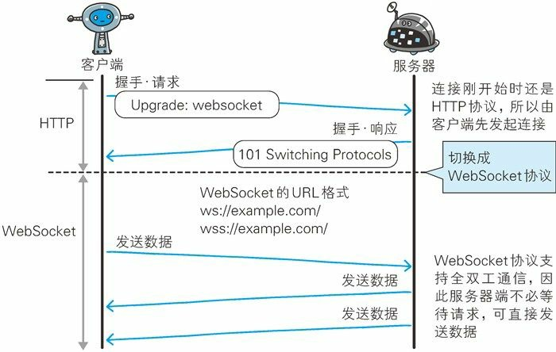

# **使用浏览器进行全双工通信的 WebSocket**

##### 什么是 `socket`?

网络上的两个程序通过一个双向的通信连接实现数据的交换，这个连接的一端称为一个socket。 建立网络通信连接至少要一对端口号(socket)。socket本质是编程接口(API)，对TCP/IP的封装，TCP/IP也要提供可供程序员做网络开发所用的接口，这就是Socket编程接口；

[原文链接](https://baike.baidu.com/item/socket/281150?fr=aladdin "原谅链接")

* * *

##### 什么是`全双工` ?

**全双工 === 双向同时** 全双工通信，又称为双向同时通信，即通信的双方可以同时发送和接收信息的信息交互方式。

* * *

### **WebSocket 设计与功能**

WebSocket,即 Web 浏览器与 Web 服务器之间全双工通信标准。 其中，WebSocket 协议由 `IETF 定为标准`，WebSocket API 由`W3C 定为标准`。 仍在开发中的 WebSocket 技术主要是为了解决 Ajax 和 Comet里 XMLHttpRequest 附带的缺陷所引起的问题。

* * *

### **WebSocket 协议**

一旦 Web 服务器与客户端之间建立起 WebSocket 协议的通信连接, 之后所有的通信都依靠这个专用协议进行。 通信过程中可互相发送JSON、XML、HTML 或图片等任意格式的数据。 由于是建立在 HTTP 基础上的协议,因此连接的发起方仍是客户端, 而一旦确立 WebSocket 通信连接,不论服务器还是客户端, 任意一方都可直接向对方发送报文。

* * *

### **推送功能**

支持由服务器向客户端推送数据的推送功能。 这样,服务器可直接发送数据,而不必等待客户端的请求。

* * *

#### **减少通信量**

只要建立起 WebSocket 连接,就希望一直保持连接状态。 和 HTTP 相比,不但每次连接时的总开销减少,而且由于 WebSocket 的首部信息很小,通信量也相应减少了。

为了实现 WebSocket 通信,在 HTTP 连接建立之后,需要完成一次“握手”(Handshaking)的步骤。

* * *

### **握手·请求**

为了实现 WebSocket 通信,需要用到 HTTP 的 Upgrade 首部字段,告知服务器通信协议发生改变,以达到握手的目的。

```
GET /chat HTTP/1.1
Host: server.example.com
Upgrade: websocket
Connection: Upgrade
Sec-WebSocket-Key: dGhlIHNhbXBsZSBub25jZQ==
Origin: http://example.com
Sec-WebSocket-Protocol: chat, superchat
Sec-WebSocket-Version: 13
```

Sec-WebSocket-Key 字段内记录着握手过程中必不可少的键值。 Sec-WebSocket-Protocol 字段内记录使用的子协议。

子协议按 WebSocket 协议标准在连接分开使用时,定义那些连接的名称。

* * *

### **握手·响应**

对于之前的请求,返回状态码 101 Switching Protocols 的响应。

```
HTTP/1.1 101 Switching Protocols
Upgrade: websocket
Connection: Upgrade
Sec-WebSocket-Accept: s3pPLMBiTxaQ9kYGzzhZRbK+xOo=
Sec-WebSocket-Protocol: chat
```

Sec-WebSocket-Accept 的字段值是由握手请求中的 Sec-WebSocket-Key 的字段值生成的。 成功握手确立 WebSocket 连接之后,通信时不再使用 HTTP 的数据帧,而采用 WebSocket 独立的数据帧。 

* * *

## **总结**

由图可见, 连接刚开始时还是HTTP协议, 所以由客户端先发起连接. 其中重要的一点是 HTTP 首部字段 Upgrade: websocket, 这意味着告诉服务器, 接下来后续的请求协议`升级为 WebSocket 协议`

`文章内容选自 HTTPS图解`
