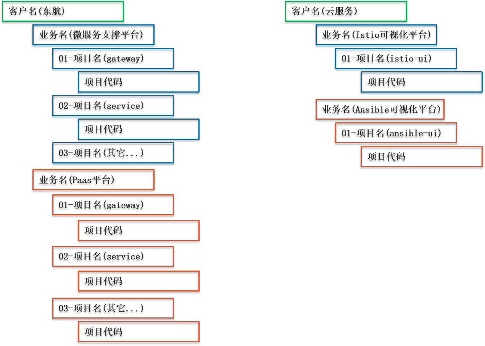

###### **[安装 docker-compose](http://www.dev-share.top/2019/06/12/%e5%ae%89%e8%a3%85-docker-compose/ "安装 docker-compose")**

###### **[DockerHub](https://hub.docker.com/r/gitlab/gitlab-ce "DockerHub")**

###### docker-compose 使用域名配置

```ruby
[root@gitlab ~]# mkdir -p /home/deploy/gitlab-ce-13 && cd /home/deploy/gitlab-ce-13
[root@gitlab gitlab-ce-13]# cat > docker-compose.yml << ERIC
version: '3.1'
services:
  gitlab:
    image: gitlab/gitlab-ce:15.7.9-ce.0
    container_name: gitlab-ce
    restart: always
    privileged: true
    user: root
    # gitlab 访问地址
    hostname: 'git.dev-share.top'
    environment:
      GITLAB_OMNIBUS_CONFIG: |
        # git clone 的地址
        external_url 'http://git.dev-share.top'
        gitlab_rails['time_zone'] = 'Asia/Shanghai'
        # 开启Pages 使用 GitLab Pages，可以直接从 GitLab 存储库托管您的静态网站
        # pages_external_url 'http://git.dev-share.top'
        # gitlab_pages['enable'] = true
        ## 默认备份的路径
        #gitlab_rails['backup_path'] = "/var/opt/gitlab/backups"
        gitlab_rails['gitlab_email_from'] = 'mao_siyu@qq.com'
    ports:
      - '8080:80'
      - '22:22'
    volumes:
      - /etc/localtime:/etc/localtime
      - ./config:/etc/gitlab
      - ./data:/var/opt/gitlab
      - ./logs:/var/log/gitlab
ERIC

[root@gitlab gitlab-ce-13]#
```

* * *

###### docker-compose 使用IP配置 并且修改 **`git clone 端口`**

```ruby
[root@gitlab ~]# mkdir -p /home/deploy/gitlab-ce-13 && cd /home/deploy/gitlab-ce-13
[root@gitlab gitlab-ce-13]# cat > docker-compose.yml << ERIC
version: '3.1'
services:
  gitlab:
    image: gitlab/gitlab-ce:15.7.9-ce.0
    container_name: gitlab-ce
    restart: always
    privileged: true
    user: root
    hostname: '192.168.2.10'
    environment:
      GITLAB_OMNIBUS_CONFIG: |
        # 设定 gitlab clone 地址
        external_url 'http://192.168.2.10:8016'
        # 设定 gitlab clone SSH时的端口，也可改变默认的22端口为8022
        #gitlab_rails['gitlab_shell_ssh_port'] = '8022'
        # 开启Pages 使用 GitLab Pages，可以直接从 GitLab 存储库托管您的静态网站
        # pages_external_url 'http://192.168.2.10:8016'
        # gitlab_pages['enable'] = true
        ## 默认备份的路径
        #gitlab_rails['backup_path'] = "/var/opt/gitlab/backups"
        gitlab_rails['gitlab_shell_ssh_port'] = '22'
        gitlab_rails['time_zone'] = 'Asia/Shanghai'
        gitlab_rails['gitlab_email_from'] = 'mao_siyu@qq.com'
        postgresql['max_worker_processes'] = 8
        postgresql['shared_buffers'] = "256MB"
        ## 节省空间，关闭不使用的监控
        redis['maxmemory'] = "2gb"
        prometheus['enable'] = false
        monitoring_role['enable'] = false
        grafana['enable'] = false
        alertmanager['enable'] = false
        node_exporter['enable'] = false
        redis_exporter['enable'] = false
        gitlab_exporter['enable'] = false
        postgres_exporter['enable'] = false

    ports:
      # 设定 gitlab外网访问地址的端口
      # 这个端口最好与 external_url端口一致， 否则登录界面的端口 与 git clone的端口不一致， 会导致使用、管理起来比较麻烦
      - '8016:8016'
      # 也可重新映射容器中的22端口
      #- '8022:22'
      - '22:22'
    volumes:
      - /etc/localtime:/etc/localtime
      - ./config:/etc/gitlab
      - ./data:/var/opt/gitlab
      - ./logs:/var/log/gitlab

ERIC

[root@gitlab gitlab-ce-13]#
```

* * *

###### 设置中文

登录后输入 **http://192.168.2.10:8016`/-/profile/preferences`** 修改语言为中文

* * *

###### **[数据备份与恢复](http://www.dev-share.top/2019/03/06/gitlab-%e6%95%b0%e6%8d%ae%e5%a4%87%e4%bb%bd%e4%b8%8e%e6%81%a2%e5%a4%8d/ "数据备份与恢复")**

* * *

* * *

* * *

* * *

* * *

* * *

### **常见问题**

###### 使用命令行重置管理员密码

> `gitlab-rake "gitlab:password:reset[root]"`

```bash
┌──(root@harbor-new 17:11:34) - [/data/gitlab-ce]
└─# docker-compose exec gitlab-ce /bin/bash gitlab-rake "gitlab:password:reset[root]"
Enter password:
Confirm password:
Password successfully updated for user with username root.

```

* * *

* * *

* * *

**如果在容器启动时 不指定 `--hostname='你的域名'` 就会出现如下问题**

gitlab服务器启动后, 新建一个项目, 但项目的地址是这样的, 本来应该是域名位置确变成了 Docker容器的ID http://eac9d06da1f7/Groups-SmallPrograms/test.git

##### 以下是非Docker安装的服务器的修改方法

**在gitlab的安装目录下找到 `gitlab-rails/etc/gitlab.yml`**

```ruby
[root@shared-server etc]# pwd
/mnt/gitlab/data/gitlab-rails/etc
[root@shared-server etc]# ll
total 52
-rw-r--r-- 1 root root   507 Oct 13 23:25 database.yml
-rw-r--r-- 1 root root   129 Oct 13 23:25 gitlab_shell_secret
-rw-r--r-- 1 root root    45 Oct 13 23:25 gitlab_workhorse_secret
-rw-r--r-- 1 root root 16781 Oct 19 13:41 gitlab.yml
-rw-r--r-- 1 root root  1383 Oct 13 23:25 rack_attack.rb
-rw-r--r-- 1 root root    59 Oct 13 23:25 resque.yml
-rw-r--r-- 1 root root  4103 Oct 13 23:25 secrets.yml
-rw-r--r-- 1 root root  1732 Oct 13 23:28 unicorn.rb
[root@shared-server etc]# vim gitlab.yml
```

###### 将 host: eac9d06da1f7 改为 自己的域名

```
  ## GitLab settings
  gitlab:
    ## Web server settings (note: host is the FQDN, do not include http://)
    # host: eac9d06da1f7
    host: git.dev-share.top
    port: 80
    https: false
```

###### 重启 Docker 容器

```ruby
[root@shared-server etc]# docker restart eac9d06da1f7
```

* * *

* * *

* * *

* * *

* * *

* * *

###### gitlab 规范使用




* * *

* * *

* * *

* * *

* * *

* * *
