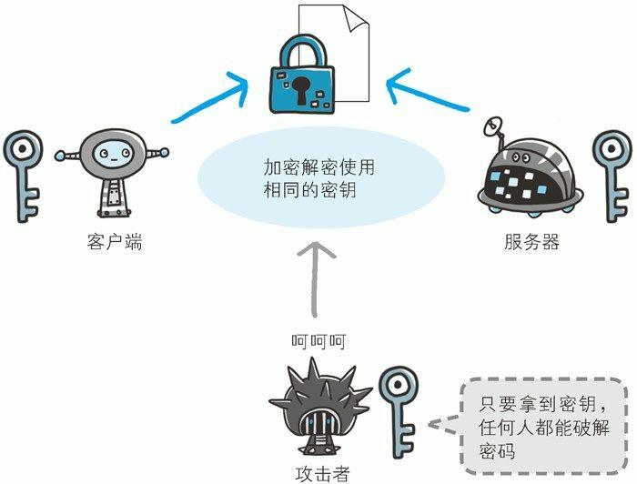
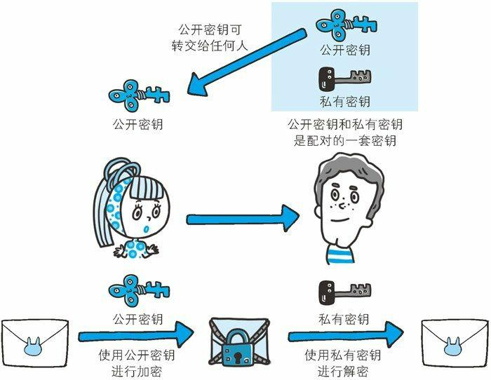
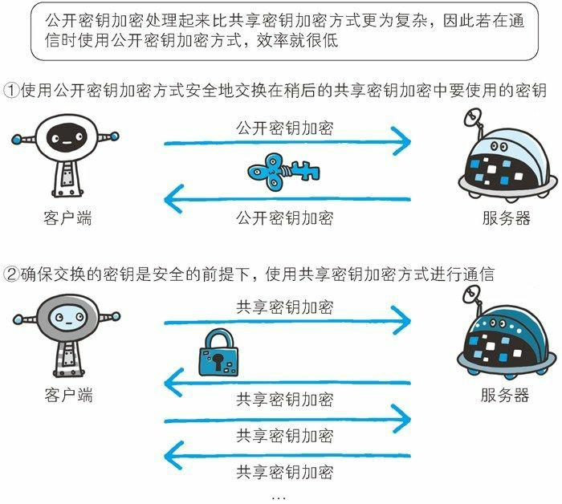
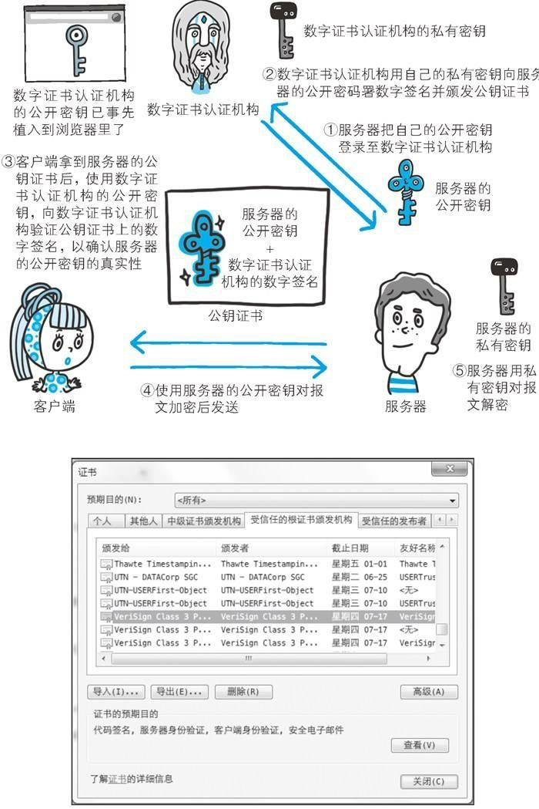

##### **以下节选自图解HTTP**

##### **相互交换密钥的公开密钥加密技术**

在对 SSL 进行讲解之前,我们先来了解一下加密方法。 SSL 采用一种叫做公开密钥加密(Public-key cryptography)的加密处理方式。

近代的加密方法中加密算法是公开的,而密钥却是保密的。 通过这种方式得以保持加密方法的安全性。

加密和解密都会用到密钥。 没有密钥就无法对密码解密,反过来说,任何人只要持有密钥就能解密了。 如果密钥被攻击者获得,那加密也就失去了意义。

* * *

##### **共享密钥加密的困境**

加密和解密同用一个密钥的方式称为共享密钥加密(Common key crypto system),也被叫做对称密钥加密。 

以共享密钥方式加密时必须将密钥也发给对方。 可究竟怎样才能安全地转交?在互联网上转发密钥时,如果通信被监听那么密钥就可会落入攻击者之手,同时也就失去了加密的意义。 另外还得设法安全地保管接收到的密钥。 

* * *

##### **使用两把密钥的公开密钥加密**

公开密钥加密方式很好地解决了共享密钥加密的困难。

公开密钥加密使用一对非对称的密钥。 一把叫做私有密钥(private key), 另一把叫做公开密钥(public key)。 顾名思义,私有密钥不能让其他任何人知道,而公开密钥则可以随意发布,任何人都可以获得。

使用公开密钥加密方式,发送密文的一方`使用对方的公开密钥进行加密`处理,对方收到被加密的信息后,再`使用自己的私有密钥进行解密`。 利用这种方式,不需要发送用来解密的私有密钥,也不必担心密钥被攻击者窃听而盗走。

另外,要想根据密文和公开密钥,恢复到信息原文是异常困难的,因为解密过程就是在对离散对数进行求值,这并非轻而易举就能办到。 退一步讲,如果能对一个非常大的整数做到快速地因式分解,那么密码破解还是存在希望的。 但就目前的技术来看是不太现实的。 

* * *

##### **HTTPS 采用混合加密机制**

HTTPS 采用共享密钥加密和公开密钥加密两者并用的混合加密机制。 若密钥能够实现安全交换,那么有可能会考虑仅使用公开密钥加密来通信。 但是`公开密钥加密`与共享密钥加密相比, 其`处理速度要慢`。

所以应充分利用两者各自的优势,将多种方法组合起来用于通信。 在交换密钥环节使用公开密钥加密方式,之后的建立通信交换报文阶段则使用共享密钥加密方式。 

* * *

##### **证明公开密钥正确性的证书**

遗憾的是,公开密钥加密方式还是存在一些问题的。 那就是无法证明公开密钥本身就是货真价实的公开密钥。 比如,正准备和某台服务器建立公开密钥加密方式下的通信时,如何证明收到的公开密钥就是原本预想的那台服务器发行的公开密钥。 或许在公开密钥传输途中,真正的公开密钥已经被攻击者替换掉了。

为了解决上述问题,可以使用由数字证书认证机构(CA,Certificate Authority)和其相关机关颁发的公开密钥证书。

数字证书认证机构处于客户端与服务器双方都可信赖的第三方机构的立场上。 威瑞信(VeriSign)就是其中一家非常有名的数字证书认证机构。 我们来介绍一下数字证书认证机构的业务流程。 首先,服务器的运营人员向数字证书认证机构提出公开密钥的申请。 数字证书认证机构在判明提出申请者的身份之后,会对已申请的公开密钥做数字签名,然后分配这个已签名的公开密钥,并将该公开密钥放入公钥证书后绑定在一起。

服务器会将这份由数字证书认证机构颁发的公钥证书发送给客户端,148以进行公开密钥加密方式通信。 公钥证书也可叫做数字证书或直接称为证书。

接到证书的客户端可使用数字证书认证机构的公开密钥,对那张证书上的数字签名进行验证, 一旦验证通过,客户端便可明确两件事: \* 一,认证服务器的公开密钥的是真实有效的数字证书认证机构。 \* 二,服务器的公开密钥是值得信赖的。

此处认证机关的公开密钥必须安全地转交给客户端。 使用通信方式时,如何安全转交是一件很困难的事,因此,多数浏览器开发商发布版本时,会事先在内部植入常用认证机关的公开密钥。 

* * *

* * *

* * *
