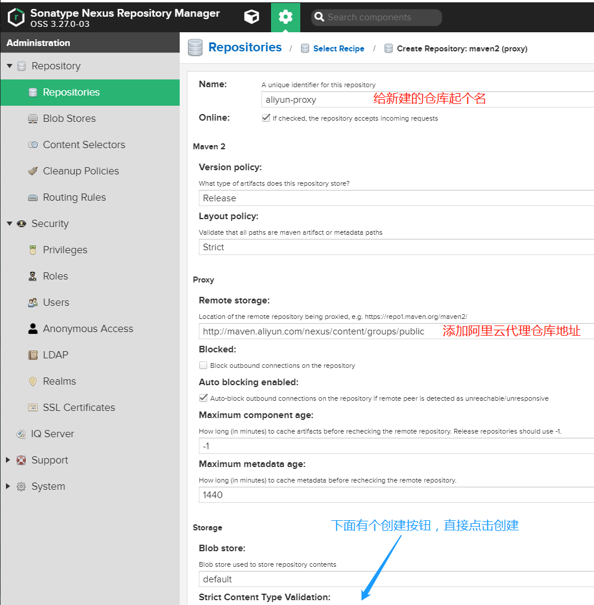

###### **[DockerHub](https://hub.docker.com/r/sonatype/nexus3/tags "DockerHub")**

* * *

###### Docker-Compose 部署Nexus私服

```ruby
mkdir -p /home/deploy/nexus/ && cd /home/deploy/nexus/

cat > docker-compose.yaml << ERIC
version: '3.1'

services:

  nexus:
    image: sonatype/nexus3:3.27.0
    restart: always
    privileged: true
    user: root
    container_name: nexus
    ports:
      - 8081:8081
    volumes:
      # 容器与宿主机时间同步
      - /etc/localtime:/etc/localtime
      - ./nexus-data:/nexus-data
    environment:
      TIME_ZONE: Asia/Shanghai

ERIC

```

* * *

###### 访问 web页面

http://192.168.20.91:8081/ admin 管理员密码在这个文件目录下 `./nexus-data/admin.password`

* * *

###### **`重点`： 让Maven 优先使用本地Nexus私服， 然后在Nexus私服中配置如何访问阿里云镜像仓库**

**步骤如下：** Repository --> Repositories --> Select Recipe --> Create Repository: maven2 (proxy)



* * *

* * *

* * *

###### 修改maven 配置文件settings.xml

```markup
<?xml version="1.0" encoding="UTF-8"?>

<settings xmlns="http://maven.apache.org/SETTINGS/1.0.0"
          xmlns:xsi="http://www.w3.org/2001/XMLSchema-instance"
          xsi:schemaLocation="http://maven.apache.org/SETTINGS/1.0.0 http://maven.apache.org/xsd/settings-1.0.0.xsd">

    <!-- 第一步： 告诉Maven 访问私服的用户名与密码是什么 -->
    <servers>
        <server>
            <id>local-nexus-userid</id>
            <username>admin</username>
            <password>rd123456</password>
        </server>
    </servers>

    <!-- 第二步： 告诉Maven 从哪儿下载文件 -->
    <mirrors>

        <!-- 告诉Maven 优先使用本地Nexus私服，在Nexus私服中配置访问阿里云镜像仓库 -->
        <mirror>
            <!-- 告诉Maven 使用哪个用户/密码 -->
            <id>local-nexus-userid</id>
            <mirrorOf>nexus-snapashots,nexus-releases,central</mirrorOf>
            <name>Local Nexus aliyun</name>
            <!-- 本地Nexus私服地址 -->
            <url>http://192.168.20.91:8081/repository/aliyun-proxy/</url>
        </mirror>

    </mirrors>

    <!-- 第三步： 告诉Maven 下载下来的文件放到哪儿 -->
    <localRepository>/home/deploy/maven/repository</localRepository>

</settings>

```

* * *

* * *

* * *
