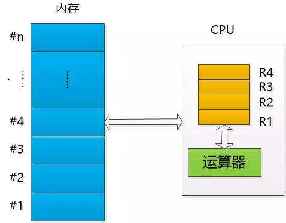

##### CPU 和 内存

CPU和内存其实特别简单，内存就是一个个的小格子， 每个格子都有一个编号， 格子中的数据可以被CPU所读写。

**CPU 内部的构造超级复杂， 但我们这次只关注两个东西：**

一是运算器，可以做各种运算， 但是有个限制，这个**运算器不能直接操作内存进行运算**， 他在运算时使用的是内部的数据格子（学名叫寄存器）， 为了区分开， 我把他们叫做R1,R2,R3,R4,假设只有这么4个， 统称Rx。

##### `CPU必须把数据装载到寄存器中才能运算。`

CPU运行速度快的令人发指， 但是它能做的事情却简单的令人发指， 主要是以下四种： 1. 从内存的某个格子中读取数据放入自己内部的寄存器Rx 2. 把Rx的数据写入内存的某个格子中（会把原有数据覆盖） 3. 进行数学运算和逻辑运算 4. 根据条件进行跳转

加入从1加到100， 我们的指令如下所示，CPU需要依次执行（除非遇到跳转指令）， 直到结束：

- 指令1 ： 把数字0 放到 编号为 #1 的格子里
- 指令2 ： 把数字1 放到 编号为 #2 的格子里
- 指令3 ： 把#1号格子的数取出放入CPU寄存器R1 （即 R1的初始值为0）
- 指令4 ： 把#2号格子的数取出放入CPU寄存器R2 （即 R2 的初始值为1）
- 指令5 ： 把R2的值和100比较， `如果小于等于100，执行第6个指令， 否则执行第9个指令`
- 指令6 ： 把R1和R2的数据加起来， 结果放入R1
- 指令7 ： 把R2的数值加1
- 指令8 ： `跳转到第5个指令`
- 指令9 ： 把R1的值写回到 编号为 #1的格子里 (注：#1号格子的值就是结果)

这里提示一下： R2表示的就是从1到100这些数字， R1存放的就是中间和。

现在，请你在脑子里边模拟一下这个过程， 看看程序能不能成功结束， 把最终结果放到#1号格子里。

[作者在这](https://mp.weixin.qq.com/s?__biz=MzAxOTc0NzExNg==&mid=2665513478&idx=1&sn=400cedb83e396021cbe04e3505cd7c2c&chksm=80d67a45b7a1f35371e2ba94c422adb3c55674eb0d496feeaa7e06f5ea46dd23d68f5c1270e2&scene=21#wechat_redirect "作者在这")
