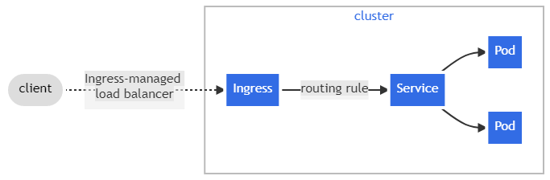
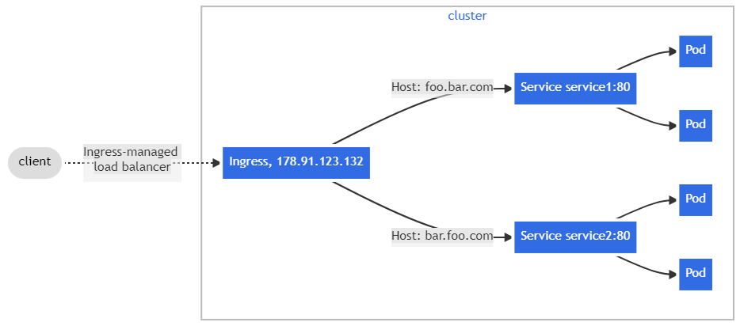
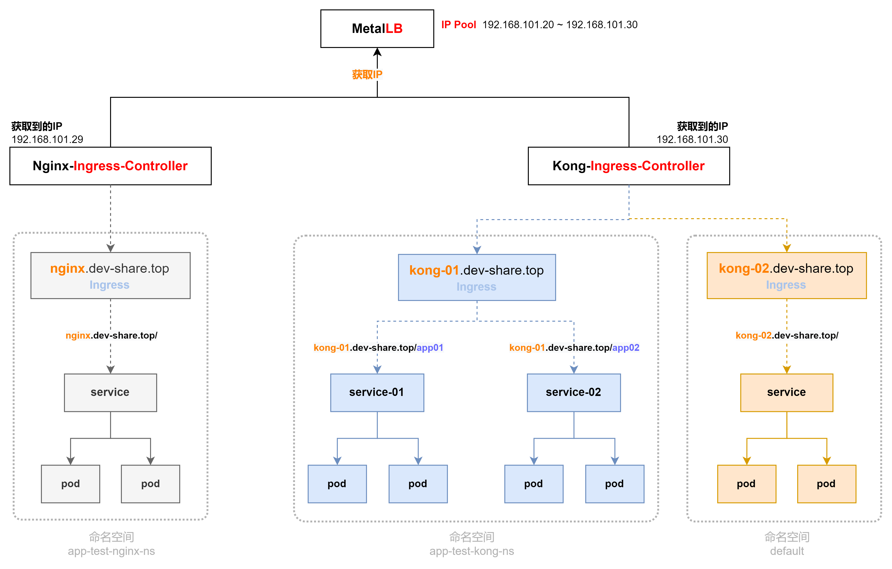
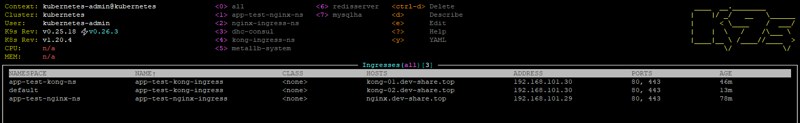

##### **基础知识点**

* * *

###### **[K8s官网 Ingress](https://kubernetes.io/zh-cn/docs/concepts/services-networking/ingress/ "K8s官网 Ingress")**

* * *

###### **Ingress、Ingress Controller 是什么？**

  简单点说，`Ingress Controller` 就是类似一个nginx，而`Ingress`则是这个`nginx的配置`



* * *

###### **Ingress Controller 工作原理**

  **Ingress Controller** 通过和kubernetes api交互，动态的去感知集群中 **`Ingress规则`变化** 然后读取它，按照自定义的规则，规则就是写明了`哪个域名对应哪个service`或者单个域名多个location形式，生成一段nginx配置再动态注入到 **nginx-ingress-control的`Pod里`** ， **这个Ingress Controller的Pod里运行着一个`Nginx服务`** ， **控制器会把生成的Nginx配置写入/etc/nginx/nginx.conf文件中 然后 `reload`一下使配置生效**。

* * *

  `Ingress` 公开了从集群外部到集群内 services 的 HTTP/HTTPS 路由。 流量路由由 Ingress 资源上定义的规则控制。

```ruby
         [  互联网  ]
            --|--
              V
    [ Ingress Controller  ]
         --|-----|--
           V     V
         [ Ingress ]
         --|-----|--
           V     V
         [ Services ]
```

* * *

##### **`重点`**

  **`Ingress`** 只是 Kubernetes 中的 **`配置路由的规则`(通俗的讲，就是配置哪些url地址，转发到哪些service上，它就是个`网关`)** ；   **`Ingress Controller`** 才是 **监听 `80/443` 端口**，并根据 **`Ingress`** 上配置的 **`路由规则`** 执行 **`HTTP/HTTPS`** 路由转发的组件。   **`Ingress Controller`** 有多种实现可供选择，比较常用的有 `Traefic`、 `Nginx Ingress Controller`等。   内部程序都是使用80端口(http协议)， 如果想让外部 **`强制`** 使用443端口(https协议)， 只需要在 `Ingress配置文件` 里面加入`tls`并 **强制 http 转发到 https**



* * *

###### **[Ingress 资源](https://kubernetes.io/zh/docs/concepts/services-networking/ingress/#ingress-%E8%B5%84%E6%BA%90 "Ingress 资源")**

###### **[Ingress 详解](https://kuboard.cn/learning/k8s-intermediate/service/ingress.html#ingress-controller "Ingress 详解")**

* * *

* * *

* * *

#### **复杂的 Ingress Controller 架构图**



* * *

###### **[部署 Nginx Ingress Controller](%e4%bd%bf%e7%94%a8-helm-3-%e5%ae%89%e8%a3%85-nginx-ingress-controller "部署 Nginx Ingress Controller")**

###### **[部署 Kong Ingress Controller](%e4%bd%bf%e7%94%a8-helm-3-%e5%ae%89%e8%a3%85-kong-ingress-controller "部署 Kong Ingress Controller")**

###### **`注意：`Ingress中配置的 `host` 一定不能重复**

* * *

**多 Ingress Controller 部署后的结果展示图** 

* * *

* * *

* * *
