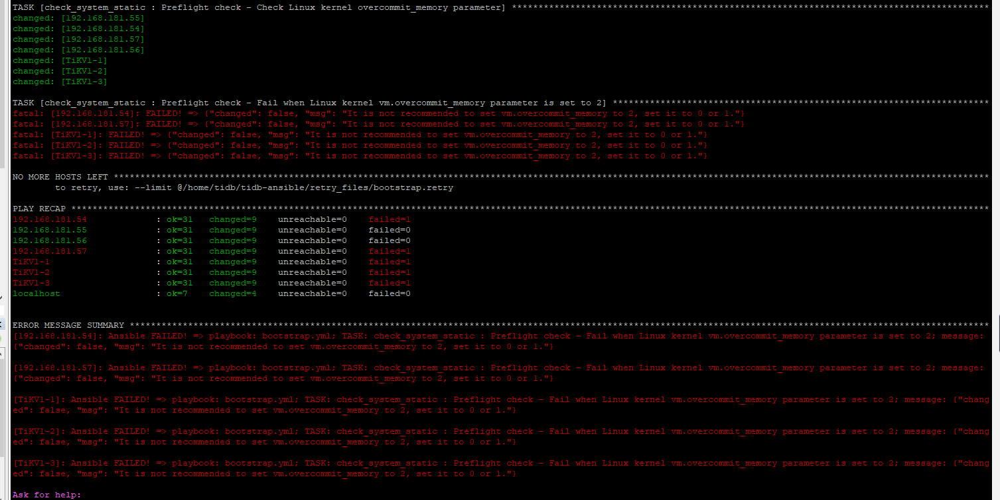

##### 前置条件

- 系统版本 CentOS Linux release 7.6.1810 (Core)
- kernel 版本 4.20.10-1.el7.elrepo.x86\_64
- TiDB 版本 3.0.5
- 内存 32G
- CPU 16 Core

##### 注意事项

**TiDB不允许修改 操作系统内存分配策略为 `2`，只允许为 `0` 或 `1`**

[](https://asktug.com/uploads/default/original/2X/6/6bfeb96155363daf4ab03a63b19df11b661443d6.png)

[TUG修改内存使用策略导致 TiDB自动下线](https://asktug.com/t/tidb/1716/4 "TUG修改内存使用策略导致 TiDB自动下线")

[什么是操作系统内存分配策略？](http://www.dev-share.top/2019/11/04/linux-oom-killer/ "什么是操作系统内存分配策略？")

* * *

##### 调整TiDB-Server的内存使用上限

###### 1 修改 `inventory.ini`

- 根据自己机器实际的内存来设置
- 当 TiDB-Server 进程的 **`常驻内存`** 超过这个限制，进程将被杀死
- 并且在TiDB-Server的日志中抛出 OOM 异常

```yml
.....
# 常驻内存上限
MemoryLimit = 25G
.....
```

**注：这个操作改变的是 `/etc/systemd/system/tidb-4000.service` 文件中的配置**

```ruby
[root@hostname ~]# cat /etc/systemd/system/tidb-4000.service | grep MemoryLimit
MemoryLimit=25G
[root@hostname ~]#

```

[TiDB Server 常驻内存与实际堆内存相差较大](https://asktug.com/t/tidb-server/1679/5 "TiDB Server 常驻内存与实际堆内存相差较大")

###### 2 滚动更新 tidb (修改完配置文件一定要更新配置)

```ruby
[root@hostname ~]# ansible-playbook rolling_update.yml
```
