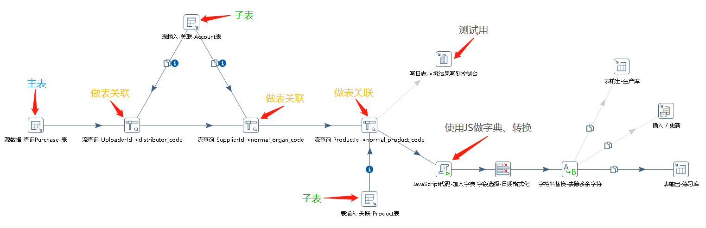

##### 什么是 ETL

> - **提取-转换-加载**（ETL）是一种在存储系统之间进行数据转换和迁移的常用方法。ETL 作业通常会周期性地触发，将数据从事务型数据库拷贝到分析型数据库或数据仓库。

* * *

###### **[Kettle官网](http://www.kettle.be/ "Kettle官网")**

###### **[Kettle中文网](http://www.kettle.org.cn/ "Kettle中文网")**

###### **[下载Kettle-8.2.x](https://s3.amazonaws.com/kettle-neo4j/kettle-neo4j-remix-8.2.0.7-719-REMIX.zip "下载Kettle-8.2.x") 1.2G左右**
