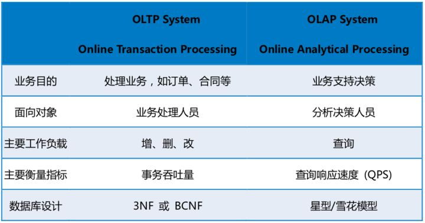

* * *

##### **OLTP**【On-Line `Transaction` Processing】 `事务`处理

**(系统主要用于大量`写`操作)**

- 业务场景：涉及到多用户大量并发的操作
- 数据库： 主要用于**事务处理** `增、删、改`
- 数据库选型：`操作型` 数据库

* * *

##### **OLAP**【On-Line `Analytical` Processing】 `分析`处理

**(系统主要用于大量`读`操作)**

- 业务场景：主要是做大量的数据统计操作，例如企业报表
- 数据库： 主要用于**分析处理** `查`
- 数据库选型：`决策型` 数据库

* * *

##### HTAP

- 业务场景：即有大量的数据统计，也有多用户大量并发的操作
- 混合 **OLTP + OLAP**
- 数据库选型：`混合型` 数据库

* * *

* * *

**[什么是 吞吐量](http://www.dev-share.top/2019/11/07/%e4%bb%80%e4%b9%88%e6%98%af-%e5%90%9e%e5%90%90%e9%87%8f/ "什么是 吞吐量")**
