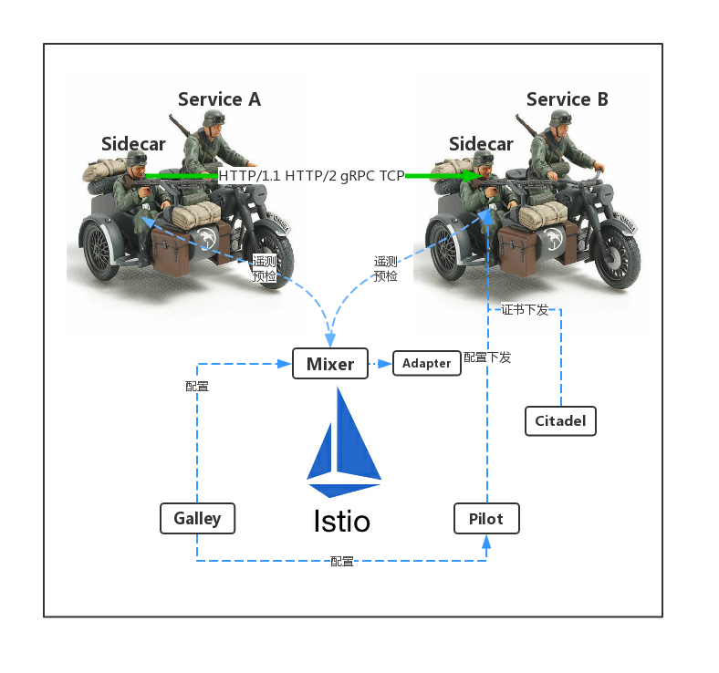

##### 需要了解的知识点

- **[istio社区论坛](https://discuss.istio.io/ "istio社区论坛")**
- **[深入解读 Service Mesh 背后的技术细节 by 刘超](https://www.cnblogs.com/163yun/p/8962278.html "深入解读 Service Mesh 背后的技术细节 by 刘超")**
- **[Istio流量管理实现机制深度解析 by 赵化冰](https://zhaohuabing.com/post/2018-09-25-istio-traffic-management-impl-intro/ "Istio流量管理实现机制深度解析 by 赵化冰")**
- **[Service Mesh架构反思：数据平面和控制平面的界线该如何划定？by 敖小剑](https://skyao.io/post/201804-servicemesh-architecture-introspection/ "Service Mesh架构反思：数据平面和控制平面的界线该如何划定？by 敖小剑")**
- **[理解 Istio Service Mesh 中 Envoy 代理 Sidecar 注入及流量劫持 by 宋净超](https://jimmysong.io/posts/envoy-sidecar-injection-in-istio-service-mesh-deep-dive/ "理解 Istio Service Mesh 中 Envoy 代理 Sidecar 注入及流量劫持 by 宋净超")**
- **[Service Mesh 深度学习系列——Istio源码分析之pilot-agent模块分析 by 丁轶群](http://www.servicemesher.com/blog/istio-service-mesh-source-code-pilot-agent-deepin "Service Mesh 深度学习系列——Istio源码分析之pilot-agent模块分析 by 丁轶群")**

* * *

##### **什么是服务网格？什么是 Sidecar模式？Istio 它能解决什么问题？**

* * *

-   **`Service Mesh`** 又译作 **`服务网格`** ，作为服务间通信的基础设施层。如果用一句话来解释什么是服务网格，可以将它比作是应用程序或者说微服务间的 TCP/IP，负责服务之间的 **`网络调用、限流、熔断和监控`。** **服务网格有如下几个特点：**
    
    1. 屏蔽分布式系统通信的复杂性(负载均衡、服务发现、认证授权、监控追踪、流量控制等等)，服务只用关注业务逻辑
    2. 轻量级网络代理
    3. 真正的语言无关，服务可以用任何语言编写，只需和Service Mesh通信即可，应用程序无感知
    4. 解耦应用程序，对应用透明，Service Mesh组件可以单独升级
    
    **服务网格中分为`控制平面`和`数据平面`** ，当前流行的两款开源的服务网格 **Istio** 和 **Linkerd** 实际上都是这种架构，只不过 **Istio** 的划分更清晰，而且部署更零散，很多组件都被拆分
    
    - **Istio 的划分**
        
        1. **`控制平面`** 中包括 **Mixer**、**Pilot**、**Citadel**
        2. **`数据平面`** 默认是用 **Envoy**
    - **Linkerd 的划分**
        
        1. **`控制平面`** **namerd**
        2. **`数据平面`** **Linkerd**

* * *

**数据平面作用：**

- **服务发现**：探测所有可用的上游或后端服务实例
- **健康检测**：探测上游或后端服务实例是否健康，是否准备好接收网络流量
- **流量路由**：将网络请求路由到正确的上游或后端服务
- **负载均衡**：在对上游或后端服务进行请求时，选择合适的服务实例接收请求，同时负责处理超时、断路、重试等情况
- **身份验证和授权**：对网络请求进行身份验证、权限验证，以决定是否响应以及如何响应，使用 mTLS 或其他机制对链路进行加密等
- **链路追踪**：对于每个请求，生成详细的统计信息、日志记录和分布式追踪数据，以便操作人员能够理解调用路径并在出现问题时进行调试
- 简单来说，**数据平面就是负责有条件地转换、转发以及观察进出服务实例的每个网络包**。典型的数据平面实现有：**Linkerd、NGINX、HAProxy、Envoy、Traefik**

* * *

**控制平面作用:**

- **服务发现**（Pilot）
- **配置**（Galley）
- **证书生成**（Citadel）
- **可扩展性**（Mixer）
- Istio 的 控制平面 本身就是一种现代的云原生应用程序。它从一开始就作为一组微服务而构建。各个 Istio 组件都被编写并部署为单独的微服务

* * *

-   **`Sidecar`** 又译作 **`边车模式`** ， 边车模式是一种分布式架构的设计模式，可以将它理解为以代理的方式来管理微服务。 **`边车模式`** 通过给应用服务加装一个 **`边车`** 来达到 **`控制`和`逻辑`的`分离`与`解耦`**。 

* * *

-   **`Istio`** 企业**上云平台**会给 **DevOps** 团队带来压力。为了 **`可移植性`** ，开发人员必须使用微服务来构建应用，同时运维人员也正在管理着 **`极端庞大的混合云和多云的部署环境`** 。 **Istio** 能够降低部署的复杂性，减轻开发团队和运维人员的压力, 解决了开发人员和运维人员所面临的从单体应用向分布式微服务架构转变的挑战。   **Istio** 服务网格采用的是 **`Sidecar`** 模式, **Istio是独立于平台的** ，它是可以在 Kubernetes 、 Consul 、虚拟机上部署的服务 **[详见官方文档](https://istio.io/latest/zh/docs/concepts/what-is-istio/ "详见官方文档")**
    
    - **Istio 的组成**
        
        1. **Mixer**：访问控制、遥测
        2. **Pilot**：服务发现、流量管理
        3. **Citadel**：终端用户认证、流量加密
        4. **Galley**（1.1新增）：验证、处理和分配配置
        5. **`Envoy`**：智能代理、流量控制
    - **Service Mesh** 关注的方面
        
        - 可观察性
        - 安全性
        - 可运维性
        - 可拓展性

* * *

###### **[相关学习资料](https://www.bookstack.cn/read/istio-handbook/SUMMARY.md "相关学习资料")**

* * *

* * *

* * *
