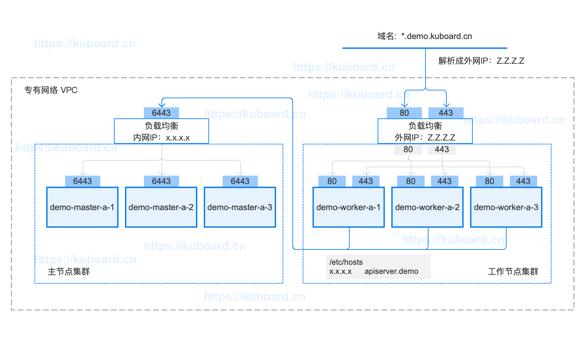

###### **[MetalLB 官网](https://metallb.universe.tf/ "MetalLB 官网")**

###### **[官方安装文档](https://metallb.universe.tf/installation/ "官方安装文档")**

* * *

###### 为什么要使用 MetalLB

  为什么Kubernetes不提供网络负载均衡器的实现（LoadBalancer类型的服务）用于裸机集群。   因为Kubernetes附带的Network LB的实现都是调用各种IaaS平台（GCP，AWS，Azure等）的粘合代码。如果您不在支持的IaaS平台（GCP，AWS，Azure等）上运行，则LoadBalancers在创建时将无限期保持“待处理”状态。

  裸机集群运营商只剩下两个较小的工具，即“ NodePort”和“ externalIP”服务，可将用户流量引入其集群。这两个选项在生产用途上都有很大的不利之处，这使裸金属集群成为Kubernetes生态系统中的第二等公民。

  MetalLB旨在通过提供与标准网络设备集成的Network LB实现来纠正这种不平衡，从而使裸机群集上的外部服务也尽可能“正常运行”。

* * *

图片来自 kuboard 

* * *

* * *

* * *

## 使用 Helm 安装

###### **[安装 Helm](helm-%e5%ae%89%e8%a3%85-%e4%bd%bf%e7%94%a8 "安装 Helm")**

###### 添加Chart源

```ruby
helm repo add metallb https://metallb.github.io/metallb
helm repo update

## 查看
[root@k8s-master ~]# helm search repo metallb -l
NAME            CHART VERSION   APP VERSION     DESCRIPTION
metallb/metallb 0.13.9          v0.13.9         A network load-balancer implementation for Kube...
metallb/metallb 0.13.7          v0.13.7         A network load-balancer implementation for Kube...
metallb/metallb 0.13.6          v0.13.6         A network load-balancer implementation for Kube...
metallb/metallb 0.13.5          v0.13.5         A network load-balancer implementation for Kube...
metallb/metallb 0.13.4          v0.13.4         A network load-balancer implementation for Kube...
metallb/metallb 0.13.3          v0.13.3         A network load-balancer implementation for Kube...
metallb/metallb 0.13.2          v0.13.2         A network load-balancer implementation for Kube...
metallb/metallb 0.12.1          v0.12.1         A network load-balancer implementation for Kube...
metallb/metallb 0.12.0          v0.12.0         A network load-balancer implementation for Kube...
metallb/metallb 0.11.0          v0.11.0         A network load-balancer implementation for Kube...
metallb/metallb 0.10.3          v0.10.3         A network load-balancer implementation for Kube...
metallb/metallb 0.10.2          v0.10.2         A network load-balancer implementation for Kube...
metallb/metallb 0.10.1          v0.10.1         A network load-balancer implementation for Kube...
metallb/metallb 0.10.0          v0.10.0         A network load-balancer implementation for Kube...

```

* * *

##### **使用 Helm 3 安装 `MetalLB`**

```ruby
export METALLB_CHART_VERSION=0.13.6
## 将Chart包下载到本地
helm pull metallb/metallb --version $METALLB_CHART_VERSION

## 为 Kong MetalLB 创建命名空间
export METALLB_NAMESPACE=metallb-ns

```

##### **values.yaml**

```yaml
# controller.
controller:
  enabled: true
  # -- Controller log level. Must be one of: `all`, `debug`, `info`, `warn`, `error` or `none`
  logLevel: info
  # command: /controller
  # webhookMode: enabled
  image:
    repository: quay.io/metallb/controller


# speaker contains configuration specific to the MetalLB speaker
# daemonset.
speaker:
  enabled: true
  # -- Speaker log level. Must be one of: `all`, `debug`, `info`, `warn`, `error` or `none`
  logLevel: info
  image:
    repository: quay.io/metallb/speaker

```

##### 安装部署

```shell
## 安装部署
helm install metallb ./metallb-$METALLB_CHART_VERSION.tgz \
  -n $METALLB_NAMESPACE \
  --create-namespace \
  -f values.yaml


## 卸载
helm uninstall metallb -n $METALLB_NAMESPACE

```

* * *

###### 查看 运行情况

```ruby
[root@k8s-master ~]# kubectl -n metallb-ns get all
NAME                                      READY   STATUS    RESTARTS   AGE
pod/metallb-controller-78d64b88b5-btjqv   1/1     Running   0          3m31s
pod/metallb-speaker-c2mcj                 1/1     Running   0          3m31s
pod/metallb-speaker-d6zhl                 1/1     Running   0          3m31s
pod/metallb-speaker-qkncb                 1/1     Running   0          3m31s
pod/metallb-speaker-xn445                 1/1     Running   0          3m31s

NAME                              TYPE        CLUSTER-IP     EXTERNAL-IP   PORT(S)   AGE
service/metallb-webhook-service   ClusterIP   10.96.190.24   <none>        443/TCP   3m31s

NAME                             DESIRED   CURRENT   READY   UP-TO-DATE   AVAILABLE   NODE SELECTOR            AGE
daemonset.apps/metallb-speaker   4         4         4       4            4           kubernetes.io/os=linux   3m31s

NAME                                 READY   UP-TO-DATE   AVAILABLE   AGE
deployment.apps/metallb-controller   1/1     1            1           3m31s

NAME                                            DESIRED   CURRENT   READY   AGE
replicaset.apps/metallb-controller-78d64b88b5   1         1         1       3m31s

```

* * *

#### 添加IP地址池

**这里在新版本中做了修改，与旧版中的 ConfigMap不同** **[参考官网地址](https://metallb.universe.tf/configuration/)**

```shell
[root@k8s-master ~]# cat > ip-address-pool.yaml << ERIC
---
apiVersion: metallb.io/v1beta1
kind: IPAddressPool
metadata:
  name: metallb-pool
  namespace: metallb-ns

## 示例
#spec:
#  addresses:
#  - 192.168.10.0/24
#  - 192.168.9.1-192.168.9.5
#  - fc00:f853:0ccd:e799::/124

spec:
  addresses:
  - 192.168.0.50-192.168.0.50

---
apiVersion: metallb.io/v1beta1
kind: L2Advertisement
metadata:
  name: layer2
  namespace: metallb-ns

ERIC


kubectl apply -f ip-address-pool.yaml

```

##### 查看结果

```shell
[root@dk8s-master meatllb]# kubectl get gatewayclass,gateway -A
NAME                                             CONTROLLER                             ACCEPTED   AGE
gatewayclass.gateway.networking.k8s.io/contour   projectcontour.io/gateway-controller   True       13m

NAMESPACE        NAME                                           CLASS       ADDRESS        PROGRAMMED   AGE
projectcontour   gateway.gateway.networking.k8s.io/contour      contour     192.168.0.50   True         13m

```

* * *

* * *

* * *

## Metallb 设计理念与工作原理解析

### 理念

> `Metallb` 有两个重要的组件，分别是 `controller` 和 `speaker`。
> 
> - `Controller` 主要负责 `IP` 地址池的管理和同步
>     - `Controller` 的主要作用是与 `Kubernetes API Server` 交互，根据 `Service` 的类型和配置生成对应的 `IP` 地址池，并将这些 `IP` 地址池信息同步到所有的 `Metallb` 节点上。
>     - `Controller` 还会监视 `Kubernetes Service` 和 `Endpoints` 的变化，并根据变化更新 `IP` 地址池信息。
> - `Speaker` 则负责实现负载均衡和流量转发。
>     - `Speaker` 的主要作用是在节点上监听所有进入的流量，通过解析目标 `IP` 地址，判断流量是否要路由到 `Kubernetes` 集群内的某个 `Service` 上，然后为该流量分配一个虚拟 `IP` 地址，并在本地 `ARP` 缓存中绑定该虚拟 `IP` 地址与对应的虚拟 `MAC` 地址，从而将流量转发到目标节点上。
>     - `Speaker` 还会将响应流量从虚拟 IP 地址转发回源 IP 地址。

* * *

### 原理

> 1. `Speaker` 根据 `Service` 的 `ClusterIP` 地址，从 `Metallb` 的 `IP` 地址池中申请一个虚拟 `IP` 地址，并为该虚拟 `IP` 地址生成对应的虚拟 `MAC` 地址。
> 2. `Speaker` 在本机的 `ARP` 缓存中添加一个记录，将虚拟 `IP` 地址与虚拟 `MAC` 地址绑定，用于响应其它节点的 `ARP` 查询请求。
> 3. 当外部流量进来时，`Speaker` 组件拦截流量并解析目标 `IP` 地址，确定该流量是要到 `k8s` 集群内的某个 `Service` 上。
> 4. 当流量到达本机时，`Speaker` 根据目标 `IP` 地址查询本机 `ARP` 缓存，找到对应的虚拟 `MAC` 地址，并将流量的目标 `MAC` 地址改为虚拟 `MAC` 地址。
> 5. `Speaker` 将流量发送到对应的节点上，对应的节点收到流量后，会根据虚拟 `MAC` 地址进行转发，直到最终到达目标 `Pod`。
> 6. 目标 `Pod` 收到流量后，会将源 `IP` 地址修改为流量的真实来源 `IP` 地址，并将响应流量发送回到 `Metallb` 的虚拟 `IP` 地址。
> 7. `Speaker` 收到响应流量后，会将流量的目标 `IP` 地址修改为真实的来源 `IP` 地址，并将响应流量发送回到流量的真实来源。

* * *

* * *

* * *

* * *

* * *

* * *

### 常见问题

> 要解决如下问题，要先把**[ARP](%e7%90%86%e8%a7%a3arp%e4%bd%9c%e7%94%a8%e4%b8%8e%e5%b7%a5%e4%bd%9c%e5%8e%9f%e7%90%86)**搞清楚

* * *

> - 一台虚拟机 : 192.168.101.99
> - 一个k8s集群，分别是
>     - Master : 192.168.101.54
>     - worker01: 192.168.101.55
>     - worker02: 192.168.101.56
>     - worker03: 192.168.101.57
>     - 虚拟IP是 : 192.168.101.81

#### 问题1

> K8s的每台机器上都有`Speaker`，当我从 `master` `worker` 上访问 `curl 192.168.101.81` 是可能访问的 但是我从 虚拟机 `192.168.101.99` 执行 `curl 192.168.101.81` 就访问失败 但是当我在Metallb中加入了 `L2Advertisement`，就可以从虚拟机 `192.168.101.99` 执行 `curl 192.168.101.81` 访问了

#### 原因

> 在没有配置 `L2Advertisement` 的情况下，`MetalLB` 会对`集群内部`的 `ARP` 请求进行响应，并且将虚拟 `IP` 地址的 `MAC` 地址映射给请求方，从而使得在同一局域网下的主机可以访问该虚拟 `IP` 地址。 当你在`虚拟机`上访问虚拟 `IP` 地址时，由于虚拟机和 `Kubernetes` 集群`不在同一台物理机`上，因此`虚拟机会向它所在的物理机`发起 `ARP` 请求，但是在没有 `L2Advertisement` 配置的情况下，`MetalLB` 不会响应这个 `ARP` 请求，因此虚拟机无法获得虚拟 `IP` 地址的 `MAC` 地址，导致访问失败。 而当你在 `MetalLB` 中配置了 `L2Advertisement` 时，`MetalLB` 会对虚拟 `IP` 地址的 `ARP` 请求进行响应，并且将虚拟 `IP` 地址的 `MAC` 地址映射给请求方，从而使得在同一局域网下的主机以及不在同一局域网但通过路由器可以访问到该局域网的主机都可以访问该虚拟 `IP` 地址。 因此，添加 `L2Advertisement` 的作用并不是扩展 `ARP` 广播的范围，而是让 `MetalLB` 响应虚拟 `IP` 地址的 `ARP` 请求，从而使得虚拟机可以访问虚拟 `IP` 地址。

* * *

#### 问题2

> 在没有 `L2Advertisement` 配置的情况下，`MetalLB` 为什么 不会响应这个 `ARP` 请求？

#### 原因

> 在没有 `L2Advertisement` 配置的情况下，`MetalLB` 的行为取决于所使用的`Layer 2 模式`。 如果使用的是 `ARP` 模式，那么 `MetalLB` 会响应 `ARP` 请求，但`仅限于集群内部`。 如果没有 `L2Advertisement` 配置，`MetalLB` 只会响应集群内部发起的 `ARP` 请求，而`不会响应集群外部`的 `ARP` 请求。 因此，当您从虚拟机上发出 `ARP` 请求时，由于请求是从集群外部发出的，因此 `MetalLB` 不会响应。

* * *

#### 问题3

> 如果不配置 `L2Advertisement` 还想响应集群外部的 `ARP`请求该怎么办？

#### 解答

> 如果你想在不配置 `L2Advertisement` 的情况下响应集群外部的 `ARP` 请求，你需要在 `Kubernetes` 集群节点上手动绑定一个虚拟 `MAC` 地址和你所需的 `IP` 地址。 这可以通过使用 `arp 命令`来实现，例如：

```shell
arp -s <IP address> <MAC address>
```

> 其中，`<IP address>` 是你想要绑定的 `IP` 地址，`<MAC address>` 是你想要使用的虚拟 `MAC` 地址。 绑定成功后，`MetalLB` 就会响应集群外部的 `ARP` 请求，并将请求重定向到你绑定的 `IP` 地址所在的节点。 请注意，这种方法需要在每个节点上手动执行 `arp` 命令，因此不适合在大型集群中使用。

* * *

#### 问题4

> `MetalLB`的虚拟`MAC`地址，是怎么来的？会不会变？

#### 解答

> `MetalLB`会为每个`LoadBalancer`服务创建一个`唯一的虚拟MAC地址`，用于在`Layer 2`上进行通信。 这个虚拟`MAC`地址是根据`LoadBalancer`服务的`IP`地址生成的，可以通过以下方式计算：
> 
> - 将IP地址中的第一个字节的最低位设置为0。
> - 将IP地址的剩余3个字节表示为16进制，并连接起来。
> - 将连接后的16进制字符串转换为一个48位的MAC地址，其中前24位为OUI（组织唯一标识符），后24位为由IP地址生成的唯一标识符。
> 
> **这个虚拟`MAC`地址是根据`IP`地址生成的，所以`只要IP地址不变`，`虚拟MAC地址就不会变`**。

* * *

#### 问题5

> 如果不配置 `L2Advertisement` 为什么虚拟机访问 `MetalLB` `虚拟IP` 不响应 `ARP`请求呢？怎么样它才会响应？

#### 解答

> `MetalLB`在不配置`L2Advertisement`的情况下，只会响应集群内部的`ARP`请求，因为它只会在节点之间通过`直接响应ARP`来提供负载均衡服务。 因此，当虚拟机发送`ARP`请求时，`MetalLB`并不会响应。 要使`MetalLB`响应集群外部的`ARP`请求，需要在配置文件中添加`L2Advertisement`。 `L2Advertisement`将告诉`MetalLB`广播其虚拟`MAC`地址，以响应集群外部的`ARP`请求。 在这种情况下，虚拟机就可以通过`MetalLB`虚拟`IP`访问`Kubernetes Service`。

* * *

#### 问题6

> 也就是说，不配置`L2Advertisement`，`MetalLB`**就不向外部广播虚拟`MAC`地址**，所以数据不能传输了对吧？

#### 解答

> 是的，`MetalLB`在没有配置`L2Advertisement`的情况下，不会向外部广播虚拟`MAC`地址，因此外部的设备无法通过`ARP`请求获取到虚拟`MAC`地址，也就无法与虚拟`IP`通信，数据传输也就无法进行。

* * *

* * *

* * *
