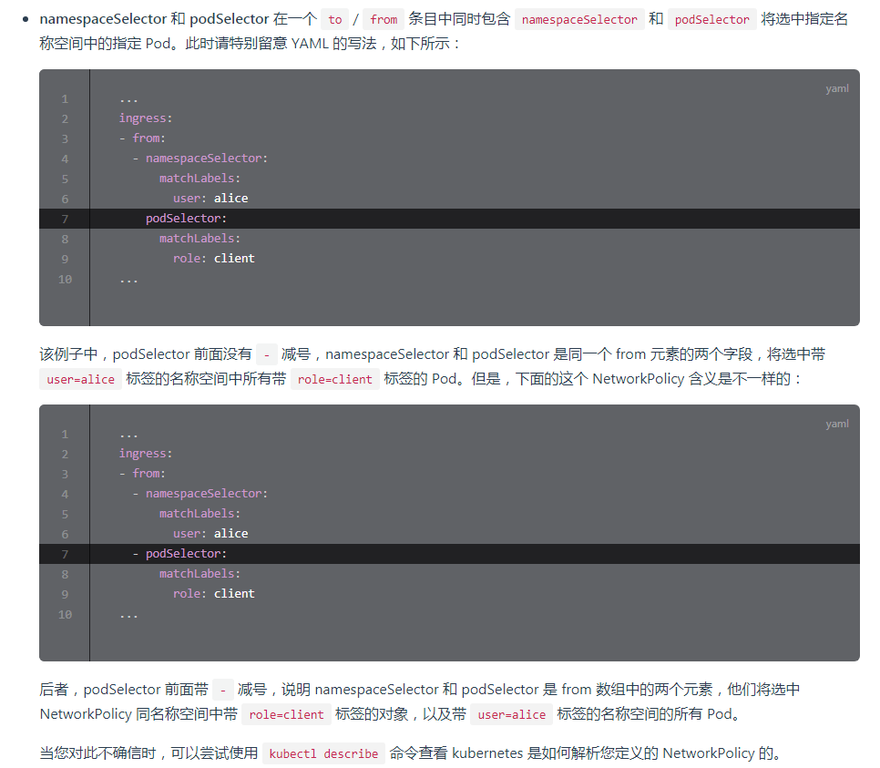

##### **[NetworkPolicy](https://kubernetes.io/zh/docs/concepts/services-networking/network-policies/#networkpolicy-resource "NetworkPolicy")**

    通俗的讲就是 **`网络权限控制`**

* * *

    默认情况下，Pod 的网络请求是非隔离的，它们接受任何来源的流量。我们可以对 Pod 通过相关的网络策略进行隔离。网络策略通过`网络插件`来实现， 其中Flannle插件并不支持。

* * *

##### 按步骤拆分理解 **`拒绝访问`**

###### 1 **默认`拒绝` ns-test** 命名空间下所有`pod`的入方向流量

```yaml
apiVersion: networking.k8s.io/v1
kind: NetworkPolicy
metadata:
  namespace: ns-test
  name: test-network-policy
spec:
  # 告诉k8s 查找ns-test命名空间下所有pod
  podSelector: {}
  # 告诉k8s 对入口添加网络规则
  policyTypes:
  - Ingress
  # 接下来这里没有填写任何的规则，默认表示拒绝
```

###### 2 在使用calico网络插件的情况下 进行测试

```ruby
kubectl -n ns-test create deployment nginx --image=nginx
kubectl -n ns-test expose deployment nginx --name=nginx-svc --port=80

kubectl -n ns-test run busybox --rm -ti --image=busybox -- /bin/sh
# 测试未添加网络策略
/ # wget --spider --timeout=1 nginx-svc
Connecting to nginx-svc (10.222.18.83:80)
remote file exists                     # 访问成功
/ #

# 测试添加网络策略
/ # wget --spider --timeout=1 nginx-svc
Connecting to nginx-svc (10.222.18.83:80)
wget: download timed out               # 访问超时
/ #

```

###### 3 添加白名单规则

```yaml
apiVersion: networking.k8s.io/v1
kind: NetworkPolicy
metadata:
  namespace: ns-test
  name: test-network-policy
spec:
  # 告诉k8s 查找ns-test命名空间下所有pod
  podSelector: {}
  # 告诉k8s 对入口添加网络规则
  policyTypes:
  - Ingress
  # 添加入方向的白名单规则，只开放80端口访问
  ingress:
  - ports:
    - protocol: TCP
      port: 80
```

###### 4 测试入方向的白名单规则

```ruby
/ # wget --spider --timeout=1 nginx-svc
Connecting to nginx-svc (10.222.18.83:80)
remote file exists                     # 访问成功
/ #
```

###### 以上做法`只是开放了nginx-svc.ns-test的80端口`访问，所有的命名空间的请求`均可以通过80端口进行访问`， `并没有`对命名空间`进行限制`。

* * *

* * *

##### **使用命名空间白名单规则`允许`访问**

###### 告诉k8s, 指定命名空间下的pod才可以对`nginx-svc.ns-test`访问

```yaml
apiVersion: networking.k8s.io/v1
kind: NetworkPolicy
metadata:
  namespace: ns-test
  name: test-network-policy
spec:
  # 告诉k8s 查找ns-test命名空间下所有pod
  podSelector: {}
  # 告诉k8s 对入口添加网络规则
  policyTypes:
  - Ingress
  # 添加入方向的白名单规则，只开放80端口访问
  ingress:
  - ports:
    - protocol: TCP
      port: 80

    from:
    # 通过标签来告诉k8s, 哪些名称空间下的pod才可以对nginx-svc.ns-test进行访问
    - namespaceSelector:
        matchLabels:
          # 只有被标记为 ns=eric 标签的命名空间下的pod才可以对nginx-svc.ns-test进行访问
          ns: eric
```

###### 测试

```ruby
kubectl -n default run busybox --rm -ti --image=busybox -- /bin/sh
# 不打标签的命名空间测试访问
/ # wget --spider --timeout=1 nginx-svc.ns-test
Connecting to nginx-svc.ns-test (10.222.18.83:80)
wget: download timed out               # 访问超时
/ #


kubectl label ns default ns=eric
kubectl -n default run busybox --rm -ti --image=busybox -- /bin/sh
# 给默认命名空间打个标签
/ # wget --spider --timeout=1 nginx-svc.ns-test
Connecting to nginx-svc.ns-test (10.222.18.83:80)
remote file exists                     # 访问成功
/ #

```

###### 出的规则测试就不做了，与入的规则同理。 **有个注意点如下图:**



**[图片来源](https://kuboard.cn/learning/k8s-intermediate/service/np.html#to%E5%92%8Cfrom%E9%80%89%E6%8B%A9%E5%99%A8%E7%9A%84%E8%A1%8C%E4%B8%BA "图片来源")**

* * *

* * *

* * *

* * *

* * *

* * *

##### **[升级](https://kubernetes.io/zh/docs/tasks/administer-cluster/kubeadm/kubeadm-upgrade "升级")**

* * *

###### 查看当前版本

```ruby
root@msy-master01:~# kubectl get nodes -o wide
NAME           STATUS   ROLES    AGE   VERSION   INTERNAL-IP   EXTERNAL-IP   OS-IMAGE             KERNEL-VERSION       CONTAINER-RUNTIME
msy-master01   Ready    master   40h   v1.19.0   10.22.12.81   <none>        Ubuntu 18.04.5 LTS   4.15.0-122-generic   docker://19.3.13
msy-worker01   Ready    <none>   40h   v1.19.0   10.22.12.82   <none>        Ubuntu 18.04.5 LTS   4.15.0-122-generic   docker://19.3.13
msy-worker02   Ready    <none>   40h   v1.19.0   10.22.12.83   <none>        Ubuntu 18.04.5 LTS   4.15.0-122-generic   docker://19.3.13
root@msy-master01:~#
```

* * *

###### 查看可安装版本

```ruby
root@msy-master01:~# apt-cache policy kubeadm | head -n 10
kubeadm:
  Installed: 1.19.0-00
  Candidate: 1.19.3-00
  Version table:
     1.19.3-00 500
        500 https://mirrors.aliyun.com/kubernetes/apt kubernetes-xenial/main amd64 Packages
     1.19.2-00 500
        500 https://mirrors.aliyun.com/kubernetes/apt kubernetes-xenial/main amd64 Packages
     1.19.1-00 500
        500 https://mirrors.aliyun.com/kubernetes/apt kubernetes-xenial/main amd64 Packages
root@msy-master01:~#
```

* * *

###### 升级第一个master

```ruby
###### 下载资源包
VERSION=1.19.1-00
apt-mark unhold kubeadm && \
apt-get update && apt-get install -y kubeadm=$VERSION && \
apt-mark hold kubeadm
```

* * *

###### 基于污点的驱逐

**`kubectl drain <cp-node-name> --ignore-daemonsets` 将 替换为你自己的控制面节点名称**

```ruby
root@msy-master01:~# kubectl drain msy-master01 --ignore-daemonsets
node/msy-master01 cordoned
WARNING: ignoring DaemonSet-managed Pods: kube-system/kube-flannel-ds-76tgb, kube-system/kube-proxy-ttz48
evicting pod kube-system/coredns-f9fd979d6-6cwtq
evicting pod kube-system/coredns-f9fd979d6-svxm6
pod/coredns-f9fd979d6-6cwtq evicted
pod/coredns-f9fd979d6-svxm6 evicted
node/msy-master01 evicted
root@msy-master01:~#


root@msy-master01:~# kubectl get nodes -o wide
NAME           STATUS                     ROLES    AGE   VERSION   INTERNAL-IP   EXTERNAL-IP   OS-IMAGE             KERNEL-VERSION       CONTAINER-RUNTIME
msy-master01   Ready,SchedulingDisabled   master   40h   v1.19.0   10.22.12.81   <none>        Ubuntu 18.04.5 LTS   4.15.0-122-generic   docker://19.3.13
msy-worker01   Ready                      <none>   40h   v1.19.0   10.22.12.82   <none>        Ubuntu 18.04.5 LTS   4.15.0-122-generic   docker://19.3.13
msy-worker02   Ready                      <none>   40h   v1.19.0   10.22.12.83   <none>        Ubuntu 18.04.5 LTS   4.15.0-122-generic   docker://19.3.13
root@msy-master01:~#
```

* * *

###### 检查集群是否可以升级，并获取到升级的版本

```ruby
root@msy-master01:~# kubeadm upgrade plan $VERSION
[upgrade/config] Making sure the configuration is correct:
[upgrade/config] Reading configuration from the cluster...
[upgrade/config] FYI: You can look at this config file with 'kubectl -n kube-system get cm kubeadm-config -oyaml'
[preflight] Running pre-flight checks.
[upgrade] Running cluster health checks
[upgrade] Fetching available versions to upgrade to
[upgrade/versions] Cluster version: v1.19.0
[upgrade/versions] kubeadm version: v1.19.1
[upgrade/versions] WARNING: Couldn't parse version stable version: illegal zero-prefixed version component "00" in "1.19.1-00"
[upgrade/versions] WARNING: Falling back to current kubeadm version as latest stable version
[upgrade/versions] WARNING: Couldn't parse version version in the v1.19 series: illegal zero-prefixed version component "00" in "1.19.1-00"

Components that must be upgraded manually after you have upgraded the control plane with 'kubeadm upgrade apply':
COMPONENT   CURRENT       AVAILABLE
kubelet     3 x v1.19.0   v1.19.1

Upgrade to the latest stable version:

COMPONENT                 CURRENT   AVAILABLE
kube-apiserver            v1.19.0   v1.19.1
kube-controller-manager   v1.19.0   v1.19.1
kube-scheduler            v1.19.0   v1.19.1
kube-proxy                v1.19.0   v1.19.1
CoreDNS                   1.7.0     1.7.0
etcd                      3.4.9-1   3.4.13-0

You can now apply the upgrade by executing the following command:

        kubeadm upgrade apply v1.19.1

_____________________________________________________________________

```

* * *

###### 开始升级

```ruby
kubeadm upgrade apply v1.19.1
```

* * *

###### 恢复调度

```ruby
kubectl uncordon msy-master01

......
[addons] Applied essential addon: CoreDNS
[addons] Applied essential addon: kube-proxy

[upgrade/successful] SUCCESS! Your cluster was upgraded to "v1.19.1". Enjoy!

[upgrade/kubelet] Now that your control plane is upgraded, please proceed with upgrading your kubelets if you haven't already done so.

```

* * *

###### 升级 kubelet、kubectl

```ruby
apt-mark unhold kubelet kubectl && \
apt-get update && apt-get install -y kubelet=$VERSION kubectl=$VERSION && \
apt-mark hold kubelet kubectl


###### 重启 kubelet
systemctl daemon-reload && systemctl restart kubelet


###### 查看
root@msy-master01:~# kubectl get nodes
NAME           STATUS   ROLES    AGE   VERSION
msy-master01   Ready    master   41h   v1.19.1
msy-worker01   Ready    <none>   41h   v1.19.0
msy-worker02   Ready    <none>   41h   v1.19.0

```

* * *

###### 升级其他控制面节点

与第一个控制面节点类似，不过使用下面的命令： **`kubeadm upgrade node`** 而不是： **`kubeadm upgrade apply`** 同时，也不需要执行 `kubeadm upgrade plan`

* * *

* * *

* * *

* * *

* * *

* * *

##### **[创建 secret](https://kubernetes.io/zh/docs/concepts/configuration/secret/#%E5%88%9B%E5%BB%BA%E6%82%A8%E8%87%AA%E5%B7%B1%E7%9A%84-secret "创建 secret")**

**Secret 作用：**     **比如说你想将某个数据库的用户名和密码，放到k8s中来管理， 你可以将用户名和密码保存在本地机器的 `./username.txt` 和 `./password.txt` 文件里。然后将文件放到k8s的secret里面来进行管理**

* * *

**基于文件创建** **`kubectl create secret generic` secret名称 --from-file=键=本地文件 --from-file=键=本地文件**

* * *

**直接创建** **`kubectl create secret generic` super-secret --from-literal=键=值 --from-literal=键=值**

```ruby
###### 生成yaml文件写到本地
kubectl create secret generic super-secret --from-literal=Credential=alice --from-literal=username=bob -o yaml --dry-run=client > super-secret.yaml

apiVersion: v1
data:
  Credential: YWxpY2U=
  username: Ym9i
kind: Secret
metadata:
  creationTimestamp: null
  name: super-secret


###### 执行
kubectl apply -f super-secret.yaml
```

* * *

###### **[在 Pod 中使用 Secret 文件](https://kubernetes.io/zh/docs/concepts/configuration/secret/#using-secrets-as-files-from-a-pod "在 Pod 中使用 Secret 文件")**

```ruby
kubectl run pod-secrets-via-file --image=redis -o yaml --dry-run=client > pod-secrets.yaml

apiVersion: v1
kind: Pod
metadata:
  creationTimestamp: null
  labels:
    run: pod-secrets-via-file
  name: pod-secrets-via-file
spec:
  containers:
  - image: redis
    name: pod-secrets-via-file

    ###### 在pod中加入如下配置
    volumeMounts:
    - name: foo
      mountPath: "/secrets"                    # 告诉k8s将Secret中的文件放到容器中的/secrets目录下
      readOnly: true
  volumes:
  - name: foo
    secret:
      secretName: super-secret


###### 执行
kubectl apply -f pod-secrets.yaml


###### 查看结果
kubectl exec pod-secrets-via-file -- ls /secrets/
Credential
username

```

* * *

###### **[以环境变量的形式使用 Secrets](https://kubernetes.io/zh/docs/concepts/configuration/secret/#using-secrets-as-files-from-a-pod "以环境变量的形式使用 Secrets")**

```ruby
kubectl run pod-secrets-via-env --image=redis -o yaml --dry-run=client > pod-secrets-via-env.yaml

apiVersion: v1
kind: Pod
metadata:
  labels:
    run: pod-secrets-via-env
  name: pod-secrets-via-env
spec:
  dnsPolicy: ClusterFirst
  restartPolicy: Always
  containers:
  - image: redis
    name: pod-secrets-via-env
    # 加入如下代码
    env:
      - name: TOPSECRET
        valueFrom:
          secretKeyRef:
            name: super-secret
            key: Credential


###### 执行
kubectl apply -f pod-secrets-via-env.yaml

###### 进入容器
kubectl exec -it pod-secrets-via-env -- bash

echo $TOPSECRET
alice

```

* * *

```ruby
# 使用目录创建（--fromfile 指定在目录下的所有文件都会被用在ConfigMap里面创建一个键值对，键的名字就是文件名，值就是文件的内容）
kubectl create configmap configmap名称 --from-file=/dir_path
# 使用文件创建
kubectl create configmap configmap名称 --from-file=file1 --from-file=file2
# 从字面值创建
kubectl create configmap configmap名称 --from-literal=键=值 --from-literal=键=值
```

* * *

* * *

* * *

* * *

* * *

* * *

###### **`一` 创建 ClusterRole**

**创建一个名为`deployment-clusterrole`且仅允许创建以下资源类型的新 ClusterRole**

- Deployment
- StatefulSet
- DaemonSet

**并绑定到特定命名空间`app-team1`下的`ServiceAccount`**

```ruby
###### 查看相关资源
kubectl api-resources -o wide | grep -E "Deployment|StatefulSet|DaemonSet"
资源名称                           缩写         核心 API 组                     是否需要命名空间                                      能够获得的权限
NAME                              SHORTNAMES   APIGROUP                       NAMESPACED          KIND                             VERBS
daemonsets                        ds           apps                           true                DaemonSet                        [create delete deletecollection get list patch update watch]
deployments                       deploy       apps                           true                Deployment                       [create delete deletecollection get list patch update watch]
statefulsets                      sts          apps                           true                StatefulSet                      [create delete deletecollection get list patch update watch]


###### 执行
kubectl create clusterrole deployment-clusterrole --resource=daemonsets,deployments,statefulsets --verb=create,delete,deletecollection,get,list,patch,update,watch -o yaml --dry-run=client > deployment-clusterrole.yaml
kubectl apply -f deployment-clusterrole.yaml
```

* * *

###### **`二` 创建 ServiceAccount**

**在`app-team1`命名空间下创建一个名为`cicd-token`的ServiceAccount**

```ruby
kubectl create serviceaccount cicd-token -n app-team1 -o yaml --dry-run=client > cicd-token.yaml
kubectl apply -f cicd-token.yaml
```

* * *

###### **`三` [RoleBinding 和 ClusterRoleBinding 运用](https://kubernetes.io/zh/docs/reference/access-authn-authz/rbac/#rolebinding-%E5%92%8C-clusterrolebinding "RoleBinding 和 ClusterRoleBinding 运用")**

**因为要求绑定到特定命名空间下的`ServiceAccount`,所以使用 `rolebinding` 将 `cicd-token`用户与`deployment-clusterrole`权限进行绑定**

- **`RoleBinding`** 可以绑定`Role`和`ClusterRole`
    
    - 其中 **`RoleBinding`** 绑定`ClusterRole` 对`ClusterRole`所定义的、位于`RoleBinding`命名空间内的资源授权。
- **`ClusterRoleBinding`** 只能绑定`ClusterRole`

**命令用法： kubectl create rolebinding `rolebinding名称` --clusterrole=`role名称` --serviceaccount=`sa命名空间`:`sa名称`**

```ruby
kubectl create rolebinding cicd-token-binding --clusterrole=deployment-clusterrole --serviceaccount=app-team1:cicd-token -o yaml --dry-run=client > cicd-token-binding.yaml
kubectl apply -f cicd-token-binding.yaml
```

* * *

* * *

* * *

* * *

* * *

* * *

###### ETCD 备份、恢复

```ruby
###### 下载 etcdctl 如果已经安装就忽略
wget http://qiniu.dev-share.top/etcdctl -P /usr/local/bin/ && chmod +x /usr/local/bin/etcdctl
```

* * *

###### 查看etcd的IP地址

```ruby
cat /etc/kubernetes/manifests/etcd.yaml | grep 2379

   kubeadm.kubernetes.io/etcd.advertise-client-urls: https://10.22.12.81:2379
   - --advertise-client-urls=https://10.22.12.81:2379
   - --listen-client-urls=https://127.0.0.1:2379,https://10.22.12.81:2379
```

* * *

###### 备份

```ruby
export ETCDCTL_API=3
etcdctl--endpoints=https://127.0.0.1:2379 \
    --cert=/etc/kubernetes/pki/etcd/server.crt \
    --key=/etc/kubernetes/pki/etcd/server.key \
    --cacert=/etc/kubernetes/pki/etcd/ca.crt \
    snapshot save $(date +%F)-etcd-snapshot.db

Snapshot saved at 2020-10-30-etcd-snapshot.db

```

* * *

###### 恢复

```ruby
export ETCDCTL_API=3
etcdctl --endpoints=https://127.0.0.1:2379 \
        --cert=/etc/kubernetes/pki/etcd/server.crt \
        --key=/etc/kubernetes/pki/etcd/server.key \
        --cacert=/etc/kubernetes/pki/etcd/ca.crt \
        snapshot restore 2020-10-30-etcd-snapshot.db

2020-10-30 16:59:06.193853 I | mvcc: restore compact to 998405
2020-10-30 16:59:06.203491 I | etcdserver/membership: added member 8e9e05c52164694d [http://localhost:2380] to cluster cdf818194e3a8c32

```

* * *

###### 查看列表

```ruby
###### endpoint status
export ETCDCTL_API=3
etcdctl --endpoints=https://127.0.0.1:2379 \
        --cert=/etc/kubernetes/pki/etcd/server.crt \
        --key=/etc/kubernetes/pki/etcd/server.key \
        --cacert=/etc/kubernetes/pki/etcd/ca.crt \
        endpoint status -w table

+--------------------------+------------------+---------+---------+-----------+-----------+------------+
|         ENDPOINT         |        ID        | VERSION | DB SIZE | IS LEADER | RAFT TERM | RAFT INDEX |
+--------------------------+------------------+---------+---------+-----------+-----------+------------+
| https://127.0.0.1:2379 | 18b28cbb1e4bb850 |  3.4.13 |  5.4 MB |      true |         4 |    1131914 |
+--------------------------+------------------+---------+---------+-----------+-----------+------------+


###### member list
export ETCDCTL_API=3
etcdctl --endpoints=127.0.0.1:2379 \
        --cert=/etc/kubernetes/pki/etcd/server.crt \
        --key=/etc/kubernetes/pki/etcd/server.key \
        --cacert=/etc/kubernetes/pki/etcd/ca.crt \
        member list -w table

+------------------+---------+--------------+--------------------------+--------------------------+
|        ID        | STATUS  |     NAME     |        PEER ADDRS        |       CLIENT ADDRS       |
+------------------+---------+--------------+--------------------------+--------------------------+
| 18b28cbb1e4bb850 | started | msy-master01 | https://10.22.12.81:2380 | https://10.22.12.81:2379 |
+------------------+---------+--------------+--------------------------+--------------------------+

```

* * *

* * *

* * *

* * *

* * *

* * *

###### [使用 CustomResourceDefinition 扩展 Kubernetes API](https://kubernetes.io/zh/docs/tasks/extend-kubernetes/custom-resources/custom-resource-definitions/ "使用 CustomResourceDefinition 扩展 Kubernetes API")

###### resourcedefinition.yaml

```ruby
apiVersion: apiextensions.k8s.io/v1
kind: CustomResourceDefinition
metadata:
  # 名字必需与下面的 spec 字段匹配，并且格式为 '<名称的复数形式>.<组名>'
  name: crontabs.stable.example.com
spec:
  # 组名称，用于 REST API: /apis/<组>/<版本>
  group: stable.example.com
  # 列举此 CustomResourceDefinition 所支持的版本
  versions:
    - name: v1
      # 每个版本都可以通过 served 标志来独立启用或禁止
      served: true
      # 其中一个且只有一个版本必需被标记为存储版本
      storage: true
      schema:
        openAPIV3Schema:
          type: object
          properties:
            spec:
              type: object
              properties:
                cronSpec:
                  type: string
                image:
                  type: string
                replicas:
                  type: integer
  # 可以是 Namespaced 或 Cluster
  scope: Namespaced
  names:
    # 名称的复数形式，用于 URL：/apis/<组>/<版本>/<名称的复数形式>
    plural: crontabs
    # 名称的单数形式，作为命令行使用时和显示时的别名
    singular: crontab
    # kind 通常是单数形式的驼峰编码（CamelCased）形式。你的资源清单会使用这一形式。
    kind: CronTab
    # shortNames 允许你在命令行使用较短的字符串来匹配资源
    shortNames:
    - ct
```

* * *

* * *

* * *
