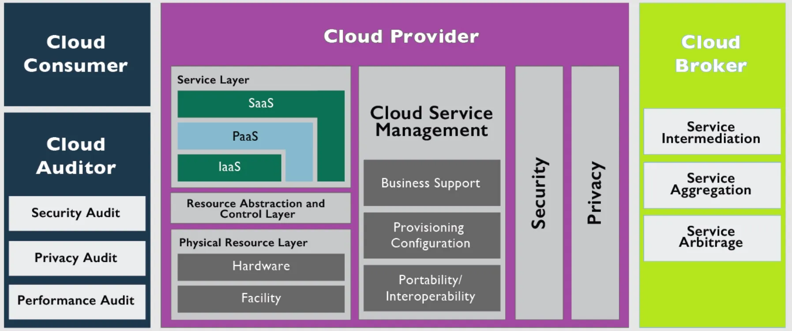
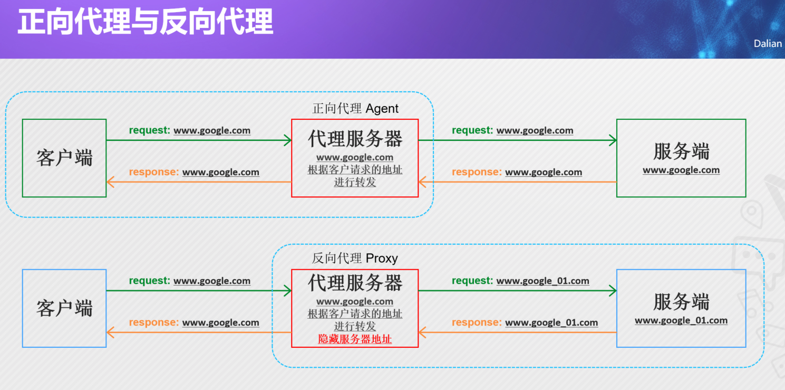
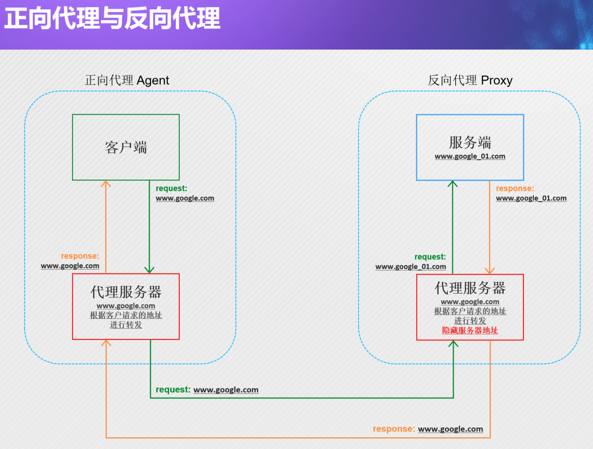
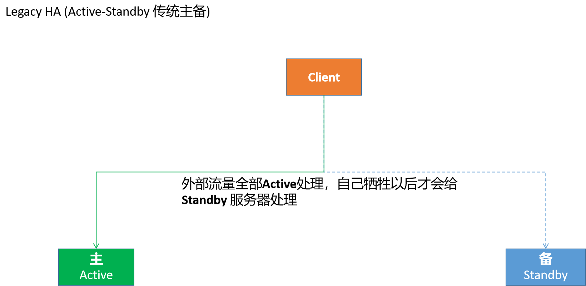
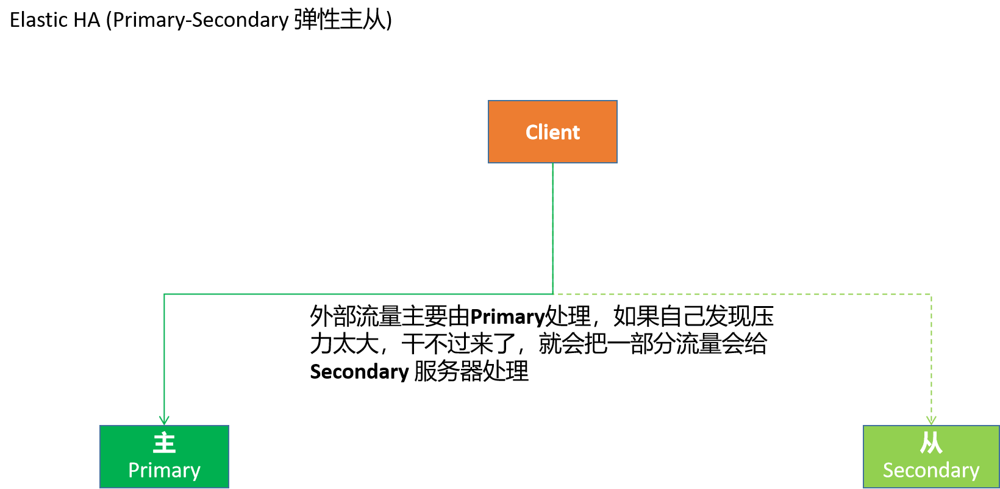
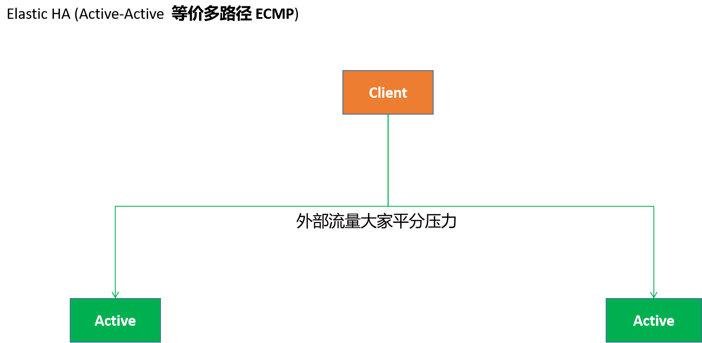
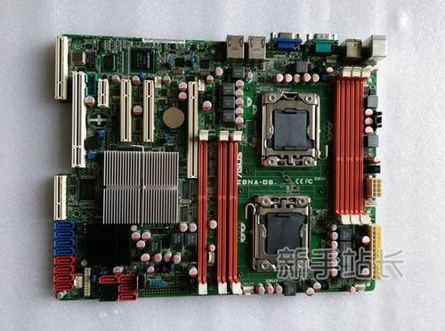

# 自学整理-资料收集-概念整理

### **[墨天轮排行榜](https://www.modb.pro/dbRank "墨天轮排行榜")**

* * *

* * *

* * *

### **[下载大模型](https://huggingface.co/THUDM/chatglm2-6b/tree/main "下载大模型")**

* * *

* * *

* * *

### **OIDC相关资料**

**[OpenID Connect 的工作原理](https://openid.net/developers/how-connect-works/ "OpenID Connect 的工作原理")**

**[Kubernetes 用户认证](https://kubernetes.io/zh-cn/docs/reference/access-authn-authz/authentication/#openid-connect-tokens "Kubernetes 用户认证")**

* * *

* * *

* * *

### 深度学习之`“深度”`

> 深度学习是机器学习的一个分支领域：它是从数据中学习表示的一种新方法，强调从连续的层（layer）中进行学习，这些层对应于越来越有意义的表示。 `“深度学习”`中的`“深度”`指的并不是利用这种方法所获取的更深层次的理解，而是指一系列连续的表示层。`数据模型中包含多少层`，这被称为`模型的深度`（depth）。 这一领域的其他名称包括`分层表示学习`（layered representations learning）和`层级表示学习`（hierarchical representations learning）。 现代深度学习通常包含数十个甚至上百个连续的表示层，这些表示层全都是从训练数据中自动学习的。 与此相反，其他机`器学习方法`的重点往往是`仅仅学习一两层`的数据表示，因此有时也被称为`浅层学习`（shallow learning）。 在深度学习中，这些分层表示几乎总是通过叫作神经网络（neural network）的模型来学习得到的。神经网络的结构是逐层堆叠。 神经网络这一术语来自于神经生物学，然而，虽然深度学习的一些核心概念是从人们对大脑的理解中汲取部分灵感而形成的，**但`深度学习模型不是大脑模型`。没有证据表明大脑的学习机制与现代深度学习模型所使用的相同。** 你可能会读到一些流行科学的文章，宣称深度学习的工作原理与大脑相似或者是根据大脑的工作原理进行建模的，但事实并非如此。 对于这一领域的新人来说，如果认为深度学习与神经生物学存在任何关系，那将使人困惑，只会起到反作用。 **你无须那种`“就像我们的头脑一样”`** 的神秘包装，最好也忘掉读过的深度学习与生物学之间的假想联系。 **就我们的目的而言，`深度学习`是`从数据中学习表示`的一种`数学框架`。**

* * *

* * *

* * *

### **云计算出处标准定义**

[标准定义出处 NIST 定义 PDF](http://qiniu.dev-share.top/file/NIST-%E4%BA%91%E8%AE%A1%E7%AE%97%E6%A0%87%E5%87%86%E5%AE%9A%E4%B9%89.pdf)

#### **下面是The NIST Definition of Cloud Computing的具体内容：**

> 云计算是一种模型，实现无处不在的、方便、通过网络按需访问的可配置的共享计算资源池（例如，网络、服务器、存储、应用程序、服务），这些资源可以快速提供，通过最小化管理成本或与服务提供商进行交互。云计算模型有五个基本特性，三个服务模型以及四个部署模型。

#### **基本特性**

> 1. **按需自助服务**
>     - 消费者能够单方面按需调配计算资源，例如服务器时间和网络存储，这些是无需人为干涉自动进行的。
> 2. **广泛网络访问**
>     - 通过各种瘦或胖客户端（移动电话、平板电脑、便携式电脑和工作站）使用标准机制通过网络访问资源。
> 3. **资源池**
>     - 通过多租户模型，供应商的计算资源池可服务多位消费者，根据用户需求动态或重新分配不同的物理和虚拟资源。资源是与位置无关的，客户通常无法控制或知道资源的精确位置，但可以在更高层抽象（例如，国家、洲或数据中心）上指定位置。资源例子包括存储、处理器、内存和网络带宽。
> 4. **快速可伸缩性**
>     - 资源能被弹性配置和发布，在有些场景下，可按需自动而快速的横向扩展和收缩。对于消费者而言，可调配的资源总是无限可用的，可在任何时候使用任意数量的资源。
> 5. **可度量服务**
>     - 云计算系统能够自动控制并优化资源的使用，通过适用于服务类型的某些抽象层级的度量机制（例如，存储、处理器、带宽以及活动的用户帐户）。能够监控、控制和报告资源使用率，为服务提供商和消费者提供透明的服务使用情况。

#### **服务模型**

> - **Software-as-a-Service (SaaS)**
>     - 提供给消费者的资源是运行在云计算基础架构上的服务商提供的应用程序。各种客户端通过瘦客户端接口访问该应用程序，例如Web浏览器，或程序接口。消费者并不管理或控制底层的云计算基础架构，包括网络、服务器、操作系统、存储、甚至应用程序本身的功能，只允许部分受限的用户设置特定的应用程序设置。
> - **Platform-as-a-Service（PaaS）**
>     - 提供给消费者的资源是可以使用由服务商支持的编程语言、库、服务和工具，把由消费者创建或购买的应用程序部署在云计算基础设施上的能力。消费者并不管理或控制底层云计算基础设施，包括网络、服务器、操作系统、存储，但对部署的应用程序有控制权，还可以配置应用程序所在宿主机的环境。
> - **Infrastructure-as-a-Service（IaaS）**
>     - 提供给消费者的资源是可调配的处理器、存储、网络以及其他可用于运行任意软件的基础计算资源，包括操作系统和应用程序。消费者并不管理或控制底层云计算基础架构，但可以控制操作系统、存储和部署的应用程序，可能还被允许有限制的控制网络组件（例如，主机防火墙）。

#### **部署模型**

> - **私有云**
>     - 云计算基础架构提供给包含多个消费者的单一组织专门使用。该云计算基础架构可以由该组织、第三方机构或他们的组合来拥有、管理和运营，基础架构可以位于组织内部或外部。
> - **社区云**
>     - 云计算基础架构提供给一个由多个组织的成员组成的消费者社区专门使用，这些组织有共同关注的话题（例如，任务、安全需求、政策、合规性考量）。该云计算基础架构可以由该社区中的一个或多个组织、第三方机构或他们的组合来拥有、管理和运营，基础架构可位于组织内部或外部。
> - **公有云**
>     - 云计算基础架构提供给公众开放使用，该云计算基础架构可以由商业机构、学术组织或政府机关、或者他们的组合来拥有、管理和运营，基础架构位于云计算服务提供商内部。
> - **混合云**
>     - 由两个或多个独立的不同云计算基础架构（私有、社区或公有）组成，他们通过标准或私有技术被绑定在一起，实现数据和应用程序的可移植性，例如，当云爆发时实现多云之间的负载均衡

NIST Cloud Computing Reference Architecture： 

* * *

* * *

* * *

### 云服务出处标准定义

* * *

* * *

* * *

### **云原生出处标准定义**

[标准定义出处 CNCF/TOC](https://github.com/cncf/toc/blob/main/DEFINITION.md#%E4%B8%AD%E6%96%87%E7%89%88%E6%9C%AC)

> 云原生技术有利于各组织在公有云、私有云和混合云等新型动态环境中，构建和运行可弹性扩展的应用。 云原生的代表技术包括`容器`、`服务网格`、`微服务`、`不可变基础设施`和`声明式API`。 这些技术能够构建容错性好、易于管理和便于观察的松耦合系统。 结合可靠的自动化手段，云原生技术使工程师能够轻松地对系统作出频繁和可预测的重大变更。 云原生计算基金会（CNCF）致力于培育和维护一个厂商中立的开源生态系统，来推广云原生技术。我们通过将最前沿的模式民主化，让这些创新为大众所用。

* * *

* * *

* * *

### 容器出处标准定义

[标准定义出处 Open Container Initiative](https://opencontainers.org/) [中文参考资料](https://xuanwo.io/2019/08/06/oci-intro/)

> 开放容器倡议（OCI）是一个旨在围绕容器格式和运行时创建开放行业标准的开放治理结构。该倡议由Docker和容器行业的其他领导者于2015年6月成立，目前包含三个规范：运行时规范（runtime-spec）、镜像规范（image-spec）和分发规范（distribution-spec）。运行时规范描述了如何运行一个“文件系统捆绑包”，这个包会被解压到磁盘上。在高层次上，OCI的实现会下载OCI镜像，然后将该镜像解压为OCI运行时文件系统捆绑包。此时，OCI运行时捆绑包将由OCI运行时执行。因此，“开放容器标准”这个翻译能够比较准确地传达OCI的目标和职能。

* * *

> - **运行时规范**（runtime-spec）
>     - 规定了如何运行一个容器，并规范了容器运行时的各种限制和管理策略，确保容器的安全和稳定性。
> - **镜像规范**（image-spec）
>     - 规定了容器镜像的格式和组成结构，包括如何构建和存储容器镜像等方面。这个规范可以让不同的容器相关工具之间进行互通和迁移。
> - **分发规范**（distribution-spec）
>     - 则规范了容器镜像的分发机制，包括如何存储和交换容器镜像，以及如何在本地和远程环境中使用它们。这个规范可以确保容器镜像的可靠性和可用性。

* * *

* * *

* * *

### 云的服务层次

- **IaaS**
    
    - **Infrastructure as a Service**，基础设施即服务。
    - IaaS产品
        
        - 主要涉及：计算、网络、存储服务
        - 通过互联网，按需提供弹性计算资源的服务
        - 需要自己部署操作系统、应用程序的高可用，需要承担应用层运行时所带来的风险
    - 责任
        
        - 由云供应商来提供【运维、安全、稳定】
        - 操作系统中的相关使用，由云用户负责来负责
    - 个人理解
        
        - 供应商提供运维层面的相关服务
- **PaaS**
    
    - **Platform as a Service**，平台即服务。
    - 对于开发者提供开发框架、不需要关心底层结构
    - PaaS产品
        
        - 云端数据库、容器化应用、中间件
        - 它是按照资源的开销来付费
    - 个人理解
        
        - 供应商提了【应用程序的运行环境】与【中间件】，云用户只负责管理自研产品的维护，其它资源可以依赖云供应商
- **SaaS**
    
    - **Software as a Service**，软件即服务。
    - 服务商提供基于软件的解决方案，交付成熟的应用，让用户用到最新的产品，产品由云供应商来提供，不需要自己开发
    - SaaS产品
        
        - 如OA、CRM、MIS、ERP、HRM、CM、Office 365、iCloud、G Suite等应用，客户不需考虑任何形式的专业技术知识，获得完整的软件包，使他们的日常工作和生活变得更轻松。
    - 个人理解
        
        - SaaS实际上是提供了具体的软件服务，细化到了具体的分类，相比IaaS和PaaS面向程序员，SaaS是直接面向产品经理甚至用户的。
- **BaaS**
    
    - **Backend as a Service**，后端即服务。
    - 服务商为客户(开发者)提供整合云后端的服务，如提供**文件存储**、**数据存储**、推送服务、**身份验证服务**等功能，以帮助开发者快速开发应用。
    - IaaS产品
        
        - 国外比较知名的BaaS服务提供商是StackMob和Parse。 在国内，Talking Data、友盟、Bmob、百度和新浪开发平台均有相关业务。
        - 事实上google的Firebase也是一个BaaS。
            
            - Firebase提供了广泛的功能列表，这些功能分为三个阶段，即开发，获取和成长。
            - 开发阶段包括实时数据库，身份验证，云消息传递，存储，托管，测试实验室（用于在设备上测试应用程序）和崩溃报告。
            - 作为商业提供商，它还集成了AdMob平台，可通过您的应用获利。
            - 在发展之路上，您会发现诸如App Indexing，AdWords，Notifications等功能。
        - 也可以理解为BaaS = IaaS + PaaS + APIs + SDKs，即服务提供商提供了大量的功能，使用方只需要接入sdk，然后使用其api即可。
- **FaaS**
    
    - **Function as a service** 函数即服务，也叫功能即服务。
    - 服务商提供一个平台，允许客户开发、运行和管理应用程序功能，而无需构建和维护通常与开发和启动应用程序相关的基础架构的复杂性。
        
        - 按照此模型构建应用程序是实现“无服务器”体系结构的一种方式，通常在构建微服务应用程序时使用。
    - 一般情况下，云平台的计算费用取决于调用次数，执行时长，内存消耗。
        
        - 所以如果这个函数的功能代码写得不好，调用次数非常多，执行时间特别长，或者消耗了大量的内存，那么价格就会很贵。
        - 一般和BaaS结合，开发一些项目所需的特殊计算，只为实际计算量付费。
        - 那么这种服务适合用于计算量偶尔比较高，但是一般情况没有计算量，或者计算量低的服务。

* * *

* * *

* * *

### 5W1H

> **Who** 谁？ **What** 发生什么事？ **When** 事情发生的时间？ **Where** 事情在哪发生？ **Why** 事情发生的原因是什么？ **`How`** 总结5W的整个经过、过程 **`我的理解`** 是前面的 **`5w`** 是辅助人来收集信息，然后 **`How`** 是将前面的碎片信息进行整理，最后在形成一个整体的故事。

* * *

> **Who（谁）**：指事件中涉及的人物、团体或机构。在新闻报道中，这可能是指犯罪嫌疑人、政治家、商人、社区居民等。 **What（什么**）：是指事件的主要内容和基本事情，即发生了什么事情。这包括事件的性质、影响、后果和结果等。 **When（何时）**：是指事件发生的时间和时间段，可以有具体的日期、时间、时期等多种形式。 **Where（何地）**：指事件发生的地点和位置，包括国家、城市、场馆、产生所有权争议的土地等。 **Why（为什么）**：关注事件发生的原因和背景等。这可以揭示事件的根本原因、相关方面的局限和潜在的战略或历史问题等。 **`How`（如何）**：关注事件的实现、发展和结果的细节和过程，以及新闻事件如何获得广泛关注和公众反应。
> 
> - **`5W1H`** 法则中的 **`Who`、`What`、`When`、`Where`、`Why`** ，是用来收集和整理碎片信息的关键问题。
> - 而**`How`** 则是基于这些问题收集到的信息，描绘事件发生的过程、细节和方式，并将这些信息整合成一个完整的故事或事件。
> - **因此，`How` 在整个 `5W1H` 法则中，可以理解为一个整合作用。**
> - 它可以帮助读者更全面、更具体地了解事件，并帮助作者更好地描述、记录和传达事件的发生。

* * *

* * *

* * *

### 在 YAML 中，有三种不同的多行字符串标记语法，它们分别是：

```yaml
>：表示折叠多行字符串（Folded Style），使用时会删除所有换行符和首尾空格。
|：表示保留多行字符串（Literal Style），使用时会保留所有换行符和缩进。
|+：表示保留多行字符串并且保留末尾空行（Literal Block Style with Chomping Indicator），
    使用时会保留所有换行符和缩进，并且在末尾保留一个空行。
```

* * *

* * *

* * *

### 灰度发布-[参考链接](https://kubesphere.io/zh/docs/v3.3/project-user-guide/grayscale-release/overview/)

> - **灰度发布是一种在生产环境中升级应用的方法，它允许您逐步向新版本过渡，以确保稳定性并最小化风险。**
>     - 当您升级应用至新版本时，灰度发布可以确保平稳过渡。
>     - 采用的具体策略可能不同，但最终目标相同，即提前识别潜在问题，避免影响在生产环境中运行的应用。
>     - 这样不仅可以将版本升级的风险降到最低，还能测试应用新构建版本的性能。
> - **常用的三种灰度发布策略：**
>     - **蓝绿部署**
>         - 在一个备用环境中运行新版本，然后将流量逐步路由至新版本。
>     - **金丝雀发布**
>         - 缓慢向一小部分用户推送变更，以测试新版本的性能和稳定性。
>     - **流量镜像**
>         - 将实时生产流量复制到镜像服务，以测试新版本的行为并进行集群和数据库测试。
> 
> 金丝雀发布、蓝绿部署和流量镜像都是灰度发布的不同策略，它们都是为了在升级或部署新版本应用程序时减少潜在风险和保证稳定性而设计的。 每种策略的实现方式和适用场景不同，具体的选择应根据应用程序的特点和需求进行综合考虑。 在实践中，可以根据具体情况选择其中一种或多种策略，或结合多种策略来实现灰度发布，以达到更好的效果。

* * *

* * *

* * *

### **什么是AKKA**

> **Akka** 是一个**免费开源的软件工具包**，使用Akka可以很容易的**在JVM上**构建**高并发**和**分布式**的应用程序。 **Akka** 支持多种编程模型，但是着重于Actor Model并发模型。它的设计灵感来自于Erlang语言。 **Akka** 同时支持使用Java和Scala进行开发。但Akka是用Scala语言写出来的。 在Scala2.10版本中，Akka取代了Scala原有的Actor Model的实现，**被收录于Scala标准库中**。

* * *

* * *

* * *

### **[什么是信创？](https://zhuanlan.zhihu.com/p/148098873 "什么是信创？")**

* * *

* * *

* * *

### **[如何理解两阶段提交？](https://zhuanlan.zhihu.com/p/111304281 "如何理解两阶段提交？")**

* * *

* * *

* * *

### **[Oracle RAC](https://baike.baidu.com/item/Oracle%20RAC/6542374 "Oracle RAC")**

* * *

* * *

* * *

### Serverless（无服务器架构）

> - **Serverless（无服务器架构）** 指的是由 **`开发者实现的服务端逻辑`** 运行在无状态的计算容器中。
>     - 它由事件触发，完全被第三方管理，其业务层面的状态则被开发者使用的数据库和存储资源所记录；
> - **Serverless** **`不代表不需要服务器`**，而是说开发者不用过多的考虑服务器问题，计算资源作为 **`服务`** 而非 **`服务器`** 的概念出现；
> - **Serverless** 是一套构建和管理基于服务架构的完整流程，允许开发者在 **`服务级`** 别而非 **`服务器级`** 别来管理应用部署，这会极大降低软件开发的复杂度，使得开发者可以快速迭代应用软件；
> - **Serverless** 是云原生技术发展的高级阶段，使开发者更聚焦在业务逻辑，而减少对基础架构的关注。
> - 当前 **Serverless** 在业界包含 **FaaS** 和 **BaaS** 两种实现方式。
>     - **FaaS（Functions as a Service）** 是函数即服务，包含了一个标准化的运行时框架，用于构建和执行函数。

* * *

* * *

* * *

### **`什么是正向代理与反向代理？`**

**场景**

- 客户端向服务端发起请求

**正向代理**

- 作为客户端的代理程序，虽然在 客户端与服务端之间，但它提供的功能是为客户端提供的，例如：翻墙使用vpn上外网。

**反向代理**

- 作为服务端的代理程序，虽然在 客户端与服务端之间，但它提供的功能是为了服务端提供服务的，例如：nginx为服务端提供反向代理。





* * *

* * *

* * *

### **[什么是事件驱动](https://www.cnblogs.com/lguow/p/10750296.html "什么是事件驱动")**

**事件驱动和异步IO** 通常，我们写服务器处理模型的程序时，有以下几种模型：

1. 每收到一个请求，创建一个新的进程，来处理该请求；
2. 每收到一个请求，创建一个新的线程，来处理该请求；
3. 每收到一个请求，放入一个事件列表，让主进程通过非阻塞I/O方式来处理请求

上面的几种方式，各有千秋，   `第（1）种`方法，由于创建新的进程的开销比较大，所以，会导致服务器性能比较差,但实现比较简单。   `第（2）种`方法，由于要涉及到线程的同步，有可能会面临死锁等问题。   `第（3）种`方法，在写应用程序代码时，逻辑比前面两种都复杂。

**综合考虑各方面因素，一般普遍认为`第（3）种`方式是大多数网络服务器采用的方式**

* * *

### **[事件驱动机制跟消息驱动机制相比](https://www.cnblogs.com/welen/articles/5115213.html "事件驱动机制跟消息驱动机制相比")**

**事件：**   按下鼠标，按下键盘，按下游戏手柄，将U盘插入USB接口，都将产生事件。比如说按下鼠标左键，将产生鼠标左键被按下的事件。 **消息：**   当鼠标被按下，产生了鼠标按下事件，windows侦测到这一事件的发生，随即发出鼠标被按下的消息到消息队列中，这消息附带了一系列相关的事件信息，比如鼠标哪个键被按了，在哪个窗口被按的，按下点的坐标是多少？如此等等。

1. 要理解事件驱动和程序，就需要与非事件驱动的程序进行比较。实际上，现代的程序大多是事件驱动的，`比如多线程的程序，肯定是事件驱动的。早期则存在许多非事件驱动的程序，这样的程序，在需要等待某个条件触发时，会不断地检查这个条件，直到条件满足，这是很浪费cpu时间的`。而`事件驱动的程序`，则有机会释放cpu从而进入睡眠态（注意是有机会，当然程序也可自行决定不释放cpu），`当事件触发时被操作系统唤醒，这样就能更加有效地使用cpu`。
2. 再说什么是事件驱动的程序。`一个典型的事件驱动的程序，就是一个死循环`，并以一个线程的形式存在，这个`死循环包括两个部分，第一个部分是按照一定的条件接收并选择一个要处理的事件`，第二个部分就是`事件的处理过程`。程序的执行过程就是`选择事件和处理事件`，而当`没有任何事件触发时`，程序会`因查询事件队列失败而进入睡眠状态`，从而释放cpu。
3. 事件驱动的程序，`必定会直接或者间接拥有一个事件队列，用于存储未能及时处理的事件`。
4. 事件驱动的程序的行为，`完全受外部输入的事件控制，所以`，事件驱动的系统中，存在大量这种程序，并以事件作为主要的通信方式。
5. 事件驱动的程序，`还有一个最大的好处`，`就是可以按照一定的顺序处理队列中的事件`，`而这个顺序则是由事件的触发顺序决定的`，这一特性往往被用于保证某些过程的原子化。
6. 目前windows,linux,nucleus,vxworks都是事件驱动的，只有一些单片机可能是非事件驱动的。

  **`事件模式`耦合高，同模块内好用。**   **`消息模式`耦合低，跨模块好用。**

  事件模式集成其它语言比较繁琐，消息模式集成其他语言比较轻松。`事件是侵入式设计，霸占你的主循环`；`消息是非侵入式设计，将主循环该怎样设计的自由留给用户`。如果你在设计一个东西举棋不定，那么你可以参考win32的GetMessage，本身就是一个藕合度极低的接口，又足够自由，接口任何语言都很方便，具体应用场景再在其基础上封装成事件并不是难事，接口耦合较低，即便哪天事件框架调整，修改外层即可，不会伤经动骨。而如果直接实现成事件，那就完全反过来了。

* * *

* * *

* * *

#### [VMware SDKs官方文档](https://techpartnerhub.vmware.com/sdks "VMware SDKs官方文档")

#### [pyVmomi 安装](https://pypi.org/project/pyvmomi/ "pyVmomi 安装")

**pyVmomi是适用于VMware vSphere API的Python SDK，可用于管理ESX，ESXi和vCenter。**

* * *

* * *

* * *

#### [Apache APISIX 官方文档](https://github.com/apache/apisix/blob/master/README_CN.md "Apache APISIX 官方文档")

#### [协议转换 k8s Apache APISIX](https://github.com/apache/apisix-ingress-controller "协议转换 k8s Apache APISIX")

* * *

#### [分布式锁 Redisson 官方文档](https://github.com/redisson/redisson/wiki/1.-%E6%A6%82%E8%BF%B0 "分布式锁 Redisson 官方文档")

#### [分布式事务 Alibaba Seata 官方文档](http://seata.io/zh-cn/docs/overview/what-is-seata.html "分布式事务 Alibaba Seata 官方文档")

#### [分布式任务调度 当当网 ElasticJob 官方文档](https://shardingsphere.apache.org/elasticjob/current/cn/overview/ "分布式任务调度 当当网 ElasticJob 官方文档")

* * *

#### [Alibaba 分布式系统的流量防卫兵 官方文档](https://github.com/alibaba/Sentinel/wiki/%E4%BB%8B%E7%BB%8D "Alibaba 分布式系统的流量防卫兵 官方文档")

#### [Alibaba Nacos 官方文档](https://nacos.io/zh-cn/docs/what-is-nacos.html "Alibaba Nacos 官方文档")

#### [阿里巴巴 spring-cloud](https://github.com/alibaba/spring-cloud-alibaba/wiki "阿里巴巴 spring-cloud")

* * *

#### [携程 阿波罗 官方文档](https://github.com/ctripcorp/apollo/wiki/Apollo%E9%85%8D%E7%BD%AE%E4%B8%AD%E5%BF%83%E4%BB%8B%E7%BB%8D "携程 阿波罗 官方文档")

* * *

#### [SkyWalking 官网](https://skywalking.apache.org/ "SkyWalking 官网")

#### [SkyWalking demo](http://demo.skywalking.apache.org/ "SkyWalking demo")

#### [全链路跟踪 华为 skywalking简介](https://www.cnblogs.com/swave/p/11347711.html "全链路跟踪 华为 skywalking简介")

#### [华为 Skywalking 是分布式系统的应用程序性能监视工具](https://cloud.tencent.com/developer/article/1736637 "华为 Skywalking 是分布式系统的应用程序性能监视工具")

* * *

* * *

* * *

#### **[通俗的语言解释什么是 RPC 框架](https://www.zhihu.com/question/25536695 "通俗的语言解释什么是 RPC 框架")**

**本地过程调用**     RPC就是要像调用本地的函数一样去调远程函数。在研究RPC前，我们先看看本地调用是怎么调的。假设我们要调用函数Multiply来计算lvalue \* rvalue的结果:

```c
int Multiply(int l, int r) {
   int y = l * r;
   return y;
}

int lvalue = 10;
int rvalue = 20;
int l_times_r = Multiply(lvalue, rvalue);
```

> - **那么在第8行时，我们实际上执行了以下操作：**
> 
> 1. 将 lvalue 和 rvalue 的值压栈
> 2. 进入Multiply函数，取出栈中的值10 和 20，将其赋予 l 和 r
> 3. 执行第2行代码，计算 l \* r ，并将结果存在 y
> 4. 将 y 的值压栈，然后从Multiply返回
> 5. 第8行，从栈中取出返回值 200 ，并赋值给 l\_times\_r

    以上5步就是执行本地调用的过程。（20190116注：以上步骤只是为了说明原理。事实上编译器经常会做优化，对于参数和返回值少的情况会直接将其存放在寄存器，而不需要压栈弹栈的过程，甚至都不需要调用call，而直接做inline操作。仅就原理来说，这5步是没有问题的。）

**远程过程调用带来的新问题**

    在远程调用时，我们需要执行的函数体是在远程的机器上的，也就是说，Multiply是在另一个进程中执行的。这就带来了几个新问题：

**1\. Call ID映射**     我们怎么告诉远程机器我们要调用Multiply，而不是Add或者FooBar呢？在本地调用中，函数体是直接通过函数指针来指定的，我们调用Multiply，编译器就自动帮我们调用它相应的函数指针。但是在远程调用中，函数指针是不行的，因为两个进程的地址空间是完全不一样的。所以，在RPC中，所有的函数都必须有自己的一个ID。这个ID在所有进程中都是唯一确定的。客户端在做远程过程调用时，必须附上这个ID。然后我们还需要在客户端和服务端分别维护一个 {函数 <--> Call ID} 的对应表。两者的表不一定需要完全相同，但相同的函数对应的Call ID必须相同。当客户端需要进行远程调用时，它就查一下这个表，找出相应的Call ID，然后把它传给服务端，服务端也通过查表，来确定客户端需要调用的函数，然后执行相应函数的代码。

**2\. 序列化和反序列**     客户端怎么把参数值传给远程的函数呢？在本地调用中，我们只需要把参数压到栈里，然后让函数自己去栈里读就行。但是在远程过程调用时，客户端跟服务端是不同的进程，不能通过内存来传递参数。甚至有时候客户端和服务端使用的都不是同一种语言（比如服务端用C++，客户端用Java或者Python）。这时候就需要客户端把参数先转成一个字节流，传给服务端后，再把字节流转成自己能读取的格式。这个过程叫序列化和反序列化。同理，从服务端返回的值也需要序列化反序列化的过程。

**3\. 网络传输**     远程调用往往用在网络上，客户端和服务端是通过网络连接的。所有的数据都需要通过网络传输，因此就需要有一个网络传输层。网络传输层需要把Call ID和序列化后的参数字节流传给服务端，然后再把序列化后的调用结果传回客户端。只要能完成这两者的，都可以作为传输层使用。因此，它所使用的协议其实是不限的，能完成传输就行。尽管大部分RPC框架都使用TCP协议，但其实UDP也可以，而gRPC干脆就用了HTTP2。Java的Netty也属于这层的东西。

* * *

#### **[Python 快速搭建 RESTful API](https://cloud.tencent.com/developer/news/625934 "Python 快速搭建 RESTful API")**

1. python 调用 ansible api成功
2. python 可以从mariadb中读取 yaml
3. python 可以将数据库中读取的 yaml 传给 ansible api 执行
4. 通过web页面读取、展示数据库中yaml内容，并且可以编辑
5. 通过页面按钮触发python脚本执行ansible api
6. 记录执行日志

* * *

#### **[什么是双活或多活？](https://zhuanlan.zhihu.com/p/30494653 "什么是双活或多活？")**

**要说双活，就得先说说单活。**

> - **`单活` 就是一主一备、传统主备。 `主` 干活儿，`备` 不干活儿，等主死了备才干活儿** 

* * *

> - **`弹性主从` 外部流量主要由 `主` 处理，如果自己发现压力太大，干不过来了，就会把一部分流量会给 `从` 服务器处理** 

* * *

> - **`双活` 就是`多主`同时干活，外部流量大家平分压力。**  **`高可用`** 通常采用的是 **`双活`** 或 **`多活`** 它的工作方式是 **`负载均衡`** ，服务器 **`同时工作`** ，想想 **`HAProxy`** 的工作方式

* * *

#### **[什么是高可用？](https://zhuanlan.zhihu.com/p/43723276 "什么是高可用？")**

> - 方法论上，高可用保证的原则是 **`集群化`** ，或者叫 **`冗余`** ：只有一个单点，挂了服务会受影响；如果有冗余备份，挂了还有其他备份能够顶上。
> - 保证系统高可用，架构设计的核心准则是：**`冗余`**。
> - 有了冗余之后，还不够，每次出现故障需要人工介入恢复势必**会增加**系统的**不可服务时间**。所以，又往往是通过 **`自动故障转移`** 来实现系统的 **高可用** 。

* * *

#### **[什么是两地三中心？](https://zhuanlan.zhihu.com/p/210550962 "什么是两地三中心？")**

> - **`两地`** 是指同城、异地，两个地方； 两地数据中心距离上有限制，理论上不大于**100km**，实际建议不大于**50km**
> - **`三中心`** 是指生产中心、同城灾备中心、异地灾备中心。

* * *

#### **[MPLS 是什么](https://zhuanlan.zhihu.com/p/27232535 "MPLS 是什么")**

* * *

> - **什么是路由决策？** 路由决策就是路由器决定数据包如何路由转发的过程

* * *

#### **[什么是 SLA](https://www.jianshu.com/p/eccdf226609f "什么是 SLA")**

SLA：服务等级协议（简称：SLA，全称：service level agreement） 全年拿365天做计算吧，看看几个9要停机多久时间做能才能达到！ **1年 = 365天 = 8760小时**

> - 99.9 = 8760 \* 0.1% = 8760 \* 0.001 = 8.76小时
> - 99.99 = 8760 \* 0.0001 = 0.876小时 = 0.876 \* 60 = 52.6分钟
> - 99.999 = 8760 \* 0.00001 = 0.0876小时 = 0.0876 \* 60 = 5.26分钟

**从以上看来，全年停机5.26分钟才能做到99.999%，即5个9。**

* * *

#### **网络传输中的匹配规则都是`优先匹配更精确`的规则**

* * *

* * *

* * *

### **[什么是双路服务器？](https://www.xinshouzhanzhang.com/shuanglufuwuqi.html "什么是双路服务器？")**

双路服务器是指该服务器物理CPU的数量，注意：是物理CPU数量，对应的服务器主板上也会有两个CPU卡槽。双路非双核，双核是指在一颗CPU上安装两个CPU核心，所以双核或者多核CPU看起来还是一颗CPU，而多路CPU，有几路就有几个可以看见的CPU。 什么是双路服务器？多路CPU服务器图文详解 双路CPU服务器 

如上图所示，上图是双路CPU，可以看见服务器主板上有两个CPU卡槽，卡槽上装有两颗CPU。 综上，单路服务器、双路服务器、四路服务器等，可以这样理解：文章源自新手站长网-https://www.xinshouzhanzhang.com/shuanglufuwuqi.html

- **单路**：服务器只有一颗物理CPU，主板上一个CPU卡槽；
- **多路**：服务器上有两颗物理CPU，主板上有两个CPU卡槽；
- **四路**：服务器上有四颗物理CPU，主板上有四个CPU卡槽。

* * *

### **[路、CPU、物理核、逻辑核和超线程概念](https://www.cnblogs.com/badboy200800/p/12641255.html "路、CPU、物理核、逻辑核和超线程概念")**

一个服务器主板可以插多个CPU称为多路，一个CPU可以有多个物理核。如果开启了超线程，一个物理核可以分成n个逻辑核（一般是2），n为超线程的数量。

> 1. **路**（多个CPU） **路**都是指服务器CPU的数量，也就是服务器主板上CPU插槽的数量。 通常有单路、两路、四路和多路。 单路指服务器支持1个CPU ； 两路指服务器支持2个CPU ； 四路指服务器支持4个CPU； 多路指服务器支持多个CPU。
> 2. **CPU**( Central Processing Unit) CPU中央处理单元是硬件系统的核心，用于数据的加工处理，能完成各种算术、逻辑运算以及控制功能。 CPU不等于物理核，更不等于逻辑核。
> 3. **物理核**(physical core/processor) 可以看的到的，真实的cpu核，有独立的电路元件以及L1,L2缓存，可以独立地执行指令。 通常有单核、双核、多核。 单核指一颗CPU中仅有1个运算核心； 双核指一颗CPU中集成了2个运算核心； 多核指一颗CPU中集成了两个以上的运算核心。
> 4. **逻辑核**( logical core/processor，LCPU): 在同一个物理核内，逻辑层面的核。主要是操作系统使用逻辑核来模拟出真实CPU的效果，让应用程序以为有两个CPU在运算（依赖于物理核的高速运算）。 如果没有开启超线程，逻辑核个数与物理核数相同。 当超线程开启后，逻辑核个数是物理核数的2倍。
> 5. **超线程**( Hyper-threading， HT)：1LCPU=1HT 超线程可以在一个逻辑核等待指令执行的间隔(等待从cache或内存中获取下一条指令)，把时间片分配到另一个逻辑核。 高速在这两个逻辑核之间切换，让应用程序感知不到这个间隔，误认为自己是独占了一个物理核。 每个物理核2个线程，则意味着它是 HT。即每个物理核可以同时运行的执行线程或处理作业的数量为2。

* * *

* * *

* * *
