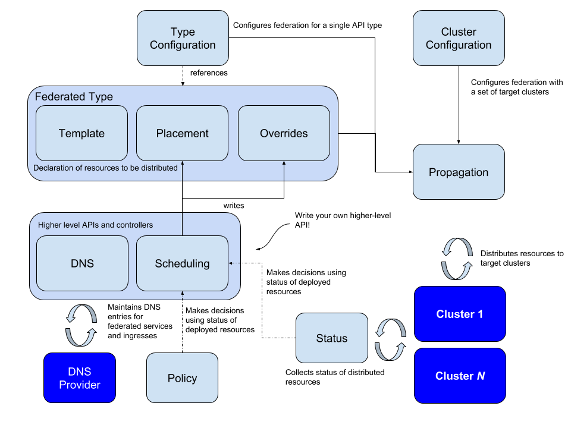

## 前言

- 技术的使用要和业务进行绑定。
- 技术理论知识与实际业务结合一定会大打折扣。
- 在技术与业务相结合的设计与使用上要从这些角度上思考。
- 不能单一的只从技术的角度来考虑。

* * *

- 例如：kubernetes集群联邦 场景
    
    - 流量较大时需要扩展更多的服务器资源。
    - 流量较小时需要缩减多余的服务器资源。
    - 对于服务资源使用量不确定的业务服务器，放到公有云上。
    - 公有云的最大好处就是动态伸缩的服务器资源池。

* * *

- 相反，流量比较稳定，对于数据安全要求很高的服务器，服务资源使用量稳定的业务服务器，则更适合放在私有云环境当中。

* * *

* * *

* * *

## 概念

- 集群联邦 Federation 的目的是实现单一集群统一管理多个kubernetes集群的机制。这些集群可以是跨地域的，跨云厂商的或者是用户内部自建集群。一旦集群建立联邦后，就可以使用集群 Federation API 来管理多个集群的 kubernetes API 资源。

* * *

## Federation 中基本术语

1. **Federate**：联邦（Federate）是指联结一组 Kubernetes 集群，并为其提供公共的跨集群部署和访问接口
2. **KubeFed**：Kubernetes Cluster Federation，为用户提供跨集群的资源分发、服务发现和高可用
3. **Host Cluster**：部署 Kubefed API 并允许 Kubefed Control Plane
4. **Cluster Registration**：通过 kubefedctl join 使得成员集群加入到主集群（Host Cluster）
5. **Member Cluster**：通过 KubeFed API 注册为成员并受 KubeFed 管理的集群，主集群（Host Cluster）也可以作为成员集群（Member Cluster）
6. **ServiceDNSRecord**： 记录 Kubernetes Service 信息，并通过 DNS 使其可以跨集群访问
7. **IngressDNSRecord**：记录 Kubernetes Ingress 信息，并通过 DNS 使其可以跨集群访问
8. **DNSEndpoint**：一个记录（ServiceDNSRecord/IngressDNSRecord 的） Endpoint 信息的自定义资源

* * *

## 目标

1. 简化管理多个联邦集群的Kubernetes API 资源
2. 在多个集群之间分散工作负载(容器)，以提升应用(服务)的可靠性
3. 在不同集群中，能更快速更容易地迁移应用(服务)
4. 跨集群的服务发现，服务可以就近访问，以降低延迟
5. 实践多云(Multi Cloud)或混合云(Hybird Cloud)的部署

- 集群联邦最初是 v1 版本，因为方案设计问题，导致可扩展性比较差，`v1 版本已经被废弃`，目前社区提出了新的方案 **Federation V2**

* * *

## 相关资料

**[官方文档](https://github.com/kubernetes-sigs/kubefed#kubernetes-cluster-federation "官方文档")**

**[KubeFed: Kubernetes Federation v2 详解](https://www.kubernetes.org.cn/5702.html "KubeFed: Kubernetes Federation v2 详解")**

**[Kubernetes 多集群管理：Kubefed（Federation v2）](https://blog.ihypo.net/15716465002689.html "Kubernetes 多集群管理：Kubefed（Federation v2）")**

**[KubeFed 应用](https://zhuanlan.zhihu.com/p/264166064 "KubeFed 应用")**

* * *

### Federation V1 集群联邦 场景


* * *

### Federation V2 集群联邦 场景


* * *

### Federation V2 集群联邦 工作原理 中文版


* * *

### Federation V2 集群联邦 工作原理 英文原版



* * *

### 集群联邦通过 yaml文件配置 部署应用

```yaml
apiVersion: types.kubefed.io/v1beta1
kind: FederatedNamespace
metadata:
  name: test-namespace
  namespace: test-namespace
spec:
  placement:
    clusters:
    - name: cluster2
    - name: cluster1

---

apiVersion: types.kubefed.io/v1beta1
# 告诉 Kubefed所在的 k8s集群，你要创建Deployment
kind: FederatedDeployment
metadata:
  # 在命名空间 test-namespace 中创建一个名为 test-deployment 的Deployment
  name: test-deployment
  namespace: test-namespace

spec:
  template:
    metadata:
      labels:
        app: stress
    spec:
      # Pod的副本数为 3个
      replicas: 3
      selector:
        matchLabels:
          app: stress
      template:
        metadata:
          labels:
            app: stress
        spec:
          containers:
          - image: registry.cn-qingdao.aliyuncs.com/cn-aliyun/iris-server-stress:v0.1.0
            name: stress

  # 在联邦的集群场景中，你期望在哪些集群上部署
  placement:
    clusters:
    - name: cluster1
    - name: cluster2

  # 对于某些集群，你可能还想单独修改一些配置
  overrides:
  - clusterName: cluster2
    clusterOverrides:
    - path: "/spec/replicas"
      value: 5

```

**对于配置文件的更多使用方法，请[参考官方案例](https://github.com/kubernetes-sigs/kubefed/tree/master/example/sample1)**

* * *

### 对比 F5 GSLB


* * *

* * *

* * *

##### 最后

> - 到此，已经了解了基本工作原理，接下来，进入实战 **[Kubernetes集群联邦(二)-使用Helm部署Kubefed](kubernetes%e9%9b%86%e7%be%a4%e8%81%94%e9%82%a6%e4%ba%8c-%e4%bd%bf%e7%94%a8helm%e9%83%a8%e7%bd%b2kubefed)**

* * *

* * *

* * *

## 系列导航

1. **[Kubernetes集群联邦(一)-Federation V2 工作原理](kubernetes%e9%9b%86%e7%be%a4%e8%81%94%e9%82%a6%e4%b8%80-federation-v2-%e5%b7%a5%e4%bd%9c%e5%8e%9f%e7%90%86)**
2. **[Kubernetes集群联邦(二)-使用Helm部署Kubefed](kubernetes%e9%9b%86%e7%be%a4%e8%81%94%e9%82%a6%e4%ba%8c-%e4%bd%bf%e7%94%a8helm%e9%83%a8%e7%bd%b2kubefed)**
3. **[Kubernetes集群联邦(三)-使用kubefedctl注册集群联邦](kubernetes%e9%9b%86%e7%be%a4%e8%81%94%e9%82%a6%e4%b8%89-%e4%bd%bf%e7%94%a8kubefedctl%e6%b3%a8%e5%86%8c%e9%9b%86%e7%be%a4%e8%81%94%e9%82%a6)**
4. **[Kubernetes集群联邦(四)-使用kubefedctl统一管理联邦集群](kubernetes%e9%9b%86%e7%be%a4%e8%81%94%e9%82%a6%e5%9b%9b-%e4%bd%bf%e7%94%a8kubefedctl%e7%bb%9f%e4%b8%80%e7%ae%a1%e7%90%86%e8%81%94%e9%82%a6%e9%9b%86%e7%be%a4)**

* * *

* * *

* * *
