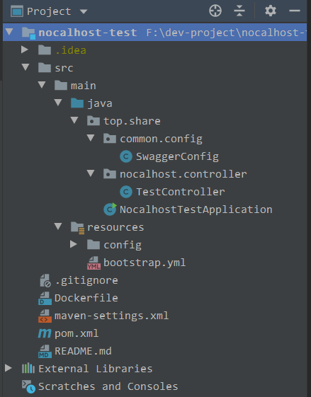
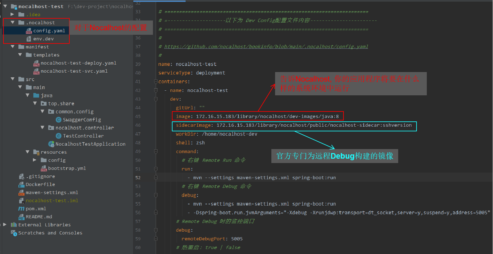
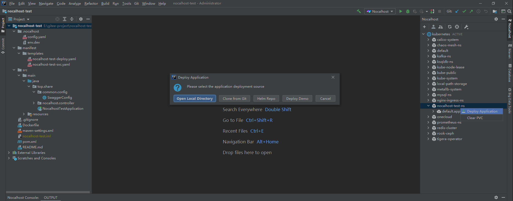
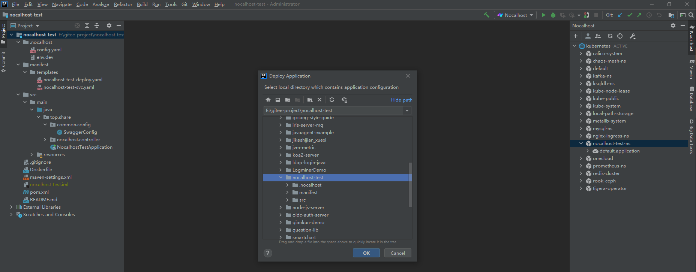
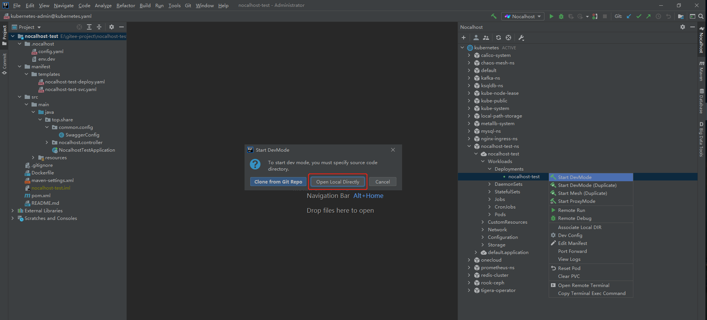
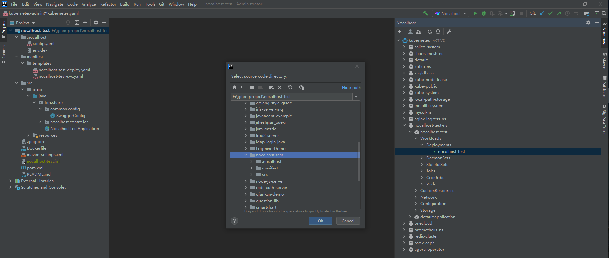
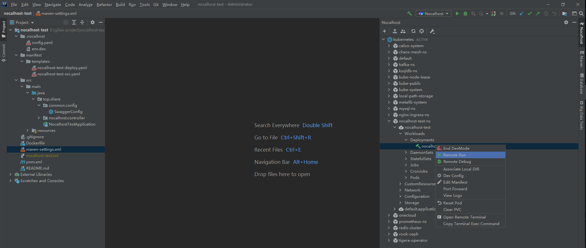
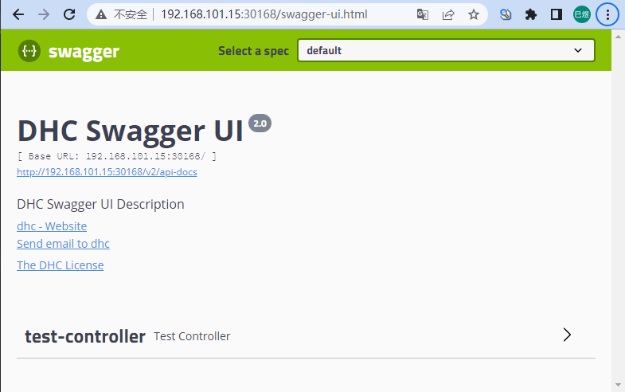
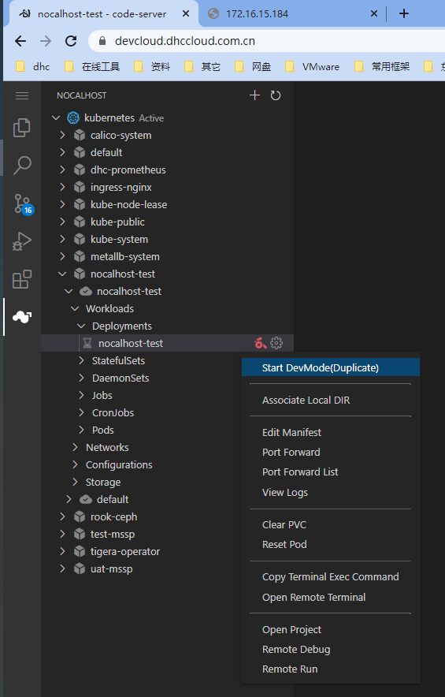

## Nocalhost 0.6.6

**[项目gitee地址](https://gitee.com/eric-mao/nocalhost-test.git "项目地址")** **[Nocalhost官方github](https://github.com/nocalhost/ "Nocalhost官方github")**

* * *

### 环境依赖

| 名称 | 版本 |
| :-- | :-- |
| 操作系统 | Win10 |
| IDEA | 2021.1.3 |
| Nocalhost | 0.6.21 |
| kubernetes | 1.20.4 |

* * *

* * *

* * *

### 为什么要使用 **`Nocalhost`**

用一个普通的Java项目举例: 

引入一个问题，目前这个Java程序在本地正常运行，但是生产环境在k8s容器中，所以我想在k8s的容器环境中测试运行，这应该怎么办？ 所以 Nocalhost 可以帮我们实现这个想法，只需要在项目中加入一些配置

* * *

### 首次使用

#### 前期准备

1. **在k8s中创建命名空间 `nocalhost-test-ns`**
2. **使用ide打开本地的项目**
3. **引入k8s集群(如果在ide中能够看到`kubernetes`的命名空间，表示引入成功)** 
4. 在项目根目录创建 `.nocalhost`（作用：配置开发环境）
5. **创建`.nocalhost/config.yaml`文件，配置容器中的开发镜像， `可以理解为我们要在k8s中部署了一套开发环境给你用`** 
6. 在项目根目录创建`manifest/templates`文件夹，告诉`Nocalhost`, 你要在k8s运行哪些组件（**作用**：配置部署哪些k8s组件）
7. 使用ide在k8s创建一套工作负载, 将你想要在k8s中部署的yaml文件都放在`manifest/templates`目录下， 当你执行`Deploy Application`时插件会读取yaml自动部署到k8s 

#### 开始部署

8. **运行：在k8s环境部署`Service`、`Deploy`**
    
    > 在ide里右键`nocalhost-test-ns`运行 **`Deploy Application`** 然后选择当前项目  **选中你的项目名**  **上面的操作，相当于在k8s中执行了如下命令:**
    > 
    > ```ruby
    >  kubectl apply -R -f manifest/templates/
    > ```
    > 
    > **查看运行结果，此时的`Deploy`是未启动状态** **注意：部署`Service`时，有可能会因为端口冲突，导致部署失败** 
    
9. **运行：部署开发环境，此时的`Deploy`才真正的部署`Pod`**
    
    > 在ide中找到 `nocalhost-test` --> `Workloads` --> `Deployments` --> `右键程序的Deploy名` --> `点击 Start DevMode`  **选中你的项目名**  **查看运行结果** 
    
10. **在容器中`运行本地代码`**
    
    > 在ide中找到 `nocalhost-test` --> `Workloads` --> `Deployments` --> `右键程序的Deploy名` --> `Remote Run`  **查看运行结果** 
    
11. **通过k8s的svc访问容器中的应用程序**
    
    > 
    

* * *

**右键菜单解释：**

| 功能 | 作用 |
| --- | --- |
| Start DevMode | 启动开发模式， 这个动作会覆盖之前的初始容器，之前的nginx被取替删除了，  
被替换为两个容器 **`nocalhost-dev` `nocalhost-sidecar`** |
| Remote Run | 将当前项目的代码，上传到 `nocalhost-dev` 容器中，并且在容器运行 |
| Remote Debug | 启动运程调试 |
| Reset Pod | 重新创建并启动原始版本化的 Pod |

* * *

* * *

* * *

###### Web Ide也可以使用 **[转到WebIde安装](http://www.dev-share.top/2021/10/08/%e5%ae%89%e8%a3%85vs-code-web-ide/ "转到WebIde安装")**



* * *

* * *

* * *
