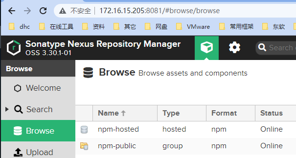
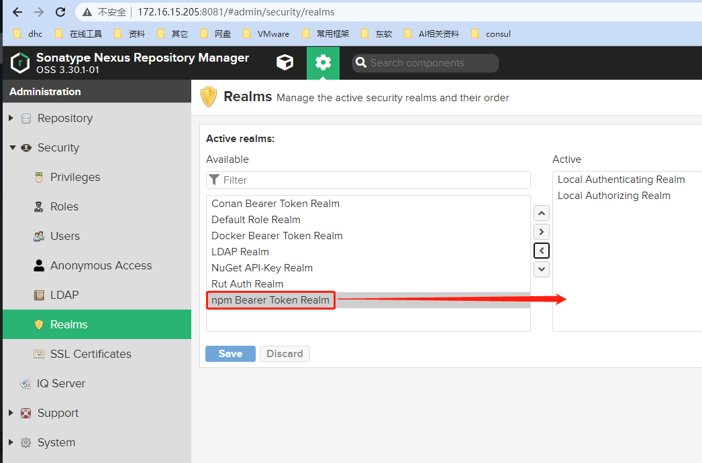

##### 前置条件

|  |  |
| :-- | :-- |
| **Nexus服务器地址**： | http://172.16.15.205:8081/ |
| **Nexus用户名**： | admin |
| **Nexus密码**： | Qwe@1245 |
| **Nexus邮箱**： | admin@example.org |
| **Nexus创建仓库组**： | http://172.16.15.205:8081/repository/npm-public/  
**`注意`**，不能将仓库组设置为私服仓库地址，否则会推送失败 |
| **Nexus创建仓库**： | http://172.16.15.205:8081/repository/npm-hosted/ |

* * *

[](http://qiniu.dev-share.top/image/nexus-lib.png)

* * *

* * *

* * *

###### 创建项目，编写插件

```ruby
mkdir annotation-router/

## 生成 package.json
npm init

```

* * *

###### 查看项目目录结构

```ruby
annotation-router
.
│  .npmignore              # 忽略推送时的文件
│  index.js
│  package.json
│  README.md
│
│
└─lib                      # 注解工具类的实现
    Controller.js
    DELETE.js
    GET.js
    POST.js
    PUT.js


```

* * *

##### 关键的配置文件

###### package.json

```json
{
    "name": "annotation-router",
    "version": "1.0.0",
    "description": "",
    "author": "Eric.Mao",
    "license": "ISC",
    "main": "index.js" // 明确指定组件的入口文件
}

```

###### index.js 组件被引用时的入口文件，它的作用是将组件中的工具类全部引入，然后统一向外暴露

```javascript
const Controller = require('./lib/Controller')
const GET = require('./lib/GET')
const POST = require('./lib/POST')
const PUT = require('./lib/PUT')
const DELETE = require('./lib/DELETE')

module.exports = {
    Controller,
    GET,
    POST,
    PUT,
    DELETE
}

```

* * *

* * *

* * *

###### 关联私服仓库

```ruby
## 设置仓库
annotation-router> npm config set registry http://172.16.15.205:8081/repository/npm-hosted/


## 登录仓库
#### 注意 npm adduser 它还有两个别名 aliases: login, add-user 功能是相同的
annotation-router>  npm adduser
npm notice Log in on http://172.16.15.205:8081/repository/npm-hosted/
Username: admin
Password:
Email: (this IS public) siyu.mao@dhc.com.cn   # 这个邮箱随便写
Logged in as admin on http://172.16.15.205:8081/repository/npm-hosted/.


## 查看
annotation-router> npm config list
...... 省略
//172.16.15.205:8081/repository/npm-hosted/:_authToken = "NpmToken.ef515ad7-0ba3-3eec-928e-8e27691d270d"
registry = "http://172.16.15.205:8081/repository/npm-hosted/"
...... 省略

```

* * *

###### 推送

```ruby
annotation-router> npm publish
npm notice
npm notice package: annotation-router@1.0.0
npm notice === Tarball Contents ===
npm notice 1.6kB annotation/Controller.js
npm notice 295B  annotation/DELETE.js
npm notice 962B  annotation/GET.js
npm notice 291B  annotation/POST.js
npm notice 289B  annotation/PUT.js
npm notice 143B  package.json
npm notice === Tarball Details ===
npm notice name:          annotation-router
npm notice version:       1.0.0
npm notice filename:      annotation-router-1.0.0.tgz
npm notice package size:  1.5 kB
npm notice unpacked size: 3.6 kB
npm notice shasum:        9bb108b33afd4c94e50ab4f7cd9ab444b7514bd7
npm notice integrity:     sha512-CmLtkwWGIWuzf[...]okumYms8UtBmg==
npm notice total files:   6
npm notice
+ annotation-router@1.0.0

annotation-router>

```

* * *

* * *

* * *

###### 在其它项目中测试使用

```ruby
koa2-server> npm install annotation-router@1.0.0
added 1 package, and removed 1 package in 3s
5 packages are looking for funding

koa2-server>

```

* * *

###### 测试在js文件中的引用方式

```javascript
import {Controller, GET, POST, PUT, DELETE} from "annotation-router";

```

* * *

* * *

* * *

###### **[封装组件项目地址](https://gitee.com/eric-mao/annotation-router "封装组件项目地址")**

###### **[在Koa2中使用自定义组件](https://gitee.com/eric-mao/koa2-server/tree/component-extraction "在Koa2中使用自定义组件")**

* * *

* * *

* * *

##### 常见问题

```ruby
npm ERR! code E401
npm ERR! Unable to authenticate, need: BASIC realm="Sonatype Nexus Repository Manager"

```

###### 解决办法

[](http://qiniu.dev-share.top/image/nexus-security-realms.png)

* * *

* * *

* * *
