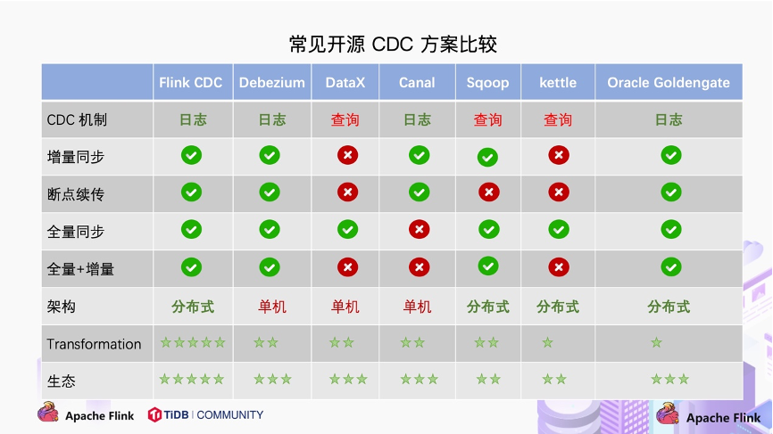
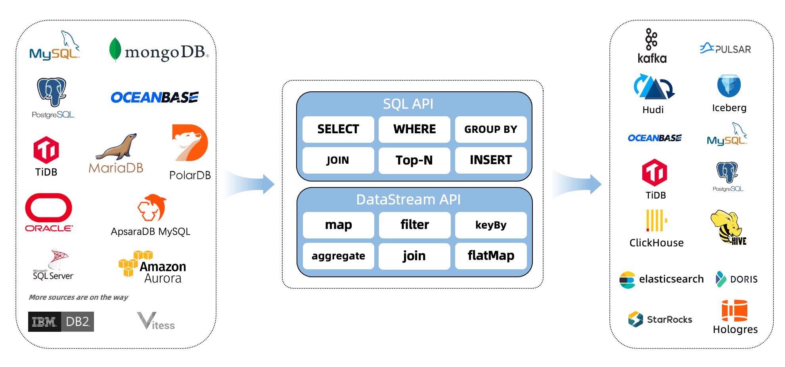
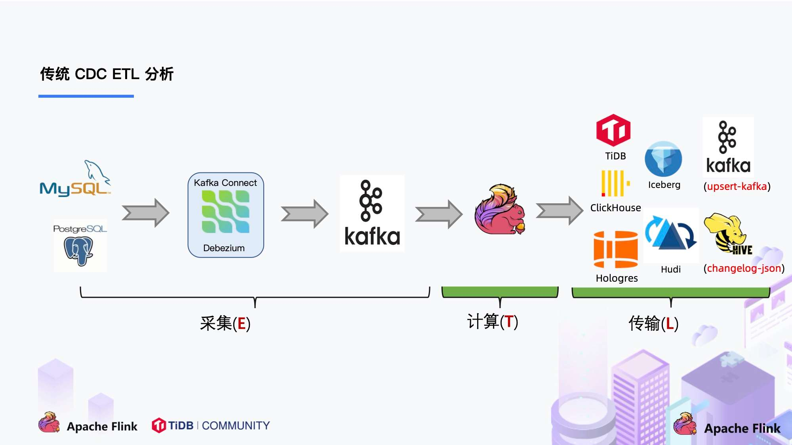
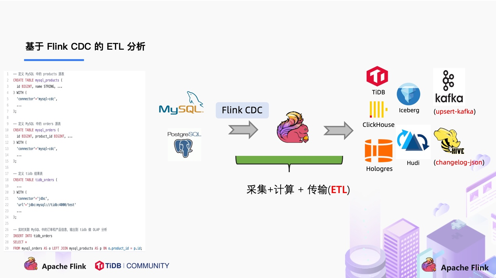

#### 前置资料

**[了解Flink](%e4%bb%80%e4%b9%88%e6%98%afflink "了解Flink")** **[Flink 概念](https://nightlies.apache.org/flink/flink-docs-release-1.15/zh/docs/concepts/overview/ "Flink 概念")** **[Flink CDC 文档](https://ververica.github.io/flink-cdc-connectors/master/content/%E5%BF%AB%E9%80%9F%E4%B8%8A%E6%89%8B/index.html "Flink CDC 文档")** **[了解 Apache Flink](https://flink.apache.org/zh/ "了解 Apache Flink")** **[了解 Debezium](https://github.com/debezium/debezium/blob/main/README_ZH.md "了解 Debezium")**

* * *

* * *

* * *

### **对比常见的开源 CDC 方案**



### Flink CDC 概述

> - **[什么是CDC？](https://developer.aliyun.com/article/786600?utm_content=m_1000289248 "什么是CDC？")**
>     - **CDC**是（Change Data Capture 变更数据获取）的简称。
> - **CDC Connectors for Apache Flink** 是一组用于 **Apache Flink** 的源连接器，使用变更数据捕获 (**CDC**) 从不同数据库获取变更。用于**Apache Flink** 的 **CDC** 连接器将 **Debezium** 集成为捕获数据更改的引擎。所以它可以充分发挥 **Debezium** 的能力。
> - 通俗的讲：**FlinkCDC** 就是 **Debezium** + **Apache Flink**
>     - 首先，我们使用 **Debezium** 监听数据库的变化，在拿到变化的数据
>     - 然后，将 **Debezium** 拿到的数据，在传给 **Apache Flink**
>     - 最后，在使用 **Apache Flink** 进行数据处理，把处理好的数据传给你想要的程序



* * *

> - **传统的 CDC** 

* * *

> - **Flink CDC** 

* * *

* * *

* * *

## 使用Flink的注意事项

> - **[Flink-1.14的JDBC说明文档](https://nightlies.apache.org/flink/flink-docs-release-1.14/zh/docs/connectors/table/jdbc/ "Flink-1.14的JDBC说明文档")**
> - **[所有Flink 插件依赖下载库](https://repo.maven.apache.org/maven2/org/apache/flink/ "所有Flink 插件依赖下载库")**
> - **[所有Flink CDC 插件依赖下载库](https://repo1.maven.org/maven2/com/ververica/ "所有Flink CDC 依赖下载库")**
> - **[版本支持](https://ververica.github.io/flink-cdc-connectors/master/content/about.html#supported-flink-versions "版本支持")**

### [Supported Connectors](https://ververica.github.io/flink-cdc-connectors/master/content/about.html#supported-connectors)

| Connector | Database | Driver |
| --- | --- | --- |
| [mongodb-cdc](https://ververica.github.io/flink-cdc-connectors/master/content/connectors/mongodb-cdc.html) | [MongoDB](https://www.mongodb.com/): 3.6, 4.x, 5.0 | MongoDB Driver: 4.3.1 |
| [mysql-cdc](https://ververica.github.io/flink-cdc-connectors/master/content/connectors/mysql-cdc.html) | [MySQL](https://dev.mysql.com/doc): 5.6, 5.7, 8.0.x[RDS MySQL](https://www.aliyun.com/product/rds/mysql): 5.6, 5.7, 8.0.x[PolarDB MySQL](https://www.aliyun.com/product/polardb): 5.6, 5.7, 8.0.x[Aurora MySQL](https://aws.amazon.com/cn/rds/aurora): 5.6, 5.7, 8.0.x[MariaDB](https://mariadb.org/): 10.x[PolarDB X](https://github.com/ApsaraDB/galaxysql): 2.0.1 | JDBC Driver: 8.0.27 |
| [oceanbase-cdc](https://ververica.github.io/flink-cdc-connectors/master/content/connectors/oceanbase-cdc.html) | [OceanBase CE](https://open.oceanbase.com/): 3.1.x[OceanBase EE](https://www.oceanbase.com/product/oceanbase) (MySQL mode): 2.x, 3.x | JDBC Driver: 5.1.4x |
| [oracle-cdc](https://ververica.github.io/flink-cdc-connectors/master/content/connectors/oracle-cdc.html) | [Oracle](https://www.oracle.com/index.html): 11, 12, 19 | Oracle Driver: 19.3.0.0 |
| [postgres-cdc](https://ververica.github.io/flink-cdc-connectors/master/content/connectors/postgres-cdc.html) | [PostgreSQL](https://www.postgresql.org/): 9.6, 10, 11, 12 | JDBC Driver: 42.2.12 |
| [sqlserver-cdc](https://ververica.github.io/flink-cdc-connectors/master/content/connectors/sqlserver-cdc.html) | [Sqlserver](https://www.microsoft.com/sql-server): 2012, 2014, 2016, 2017, 2019 | JDBC Driver: 7.2.2.jre8 |
| [tidb-cdc](https://ververica.github.io/flink-cdc-connectors/master/content/connectors/tidb-cdc.html) | [TiDB](https://www.pingcap.com/): 5.1.x, 5.2.x, 5.3.x, 5.4.x, 6.0.0 | JDBC Driver: 8.0.27 |
| [db2-cdc](https://ververica.github.io/flink-cdc-connectors/master/content/connectors/db2-cdc.html) | [Db2](https://www.ibm.com/products/db2): 11.5 | DB2 Driver: 11.5.0.0 |

* * *

### [Supported Flink Versions](https://ververica.github.io/flink-cdc-connectors/master/content/about.html#supported-flink-versions)

| Flink® CDC Version | Flink® Version |
| --- | --- |
| 1.0.0 | 1.11.\* |
| 1.1.0 | 1.11.\* |
| 1.2.0 | 1.12.\* |
| 1.3.0 | 1.12.\* |
| 1.4.0 | 1.13.\* |
| 2.0.\* | 1.13.\* |
| 2.1.\* | 1.13.\* |
| 2.2.\* | 1.13.\*, 1.14.\* |
| 2.3.\* | 1.13.\*, 1.14.\*, 1.15.\*, 1.16.0 |

* * *

* * *

* * *

#### **部署 Flink**

> - 如果你想使用**SQL-Client**，那么我们需要对**Flink**做一些简单的封装 这里只做最少依赖，所以只需要创建一个**Dockerfile**就够了

### **编写 Dockerfile 文件**

```ruby
git clone https://gitee.com/eric-mao/flink-sql-client.git

cd flink-sql-client/

## 开始构建镜像
docker build -t apache/flink-sql-client:1.14.5-java11 .

```

* * *

* * *

* * *

### 使用 docker-compose 安装部署 Flink CDC

```ruby
cat > docker-compose.yaml << ERIC


version: '3.1'
services:
  # SQL-Client:  Flink SQL Client, 用来提交 SQL 查询和查看 SQL 的执行结果
  sql-client:
    restart: always
    user: flink:flink
    image: apache/flink-sql-client:1.14.5-java11
    depends_on:
      - jobmanager
    environment:
      # SQL-Client 与 Jobmanager 交互是通过 RPC 进行访问的
      # 指定 Jobmanager 的RPC地址
      #   这里IP使用的是服务名 jobmanager，流量走的是容器内部网络，可能通过 docker network ls 查看
      #   端口默认使用的 6123
      FLINK_JOBMANAGER_HOST: jobmanager
      TZ: Asia/Shanghai
    volumes:
      - /etc/localtime:/etc/localtime
      - ./config/lib/:/opt/flink/lib/


  # ---------------------------------------------------------------------------------

  # Flink Cluster： 包含 Flink JobManager 和 Flink TaskManager，用来执行 Flink SQL
  jobmanager:
    restart: always
    user: flink:flink
    image: apache/flink:1.14.5-java11
    ports:
      - 8081:8081
    # 启动 Jobmanager 程序
    command: jobmanager
    environment:
      - |
        TZ= Asia/Shanghai
      - |
        FLINK_PROPERTIES=
        jobmanager.rpc.address: jobmanager
    volumes:
      - /etc/localtime:/etc/localtime
      - ./config/lib/:/opt/flink/lib/

  taskmanager:
    restart: always
    user: flink:flink
    image: apache/flink:1.14.5-java11
    depends_on:
      - jobmanager
    # 启动 Taskmanager 程序
    command: taskmanager
    environment:
      - |
        TZ= Asia/Shanghai
      - |
        FLINK_PROPERTIES=
        jobmanager.rpc.address: jobmanager
        taskmanager.numberOfTaskSlots: 20
    volumes:
      - /etc/localtime:/etc/localtime
      - ./config/lib/:/opt/flink/lib/


ERIC

```

```ruby
## 启动
docker-compose up -d

## 查看是否启动成功
[root@centos01 flink-cdc]# docker-compose ps
         Name                        Command               State                         Ports
---------------------------------------------------------------------------------------------------------------------
flink-cdc_jobmanager_1    /docker-entrypoint.sh jobm ...   Up      6123/tcp, 0.0.0.0:8081->8081/tcp,:::8081->8081/tcp
flink-cdc_sql-client_1    /bin/bash -c tail -f /dev/null   Up      6123/tcp, 8081/tcp
flink-cdc_taskmanager_1   /docker-entrypoint.sh task ...   Up      6123/tcp, 8081/tcp

```

* * *

* * *

* * *

### **[使用 Flink-CDC 实现 MariaDB --> MariaDB](%e4%bd%bf%e7%94%a8-flink-cdc-%e5%ae%9e%e7%8e%b0-mariadb-mariadb "使用 Flink-CDC 实现 MariaDB --> MariaDB")**

### **[使用 Flink-CDC 实现 Oracle --> MariaDB](%e4%bd%bf%e7%94%a8-flink-cdc-%e5%ae%9e%e7%8e%b0-oracle-mariadb "使用 Flink-CDC 实现 Oracle --> MariaDB")**
