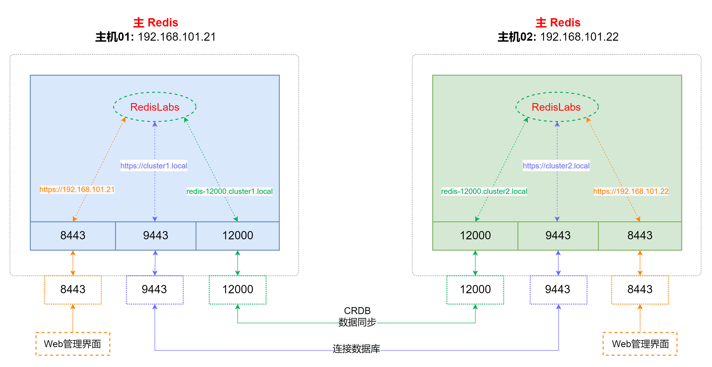
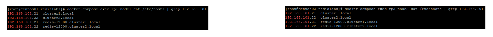

##### 前提条件

- CentOS 7.9
- CPU 8核
- MEM 16G
- 硬盘 400G
    
- **主机01**：192.168.101.21
    
- **主机02**：192.168.101.22

**这里测试中使用了 `2个主机` ，多个主机的配置方式除了 `FQDN` 的配置方式不同，其它都没区别**

* * *

* * *

* * *

##### 在**主机01**安装第一个 **`主Redis`**

> - 使用docker-compose部署

```ruby
cat > docker-compose.yaml << ERIC
version: '3.6'
services:
  rp1_node1:
    image: redislabs/redis:6.2.12-68
    restart: always
    hostname: rp1_node1
    container_name: rp1_node1
    volumes:
      - /etc/localtime:/etc/localtime
    ports:
      - 8443:8443
      - 9443:9443
      - 12000:12000
    privileged: true
    cap_add:
     - sys_resource
    extra_hosts:
      - 'cluster1.local:192.168.101.21'
      - 'cluster2.local:192.168.101.22'
      - 'redis-12000.cluster1.local:192.168.101.21'
      - 'redis-12000.cluster2.local:192.168.101.22'

ERIC

```

* * *

* * *

* * *

##### 在**主机02**安装第二个 **`主Redis`**

> - 使用docker-compose部署

```ruby
cat > docker-compose.yaml << ERIC
version: '3.6'
services:
  rp2_node2:
    image: redislabs/redis:6.2.12-68
    restart: always
    hostname: rp2_node2
    container_name: rp2_node2
    volumes:
      - /etc/localtime:/etc/localtime
    ports:
      - 8443:8443
      - 9443:9443
      - 12000:12000
    privileged: true
    cap_add:
     - sys_resource
    extra_hosts:
      - 'cluster1.local:192.168.101.21'
      - 'cluster2.local:192.168.101.22'
      - 'redis-12000.cluster1.local:192.168.101.21'
      - 'redis-12000.cluster2.local:192.168.101.22'

ERIC

```

* * *

* * *

* * *

##### [参考官网](https://docs.redis.com/latest/rs/databases/active-active/get-started-active-active/ "参考官网")配置集群

* * *

* * *

* * *

##### 测试

###### 在**主机01**上执行

```ruby
docker-compose exec rp1_node1  redis-cli -p 12000

127.0.0.1:12000> set key1 123
OK

127.0.0.1:12000> get key1
"123"

```

###### 在**主机02**上执行

```ruby
docker-compose exec rp2_node2  redis-cli -p 12000

127.0.0.1:12000> get key1
"123"

```

* * *

* * *

* * *

##### **多主网络图**



**容器内域名映射** 

* * *

* * *

* * *
