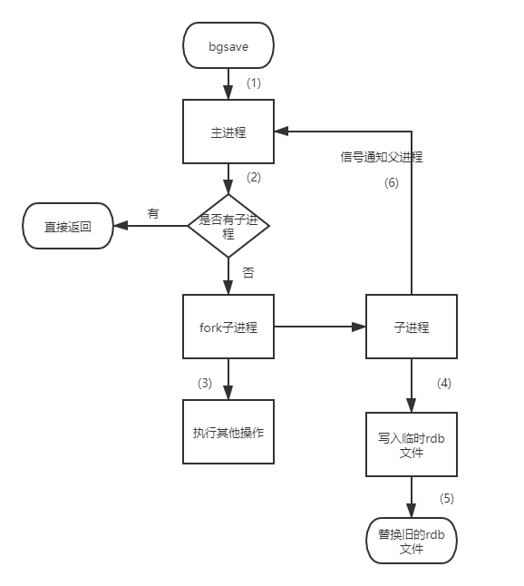

##### 前言

Redis 中引入了持久化来避免数据的丢失，主要有两种持久化的方式 **RDB** 持久化和 **AOF** 持久化。

**[RDB和AOF机制详解](https://pdai.tech/md/db/nosql-redis/db-redis-x-rdb-aof.html "RDB和AOF机制详解")**

**[Redis中如何进行数据持久化](https://boilingfrog.github.io/2022/01/07/redis%E4%B8%AD%E5%A6%82%E4%BD%95%E8%BF%9B%E8%A1%8C%E6%95%B0%E6%8D%AE%E6%8C%81%E4%B9%85%E5%8C%96/ "Redis中如何进行数据持久化")**

* * *

##### **RDB**

##### bgsave流程图

###### **优缺点**

> - **优点**
>     - RDB文件是某个时间节点的快照，默认使用LZF算法进行压缩，压缩后的文件体积远远小于内存大小，适用于备份、全量复制等场景;
>     - Redis加载RDB文件恢复数据要远远快于AOF方式；
> - **缺点**
>     - RDB方式实时性不够，无法做到秒级的持久化；
>     - 每次调用bgsave都需要fork子进程，fork子进程属于重量级操作，频繁执行成本较高；
>     - RDB文件是二进制的，没有可读性，AOF文件在了解其结构的情况下可以手动修改或者补全；
>     - 版本兼容RDB文件问题；

**针对RDB不适合实时持久化的问题，Redis提供了AOF持久化方式来解决；**

* * *

###### **AOF**

> - Redis是 **`"写后"`** 日志，Redis先执行命令，把数据写入内存，然后才记录日志。日志里记录的是Redis收到的每一条命令，这些命令是以文本形式保存。PS: 大多数的数据库采用的是写前日志（WAL），例如MySQL，通过写前日志和两阶段提交，实现数据和逻辑的一致性。
> - 而**AOF日志采用写后日志，即`先写内存，后写日志`。**

* * *

###### **为什么采用写后日志？**

> - Redis要求高性能，采用写日志有两方面好处：
>     - **避免额外的检查开销**：
>         - Redis 在向 AOF 里面记录日志的时候，并不会先去对这些命令进行语法检查。所以，如果先记日志再执行命令的话，日志中就有可能记录了错误的命令，Redis 在使用日志恢复数据时，就可能会出错。
>         - 不会阻塞当前的写操作
>     - **但这种方式存在潜在风险**：
>         - 如果命令执行完成，写日志之前宕机了，会丢失数据。
>         - 主线程写磁盘压力大，导致写盘慢，阻塞后续操作。 ¶ 如何实现AOF

* * *

> - Redis提供了三种写回策略:
>     1. **Always** 同步写回：每个写命令执行完，立马同步地将日志写回磁盘；
>     2. **Everysec** 每秒写回：每个写命令执行完，只是先把日志写到AOF文件的内存缓冲区，每隔一秒把缓冲区中的内容写入磁盘；
>     3. **No** 操作系统控制的写回：每个写命令执行完，只是先把日志写到AOF文件的内存缓冲区，由操作系统决定何时将缓冲区内容写回磁盘。

* * *

**三种写回策略的优缺点** 

* * *

* * *

* * *
