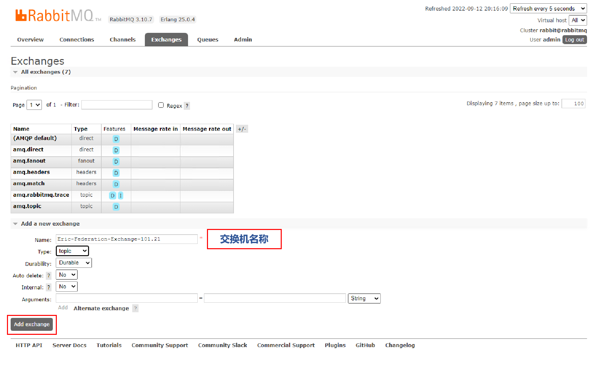
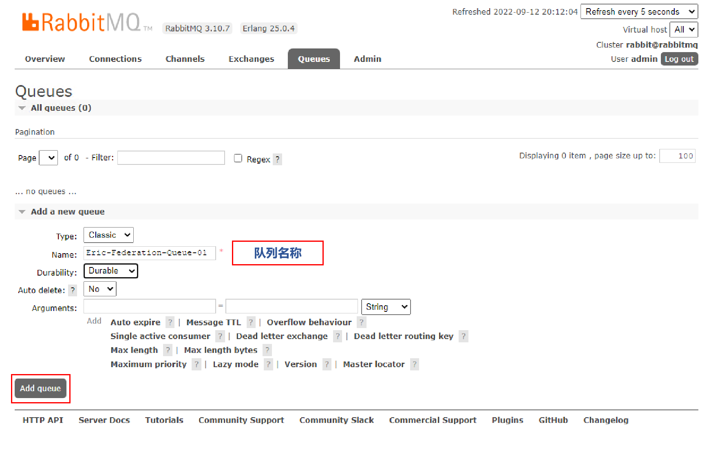
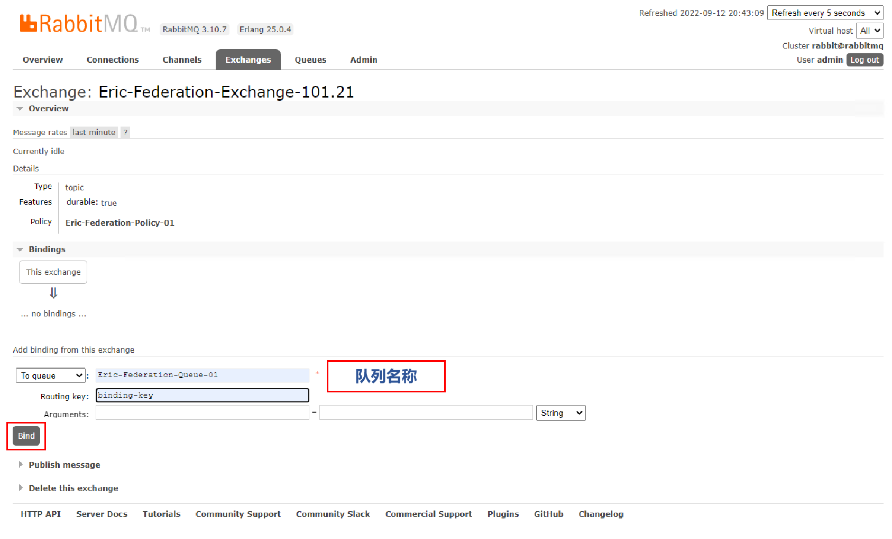
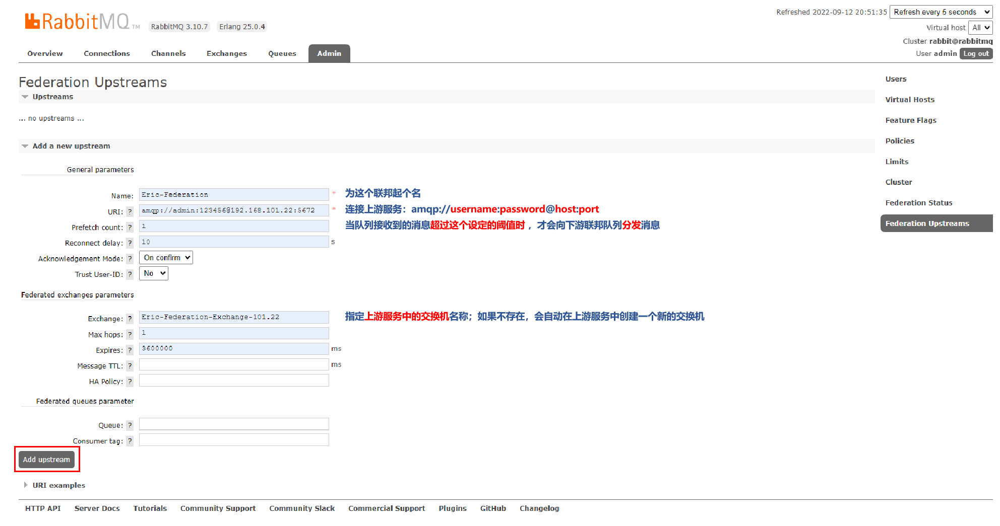
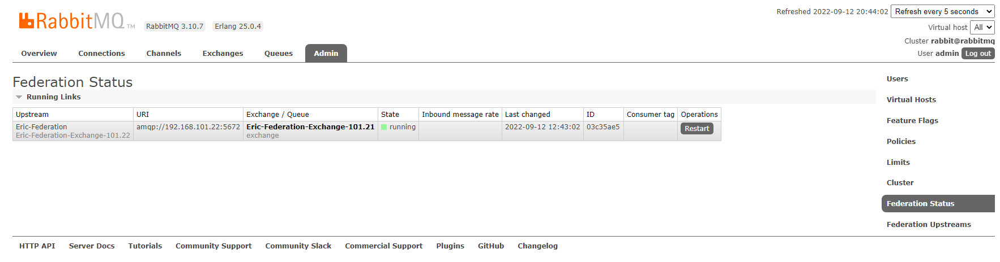
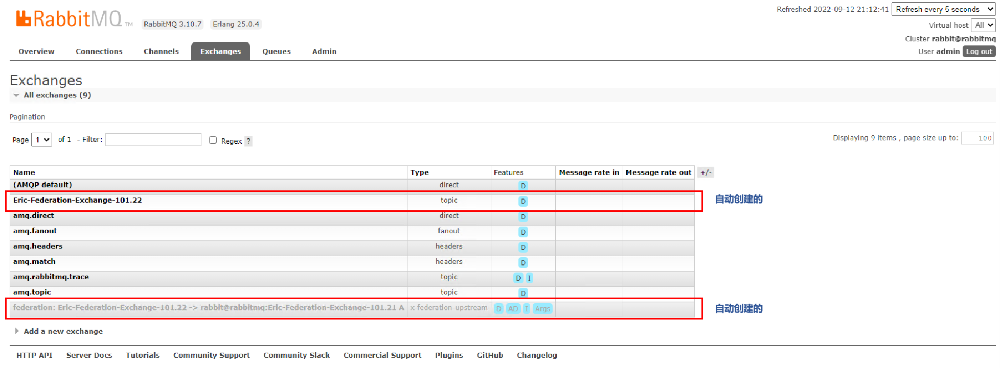
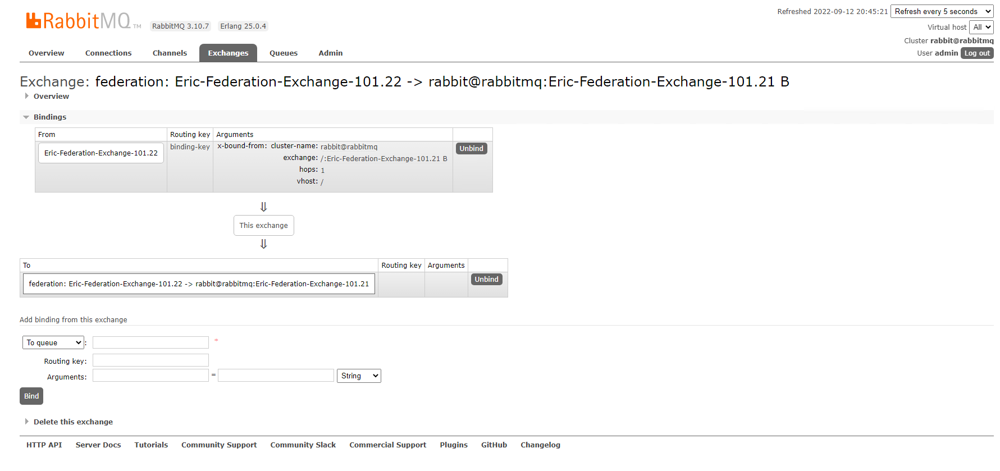
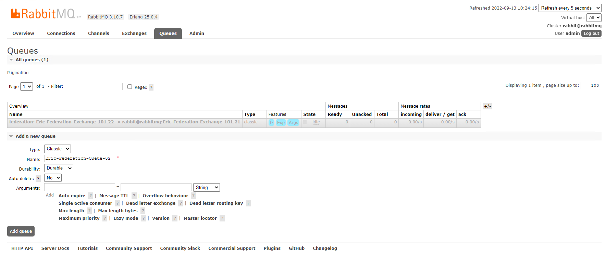
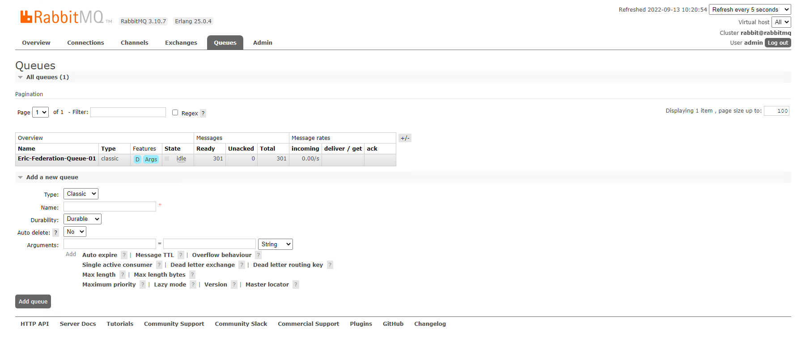
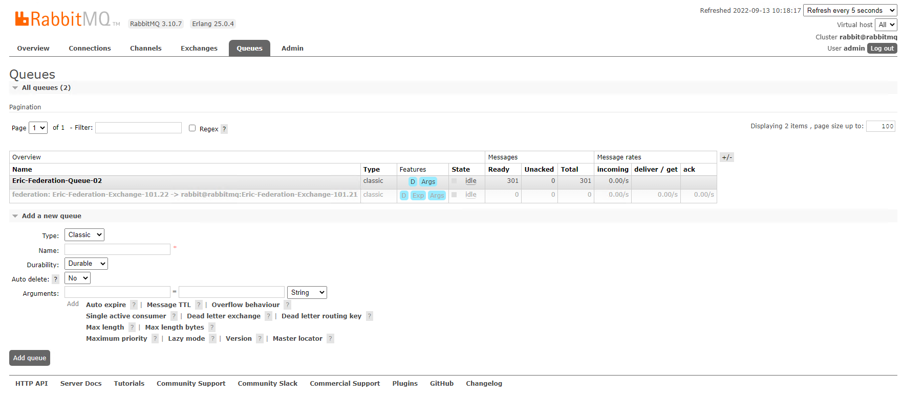

##### 1\. 创建交换机

> 

##### 2\. 创建队列

> 

##### 3\. 交换机绑定队列

> 

##### 4\. 添加联邦上游服务

> 

##### 5\. 添加策略

> 

##### 6\. 查看联邦状态

> 

##### 7\. 登录另一台RabbitMQ 查看上游服务信息

> 

##### 8\. 登录另一台RabbitMQ 查看上游服务交换机信息

> 

##### 9\. 上游服务，创建队列，并绑定到上游交换机

> 

* * *

##### 查看交换机联邦效果

###### 下游服务同步效果

> 

* * *

###### 上游服务同步效果

> 
