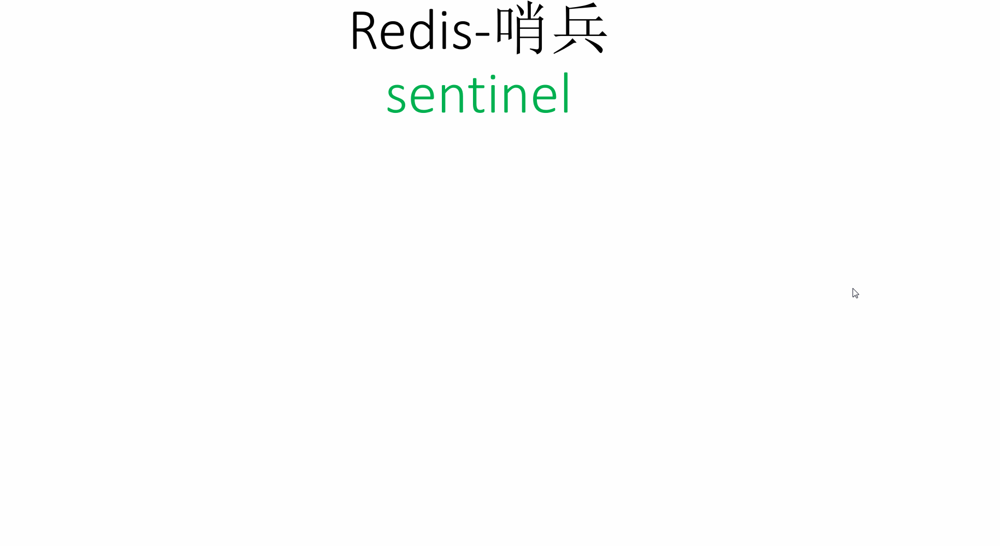

##### 概念

##### **集群模式下的 Redis-工作原理图**

> 

##### **哨兵模式下的 Redis-工作原理图**

> 

* * *

###### **什么是一致性Hash**

> - **一致性hash**算法主要应用于分布式存储系统中，可以有效地**解决分布式存储结构**下普通余数Hash算法带来的**伸缩性差**的问题，可以保证在动态增加和删除节点的情况下尽量有多的请求命中原来的机器节点。
> - **一致性hash**是一个`0-2^32`的闭合圆，（拥有`2^32`个桶空间，每个桶里面可以存储很多数据，可以理解为**s3的存储桶**）所有节点存储的数据都是不一样的

* * *

###### **什么是Hash Slot**

> - **Redis Cluster**在设计中 **`没有`使用一致性哈希（Consistency Hashing）** ，而是使用 **`数据分片`引入哈希槽（hash slot）** 来实现
> - 一个 **Redis Cluster**包含 **16384（0~16383）** 个哈希槽（可以假设成盒子），存储在**Redis Cluster**中的所有键都会被映射到这些**slot**中，集群中的每个键都属于这**16384**个哈希槽中的一个。按照槽来进行分片，通过为每个节点指派不同数量的槽，可以控制不同节点负责的数据量和请求数
> - **假设当前集群有`3个Master`节点，`哈希槽`默认是平均分的:**
>     - **Master `1`** 包含 **`0-5460`** 哈希槽
>     - **Master `2`** 包含 **`5461-10922`** 哈希槽
>     - **Master `3`** 包含 **`10923-16383`** 哈希槽
> - `增加`一个 **master**节点，就将其他 **master** 的 **hash slot** 移走一部分过去
> - `减少`一个 **master**节点，就将它的 **hash slot** 移动到其他 **master** 上去
> - 这样**移动 hash slot 的成本是非常低**的，并且将一个哈希槽从一个节点移动到另一个节点不会造成节点阻塞， 所以无论是添加新节点还是移除已存在节点， 又或者改变某个节点包含的哈希槽数量， 都不会造成集群下线 **那hash slot是怎么分槽的呢？**
> - 集群使用公式`slot=CRC16（key）/16384`来计算`key`属于哪个槽，其中`CRC16(key)`语句用于计算`key`的`CRC16` 校验和

**[参考原文链接](https://blog.csdn.net/qq_44833552/article/details/123997903 "参考原文链接")**

* * *

* * *

* * *

##### 简单的了解一下

**[Helm 安装 bitnami/redis 集群模式](http://www.dev-share.top/2020/07/13/helm-%e5%ae%89%e8%a3%85-bitnami-redis-%e9%9b%86%e7%be%a4%e6%a8%a1%e5%bc%8f/ "Helm 安装 bitnami/redis 集群模式")**

###### redis-cli 客户端命令介绍

> - redis-cli -c 在集群模式中（启用**客户端跟踪重定向**功能） -h 服务端 地址 -p 服务端 端口
> - 使用客户端命令 **`cluster nodes`** 查看 Redis 集群节点信息
>     
>     ```ruby
>     [root@client-tools app]# redis-cli -c -h 10.100.36.235 -p 6379
>     ## 查看 Redis 集群节点信息
>     10.100.36.235:6379> cluster nodes
>     节点ID                                   节点IP                     节点类型        关联的主节点ID                                                        插槽位置
>     8bffbc102f7159957ac02c5ff17c39c00dab9418 10.100.36.235:6379@16379   myself,master  - 0 1663241841000 1 connected 0-5460
>     cc5dbf7920bc8b754bc50c6284ed9b21ce93bc5b 10.100.7.163:6379@16379           master  - 0 1663241840000 2 connected 5461-10922
>     fc74c75140d3144024115c2d1da9ff68a738e9f6 10.100.118.101:6379@16379         master  - 0 1663241841000 3 connected 10923-16383
>     19253a8b6d59b4bf8e94e49dd8d42031b3f434b6 10.100.7.162:6379@16379           slave   8bffbc102f7159957ac02c5ff17c39c00dab9418 0 1663241841885 1 connected
>     dcf6c072b433fa1994de446cb9605e55454c99a1 10.100.118.100:6379@16379         slave   cc5dbf7920bc8b754bc50c6284ed9b21ce93bc5b 0 1663241842892 2 connected
>     6503c00d9c9b7e2952c8f1611cbbea9f1e2ed756 10.100.36.236:6379@16379          slave   fc74c75140d3144024115c2d1da9ff68a738e9f6 0 1663241840879 3 connected
>     ```
>     

* * *

> - **测试：如果不使用客户端跟踪重定向功能**
>     
>     ```ruby
>     [root@client-tools app]# redis-cli -h 10.100.36.235 -p 6379
>     10.100.36.235:6379> SET hello 123
>     OK
>     #
>     #
>     10.100.36.235:6379> SET world 456
>     (error) MOVED 9059 10.100.7.163:6379
>     # 名为 world 的key，它的插槽位是 9059，它被分配在 10.100.7.163 这个节点上
>     #
>     #
>     10.100.36.235:6379> SET eric 789
>     (error) MOVED 16008 10.100.118.101:6379
>     # 名为 eric 的key，它的插槽位是 16008，它被分配在 10.100.118.101 这个节点上
>     ```
>     

* * *

> - **测试：使用客户端跟踪重定向功能**
>     
>     ```ruby
>     [root@client-tools app]# redis-cli -c -h 10.100.36.235 -p 6379
>     10.100.36.235:6379> set hello 123
>     OK
>     10.100.36.235:6379>
>     10.100.36.235:6379>
>     10.100.36.235:6379> set world 456
>     # 客户端会自动重定向到它所在的节点上
>     -> Redirected to slot [9059] located at 10.100.7.163:6379
>     OK
>     10.100.7.163:6379>
>     10.100.7.163:6379>
>     10.100.7.163:6379> set eric 789
>     # 客户端会自动重定向到它所在的节点上
>     -> Redirected to slot [16008] located at 10.100.118.101:6379
>     OK
>     10.100.118.101:6379>
>     10.100.118.101:6379>
>     ```
>     

* * *
