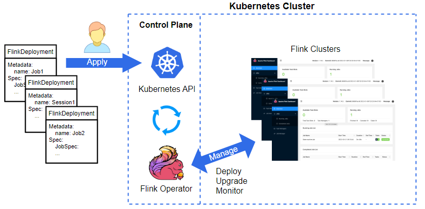
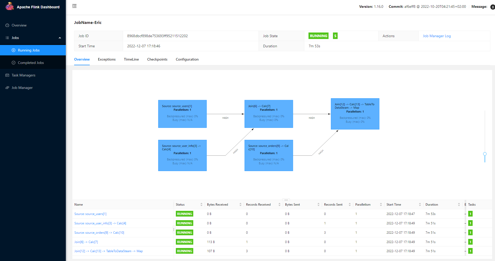

# K8S部署Flink-Kubernetes-Operator

> - [Apache Flink Kubernetes Operator Github](https://github.com/apache/flink-kubernetes-operator)
> - [Flink-Kubernetes-Operator 官网](https://nightlies.apache.org/flink/flink-kubernetes-operator-docs-main/#flink-kubernetes-operator)



## 快速开始

> **资料**：在k8s中安装 [Apache Flink Kubernetes Operator Quick Start](https://nightlies.apache.org/flink/flink-kubernetes-operator-docs-main/docs/try-flink-kubernetes-operator/quick-start/)

1. 在 Kubernetes 集群上安装证书管理器以启用添加 webhook 组件（每个 Kubernetes 集群只需要一次）：
    
    [cert-manager.yaml](http://qiniu.dev-share.top/file/cert-manager.yaml)
    

- ```bash
    kubectl apply -f cert-manager.yaml
    ```
    

2. 使用 helm 部署

- ```shell
    export FLINK_VERSION_OPERATOR=1.3.0
    
    helm repo add flink-operator-repo https://downloads.apache.org/flink/flink-kubernetes-operator-$FLINK_VERSION_OPERATOR
    
    helm repo update
    
    ## 将Chart包下载到本地
    helm pull flink-operator-repo/flink-kubernetes-operator --version $FLINK_VERSION_OPERATOR
    
    ```
    

3. 创建命名空间

- ```shell
    export FLINK_NAMESPACE=flink
    kubectl create ns $FLINK_NAMESPACE
    ```
    

4. 编写values.yaml

- ```shell
    cat > values.yaml << ERIC
    
    ---
    
    image:
      repository: apache/flink-kubernetes-operator
      pullPolicy: IfNotPresent
      tag: "1.3.0"
    
    # 如果证书管理器安装因任何原因失败，您可以设置 webhook.create=false 来禁用 webhook。
    webhook:
      create: true
    
    defaultConfiguration:
      create: true
      # Set append to false to replace configuration files
      append: true
      flink-conf.yaml: |+
        # Flink Config Overrides
        kubernetes.operator.metrics.reporter.slf4j.factory.class: org.apache.flink.metrics.slf4j.Slf4jReporterFactory
        kubernetes.operator.metrics.reporter.slf4j.interval: 5 MINUTE
    
        kubernetes.operator.reconcile.interval: 15 s
        kubernetes.operator.observer.progress-check.interval: 5 s
      log4j-operator.properties: |+
        # Flink Operator Logging Overrides
        # rootLogger.level = DEBUG
        # logger.operator.name= org.apache.flink.kubernetes.operator
        # logger.operator.level = DEBUG
      log4j-console.properties: |+
        # Flink Deployment Logging Overrides
        # rootLogger.level = DEBUG
    
    ERIC
    
    ```
    

5. 安装部署

- ```shell
    helm install flink-k8s-operator ./flink-kubernetes-operator-$FLINK_VERSION-helm.tgz -f values.yaml -n $FLINK_NAMESPACE
    
    ## 安装成功，会出现如下提示
    NAME: flink-k8s-operator
    LAST DEPLOYED: Sat Dec 17 10:11:15 2022
    NAMESPACE: flink
    STATUS: deployed
    REVISION: 1
    TEST SUITE: None
    
    ```
    
- 卸载
    
    ```shell
    helm uninstall flink-k8s-operator -n $FLINK_NAMESPACE
    # 不删除命名空间，会有些依赖删不干净
    kubectl delete ns $FLINK_NAMESPACE
    # 要删除证书管理器，否则重装以后，再启动程序，会出现证书错误
    kubectl delete -f cert-manager.yaml
    
    ```
    

### 测试

- 编写测试文件
    
    ```yaml
    cat > basic.yaml << ERIC
    
    apiVersion: flink.apache.org/v1beta1
    kind: FlinkDeployment
    metadata:
    name: basic-example
    spec:
    image: flink:1.16
    imagePullPolicy: IfNotPresent
    flinkVersion: v1_16
    flinkConfiguration:
      taskmanager.numberOfTaskSlots: "1"
    serviceAccount: flink
    jobManager:
      replicas: 1
      resource:
        memory: "1024m"
        cpu: 1
    taskManager:
      replicas: 1
      resource:
        memory: "1024m"
        cpu: 1
    job:
      # 这里的jar文件是Flink社区提供的测试Demo文件，每个镜像中都有
      jarURI: local:///opt/flink/examples/streaming/TopSpeedWindowing.jar
      parallelism: 1
      # stateless: 表示启动无状态应用
      upgradeMode: stateless
    
    ERIC
    
    
    kubectl -n $FLINK_NAMESPACE apply -f basic.yaml
    ```
    

## 部署你的应用程序

> - **[官方模板](https://github.com/apache/flink-kubernetes-operator/tree/main/examples)**
> - **[官方文档](https://nightlies.apache.org/flink/flink-kubernetes-operator-docs-main/docs/custom-resource/overview/)**

### 【应用模式-部署】

#### 构建镜像

**官方参考资料**

> - **部署模式 [#](https://nightlies.apache.org/flink/flink-docs-release-1.16/docs/deployment/resource-providers/native_kubernetes/#deployment-modes)**
>     - [对于生产使用，我们建议在应用程序模式下](https://nightlies.apache.org/flink/flink-docs-release-1.16/docs/deployment/overview/#application-mode)部署 Flink 应用程序，因为这些模式为应用程序提供了更好的隔离。
>         
>     - [应用模式](https://nightlies.apache.org/flink/flink-docs-release-1.16/docs/deployment/overview/#application-mode)要求用户代码与 Flink 镜像捆绑在一起，因为它在集群上运行用户代码的方法`main()`。Application Mode 确保在应用程序终止后所有 Flink 组件都被正确清理。
>         
> - Flink 社区提供了一个[基础 Docker 镜像](https://nightlies.apache.org/flink/flink-docs-release-1.16/docs/deployment/resource-providers/standalone/docker/#docker-hub-flink-images)，可用于捆绑用户代码：
>     
>     ```dockerfile
>     FROM flink
>     RUN mkdir -p $FLINK_HOME/usrlib
>     COPY /path/of/my-flink-job.jar $FLINK_HOME/usrlib/my-flink-job.jar
>     ```
>     

##### 编写Dockerfile文件

1. ```shell
    cat > Dockerfile << ERIC
    
    FROM flink:1.16.0
    # 将你应用程序依赖的jar包 复制到 /opt/flink/bin/ 目录
    COPY ./flink-connector-oracle-cdc-2.3.0.jar /opt/flink/lib/
    
    RUN mkdir -p /opt/flink/usrlib
    # 你打好的应用程序jar包
    COPY ./test-flink-cdc-jar-with-dependencies.jar /opt/flink/usrlib/
    
    ERIC
    
    ```
    
2. ```shell
    [root@centos01 build-image]# ll
    Dockerfile
    flink-connector-oracle-cdc-2.3.0.jar
    test-flink-cdc-jar-with-dependencies.jar.jar
    
    
    ## 构建你的镜像
    [root@centos01 build-image]# docker build -t test-flink-cdc:1.16 .
    
    ## 查看结果
    [root@centos01 build-image]# docker images test-flink-cdc
    REPOSITORY       TAG       IMAGE ID       CREATED          SIZE
    test-flink-cdc   1.16      b90b47946048   27 seconds ago   831MB
    
    ```
    
3. 将镜像上传到私服仓库
    
    ```shell
    docker tag test-flink-cdc:1.16 192.168.101.23/library/test-flink-cdc:1.16
    
    docker push 192.168.101.23/library/test-flink-cdc:1.16
    
    ```
    

#### 编写k8s部署文件

1. ```shell
    cat > test-flink-cdc.yaml << ERIC
    
    apiVersion: flink.apache.org/v1beta1
    kind: FlinkDeployment
    metadata:
     name: test-flink-cdc
    spec:
     image: 192.168.101.23/library/test-flink-cdc:1.16
     imagePullPolicy: Always
     flinkVersion: v1_16
     flinkConfiguration:
       # 插槽数
       taskmanager.numberOfTaskSlots: "1"
     serviceAccount: flink
     # 设置 jobManager 在单主k8s时，只能有一个副本数
     jobManager:
       replicas: 1
       resource:
         memory: "1024m"
         cpu: 1
     # 设置 taskManager
     taskManager:
       # 设置最多能启动几个 task 副本
       replicas: 1
       resource:
         memory: "1024m"
         cpu: 1
     job:
       # 这里的jar文件，要指向自己的应用程序
       jarURI: local:///opt/flink/usrlib/test-flink-cdc-jar-with-dependencies.jar
       # 设置并行度，
       parallelism: 1
       # stateless: 表示启动无状态应用
       upgradeMode: stateless
    
     # 配置日志(可选)
     logConfiguration:
       "log4j-console.properties": |
         rootLogger.level = DEBUG
         rootLogger.appenderRef.file.ref = LogFile
         rootLogger.appenderRef.console.ref = LogConsole
         appender.file.name = LogFile
         appender.file.type = File
         appender.file.append = false
         appender.file.fileName = ${sys:log.file}
         appender.file.layout.type = PatternLayout
         appender.file.layout.pattern = %d{yyyy-MM-dd HH:mm:ss,SSS} %-5p %-60c %x - %m%n
         appender.console.name = LogConsole
         appender.console.type = CONSOLE
         appender.console.layout.type = PatternLayout
         appender.console.layout.pattern = %d{yyyy-MM-dd HH:mm:ss,SSS} %-5p %-60c %x - %m%n
         logger.akka.name = akka
         logger.akka.level = INFO
         logger.kafka.name= org.apache.kafka
         logger.kafka.level = INFO
         logger.hadoop.name = org.apache.hadoop
         logger.hadoop.level = INFO
         logger.zookeeper.name = org.apache.zookeeper
         logger.zookeeper.level = INFO
         logger.netty.name = org.apache.flink.shaded.akka.org.jboss.netty.channel.DefaultChannelPipeline
         logger.netty.level = OFF
    
    
    ERIC
    
    
    kubectl -n $FLINK_NAMESPACE apply -f test-flink-cdc.yaml
    ```
    
2. 开放Web页面访问
    
    ```shell
    kubectl -n $FLINK_NAMESPACE port-forward svc/test-flink-cdc-rest --address 192.168.101.11  8081:8081
    ## 输出访问地址
    Forwarding from 192.168.101.11:8081 -> 8081
    
    ```
    

- 查看页面
    
    
    
- 查看 Svc
    
    
    
- 查看 Pod
    
    
    

3. 总结
    
    > - 根据实际情况看来，在k8s中创建的应用模式指的是，**一个应用创建一套Flink**，是由 **Flink-Operator** 自动管理的
    > - 这种模式(【**应用模式**】)，它只**能实现高可用**，但是**不能实现分布式负载均衡**
    

### 【会话模式-部署】

#### 编写k8s部署文件

1. ```yaml
    cat > session-job.yaml << ERIC
    apiVersion: flink.apache.org/v1beta1
    kind: FlinkDeployment
    metadata:
     name: session-deployment-flink-cdc
    spec:
     image: 192.168.101.23/library/flink:1.16.0
     imagePullPolicy: Always
     flinkVersion: v1_16
     jobManager:
       replicas: 1
       resource:
         memory: "1024m"
         cpu: 1
     taskManager:
       replicas: 1
       resource:
         memory: "1024m"
         cpu: 1
     serviceAccount: flink
    
    --/-
    
    ## 部署 FlinkSessionJob 需要依赖一个 FlinkDeployment
    apiVersion: flink.apache.org/v1beta1
    kind: FlinkSessionJob
    metadata:
     name: session-job-flink-cdc
    spec:
     deploymentName: session-deployment-flink-cdc
     job:
       # 1. 自己部署一个 apache-httpd 服务器，把Jar包放上去
       #    它表示，task 启动时运行这个Jar
       # 2. 也可以不写jarURI，可以采用Web页面上传的方式来启动
    #    jarURI: http://192.168.101.30:1080/test-flink-cdc-jar-with-dependencies.jar
       parallelism: 1
       upgradeMode: stateless
    
    
    ERIC
    
    
    kubectl -n $FLINK_NAMESPACE apply -f session-job.yaml
    
    ```
    
2. 开放Web页面访问
    
    ```shell
    kubectl -n $FLINK_NAMESPACE port-forward svc/session-deployment-flink-cdc-rest --address 192.168.101.11  8081:8081
    ## 输出访问地址
    Forwarding from 192.168.101.11:8081 -> 8081
    
    ```
    
3. 查看页面
    
    
    
    
    
    
    
    > **与应用模式的区别**:
    > 
    > - 页面可以手动提交Jar文件了
    > - 提交的任务共享同一个Flink资源
    

## 常见问题

**JobManagers 的高可用，需要依赖K8s的高可用**

> - `Error from server: error when creating "basic.yaml": admission webhook "flinkoperator.flink.apache.org" denied the request: Kubernetes High availability should be enabled when starting standby JobManagers.`
> - 服务器错误：创建“basic.yaml”时出错：admission-webhook“flinkoperator.flink.apache.org”拒绝了请求：启动备用JobManagers时应启用Kubernetes高可用性。

**One or more fetchers have encountered exception**

> **异常信息**
> 
> ```
> org.apache.flink.runtime.JobException: Recovery is suppressed by NoRestartBackoffTimeStrategy
> 
>     ...
> 
> Caused by: java.lang.RuntimeException: One or more fetchers have encountered exception
> 
>     ...
> 
> Caused by: java.lang.RuntimeException: SplitFetcher thread 0 received unexpected exception while polling the records
> 
>     ...
> 
> Caused by: org.apache.kafka.connect.errors.RetriableException: An exception occurred in the change event producer. This  
> 
>     ...
> 
> Caused by: java.sql.SQLRecoverableException: No more data to read from socket
> 
>   ...
> 
> ```
> 
> **解决方法** **需要在代码中指定重启策略**
> 
> ```java
> // 指定重启策略
> // 不重启：
> // env.setRestartStrategy(RestartStrategies.noRestart());
> // 每隔10秒，尝试重启3次
> env.setRestartStrategy(RestartStrategies.fixedDelayRestart(3, Time.of(10, TimeUnit.SECONDS)));
> ```

## 注意事项

### 部署模式详解

> - Flink 可以通过以下三种方式之一执行应用程序：
>     - 在应用程序模式下，
>     - 在会话模式下，
>     - 在 Per-Job 模式下（已弃用）。
> - 上述模式的区别在于：
>     
>     - 集群生命周期和资源隔离保证
>     - 应用程序的`main()`方法是在客户端还是在集群上执行。
>     
>     
>     
> - 【**[应用程序模式](https://nightlies.apache.org/flink/flink-docs-release-1.16/docs/deployment/overview/#application-mode)**】假定用户 jar 与 Flink 分发包捆绑在一起。
>     
>     - 在集群上执行该`main()`方法可能会对您的代码产生其他影响，例如您在环境中注册的任何路径都`registerCachedFile()`必须可以由应用程序的 JobManager 访问。
>     - 应用程序模式允许多`execute()`应用程序，但在这些情况下不支持高可用性。
>     - 应用程序模式下的高可用性仅支持单个`execute()`应用程序。
>     - 此外，当应用程序模式下的多个正在运行的作业（例如使用 提交 `executeAsync()`）中的任何一个被取消时，所有作业都将停止并且 JobManager 将关闭。支持定期完成作业（通过关闭源）。
> - \[**[会话模式](https://nightlies.apache.org/flink/flink-docs-release-1.16/docs/deployment/overview/#session-mode)**】假定**一个已经在运行的集群**，并使用该集群的资源来执行，**任何提交的应用程序**。
>     - 在同一（会话）集群中执行的应用程序使用并因此竞争相同的资源。
>     - 这样做的好处是您无需为每个提交的作业支付启动完整集群的资源开销。
>     - 但是，如果其中一个作业行为不当或导致 TaskManager 崩溃，则在该 TaskManager 上运行的所有作业都将受到故障的影响。
>     - 这除了对导致失败的作业产生负面影响外，还意味着一个潜在的大规模恢复过程，所有重新启动的作业同时访问文件系统并使其对其他服务不可用。
>     - 此外，让一个集群运行多个作业意味着 JobManager 有更多的负载，

### upgradeMode详解

> - upgradeMode 支持的值：`stateless`, `savepoint`,`last-state`
> - 该`upgradeMode`设置控制停止和恢复机制，如下表所述：
> - [官网地址](https://nightlies.apache.org/flink/flink-kubernetes-operator-docs-release-1.3/docs/custom-resource/job-management/#stateful-and-stateless-application-upgrades)

|  | **Stateless** | **Last State** | **Savepoint** |
| --- | --- | --- | --- |
| 配置要求 | 无 | 启用检查点（Checkpoint）和kubernetes的高可用（HA） | 定义了checkpoint/savepoint目录 |
| job 状态要求 | 无 | 具有可用的 HA 元数据（HA metadata） | job正在运行 |
| 暂停机制 | 取消/删除 | 删除 Flink 部署(保留 HA metadata) | 取消并保存到savepoint |
| 恢复机制 | 从空状态部署 | 使用 HA metadata 恢复最后的状态 | 从savepoint恢复 |
| 用于生产环境 | 不推荐 | 推荐 | 推荐 |

> - 启用 **Kubernetes HA** 后，`savepoint`升级模式可能会回退到`last-state`作业处于不健康状态时的行为。
>     
> - 三种升级模式旨在支持不同的场景：
>     
> - 1. **stateless**：
>     
>     - 无状态应用程序从空状态升级
>         2. **last-state**：
>     - 在任何应用程序状态下快速升级（即使是失败的作业），不需要健康的作业，因为它始终使用最新的检查点信息。
>     - 如果 HA 元数据丢失，可能需要手动恢复。
>         3. **保存点**：
>     - 使用保存点进行升级，提供最大的安全性和作为备份/分叉点的可能性。
>     - 保存点将在升级过程中创建。请注意，Flink 作业需要运行才能创建保存点。
>     - 如果作业处于不健康状态，将使用最后一个检查点（除非`kubernetes.operator.job.upgrade.last-state-fallback.enabled`设置为`false`）。
>     - 如果最后一个检查点不可用，则作业升级将失败。
