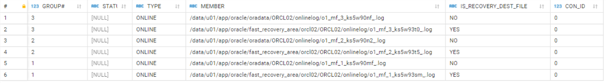
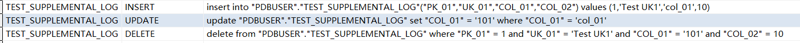
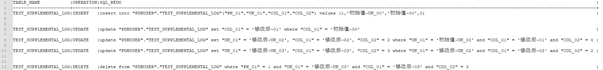

## 前置资料补充

> - **什么是RedoLog ?**
>     
>     - 对数据库的操作进行记录例如：**DML、DDL**操作都能够被记录下来
>         
>     - Redo日志文件主要包两种：
>         
>     - **联机Redo日志文件（Online Redo Log Files）**
>         
>         - 包含对数据库所做的更改记录。万一数据库出现故障可以启用数据恢复。一个数据库至少需要两个Redo日志组，一个Redo日志组至少包含一个文件。
>         - **个人理解**：实时记录，相当于热备
>     - **归档Redo日志文件（Archive Redo Log Files）**
>         - 归档Redo日志文件是联机Redo日志文件的脱机副本，是介质恢复所必要的文件。
>         - **个人理解**：定时记录，相当于冷备
>     - **查看联机Redo日志文件所在位置**
>         
>     
>     ```sql
>     SELECT * FROM V$LOGFILE;
>     ```
>     
>     [](http://qiniu.dev-share.top/image/redolog-01.png)
>     
>     - 所有的文件都是二进制内容

* * *

> - **什么是LogMiner ?**[参考链接](https://www.cnblogs.com/shishanyuan/p/3140440.html)
>     
>     - Oracle LogMiner 是Oracle公司从产品8i以后提供的一个实际非常有用的**分析工具**
>         - 使用该工具可以【轻松获得**`联机Redo日志`/`归档Redo日志文件`**中的具体内容】
>         - 特别是**该工具可以分析出所有**对于数据库操作的**DML**和**DDL**语句。
>         - 该工具特别适用于调试、审计或者回退某个特定的事务
>         - Oracle LogMiner 是 Oracle 数据库的一部分
>     - **LogMiner怎么使用？**
>         
>     
>     1. 开启**LogMiner**
>         
>         1. 在默认情况下，**Oracle**已经安装了**LogMiner**工具。
>         2. 开启**LogMiner**只需要先开启 **【补充日志】** 就可以捕捉到**RedoLog**了
>         
>         - ```sql
>             -- 开启 LogMiner
>             ALTER DATABASE ADD SUPPLEMENTAL LOG DATA;
>             ```
>             
>     2. 加入需分析的日志文件
>         - ```sql
>             BEGIN
>             -- 指定 联机日志文件全路径
>             dbms_logmnr.add_logfile(logfilename=>'/data/u01/app/oracle/oradata/ORCL02/onlinelog/o1_mf_3_ks5w90nf_.log',options=>dbms_logmnr.NEW);
>             -- 配置
>             SYS.DBMS_LOGMNR.START_LOGMNR(
>                OPTIONS => SYS.DBMS_LOGMNR.SKIP_CORRUPTION +
>                           SYS.DBMS_LOGMNR.NO_SQL_DELIMITER +
>                           SYS.DBMS_LOGMNR.NO_ROWID_IN_STMT +
>                           SYS.DBMS_LOGMNR.DICT_FROM_ONLINE_CATALOG +
>                           SYS.DBMS_LOGMNR.COMMITTED_DATA_ONLY +
>                           SYS.DBMS_LOGMNR.STRING_LITERALS_IN_STMT);
>             END;
>             ```
>             
>     3. 观察分析结果
>         - ```sql
>             SELECT
>             TABLE_NAME, OPERATION, SQL_REDO
>             FROM
>             V$LOGMNR_CONTENTS
>             WHERE
>             -- 指定你想要查看的表
>             TABLE_NAME = 'TEST_SUPPLEMENTAL_LOG';
>             ```
>             

## 问题场景

> - 私有云 Oracle 12c ---> 公有云Oracle 12c，采用 Kafka Connector 完成云下到云上数据同步
> - 具体步骤
>     - 私有云 Oracle 12c ---> Kafka Source Connector ---> Kafka ---> Kafka Sink Connector ---> 公有云Oracle 12c
> - 再具体步骤
>     - 私有云 Oracle 12c ---> Oracle LogMiner---> Kafka Source Connector ---> Kafka ---> Kafka Sink Connector ---> 公有云Oracle 12c

### 问题1

> 在数据同步的过程当中，由于执行的**DML**语句**WHERE**条件过长，导致数据同步失败

**排查问题**

> 手动执行引发问题的 SQL语句，然后通过手动执行 **LogMiner** 工具，进行查看 联机**RedoLog**日志

1. 查看你当前使用的 **联机日志文件全路径**
    
    - ```sql
        SELECT L.STATUS,S.MEMBER FROM V$LOG L,V$LOGFILE S WHERE L.GROUP# = S.GROUP# AND L.STATUS = 'CURRENT';
        
        STATUS |MEMBER                                                                               |
        -------+-------------------------------------------------------------------------------------+
        CURRENT|/data/u01/app/oracle/oradata/ORCL02/onlinelog/o1_mf_3_ks5w90nf_.log                  |  联机日志文件
        CURRENT|/data/u01/app/oracle/fast_recovery_area/orcl02/ORCL02/onlinelog/o1_mf_3_ks5w93t0_.log|  联机日志文件快速恢复区
        ```
        
2. 加入需分析的日志文件(只对当前session有效)
    
    - ```sql
        BEGIN
        -- 指定 联机日志文件全路径
        dbms_logmnr.add_logfile(logfilename=>'/data/u01/app/oracle/oradata/ORCL02/onlinelog/o1_mf_3_ks5w90nf_.log',options=>dbms_logmnr.NEW);
        -- 配置
        SYS.DBMS_LOGMNR.START_LOGMNR(
            OPTIONS => SYS.DBMS_LOGMNR.SKIP_CORRUPTION +
                       SYS.DBMS_LOGMNR.NO_SQL_DELIMITER +
                       SYS.DBMS_LOGMNR.NO_ROWID_IN_STMT +
                       SYS.DBMS_LOGMNR.DICT_FROM_ONLINE_CATALOG +
                       SYS.DBMS_LOGMNR.COMMITTED_DATA_ONLY +
                       SYS.DBMS_LOGMNR.STRING_LITERALS_IN_STMT);
        END;
        
        ```
        
3. 开始测试
    
    - ```sql
        -- 新增
        INSERT INTO PDBUSER.TEST_SUPPLEMENTAL_LOG (PK_01, UK_01, COL_01, COL_02) VALUES (1, 'Test UK1', 'col_01', 10);
        -- 修改
        UPDATE PDBUSER.TEST_SUPPLEMENTAL_LOG SET COL_01 = '101' WHERE PK_01  = 1;
        -- 查询
        SELECT * FROM PDBUSER.TEST_SUPPLEMENTAL_LOG WHERE PK_01 = 1;
        -- 删除
        DELETE FROM PDBUSER.TEST_SUPPLEMENTAL_LOG WHERE PK_01 = 1;
        
        ```
        
4. 查询 **Redo Log** 中的 **DML** 信息
    
    - ```sql
        SELECT
         TABLE_NAME, OPERATION, SQL_REDO
        FROM
         V$LOGMNR_CONTENTS
        WHERE
         TABLE_NAME = 'TEST_SUPPLEMENTAL_LOG';
        
        ```
        
    - 查看结果
        
    - [](http://qiniu.dev-share.top/image/redolog-02.png)
        
5. **结果分析**
    
    > 从操作DML的结果来看： ​ Oracle数据库在执行**删除**时，会将**所有列**数据，自动补全到**WHRER**条件中 ​ Oracle数据库在执行**修改**时，会将**被更新列**的数据，自动补全到**WHRER**条件中
    
6. **注意事项**
    

- 测试时要注意，**是否开启了表级别的日志补全功能**，如果开启了，要以表级别的补全策略为准
- `SELECT * FROM ALL_LOG_GROUPS WHERE TABLE_NAME = 'TEST_SUPPLEMENTAL_LOG';`

### 问题2

> Oracle数据库在执行**删除**、**修改**时，会将**所有列**数据，自动补全到**WHRER**条件中，是什么引发的？

**排查问题**

> 因为要使用**LogMiner** 需要使用开启补充日志功能，那就进行逐一排查

1. 查看默认的日志补充策略
    
    - ```sql
        SQL> SELECT
        SUPPLEMENTAL_LOG_DATA_MIN MIN,
        SUPPLEMENTAL_LOG_DATA_PK PK,
        SUPPLEMENTAL_LOG_DATA_UI UNIQUE_INDEX,
        SUPPLEMENTAL_LOG_DATA_FK FK,
        SUPPLEMENTAL_LOG_DATA_ALL ALL_COLUMNS
        FROM
        V$DATABASE;
        
        
        ---------------------------- 日志补充策略 ----------------------------------------
        最小补充     基于主键补充       基于唯一键补充       基于外键补充        补充所有列
        MIN         PK              UNI                FK               ALL
        -------- ------------ -------------- ------------- ----------------
        YES         NO              NO                 NO               NO
        
        ```
        
2. 开始测试
    
    - 创建测试表
        
        ```sql
        DROP TABLE PDBUSER.TEST_SUPPLEMENTAL_LOG;
        
        CREATE TABLE PDBUSER.TEST_SUPPLEMENTAL_LOG (
         PK_01   NUMBER NOT NULL PRIMARY KEY,
         UK_01   VARCHAR2(255) NOT NULL,
         COL_01  VARCHAR2(255) NULL,
         COL_02  NUMBER  NULL,
         CONSTRAINT CONSTRAINT_UK_01 UNIQUE (UK_01)
        );
        ```
        
3. **最小补充**
    
    1. 只使用最小补充
        
        ```sql
        -- 添加
        ALTER DATABASE ADD SUPPLEMENTAL LOG DATA;
        ```
        
    2. 查看日志级别
        
        ```sql
        最小补充
        MIN         PK              UNI                FK               ALL
        -------- ------------ -------------- ------------- ----------------
        YES         NO              NO                 NO               NO
        
        ```
        
    3. 执行增删改
        
        ```sql
        -- 插入一条数据
        INSERT INTO
        PDBUSER.TEST_SUPPLEMENTAL_LOG (PK_01, UK_01, COL_01, COL_02)
        VALUES
        (1, '初始值-UK_00', '初始值-00', 0);
        
        
        -- 只更新一个字段
        UPDATE
        PDBUSER.TEST_SUPPLEMENTAL_LOG
        SET
        COL_01 = '修改后-01'
        WHERE
        PK_01 = 1;
        
        -- 更新多个字段
        UPDATE
        PDBUSER.TEST_SUPPLEMENTAL_LOG
        SET
        UK_01 = '修改后-UK_02', COL_01 = '修改后-02', COL_02 = 2
        WHERE
        PK_01 = 1;
        
        -- 更新多个字段，WHERE 条件非主键
        UPDATE
        PDBUSER.TEST_SUPPLEMENTAL_LOG
        SET
        UK_01 = '修改后-UK_03', COL_01 = '修改后-03', COL_02 = 3
        WHERE
        COL_02 = 2;
        
        
        -- 删除该条记录
        DELETE FROM PDBUSER.TEST_SUPPLEMENTAL_LOG WHERE PK_01 = 1;
        
        ```
        
    4. 查看 Redo SQL
        
        ```sql
        SELECT
        TABLE_NAME, OPERATION, SQL_REDO
        FROM
        V$LOGMNR_CONTENTS
        WHERE
        TABLE_NAME = 'TEST_SUPPLEMENTAL_LOG';
        
        ```
        
        [](http://qiniu.dev-share.top/image/redolog-03.png)
        
    5. **WHERE**条件的变化
        
        1. **UPDATE** 的REDO SQL
            
            1. **去除**原有的**WHERE**条件
            2. 使用所有**被更新的列**作为新的**WHERE**条件
        2. **DELETE**
            
            1. **去除**原有的**WHERE**条件
            2. 使用**表中所有的列**作为新的**WHERE**条件
4. **最小补充 + 基于主键补充**
    
    1. 添加主键补全
        
        ```sql
        -- 添加
        ALTER DATABASE ADD SUPPLEMENTAL LOG DATA (PRIMARY KEY) COLUMNS;
        
        -- 删除
        -- ALTER DATABASE DROP SUPPLEMENTAL LOG DATA (PRIMARY KEY) COLUMNS;
        
        ```
        
    2. 查看日志状态
        
        ```sql
        最小补充     基于主键补充
        MIN         PK              UNI                FK               ALL
        -------- ------------ -------------- ------------- ----------------
        YES         YES              NO                 NO               NO
        
        ```
        
    3. 执行增删改
        
        ```sql
        -- 插入一条数据
        INSERT INTO
        PDBUSER.TEST_SUPPLEMENTAL_LOG (PK_01, UK_01, COL_01, COL_02)
        VALUES
        (1, '初始值-UK_00', '初始值-00', 0);
        
        
        -- 只更新一个字段
        UPDATE
        PDBUSER.TEST_SUPPLEMENTAL_LOG
        SET
        COL_01 = '修改后-01'
        WHERE
        PK_01 = 1;
        
        -- 更新多个字段
        UPDATE
        PDBUSER.TEST_SUPPLEMENTAL_LOG
        SET
        UK_01 = '修改后-UK_02', COL_01 = '修改后-02', COL_02 = 2
        WHERE
        PK_01 = 1;
        
        -- 更新多个字段，WHERE 条件非主键
        UPDATE
        PDBUSER.TEST_SUPPLEMENTAL_LOG
        SET
        UK_01 = '修改后-UK_03', COL_01 = '修改后-03', COL_02 = 3
        WHERE
        COL_02 = 2;
        
        
        -- 删除该条记录
        DELETE FROM PDBUSER.TEST_SUPPLEMENTAL_LOG WHERE PK_01 = 1;
        
        ```
        
    4. 查看 Redo SQL
        
        [](http://qiniu.dev-share.top/image/redolog-04.png)
        
    5. 观察**WHERE**条件的变化
        
    
    - **UPDATE**的REDO SQL
        
        1. **去除**原有的**WHERE**条件
        2. 使用所有**被更新的列**作为新的**WHERE**条件
        3. **WHERE**条件会额外加入主键
    - **DELETE**
        
        1. **去除**原有的**WHERE**条件
        2. 使用**表中所有的列**作为新的**WHERE**条件
