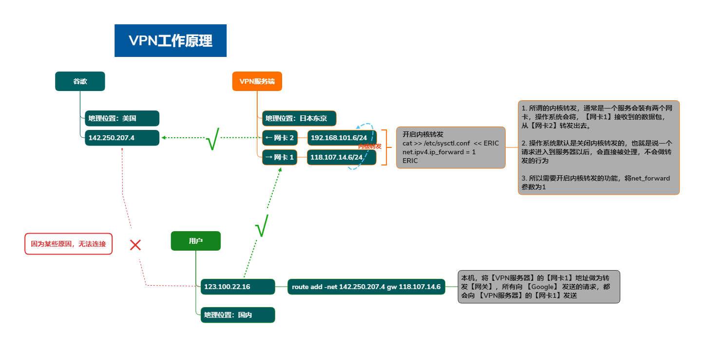
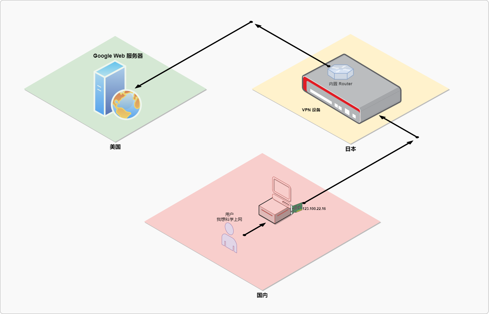

## 网络管理

### CentOS 7

- **常用命令**
    
    - `ip a`
    - `ping ip/域名`
    - `telnet ip:port`
    - `route add -net 192.168.0.0/24 gw 192.168.0.1`
    - `route del -net 192.168.0.0/24 gw 192.168.0.1`
- **常见的IP与端口**
    
    - `255.255.255.0` 子网掩码，用来划分网段的
    - `0.0.0.0/0` 表示所有网络，任意网段
    - `21 22 23 25 80 443 3306 3389 1521 6379 等`
- **常用DNS地址**
    
    - `114.114.114.114`
    - `223.5.5.5`
    - `223.6.6.6`
    - `1.2.4.8`
    - `8.8.8.8` Google的
    - `8.8.4.4` Google的
    - `202.106.0.20` 联通的
- 网关(通常就是你的路由)
    
- 防火墙
    
    - `iptables`
    - `firewalld`
- VPN服务器/客户端
    
    - > 访问Google查点儿技术文章
        
    - 如果不使用VPN设备可能会这样实现
        
        - 
    - 当下最新的简单的理解工作原理
        
        - 
