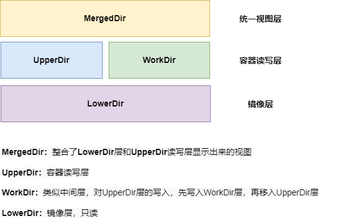

# 详解Docker镜像分层

## 存储结果

> Docker镜像是如何存储在操作系统中的，这里通过拉取一个镜像来说明

1. 查看docker里面没有镜像时的样子
    
    - ```shell
        ┌──(root@localhost 14:03:36) - [/var/lib/docker/overlay2]
        └─# ll
        drwxr-xr-x 2 root root 6 Feb 22 14:03 l
        ```
        
2. 拉取一个镜像做为对比
    
    - ```shell
        ## 拉取镜像
        ┌──(root@localhost 14:03:37) - [/var/lib/docker/overlay2]
        └─# docker pull cnagent/centos:7.9.2009
        7.9.2009: Pulling from cnagent/centos
        2d473b07cdd5: Pull complete
        Digest: sha256:dead07b4d8ed7e29e98de0f4504d87e8880d4347859d839686a31da35a3b532f
        Status: Downloaded newer image for cnagent/centos:7.9.2009
        docker.io/cnagent/centos:7.9.2009
        
        
        ┌──(root@localhost 14:07:51) - [/var/lib/docker/overlay2]
        └─# docker images
        REPOSITORY       TAG        IMAGE ID       CREATED         SIZE
        cnagent/centos   7.9.2009   eeb6ee3f44bd   17 months ago   204MB
        
        
        ┌──(root@localhost 14:05:07) - [/var/lib/docker/overlay2]
        └─# ll
        
        # 这个是镜像
        drwx-----x 3 root root 30 Feb 22 14:05 8a2699977acc2eb675ac5dfae7eb705eec89bea81dea61ac62d7fed664a51ef7
        # 这个是Docker默认创建的文件夹 L，删除后镜像就无法保存了
        # 这里面都是软连接文件目录的简写标识，这个主要是为了避免mount时候页大小的限制
        drwxr-xr-x 2 root root 40 Feb 22 14:05 l
        
        ```
        
    - 查看这个镜像的结构
        
        - ```shell
            ┌──(root@localhost 15:58:25) - [/var/lib/docker/overlay2]
            └─# tree . -L 3
            .
            ├── 8a2699977acc2eb675ac5dfae7eb705eec89bea81dea61ac62d7fed664a51ef7
            │   ├── diff
            │   │   ├── anaconda-post.log
            │   │   ├── bin -> usr/bin
            │   │   ├── dev
            │   │   ├── etc
            │   │   ├── home
            │   │   ├── lib -> usr/lib
            │   │   ├── lib64 -> usr/lib64
            │   │   ├── media
            │   │   ├── mnt
            │   │   ├── opt
            │   │   ├── proc
            │   │   ├── root
            │   │   ├── run
            │   │   ├── sbin -> usr/sbin
            │   │   ├── srv
            │   │   ├── sys
            │   │   ├── tmp
            │   │   ├── usr
            │   │   └── var
            │   └── link
            └── l
             └── PLK5WEIXPIX2WN7AKGPV2MNJJI -> ../8a2699977acc2eb675ac5dfae7eb705eec89bea81dea61ac62d7fed664a51ef7/diff
            
            ```
            
        
        1. 可以看到`centos:7.9.2009`镜像默认只有`1`个`layer`其中`diff`即是默认的文件系统
        2. `l`文件夹下都是链接各个`layer`的软连接
    - 查看容器运行起来后的变化
        
        - ```shell
            ## 运行容器
            ┌──(root@localhost 16:06:04) - [~]
            └─# docker run --rm -it cnagent/centos:7.9.2009
            [root@170b90273a16 /]#
            
            
            
            
            ## 查看目录变化
            ┌──(root@localhost 16:06:01) - [/var/lib/docker/overlay2]
            └─# ll
            
            drwx-----x 3 root root  47 Feb 22 16:05 8a2699977acc2eb675ac5dfae7eb705eec89bea81dea61ac62d7fed664a51ef7
            drwxr-xr-x 2 root root 108 Feb 22 16:06 l
            ## 多出来两个运行时产生的文件
            ##   这两个文件就是容器运行时文件
            ##   容器删除后就是把这些文件删除了
            drwx-----x 5 root root  69 Feb 22 16:06 09d37924cf8d958166b8c657705c711651d384ef61c371d68dce09fbb65e8a5c
            drwx-----x 4 root root  72 Feb 22 16:06 09d37924cf8d958166b8c657705c711651d384ef61c371d68dce09fbb65e8a5c-init
            
            ```
            
    - 接下来基于`centos:7.9.2009`构建一个新的镜像，在查看目录的变化
        
        - ```shell
            cat > Dockerfile << ERIC
            
            FROM cnagent/centos:7.9.2009
            RUN echo "Hello World" > /tmp/newfile
            
            ERIC
            
            
            
            
            ## 构建新的镜像
            ┌──(root@localhost 16:13:52) - [~]
            └─# docker build -t siyu-image:1.0.0 .
            Sending build context to Docker daemon  58.88kB
            Step 1/2 : FROM cnagent/centos:7.9.2009
            ---> eeb6ee3f44bd
            Step 2/2 : RUN echo "Hello World" > /tmp/newfile
            ---> Using cache
            ---> fd69adb3bfce
            Successfully built fd69adb3bfce
            Successfully tagged siyu-image:1.0.0
            ```
            
        - ```shell
            ## 查看目录变化
            ┌──(root@localhost 16:15:50) - [/var/lib/docker/overlay2]
            └─# ll
            
            drwx-----x 3 root root 47 Feb 22 16:05 8a2699977acc2eb675ac5dfae7eb705eec89bea81dea61ac62d7fed664a51ef7
            drwxr-xr-x 2 root root 74 Feb 22 16:13 l
            ## 多出来一个新的镜像文件夹
            drwx-----x 4 root root 55 Feb 22 16:13 58b8befeb2afc6df91afdadca9e50cface0c3573cae1f83b048d154577e504bc
            
            
            
            
            ## 查看 新的镜像结构
            ┌──(root@localhost 16:17:33) - [/var/lib/docker/overlay2]
            └─# tree 58b8befeb2afc6df91afdadca9e50cface0c3573cae1f83b048d154577e504bc -L 3
            58b8befeb2afc6df91afdadca9e50cface0c3573cae1f83b048d154577e504bc
            ├── diff
            │   └── tmp
            │       └── newfile
            ├── link
            ├── lower
            └── work
            
            
            ## 查看 L 文件
            ┌──(root@localhost 16:18:50) - [/var/lib/docker/overlay2]
            └─# tree l -L 3
            l
            ├── M2T7J6CBSUDUHN4UONJ6XYPF7C -> ../58b8befeb2afc6df91afdadca9e50cface0c3573cae1f83b048d154577e504bc/diff
            └── PLK5WEIXPIX2WN7AKGPV2MNJJI -> ../8a2699977acc2eb675ac5dfae7eb705eec89bea81dea61ac62d7fed664a51ef7/diff
            
            ```
            
        
        1. 发现新的镜像中没有系统文件了，但是确多出了一个文件，`lower`与一个文件夹`work`，`diff`文件夹也不一样了
            
            - ```shell
                ┌──(root@localhost 16:22:12) - [/var/lib/docker/overlay2/58b8befeb2afc6df91afdadca9e50cface0c3573cae1f83b048d154577e504bc]
                └─# cat lower
                l/PLK5WEIXPIX2WN7AKGPV2MNJJI    ## 这个是自己镜像的软链接
                
                
                ┌──(root@localhost 16:22:15) - [/var/lib/docker/overlay2/58b8befeb2afc6df91afdadca9e50cface0c3573cae1f83b048d154577e504bc]
                └─# cat link
                M2T7J6CBSUDUHN4UONJ6XYPF7C      ## 这个是最底层镜像的软链接
                
                
                ┌──(root@localhost 16:26:45) - [/var/lib/docker/overlay2/58b8befeb2afc6df91afdadca9e50cface0c3573cae1f83b048d154577e504bc]
                └─# tree diff/
                diff/                           ## diff文件夹中原来的系统文件也没有了，只留下了新加入的层
                └── tmp
                  └── newfile
                
                ```
                
        2. 查看`新镜像的history信息` 与 `基础镜像history信息`做个对比
            
            - ```shell
                ## 基础镜像
                ┌──(root@localhost 16:33:28) - [/var/lib/docker/overlay2]
                └─# docker image history cnagent/centos:7.9.2009
                
                IMAGE          CREATED         CREATED BY                                      SIZE      COMMENT
                eeb6ee3f44bd   17 months ago   /bin/sh -c #(nop)  CMD ["/bin/bash"]            0B
                <missing>      17 months ago   /bin/sh -c #(nop)  LABEL org.label-schema.sc…   0B
                <missing>      17 months ago   /bin/sh -c #(nop) ADD file:b3ebbe8bd304723d4…   204MB
                
                
                
                
                ## 新镜像
                ┌──(root@localhost 16:33:28) - [/var/lib/docker/overlay2]
                └─# docker image history siyu-image:1.0.0
                
                IMAGE          CREATED          CREATED BY                                      SIZE      COMMENT
                fd69adb3bfce   20 minutes ago   /bin/sh -c echo "Hello World" > /tmp/newfile    12B       # 在这里可以看到，会多出一层
                eeb6ee3f44bd   17 months ago    /bin/sh -c #(nop)  CMD ["/bin/bash"]            0B
                <missing>      17 months ago    /bin/sh -c #(nop)  LABEL org.label-schema.sc…   0B
                <missing>      17 months ago    /bin/sh -c #(nop) ADD file:b3ebbe8bd304723d4…   204MB
                ┌──(root@localhost 16:33:40) - [/var/lib/docker/overlay2]
                └─#
                
                ```
                
        3. 查看`新镜像的inspect信息` 与 `基础镜像inspect信息`做个对比
            
            - ```shell
                ┌──(root@localhost 16:39:14) - [/var/lib/docker/overlay2]
                └─# docker inspect cnagent/centos:7.9.2009 | jq '.[].GraphDriver.Data'
                {
                "MergedDir": "/data/docker-data/overlay2/8a2699977acc2eb675ac5dfae7eb705eec89bea81dea61ac62d7fed664a51ef7/merged",
                "UpperDir": "/data/docker-data/overlay2/8a2699977acc2eb675ac5dfae7eb705eec89bea81dea61ac62d7fed664a51ef7/diff",
                "WorkDir": "/data/docker-data/overlay2/8a2699977acc2eb675ac5dfae7eb705eec89bea81dea61ac62d7fed664a51ef7/work"
                }
                ┌──(root@localhost 16:39:19) - [/var/lib/docker/overlay2]
                └─#
                ┌──(root@localhost 16:39:20) - [/var/lib/docker/overlay2]
                └─# docker inspect siyu-image:1.0.0 | jq '.[].GraphDriver.Data'
                {
                "LowerDir": "/data/docker-data/overlay2/8a2699977acc2eb675ac5dfae7eb705eec89bea81dea61ac62d7fed664a51ef7/diff",
                "MergedDir": "/data/docker-data/overlay2/58b8befeb2afc6df91afdadca9e50cface0c3573cae1f83b048d154577e504bc/merged",
                "UpperDir": "/data/docker-data/overlay2/58b8befeb2afc6df91afdadca9e50cface0c3573cae1f83b048d154577e504bc/diff",
                "WorkDir": "/data/docker-data/overlay2/58b8befeb2afc6df91afdadca9e50cface0c3573cae1f83b048d154577e504bc/work"
                }
                
                ```
                
        4. 到这里可能需要做一些知识的补充【**存储流程**】
            
            1. `LowerDir`层是最下层
                
                - 也是只读/镜像层，也是你当前镜像的基础层
            2. `UpperDir`是容器的读写层
                
                - 采用了`CoW`(写时复制)机制
                - 只有对文件进行修改才会将文件拷贝到`UpperDir`层，之后所有的修改操作都会对`UpperDir`层的副本进行修改
            3. `WorkDir`层它的作用是充当一个中间层的作用
                
                - `WorkDir`层与`UpperDir`并列
                - 每当对`UpperDir`层里面的副本进行修改时，会先写到`WorkDir`，然后再从`WorkDir`移动`UpperDir`层
            4. `MergedDir`层是最上层
                
                - `MergedDir`层是一个统一视图层,从`MergedDir`可以看到`LowerDir`、`UpperDir`、`WorkDir`中所有数据的整合
                - 它只有在容器运行时才分进行整合，容器停止运行后就会消失。
            5. 
        5. 对比**MergedDir**层的工作原理
            
            - ```shell
                ## 查看Docker镜像默认结构
                ┌──(root@localhost 17:20:38) - [/var/lib/docker/overlay2]
                └─# ll
                
                drwx-----x 4 root root 72 Feb 22 17:12 58b8befeb2afc6df91afdadca9e50cface0c3573cae1f83b048d154577e504bc
                drwx-----x 3 root root 47 Feb 22 16:05 8a2699977acc2eb675ac5dfae7eb705eec89bea81dea61ac62d7fed664a51ef7
                drwxr-xr-x 2 root root 74 Feb 22 17:20 l
                
                
                
                
                ## 使用新镜像，启动一个容器
                ┌──(root@localhost 17:25:13) - [~]
                └─# docker run -it siyu-image:1.0.0
                [root@44289e1df216 /]#
                
                
                
                
                ## 再次查看Docker镜像默认结构
                ┌──(root@localhost 17:20:58) - [/var/lib/docker/overlay2]
                └─# ll
                
                drwx-----x 4 root root  72 Feb 22 17:12 58b8befeb2afc6df91afdadca9e50cface0c3573cae1f83b048d154577e504bc
                drwx-----x 3 root root  47 Feb 22 16:05 8a2699977acc2eb675ac5dfae7eb705eec89bea81dea61ac62d7fed664a51ef7
                drwxr-xr-x 2 root root 142 Feb 22 17:25 l
                ## 可以看到这里多出了两个容器文件夹
                drwx-----x 5 root root  69 Feb 22 17:25 1e531e462a72be9caa50b9c862985ebb68d24569fe95af0c4ddfcb5085c63b5c
                drwx-----x 4 root root  72 Feb 22 17:25 1e531e462a72be9caa50b9c862985ebb68d24569fe95af0c4ddfcb5085c63b5c-init
                
                ```
                
            - ```shell
                ## 查看容器的目录结构
                ┌──(root@localhost 17:27:02) - [/var/lib/docker/overlay2]
                └─# tree 1e531e462a72be9caa50b9c862985ebb68d24569fe95af0c4ddfcb5085c63b5c -L 2
                1e531e462a72be9caa50b9c862985ebb68d24569fe95af0c4ddfcb5085c63b5c
                ├── diff
                ├── link
                ├── lower
                ├── merged
                │   ├── anaconda-post.log
                │   ├── bin -> usr/bin
                │   ├── dev
                │   ├── etc
                │   ├── home
                │   ├── lib -> usr/lib
                │   ├── lib64 -> usr/lib64
                │   ├── media
                │   ├── mnt
                │   ├── opt
                │   ├── proc
                │   ├── root
                │   ├── run
                │   ├── sbin -> usr/sbin
                │   ├── srv
                │   ├── sys
                │   ├── tmp
                │   ├── usr
                │   └── var
                └── work
                  └── work
                
                ```
                
                - 发现里面多出了一个`merged`文件夹，它是在容器运行时动态生成的
            - ```shell
                ## 退出容器
                ┌──(root@localhost 17:25:13) - [~]
                └─# docker run -it siyu-image:1.0.0
                [root@44289e1df216 /]# exit
                exit
                
                
                ## 容器文件夹还在，但是里面的merged文件夹没了
                ┌──(root@localhost 17:35:03) - [/var/lib/docker/overlay2]
                └─# ll
                
                drwx-----x 4 root root  55 Feb 22 17:34 1e531e462a72be9caa50b9c862985ebb68d24569fe95af0c4ddfcb5085c63b5c
                drwx-----x 4 root root  72 Feb 22 17:25 1e531e462a72be9caa50b9c862985ebb68d24569fe95af0c4ddfcb5085c63b5c-init
                drwx-----x 4 root root  72 Feb 22 17:12 58b8befeb2afc6df91afdadca9e50cface0c3573cae1f83b048d154577e504bc
                drwx-----x 3 root root  47 Feb 22 16:05 8a2699977acc2eb675ac5dfae7eb705eec89bea81dea61ac62d7fed664a51ef7
                drwxr-xr-x 2 root root 142 Feb 22 17:25 l
                
                
                
                ## 查看 容器退出后的目录
                ┌──(root@localhost 17:35:06) - [/var/lib/docker/overlay2]
                └─# tree 1e531e462a72be9caa50b9c862985ebb68d24569fe95af0c4ddfcb5085c63b5c -L 2
                1e531e462a72be9caa50b9c862985ebb68d24569fe95af0c4ddfcb5085c63b5c
                ├── diff
                │   └── root
                ├── link
                ├── lower
                └── work
                  └── work
                
                ```
                
                - 到这里你会发现`merged`文件夹随着容器的停止而消失了，所以从这里可以看出，`merged`文件夹它是容器运行`初始化时`合并文件后的文件夹
3. 测试构建多层镜像时的对比
    
    - ```shell
        ## 默认只有一个基础镜像的目标结构
        ┌──(root@localhost 17:49:38) - [/var/lib/docker/overlay2]
        └─# ll
        
        drwx-----x 3 root root 47 Feb 22 16:05 8a2699977acc2eb675ac5dfae7eb705eec89bea81dea61ac62d7fed664a51ef7
        drwxr-xr-x 2 root root 40 Feb 22 17:50 l
        ```
        
    - ```shell
        ## 构建镜像
        ┌──(root@localhost 17:50:55) - [~]
        └─# cat Dockerfile
        FROM cnagent/centos:7.9.2009
        RUN echo "Hello World" > /tmp/newfile
        RUN echo "Hello Siyu" >> /tmp/newfile
        
        
        
        
        ┌──(root@localhost 17:51:15) - [~]
        └─# docker build -t siyu-image:1.0.0 .
        Sending build context to Docker daemon  59.39kB
        Step 1/3 : FROM cnagent/centos:7.9.2009
        ---> eeb6ee3f44bd
        Step 2/3 : RUN echo "Hello World" > /tmp/newfile
        ---> Running in 16c9419303db
        Removing intermediate container 16c9419303db
        ---> 5d02b4f4a3a9
        Step 3/3 : RUN echo "Hello Siyu" >> /tmp/newfile
        ---> Running in 23e786fb0324
        Removing intermediate container 23e786fb0324
        ---> a0fa61ec8c69
        Successfully built a0fa61ec8c69
        Successfully tagged siyu-image:1.0.0
        
        
        
        
        ## 加了两层
        ┌──(root@localhost 17:54:03) - [/var/lib/docker/overlay2]
        └─# docker history siyu-image:1.0.0
        IMAGE          CREATED         CREATED BY                                      SIZE      COMMENT
        a0fa61ec8c69   2 minutes ago   /bin/sh -c echo "Hello Siyu" >> /tmp/newfile    23B
        5d02b4f4a3a9   2 minutes ago   /bin/sh -c echo "Hello World" > /tmp/newfile    12B
        eeb6ee3f44bd   17 months ago   /bin/sh -c #(nop)  CMD ["/bin/bash"]            0B
        <missing>      17 months ago   /bin/sh -c #(nop)  LABEL org.label-schema.sc…   0B
        <missing>      17 months ago   /bin/sh -c #(nop) ADD file:b3ebbe8bd304723d4…   204MB
        
        
        
        
        ┌──(root@localhost 17:55:08) - [/var/lib/docker/overlay2]
        └─# docker inspect siyu-image:1.0.0 | jq '.[].GraphDriver.Data'
        {
         "LowerDir": "/data/docker-data/overlay2/bae70eed479837e77fe2ac5f8f6fab8dfc9fcdfaf9ecbab14163dd8c0fe1d756/diff:/data/docker-data/overlay2/8a2699977acc2eb675ac5dfae7eb705eec89bea81dea61ac62d7fed664a51ef7/diff",
         "MergedDir": "/data/docker-data/overlay2/1ec6c108efb3fcc790f04dc8bb70315c7639efaf0f7172dc80771975ecc7ec24/merged",
         "UpperDir": "/data/docker-data/overlay2/1ec6c108efb3fcc790f04dc8bb70315c7639efaf0f7172dc80771975ecc7ec24/diff",
         "WorkDir": "/data/docker-data/overlay2/1ec6c108efb3fcc790f04dc8bb70315c7639efaf0f7172dc80771975ecc7ec24/work"
        }
        
        
        
        
        ## 查看目录结构
        ┌──(root@localhost 17:51:07) - [/var/lib/docker/overlay2]
        └─# ll
        
        drwx-----x 3 root root  47 Feb 22 16:05 8a2699977acc2eb675ac5dfae7eb705eec89bea81dea61ac62d7fed664a51ef7
        drwxr-xr-x 2 root root 108 Feb 22 17:51 l
        ## 这里会发现多了两个文件夹
        drwx-----x 4 root root  55 Feb 22 17:51 1ec6c108efb3fcc790f04dc8bb70315c7639efaf0f7172dc80771975ecc7ec24
        drwx-----x 4 root root  72 Feb 22 17:51 bae70eed479837e77fe2ac5f8f6fab8dfc9fcdfaf9ecbab14163dd8c0fe1d756
        
        
        
        
        ## 查看文件夹结构
        ┌──(root@localhost 17:53:11) - [/var/lib/docker/overlay2]
        └─# tree . -L 3
        .
        ├── 1ec6c108efb3fcc790f04dc8bb70315c7639efaf0f7172dc80771975ecc7ec24
        │   ├── diff
        │   │   └── tmp
        │   ├── link
        │   ├── lower
        │   └── work
        ├── 8a2699977acc2eb675ac5dfae7eb705eec89bea81dea61ac62d7fed664a51ef7
        │   ├── committed
        │   ├── diff
        │   │   ├── anaconda-post.log
        │   │   ├── bin -> usr/bin
        │   │   ├── dev
        │   │   ├── etc
        │   │   ├── home
        │   │   ├── lib -> usr/lib
        │   │   ├── lib64 -> usr/lib64
        │   │   ├── media
        │   │   ├── mnt
        │   │   ├── opt
        │   │   ├── proc
        │   │   ├── root
        │   │   ├── run
        │   │   ├── sbin -> usr/sbin
        │   │   ├── srv
        │   │   ├── sys
        │   │   ├── tmp
        │   │   ├── usr
        │   │   └── var
        │   └── link
        ├── bae70eed479837e77fe2ac5f8f6fab8dfc9fcdfaf9ecbab14163dd8c0fe1d756
        │   ├── committed
        │   ├── diff
        │   │   └── tmp
        │   ├── link
        │   ├── lower
        │   └── work
        └── l
           ├── 5AHPV4GIUPOFTFI7YI7QHQ2WGN -> ../1ec6c108efb3fcc790f04dc8bb70315c7639efaf0f7172dc80771975ecc7ec24/diff
           ├── JSU5YM6TEJILD76PDG3VH5PRBJ -> ../bae70eed479837e77fe2ac5f8f6fab8dfc9fcdfaf9ecbab14163dd8c0fe1d756/diff
           └── PLK5WEIXPIX2WN7AKGPV2MNJJI -> ../8a2699977acc2eb675ac5dfae7eb705eec89bea81dea61ac62d7fed664a51ef7/diff
        
        ```
        
    - 从上面的信息中可以看出，我多加了一层，就会多出一个文件夹，那么我把Dockerfile改一个，写个10层看看
        
        - ```shell
            ┌──(root@localhost 18:00:33) - [~]
            └─# cat Dockerfile
            FROM cnagent/centos:7.9.2009
            RUN echo "Hello World" > /tmp/01.log
            RUN echo "Hello Siyu"  > /tmp/02.log
            RUN echo "Hello Siyu"  > /tmp/03.log
            RUN echo "Hello Siyu"  > /tmp/04.log
            RUN echo "Hello Siyu"  > /tmp/05.log
            RUN echo "Hello Siyu"  > /tmp/06.log
            RUN echo "Hello Siyu"  > /tmp/07.log
            RUN echo "Hello Siyu"  > /tmp/08.log
            RUN echo "Hello Siyu"  > /tmp/09.log
            RUN echo "Hello Siyu"  > /tmp/10.log
            
            
            ## 构建
            ┌──(root@localhost 18:00:36) - [~]
            └─# docker build -t siyu-image:1.0.0 .
            Sending build context to Docker daemon  59.39kB
            Step 1/11 : FROM cnagent/centos:7.9.2009
            ---> eeb6ee3f44bd
            Step 2/11 : RUN echo "Hello World" > /tmp/01.log
            ---> Running in 088feccb7b11
            Removing intermediate container 088feccb7b11
            ---> 0d0f60aad123
            Step 3/11 : RUN echo "Hello Siyu"  > /tmp/02.log
            ---> Running in 93f551b2fd46
            Removing intermediate container 93f551b2fd46
            ---> dc85b5df623f
            Step 4/11 : RUN echo "Hello Siyu"  > /tmp/03.log
            ---> Running in 34d7fcc137e9
            Removing intermediate container 34d7fcc137e9
            ---> 584d97e245e0
            Step 5/11 : RUN echo "Hello Siyu"  > /tmp/04.log
            ---> Running in 3fef9daf166e
            Removing intermediate container 3fef9daf166e
            ---> 61b1916ba12c
            Step 6/11 : RUN echo "Hello Siyu"  > /tmp/05.log
            ---> Running in 4696b80e9874
            Removing intermediate container 4696b80e9874
            ---> 81b2095c31f7
            Step 7/11 : RUN echo "Hello Siyu"  > /tmp/06.log
            ---> Running in 2d93f5c99193
            Removing intermediate container 2d93f5c99193
            ---> 23f61bdc3edc
            Step 8/11 : RUN echo "Hello Siyu"  > /tmp/07.log
            ---> Running in 1e0245154109
            Removing intermediate container 1e0245154109
            ---> ce46e68c3a2f
            Step 9/11 : RUN echo "Hello Siyu"  > /tmp/08.log
            ---> Running in d0c2f4231aa9
            Removing intermediate container d0c2f4231aa9
            ---> 8250080f16db
            Step 10/11 : RUN echo "Hello Siyu"  > /tmp/09.log
            ---> Running in b9ab6f760ded
            Removing intermediate container b9ab6f760ded
            ---> 90c932cb249b
            Step 11/11 : RUN echo "Hello Siyu"  > /tmp/10.log
            ---> Running in e86c8db662e0
            Removing intermediate container e86c8db662e0
            ---> 1e50ae470aec
            Successfully built 1e50ae470aec
            Successfully tagged siyu-image:1.0.0
            
            ```
            
        - ```shell
            ## 查看目录结构
            ┌──(root@localhost 18:01:41) - [/var/lib/docker/overlay2]
            └─# docker history siyu-image:1.0.0
            
            IMAGE          CREATED              CREATED BY                                      SIZE      COMMENT
            1e50ae470aec   57 seconds ago       /bin/sh -c echo "Hello Siyu"  > /tmp/10.log     11B
            90c932cb249b   58 seconds ago       /bin/sh -c echo "Hello Siyu"  > /tmp/09.log     11B
            8250080f16db   58 seconds ago       /bin/sh -c echo "Hello Siyu"  > /tmp/08.log     11B
            ce46e68c3a2f   59 seconds ago       /bin/sh -c echo "Hello Siyu"  > /tmp/07.log     11B
            23f61bdc3edc   59 seconds ago       /bin/sh -c echo "Hello Siyu"  > /tmp/06.log     11B
            81b2095c31f7   About a minute ago   /bin/sh -c echo "Hello Siyu"  > /tmp/05.log     11B
            61b1916ba12c   About a minute ago   /bin/sh -c echo "Hello Siyu"  > /tmp/04.log     11B
            584d97e245e0   About a minute ago   /bin/sh -c echo "Hello Siyu"  > /tmp/03.log     11B
            dc85b5df623f   About a minute ago   /bin/sh -c echo "Hello Siyu"  > /tmp/02.log     11B
            0d0f60aad123   About a minute ago   /bin/sh -c echo "Hello World" > /tmp/01.log     12B
            eeb6ee3f44bd   17 months ago        /bin/sh -c #(nop)  CMD ["/bin/bash"]            0B
            <missing>      17 months ago        /bin/sh -c #(nop)  LABEL org.label-schema.sc…   0B
            <missing>      17 months ago        /bin/sh -c #(nop) ADD file:b3ebbe8bd304723d4…   204MB
            
            
            
            
            ┌──(root@localhost 18:01:57) - [/var/lib/docker/overlay2]
            └─# ll
            
            drwx-----x 3 root root   47 Feb 22 16:05 8a2699977acc2eb675ac5dfae7eb705eec89bea81dea61ac62d7fed664a51ef7
            drwxr-xr-x 2 root root 4096 Feb 22 18:00 l
            ## 底下多出了10个文件夹
            drwx-----x 4 root root   55 Feb 22 18:00 05950772d987739adda4ccd807d70b6ad0336529ccc2fb4d8a809ab509c497ee
            drwx-----x 4 root root   72 Feb 22 18:00 13460c0f964d5dc0e4f7afb1d1cc83445ab151c0a211ce8eb96f471c721196df
            drwx-----x 4 root root   72 Feb 22 18:00 174354864ea0d3166871dc387e1c58201bb22baa16dc723f0d2930cd8f9398f9
            drwx-----x 4 root root   72 Feb 22 18:00 4417d4572f53a80c80bc7d4f9b0cb077e4ad8be8a2b5549e6250184e01d3c756
            drwx-----x 4 root root   72 Feb 22 18:00 612506461c4f5096e64c66a9242ff93f879e48152114c73f7173db30d169dcde
            drwx-----x 4 root root   72 Feb 22 18:00 77a1f16e0bdc46a8c2e7c15937d99587c06eb2b6d97149fe9d203d5101747408
            drwx-----x 4 root root   72 Feb 22 18:00 a844237f0f6d30b9b41e6247b5c6c6ec865d106d88ba6a4a00a68f5fce61c0b6
            drwx-----x 4 root root   72 Feb 22 18:00 dfa2d71f22a0c27802f6b8358d1f682be3b31bb092540fb226896b1144fb45c0
            drwx-----x 4 root root   72 Feb 22 18:00 ecfefc20562cb27611738b77bae7b393ab46c1f8a76884522f5c9c8e1f44f9d3
            drwx-----x 4 root root   72 Feb 22 18:00 ef62716c6ab694d3a01f85d2ab049ff8adb42488cbd5200eb440942859446273
            
            ```
            
            - 由此可见，Dockerfile如果不按照规范去写，就可能会出现特别多的文件夹，带来的影响也是可想而知的
