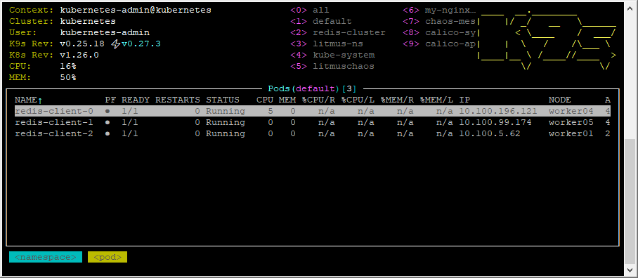
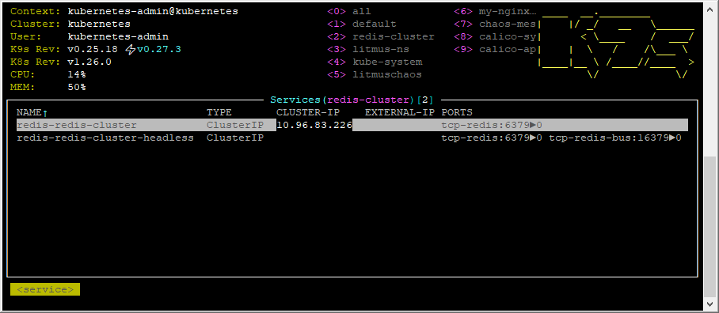
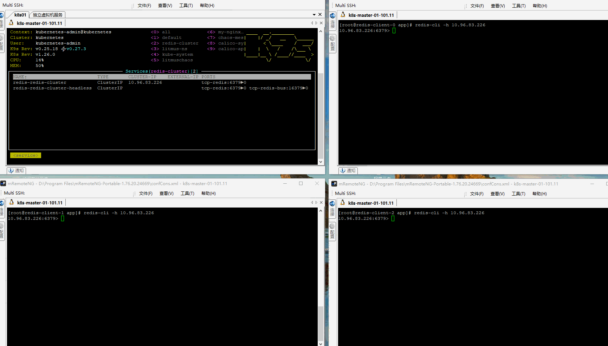

## 创建3个Redis客户端

## 查看Redis集群信息和Redis访问地址

## 测试Redis客户端的 发布订阅

## Redis 发布订阅命令

| 序号 | 命令及描述 |
| :-- | :-- |
| 1 | `PSUBSCRIBE pattern [pattern ...\]` 订阅一个或多个符合给定模式的频道。 |
| 2 | `PUBSUB subcommand [argument [argument ...\]]` 查看订阅与发布系统状态。 |
| 3 | `PUBLISH channel message` 将信息发送到指定的频道。 |
| 4 | `PUNSUBSCRIBE [pattern [pattern ...\]]` 退订所有给定模式的频道。 |
| 5 | `SUBSCRIBE channel [channel ...\]` 订阅给定的一个或多个频道的信息。 |
| 6 | `UNSUBSCRIBE [channel [channel ...\]]` 指退订给定的频道。 |
