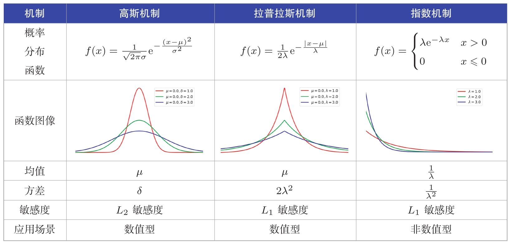

## markdown新用法

[](https://vercel.com/new)

* * *

* * *

* * *

**您希望 ChatGPT 如何进行回复？**

```
回答问题时：
1. 要先设定一个合理的背景
2. 阐明问题的重点
3. 优先考虑使用图像化来解答问题
4. 还要考虑他解决了什么样的问题，为什么要用它

要求，先不要讲具体的
```

* * *

* * *

* * *


> 我们通常都会使用一个三维的张量，是因为张量的维度是有特殊的表示意义的，在RNN这个场景下，第一维通常会表示成批次，就是这一个段的张量数据是由几批组成的 第二个维度就是每一批中有多少数据，最后一维指的是每批数据中的具体内容一共有多少

> 是的，你的理解是正确的。我们通常会使用一个三维的张量来处理序列数据，尤其是在RNN（循环神经网络）中，这个三维张量的维度确实有特殊的表示意义。具体来说：

### 三维张量的维度意义

1. **第一维（Batch Size）**：
   - 表示一个批次中有多少样本。
   - 例如，如果 batch_size 是 32，那么这一维的大小就是 32，表示这一个段的张量数据是由 32 个样本组成的。

2. **第二维（Sequence Length / Time Steps）**：
   - 表示每个样本中有多少个时间步。
   - 例如，如果 sequence_length 是 10，那么这一维的大小就是 10，表示每个样本都有 10 个时间步。

3. **第三维（Feature Size / Output Size）**：
   - 表示每个时间步的特征维度或者输出维度。
   - 例如，如果 feature_size 或 output_size 是 5，那么这一维的大小就是 5，表示每个时间步的特征向量或输出向量有 5 个值。

### 举例说明

假设你有一个形状为 `(32, 10, 5)` 的三维张量：

- **第一维（Batch Size）**：
  - 32，表示一个批次有 32 个样本。
  
- **第二维（Sequence Length）**：
  - 10，表示每个样本有 10 个时间步。
  
- **第三维（Feature Size / Output Size）**：
  - 5，表示每个时间步的特征向量或输出向量有 5 个值。

### 示例张量

```
[
  [  # 第一个样本
    [0.1, 0.2, 0.3, 0.4, 0.0],  # 时间步1的特征/输出
    [0.2, 0.2, 0.1, 0.4, 0.1],  # 时间步2的特征/输出
    ...
    [0.3, 0.1, 0.2, 0.2, 0.2]   # 时间步10的特征/输出
  ],
  [  # 第二个样本
    [0.15, 0.25, 0.2, 0.3, 0.1],  # 时间步1的特征/输出
    [0.2, 0.3, 0.1, 0.2, 0.2],    # 时间步2的特征/输出
    ...
    [0.25, 0.1, 0.2, 0.15, 0.3]   # 时间步10的特征/输出
  ],
  ...
  [  # 第32个样本
    [0.3, 0.1, 0.2, 0.25, 0.15],  # 时间步1的特征/输出
    [0.2, 0.3, 0.15, 0.25, 0.1],  # 时间步2的特征/输出
    ...
    [0.1, 0.2, 0.3, 0.1, 0.3]     # 时间步10的特征/输出
  ]
]
```

### 总结

- **第一维**：表示批次大小，即有多少样本。
- **第二维**：表示每个样本的序列长度或时间步数。
- **第三维**：表示每个时间步的特征向量或输出向量的维度。

这样，三维张量的每个维度都具有特定的含义，有助于处理和理解序列数据在RNN中的应用。


---


> 那我有一个更简单的理解方法，所就是说神经网络需要这样一个三维的数组的数据格式来进行传播，只不过张量是适用于在GPU上进行计算的，所以我们要使用张量

> 你的理解基本正确。确实，神经网络（特别是RNN和其他序列模型）通常需要一个三维数组的数据格式来进行前向传播和反向传播。这个三维数组可以用张量来表示，特别是为了在GPU上进行高效计算。以下是对这个概念的更详细解释：
>
> ### 三维数组的数据格式
>
> 1. 神经网络需要三维数组
>
>    ：
>
>    - 在处理序列数据时，神经网络通常需要一个三维数组，其中每个维度有特定的含义（如前面所述的批次大小、序列长度和特征维度）。
>    - 这种三维结构有助于批处理（同时处理多个样本）、处理序列数据的时间步以及每个时间步的特征或输出。
>
> ### 张量的优势
>
> 1. **张量适用于GPU计算**：
>    - 张量（Tensor）是一种多维数组，可以在CPU和GPU上进行高效计算。
>    - 使用张量可以充分利用GPU的并行计算能力，大大加速神经网络的训练和推理过程。
> 2. **深度学习库的支持**：
>    - 许多深度学习库（如PyTorch、TensorFlow等）都使用张量作为基础数据结构。
>    - 这些库提供了丰富的操作函数，可以方便地对张量进行各种数学和矩阵操作，简化了神经网络的实现和优化。


---

---

---


> 我对 self.rnn(input, hidden)  和  out = self.linear(out) 这样的写法也不理解，初始化后它明明是一个对象，但在使用的时候为什么是使用方法的调用方式？

> 在 PyTorch 中，`self.rnn(input, hidden)` 和 `out = self.linear(out)` 这样的写法实际上是利用了 Python 中的特殊方法 `__call__`，它允许对象像函数一样被调用。

> **Python 中的 `__call__` 方法**
>
> 在 Python 中，如果一个类定义了 `__call__` 方法，那么它的实例就可以像函数一样被调用。以下是一个简单的例子：
>
> ``` python
> class CallableClass:
>     def __init__(self, value):
>         self.value = value
> 
>     def __call__(self, x):
>         return self.value + x
> 
> obj = CallableClass(10)
> result = obj(5)  # 相当于调用 obj.__call__(5)
> print(result)    # 输出: 15
> ```

> **PyTorch 中的 `__call__` 方法**
>
> 在 PyTorch 中，`nn.Module` 的子类（如 `nn.RNN` 和 `nn.Linear`）都实现了 `__call__` 方法，这个方法会在内部调用 `forward` 方法。因此，当你像调用函数一样调用这些模块时，实际上是在调用它们的 `forward` 方法。
>
> 
>
> **使用PyTorch 自定义RNN中的实际代码**
>
> ``` python
> import torch
> import torch.nn as nn
> 
> class RNN(nn.Module):
>     def __init__(self, input_size, hidden_size, output_size, num_layers=1):
>         super(RNN, self).__init__()
>         self.hidden_size = hidden_size
>         self.num_layers = num_layers
>         self.rnn = nn.RNN(input_size, hidden_size, num_layers, batch_first=True)
>         self.linear = nn.Linear(hidden_size, output_size)
> 
>     def forward(self, input, hidden):
>         # 调用 self.rnn 的 __call__ 方法，这实际上调用了 RNN 模块的 forward 方法
>         out, hidden = self.rnn(input, hidden)
>         # 只使用最后一个时间步的输出
>         out = out[:, -1, :]
>         # 调用 self.linear 的 __call__ 方法，这实际上调用了 Linear 模块的 forward 方法
>         out = self.linear(out)
>         return out, hidden
> 
>     def init_hidden(self, batch_size):
>         return torch.zeros(self.num_layers, batch_size, self.hidden_size)
> 
> # 测试 RNN
> input_size = 10
> hidden_size = 20
> output_size = 1
> num_layers = 2
> batch_size = 5
> seq_len = 15
> 
> model = RNN(input_size, hidden_size, output_size, num_layers)
> input = torch.randn(batch_size, seq_len, input_size)
> hidden = model.init_hidden(batch_size)
> output, hidden = model(input, hidden)
> print(output.size())  # 应该输出: torch.Size([5, 1])
> 
> ```
>
> 

> ### 总结
>
> - `self.rnn(input, hidden)` 和 `self.linear(out)` 的写法依赖于 Python 中的 `__call__` 方法，这个方法允许对象像函数一样被调用。
> - 在 PyTorch 中，所有继承自 `nn.Module` 的类（例如 `nn.RNN` 和 `nn.Linear`）都实现了 `__call__` 方法，该方法内部会调用 `forward` 方法。
> - 因此，当你调用这些对象时，实际上是在调用它们的 `forward` 方法。


---

---

---


## **理解如何生成模型的训练数据**

### **知识要点**

> 我们的目标是解释如何生成模型的训练数据，并且介绍块在这个过程中所起的作用。

### **背景场景**

> 我们正在开发一个程序，这个程序可以根据输入的文本问题，自动生成相应的回答。比如，当输入“我想知道今天的天气怎么样？”，程序可以自动回答“今天的天气很好。”

### **目标**

> 我们希望程序在看到问题“我想知道今天的天气怎么样？”后，能够生成回答“今天的天气很好。”

### **为什么需要块**？

> 为了让程序学会如何回答问题，我们需要提供大量的例子，这些例子包括问题和相应的回答。块（block）的作用就是把文本分割成更小的片段，使程序能够学习这些例子。

### **块的作用**

> 块的作用是将长文本分成多个上下文和目标对。上下文是程序已经看到的问题，目标是程序需要生成的回答。

### **示例**

> 假设我们有一个问题和回答的对话：“我想知道今天的天气怎么样？” -> “今天的天气很好。” 我们可以把这个对话分割成块（上下文和目标对）来让程序学习。

#### **具体步骤**

> 1. **选择块大小**：假设我们选择块大小为5，这意味着我们会使用5个字符的上下文来预测下一个字符。
> 2. **生成上下文和目标对**：
>     - 上下文："我想知道今天" -> 目标："的"
>     - 上下文："想知道今天的" -> 目标："天"
>     - 上下文："知道今天的天" -> 目标："气"
>     - 上下文："道今天的天气" -> 目标："怎"
>     - 上下文："今天的天气怎" -> 目标："么"
>     - 上下文："天的天气怎么" -> 目标："样"
>     - 上下文："的天气怎么样" -> 目标："？"
>     - 上下文："天气怎么样？今" -> 目标："天"
>     - 上下文："气怎么样？今天" -> 目标："的"
>     - 上下文："怎么样？今天的" -> 目标："天"
>     - 上下文："么样？今天的天" -> 目标："气"
>     - 上下文："样？今天的天气" -> 目标："很"
>     - 上下文："？今天的天气很" -> 目标："好"
>     - 上下文："今天的天气很好" -> 目标："。"
> 
> 通过这种方式，我们生成了多个上下文和目标对，程序会根据这些对来学习。

### **具体代码示例**

```python
text = "我想知道今天的天气怎么样？今天的天气很好。"
block_size = 5

# 生成上下文和目标对
for i in range(len(text) - block_size):
    context = text[i:i+block_size]
    target = text[i+block_size]
    print(f'上下文: "{context}" -> 目标: "{target}"')

# 输出：
# 上下文: "我想知道今天" -> 目标: "的"
# 上下文: "想知道今天的" -> 目标: "天"
# 上下文: "知道今天的天" -> 目标: "气"
# 上下文: "道今天的天气" -> 目标: "怎"
# 上下文: "今天的天气怎" -> 目标: "么"
# 上下文: "天的天气怎么" -> 目标: "样"
# 上下文: "的天气怎么样" -> 目标: "？"
# 上下文: "天气怎么样？今" -> 目标: "天"
# 上下文: "气怎么样？今天" -> 目标: "的"
# 上下文: "怎么样？今天的" -> 目标: "天"
# 上下文: "么样？今天的天" -> 目标: "气"
# 上下文: "样？今天的天气" -> 目标: "很"
# 上下文: "？今天的天气很" -> 目标: "好"
# 上下文: "今天的天气很好" -> 目标: "。"
```

### **程序的学习过程**

> 通过分块，我们提供了多个上下文和目标对，程序会通过这些对来学习以下内容：
> 
> 1. **提供上下文信息**：告诉程序在不同的上下文下，下一个字符或回答是什么。
> 2. **预测下一个字符或回答**：程序根据上下文，学习如何预测下一个字符或回答。

### **总结**

> 块的作用是在长文本中生成多个上下文和目标对，提供给程序，使其能够学会如何在给定上下文的情况下生成回答。通过这种方法，程序可以逐步学会如何回答问题。希望这个解释能帮助你理解块的作用。

* * *

* * *

* * *

## 什么是二元语言模型？

> 二元语言模型（Bigram Language Model）是一种基于统计的自然语言处理模型，用于计算文本中单词序列的概率。具体来说，它使用当前单词和前一个单词的联合概率来预测下一个单词的出现。二元语言模型的基本假设是马尔可夫假设，即每个单词的出现只依赖于它前面的一个单词。

### 数学表示

二元语言模型中的一个句子$ _w_1,_w_2,...,_w_n $的概率可以表示为： $ \begin{aligned} P(w\_1, w\_2, \ldots, w\_n) &= P(w\_1) \times P(w\_2 \mid w\_1) \times P(w\_3 \mid w\_2) \times \ldots \times P(w\_n \mid w\_{n-1}) \end{aligned} $

### 训练过程

> 在训练过程中，二元语言模型会计算所有二元组（bigram）的频率，然后将这些频率转换为条件概率。 这里面所提到的`二元组`是在二元语言模型中，二元组（bigram）是指由两个连续的单词组成的单词对。每个二元组表示在训练数据中这两个单词的相邻出现情况。 例如，在句子 `"I love programming"` 中，可能的二元组是： `("I", "love")` `("love", "programming")` 二元组用于计算一个单词在另一个单词后出现的条件概率。在二元语言模型中，句子的概率被分解为这些二元组的条件概率的乘积。

### 应用

> 二元语言模型主要用于以下几个方面：
> 
> 1. **文本生成**：根据前一个单词生成下一个单词，从而生成完整的句子。
> 2. **拼写纠错**：通过计算不同单词序列的概率，判断哪个序列更有可能是正确的，从而进行纠错。
> 3. **语音识别**：根据前一个单词预测下一个单词，提高语音识别的准确性。
> 
> 尽管二元语言模型相对简单，但在很多实际应用中效果良好。然而，它的一个主要限制是只考虑了前一个单词的影响，忽略了更长的上下文信息。为了解决这个问题，后续发展出了三元模型（Trigram Model）以及更高级的N元模型（N-gram Model），甚至是基于神经网络的语言模型（如RNN、Transformer等）。

* * *

* * *

* * *

## 什么是损失函数？

> 在机器学习中，损失函数就像是裁判，用来判断模型预测的和实际情况相差多少。 预测得值越准，损失函数给出的`“分数”`就越低，说明模型的预测`越接近真实`结果。

通俗的理解：

- 预测出来的结果与实际结果的差距或精度是多少，差距大损失的精度就大，差距小损失的精度就小。

* * *

* * *

* * *

## 什么是归一化

> - 归一化就是把不同范围内的数转换成相同范围（通常是0到1或者百分比），这样比较起来就更公平了。
> 
> 你可以把它理解为一种把不同范围的数据变成百分比的过程，这样大家都在同一个标准下进行比较。

### 举个例子

假设我们有两个小朋友：

- 小明在语文考试中得了80分（满分100分）。
- 小红在跑步比赛中得了8分（满分10分）。

直接比较分数是不公平的，因为满分不一样。通过归一化，我们可以把它们的得分变成百分比：

- 小明的语文成绩：80 / 100 = 0.8（相当于80%）
- 小红的跑步成绩：8 / 10 = 0.8（相当于80%）

### 计算公式

$ \begin{aligned} x' = \frac{x - \min(x)}{\max(x) - \min(x)} \end{aligned} $

## 实际案例

### 数据集

- 语文考试成绩：\[30, 60, 80, 90\]
- 体育考试成绩：\[10, 20, 30, 40\]

### 归一化步骤

1. **找到数据集中的最小值和最大值**：

- 语文考试的最小值：min(语文) = 30
- 语文考试的最大值：max(语文) = 90
- 体育考试的最小值：min(体育) = 10
- 体育考试的最大值：max(体育) = 40

2. **语文考试成绩归一化**
   
   $ \begin{aligned} & \text{对于成绩 } x = 30: & x' &= \frac{30 - 30}{90 - 30} = \frac{0}{60} = 0 \end{aligned} $
   
   $ \begin{aligned} & \text{对于成绩 } x = 60: & x' &= \frac{60 - 30}{90 - 30} = \frac{30}{60} = 0.5 \end{aligned} $
   
   $ \begin{aligned} & \text{对于成绩 } x = 80: & x' &= \frac{80 - 30}{90 - 30} = \frac{50}{60} = \frac{5}{6} \approx 0.833 \end{aligned} $
   
   $ \begin{aligned} & \text{对于成绩 } x = 90: & x' &= \frac{90 - 30}{90 - 30} = \frac{60}{60} = 1 \end{aligned} $
   

- 归一化后的语文成绩是：\[0, 0.5, 0.833, 1\]

3. **体育考试成绩归一化**
   
    $ \begin{aligned} & \text{对于成绩 } x = 10: & x' &= \frac{10 - 10}{40 - 10} = \frac{0}{30} = 0 \end{aligned} $

    $ \begin{aligned} & \text{对于成绩 } x = 20: & x' &= \frac{20 - 10}{40 - 10} = \frac{10}{30} = \frac{1}{3} \approx 0.333 \end{aligned} $

    $ \begin{aligned} & \text{对于成绩 } x = 30: & x' &= \frac{30 - 10}{40 - 10} = \frac{20}{30} = \frac{2}{3} \approx 0.667 \end{aligned} $

    $ \begin{aligned} & \text{对于成绩 } x = 40: & x' &= \frac{40 - 10}{40 - 10} = \frac{30}{30} = 1 \end{aligned} $
    

- 归一化后的体育成绩是：$ [0, 0.333, 0.667, 1] $

### 结果

归一化后的成绩如下：

- 语文考试成绩：$ [0, 0.5, 0.833, 1] $
- 体育考试成绩：$ [0, 0.333, 0.667, 1] $

通过归一化，我们把不同范围的分数转换到了0到1之间，方便比较和分析。

* * *

* * *

* * *

## 什么是概率分布？

> 概率分布其实就是用来描述事件发生的可能性有多大的一种方法。 如果我们想要找到一些事情的答案，或者`预测某些事情`会发生多少次，我们可以通过`分析大量的数据`来实现。

#### 概率分布的背景和作用

1. **数据背景**：`概率分布需要基于数据来建立`。
   
    - 比如，如果我们想要预测明天下雨的可能性，我们可以看以前的天气数据来判断。
2. **答案的可能性**：`概率分布告诉我们不同的答案是多少可能性`。
   
    - 比如，如果我们发现80%的天气数据是晴朗的，我们可以说晴天的可能性是80%。
3. **数据预测**：通过分析大量数据，我们可以建立一个模型来预测未来事件的发生概率。
   
    - 比如，通过分析过去几个月的天气数据，我们可以预测明天下雨的可能性有多大。

* * *

* * *

* * *

## 什么是学习率？

#### Ai

> 学习率是机器学习模型在训练过程中更新参数的步长大小。 如果学习率太高，模型可能会错过最佳参数值； 如果学习率太低，模型训练会变得非常缓慢。 因此，选择合适的学习率对于模型的性能至关重要。

#### siyu

> 其实通俗的讲，假设有3个学生看同一本词典，第1个学生学习的速度是1目10行，第2个学生学习的速度是1个字一个字的读，第3个学生的速度是读一行理解一行，然后再读下一行。
> 
> - 第1个学生（学习率太大）可能快速浏览过去，但可能没有充分理解和记住内容，类似于机器学习中的过冲现象。
> - 第2个学生（学习率太小）虽然每个字都读了，但是进度非常慢，可能需要很长时间才能完成整本书，类似于机器学习中的训练过程过于缓慢。
> - 第3个学生（适当的学习率）则找到了一个平衡点，既能理解内容，又能保持合理的进度，类似于机器学习中找到了一个合适的学习率，可以快速且有效地学习。
> 
> 所以，选择合适的学习率对于确保学习或训练过程既有效又高效是非常重要的。

* * *

* * *

* * *

## 什么是 批次、时间、通道

**批次（Batch，B）**：

- 批次是指一次性处理的数据量。
- 在深度学习中，我们通常不会一次性处理整个数据集，而是将数据分成多个小批次来进行训练。每个批次的大小就是 B。
- 比如，如果批次大小为 32，那么一次训练中就会处理 32 个样本。

**时间（Time，T）**：

- 时间步数在序列数据（如文本、时间序列、视频等）处理中非常重要。
- 每个样本可能包含多个时间步，例如一个句子中的单词序列。如果句子长度为 10，那么时间步数 T 就是 10。
- 对于每个时间步，模型会处理当前的输入并输出相应的结果。

**通道（Channel，C）**：

- 通道在不同的上下文中有不同的含义。在 NLP 中，它通常指的是词汇表的大小，即所有可能词的数量。
- 在图像处理中，通道通常指的是颜色通道（如 RGB 图像有三个通道）。
- 在这里，C 代表词汇量大小，即模型可以输出的不同单词的数量。

### 示例

举个例子，假设我们有一个包含三个单词的句子 `"I love NLP"`：

- 输入数据的形状可能是 (1, 3, D)，其中 `1` 是批次大小（一个句子），`3` 是时间步数（句子的长度），`D` 是每个单词的嵌入维度（词向量的大小）。
- 模型会依次处理每个单词 "I"、"love"、"NLP"。
- 时间步数（T=3）表示这个序列的长度，模型会按顺序处理这三个单词，依次进行3次计算。

### 示例详细说明

假设我们有一个包含三个单词的句子 "I love NLP"。在这个例子中：

- **批次大小（B）**：假设我们一次只处理一个句子，所以批次大小为 `1`。
- **时间步数（T）**：句子有 3 个单词，因此时间步数为 `3`。
- **词嵌入维度（D）**：假设每个单词被嵌入到一个 `5` 维的向量空间中，所以 D 为 5。

我们将这个句子的每个单词嵌入成一个 5 维向量，因此整个句子的表示形状为 `(1, 3, 5)`。

### 在代码中的体现

```python
def forward(self, index, targets=None):
    # 一堆的浮点数
    logits = self.token_embedding_table(index)  # 假设 index 是 (1, 3)
    # logits 的形状现在是 (1, 3, C)，其中 C 是词汇量大小

    if targets is None:
        loss = None
    else:
        B, T, C = logits.shape  # B=1, T=3, C=词汇量大小

        # 得到对数
        logits = logits.view(B * T, C)  # (1 * 3, C) -> (3, C)
        # 得到目标
        targets = targets.view(B * T)  # (1 * 3) -> (3,)
        # 计算损失
        loss = F.cross_entropy(logits, targets)

    return logits, loss

```

* * *

* * *

* * *

## 什么是向前传播、向后传播

在神经网络中，"向前传播"和"向后传播"并不涉及物理空间中的方向（如左右、上下），而是描述数据流动和梯度传播的方向。

- **向前传播（Forward Propagation）**：从输入层经过隐藏层到输出层的过程，即从网络的起点到终点的传播过程。
  
    - **示例说明**：假设你站在一条直线上，直线从左到右延伸。你把一张纸条沿着直线向前传递给下一个人，然后下一个人再传给下一个人，直到纸条到达直线的另一端。这个过程就类似于神经网络的向前传播，信息从起始点传递到终点。
- **向后传播（Backward Propagation）**：从损失函数反向计算梯度，更新网络参数的过程，即从网络的终点到起点的传播过程。
  
    - **示例说明**：现在，你的朋友收到了纸条，想要回复给你。他把纸条沿着直线向后传递给下一个人，然后下一个人再传给下一个人，直到纸条回到你手中的位置。这个过程就类似于神经网络的向后传播，信息从终点回传到起始点。

这里的“方向”是指数据和梯度在网络中流动和传播的方向，与物理空间中的方向无关。

* * *

* * *

* * *

## 什么是采样

模型的采样过程通常基于概率分布。在大多数深度学习模型中，特别是用于分类或生成任务的模型，输出的结果通常会通过某种方式转换为概率分布，例如通过 softmax 函数。这些概率分布再用于采样或决定最终的输出。

具体步骤如下：

1. **模型输出（Logits）**：

- 模型的最后一层通常会输出一组未归一化的分数，这些分数称为 logits。

2. **概率分布**：

- 对这些 logits 应用 softmax 函数，将它们转换为概率分布。这一步将 logits 归一化为一组浮点数，使得它们的总和为 1。
  
    $$ \\begin{aligned} & Softmax 函数公式：& \\text{softmax}(z\_i) = \\frac{e^{z\_i}}{\\sum\_{j} e^{z\_j}} \\end{aligned} $$
    

3. **采样**：

- 从这个概率分布中进行采样。通常有两种方式：
  
    - **贪婪采样（Greedy Sampling）**：选择具有最高概率的类别。
    - **随机采样（Stochastic Sampling）**：按照概率分布随机选择类别。

举个例子，如果模型的输出 logits 是 (\[2.0, 1.0, 0.1\])，通过 softmax 计算得到的概率分布可能是 (\[0.7, 0.2, 0.1\])。

在贪婪采样中，我们会选择概率最高的类别（即第一个类别）。

在随机采样中，我们会根据这些概率来选择类别。

### 具体示例代码

假设有一个模型输出 logits，并演示从概率分布中采样的过程：

```python
import torch
import torch.nn.functional as F

# 假设模型输出的logits
logits = torch.tensor([2.0, 1.0, 0.1])

# 将logits转换为概率分布
probabilities = F.softmax(logits, dim=-1)
print(f"Probabilities: {probabilities}")

# 贪婪采样
_, predicted_class = probabilities.max(dim=-1)
print(f"Greedy Sampling: {predicted_class.item()}")

# 随机采样
predicted_class = torch.multinomial(probabilities, num_samples=1)
print(f"Stochastic Sampling: {predicted_class.item()}")
```

在这个示例中：

- `F.softmax` 函数将 logits 转换为概率分布。
- `probabilities.max(dim=-1)` 用于执行贪婪采样，选择具有最高概率的类别。
- `torch.multinomial` 函数用于从概率分布中进行随机采样。

这就展示了模型的采样过程是基于概率分布，而这个概率分布是从归一化后的 logits 中得到的。

* * *

* * *

* * *

# 即兴演讲-核心概念

在**即兴演讲中，`抓手`、`要点`、`结构体`和`呼吁行动`是四个关键要素**，它们共同构成了一个有效的演讲框架。下面我会解释每个要素的用意：

1. **抓手（Grabber）**：
   
    > 抓手是演讲的开头部分，用来吸引听众的注意力。 它可能是一个引人入胜的故事、一个令人惊讶的事实、一个有趣的问题或者一个幽默的段子。 抓手的 **`主要目的`是`让听众`对演讲内容`产生兴趣`** ，从而愿意继续聆听。
    
2. **要点（Point）**：
   
    > 要点是演讲的核心信息，是演讲者想要传达给听众的主要观点或论点。 要点应该是清晰、简洁和有力的，能够 **让听众`快速理解`演讲的主旨**。
    
3. **结构体（Structure）**：
   
    > 结构体是指演讲内容的组织方式，它包括 **支持要点的`论据`、`例子`、`数据`和`故事`** 等。 一个良好的结构可以帮助听众更好地理解和记忆演讲内容，同时也能使演讲更加流畅和有逻辑性。
    
4. **呼吁行动（Call to Action）**：
   
    > 呼吁行动是演讲的结尾部分，演讲者在这里鼓励听众采取具体的行动。 这可能是要求听众改变观点、开始一个新习惯、参与一个活动或者支持一个事业。 呼吁行动的目的是将演讲转化为实际的行动，使听众不仅仅是被动接收信息，而是成为积极的参与者。 总的来说，这四个要点共同构成了一个有效的即兴演讲框架，它们帮助演讲者更好地吸引听众、传达信息并激发听众的行动。
    

### 案例1

以人`保护海洋生态`为主题，构建一个即兴演讲的例子。

1. **抓手（Grabber）**：
   
    > 想象一下，如果我们海洋中的鱼类在未来几十年内全部消失，我们的餐桌上将不再有新鲜的鱼，沿海社区的经济将崩溃，生态平衡将被破坏。这不是科幻小说，如果我们不采取行动，这可能会成为现实。 这个抓手通过描绘一个可能的未来场景来吸引听众的注意力，并提出一个紧迫的问题。
    
2. **要点（Point）**：
   
    > 我们必须立即采取行动来保护我们的海洋生态，防止过度捕捞和污染，确保海洋资源的可持续性。 这个要点清晰地表达了演讲的核心信息和主旨。
    
3. **结构体（Structure）**：
   
    > **首先**，过度捕捞正在耗尽我们的海洋资源。根据联合国粮农组织的数据，三分之一的鱼类资源被过度捕捞。 **其次**，海洋污染，尤其是塑料垃圾，对海洋生物构成了巨大威胁。每年有大约800万吨塑料进入海洋，影响了食物链的每一个层级。 **最后**，全球变暖导致的海水温度上升正在破坏珊瑚礁生态系统，这对数百万种海洋生物的生存至关重要。 结构体提供了支持要点的论据和证据，帮助听众理解为什么需要保护海洋生态。
    
4. **呼吁行动（Call to Action）**：
   
    > 因此，我呼吁大家采取行动。支持可持续捕鱼和海洋保护的组织；减少个人塑料使用，并参与海滩清洁活动；最重要的是，让我们向决策者施压，要求他们制定更严格的环保法律和政策。保护海洋，就是保护我们自己。 这个呼吁行动鼓励听众参与具体的环保活动，并将演讲转化为实际的行动。
    

### 案例2

以`人工智能商业化`为主题，构建一个即兴演讲的例子。

1. **抓手（Grabber）**：
   
    > 想象一下，未来的世界，我们的日常生活被人工智能助手无缝集成，从早晨的咖啡到晚上的睡眠监测，每一步都由智能算法优化。这不是遥远的梦想，这是正在发生的事情。人工智能的商业化正在改变我们的工作和生活方式。 这个抓手通过描绘一个由人工智能驱动的未来场景，激发了听众对技术进步的好奇心。
    
2. **要点（Point）**：
   
    > 我们必须认识到，人工智能的商业化不仅是技术进步的象征，更是经济增长和创新的关键驱动力。 这个要点直接指出了人工智能商业化的核心价值和重要性。
    
3. **结构体（Structure）**：
   
    > - **首先**，人工智能正在改变传统的商业模式。通过数据分析，企业可以更精准地了解客户需求，提供个性化服务。
    > - **其次**，人工智能提高了生产效率。在制造业，自动化和智能优化流程减少了浪费，提高了产品质量。
    > - **最后**，人工智能推动了新产业的诞生。从自动驾驶汽车到智能医疗诊断，这些新兴领域正在创造新的商业机会和就业岗位。
    > 
    > 结构体提供了具体的例子和领域，展示了人工智能商业化的多样性和深远影响。
    
4. **呼吁行动（Call to Action）**：
   
    > 因此，我呼吁大家拥抱人工智能的商业化。对于企业家来说，探索如何将人工智能集成到现有业务中；对于员工，提升自己的技能，适应智能化的工作环境；对于政策制定者，制定支持人工智能发展的政策和法规。让我们一起构建一个人工智能和人类共同繁荣的未来。 这个呼吁行动鼓励听众积极参与人工智能的商业化进程，无论是通过创新、学习还是政策支持。
    

* * *

* * *

* * *

1. **什么是大语言模型？**
   
    - 大语言模型是指能够理解和生成自然语言的模型，它是使用深度学习技术训练的。
2. **如何使用一个大语言模型？（模型加载）**
   
    - 模型下载
      
        - 国外：https://huggingface.co
        - 国内：https://www.modelscope.cn/home
    - 使用Python代码加载模型，具体做法参考模型仓库中的说明文档。
    - ```python
        from transformers import AutoTokenizer, AutoModel
        tokenizer = AutoTokenizer.from_pretrained("THUDM/chatglm3-6b", trust_remote_code=True)
        model = AutoModel.from_pretrained("THUDM/chatglm3-6b", trust_remote_code=True).half().cuda()
        model = model.eval()
        ```
    
3. **如何与大语言模型对话？**
   
    - ```python
        response, history = model.chat(tokenizer, "你好", history=[])
        print(response)
        你好👋!我是人工智能助手 ChatGLM-6B,很高兴见到你,欢迎问我任何问题。
        ```
    
4. **什么是提示模板？（对模型的约束）**
   
    - 提示模板是指在与大语言模型对话时，用于约束模型生成的内容。
5. **提示模板的作用是什么？**
   
    - 提示模板的作用是引导模型在对话中，按照你的期望进行生成内容。
6. **模型有记忆吗？（历史对话）**
   
    - 模型本身并不具有记忆，是使用提示模板，记录过去的对话记录，以帮助模型理解当前对话的上下文和语境，从而提高生成文本的准确性和连贯性。
7. **模型是谁？（角色或身份）**
   
    - 大语言模型在训练之初被设定为是一个智能助手
    - 我们可以通过配置提示模板为它指定角色或身份
8. **可以要求模型应该如何思考吗？**
   
    - 当然，我们可以通过给出相应的提示模板，来引导模型生成符合预期的思考和回答。
    - 比如COT思维链
9. **你想要掌握的知识太多模型记不住怎么办？（RAG系统）**
   
    - 可以使用RAG（Retriever-Agnostic Generative）系统，该系统结合了生成模型和检索模型，使得模型可以根据需要从海量知识中检索相关信息，而不需要记住所有知识。

* * *

* * *

* * *

## 什么是StepBack-prompt

> StepBack-prompt 是一种方法或技术，用来引导大型语言模型在回答问题或产生推理结果之前，先考虑 StepBack-prompt 中描述的内容。这个描述内容可以是一些提示或指导，旨在帮助模型从更广泛的角度去理解问题，提高其性能和适应性。

* * *

> User 模型是如何知道哪个问题是 StepBack-prompt 中的提示

* * *

> ChatGPT 在实践中，模型无法直接识别哪个问题是 StepBack-prompt 中的提示。相反，这是由系统设计者在模型训练和部署过程中实现的。以下是一种可能的实现方式： 标记数据集：在准备用于训练的数据集时，系统设计者可以明确标记哪些问题是 StepBack-prompt 中的提示。这可以通过为这些问题添加特殊的标记或者在数据集中进行注释来实现。 模型训练：在训练过程中，模型会学习如何根据输入的问题类型和相关的上下文来生成回答。StepBack-prompt 中的提示会被当作普通的问题一样被模型训练，使模型学会如何根据提示来回答问题。 推理阶段：在模型部署和推理阶段，当模型接收到一个问题时，它不会直接知道这个问题是 StepBack-prompt 中的提示。相反，模型会根据输入的文本内容和相关的上下文来生成回答。如果提示被正确设计，模型会在生成回答之前考虑到提示中的内容，并尝试根据提示来提供更全面和深入的回答。 总之，模型无法直接识别哪个问题是 StepBack-prompt 中的提示，而是通过在数据集中标记和训练过程中学习，使模型能够在推理阶段根据提示生成更好的回答。

* * *

* * *

* * *

## 什么是召回

> 为了更清晰地梳理这些概念，可以将其分成几个关键点来讨论：
> 
> 1. **召回率的定义**：
>     - 召回率是信息检索系统的重要性能指标，主要用于衡量系统在处理模糊或不完全匹配查询时的效果。 $$ \\begin{aligned} & \\text{公式：召回率} = \\frac{\\text{检索到的相关文档数量}}{\\text{文档库中所有相关文档的数量}} \\end{aligned} $$
> 2. **召回率适用的场景**：
>     - 召回率主要应用于不完全匹配的检索场景，例如搜索引擎、推荐系统等。
>     - 这些系统根据相关性或其他标准返回结果，而不仅仅是精确匹配查询条件。
> 3. **完全匹配检索场景**：
>     - 在完全匹配检索场景下，例如使用SQL进行数据库查询，系统返回的结果要么是完全匹配的，要么没有匹配的。
>     - 由于查询的目的是找到完全匹配的结果，因此召回率在这种情况下并不适用。

* * *

* * *

* * *

### **User**:

> 独热编码是什么意思？

### **ChatGPT**:

> 独热编码（One-Hot Encoding）是一种常用于机器学习和数据处理领域的数据编码方法，用于将分类数据（categorical data）转换为数值数据（numerical data）。 它通常用于处理分类特征，如颜色、类别、标签等。 独热编码的基本思想是将每个不同的分类值映射到一个唯一的整数，并创建一个与分类值数量相等的二进制特征向量，其中只有一个元素为1（表示该分类值），其余元素都为0。 这样可以将分类数据转换为一种机器学习模型可以理解的形式。 以下是一个简单的例子来说明独热编码的概念： 假设有一个分类特征 "颜色"，可能的取值是 "红色"、"蓝色" 和 "绿色"。使用独热编码，可以将这个特征转换为以下形式：
> 
> - 红色 -> \[1, 0, 0\]
> - 蓝色 -> \[0, 1, 0\]
> - 绿色 -> \[0, 0, 1\]
> 
> 这是独热编码的典型表示方法。每个颜色都被映射为一个长度为3的二进制向量，其中只有一个元素为1，其余元素为0。 这样，模型可以处理这些编码后的特征，而不需要对颜色进行数值化的假设或排序。 独热编码是处理分类数据的常见方法之一，但对于具有大量不同分类值的特征，它可能会导致特征空间变得非常大，增加了模型的复杂性。 因此，在某些情况下，可以考虑其他编码方法，如标签编码或嵌入编码，以更有效地表示分类特征。

* * *

### **User**:

> 那假设有一个分类特征 "颜色"，可能的取值是 "红色"、"白色"、"黄色"、"紫色"、"蓝色" 和 "绿色" 呢，要如何表示？

### **ChatGPT**:

> 如果有一个分类特征 "颜色"，可能的取值是 "红色"、"白色"、"黄色"、"紫色"、"蓝色" 和 "绿色"，你可以使用独热编码（One-Hot Encoding）来表示这个特征。 在这种情况下，你将会创建一个包含六个二进制特征的向量，每个特征对应一个颜色值，其中只有一个特征的值为1，其余特征的值为0，以表示每种颜色的存在或缺失。 这里是每种颜色的独热编码表示：
> 
> - 红色 -> \[1, 0, 0, 0, 0, 0\]
> - 白色 -> \[0, 1, 0, 0, 0, 0\]
> - 黄色 -> \[0, 0, 1, 0, 0, 0\]
> - 紫色 -> \[0, 0, 0, 1, 0, 0\]
> - 蓝色 -> \[0, 0, 0, 0, 1, 0\]
> - 绿色 -> \[0, 0, 0, 0, 0, 1\]
> 
> 每个颜色都被映射为一个长度为6的二进制向量，其中只有一个元素为1，表示对应的颜色。这种表示方式可以让你在机器学习模型中使用颜色特征，而不引入任何不必要的数值关系或偏好。 请注意，如果分类特征的取值数量非常多，独热编码可能会导致高维度的特征向量，从而增加了模型的复杂性。 在这种情况下，可以考虑使用其他编码方法，或者对特征进行降维或特征选择，以便更好地处理数据。

* * *

### **User**:

> 独热编码是稀疏、高维的硬编码，如果一个语料有一万个不同的词，那么每个词就需要用一万维的独热编码表示。 如果用向量或词嵌入表示，那么这些向量就是低维、密集的，且这些向量值都是通过学习得来的，而不是硬性给定的。

### **ChatGPT**:

> 你说得对，独热编码在处理大规模的分类特征时会引入高维度的稀疏表示，而这种表示在实际应用中可能会导致存储和计算效率问题。 这就是为什么在自然语言处理（NLP）和词汇处理中，独热编码并不常见的原因。 相反，NLP领域通常使用词嵌入（Word Embeddings）来表示词汇。词嵌入是低维度、密集的向量，每个词汇都映射到一个连续的向量空间中。 这些向量通过深度学习模型（如Word2Vec、GloVe和BERT）在大规模文本数据上进行训练得到，这样能够捕捉词汇之间的语义关系和上下文信息。 使用词嵌入的好处包括：
> 
> - 降低维度：词嵌入通常是低维度的，通常在50到300维之间，远远小于独热编码的维度，从而减少了存储和计算的开销。
> - 密集表示：词嵌入是密集的向量，其中每个元素都包含有关词汇的信息，而不像独热编码那样大多数元素都是零。
> - 语义信息：词嵌入能够捕捉到词汇之间的语义关系，因此在自然语言处理任务中表现更好，如词义相似度、文本分类、情感分析等。
> 
> 总之，词嵌入是更先进、更有效的方式来表示文本数据，因为它们不仅提供了紧凑的表示，还包含了更丰富的语义信息。 这就是为什么在NLP中，词嵌入已经取代了独热编码作为表示文本数据的首选方法。

* * *

### **User**:

> 独热编码与向量，我还是有些不理解，给帮我入个门吗？做一些简单易懂的示例

### **ChatGPT**:

> **ChatGPT**: 当谈到独热编码（One-Hot Encoding）和向量表示时，让我们通过一个简单的示例来说明它们之间的区别和应用。 **示例：** 假设我们有一个小数据集，其中包含一些水果的名称，我们想将它们表示成机器学习模型可以理解的形式。 **1\. 使用独热编码（One-Hot Encoding）：** 首先，我们可以使用独热编码将水果的名称转换为独热编码向量。 水果名称列表：苹果、香蕉、橙子、葡萄 使用独热编码，我们可以将每个水果映射为一个独热编码向量，其中每个维度表示一个水果：
> 
> - 苹果 -> \[1, 0, 0, 0\]
> - 香蕉 -> \[0, 1, 0, 0\]
> - 橙子 -> \[0, 0, 1, 0\]
> - 葡萄 -> \[0, 0, 0, 1\]
> 
> 这是独热编码的典型表示方法。每个水果都表示成一个向量，其中只有一个元素为1（对应该水果），其他元素都为0。 **2\. 使用向量表示：** 与独热编码不同，向量表示是一种连续的、低维度表示方法。我们可以使用预训练的词嵌入来将水果名称映射为向量。 假设我们有一个4维的词嵌入模型，它可以将每个水果名称映射为4维向量：
> 
> - 苹果 -> \[0.8, 0.6, 0.3, 0.2\]
> - 香蕉 -> \[0.7, 0.5, 0.2, 0.1\]
> - 橙子 -> \[0.5, 0.4, 0.9, 0.3\]
> - 葡萄 -> \[0.3, 0.2, 0.4, 0.8\]
> 
> 这些向量是密集的，包含了更多的信息。例如，它们可以捕捉到水果之间的相似性，如苹果和香蕉的向量更接近，因为它们在词嵌入空间中更相似。 **总结：** 独热编码生成稀疏的二进制向量，每个特征都有自己的维度；而向量表示生成密集的、连续的向量，通常包含更多语义信息，并且可以用于捕捉特征之间的关系。 在实际应用中，通常会根据任务需求选择适当的表示方法。如果任务涉及到文本数据，通常会使用词嵌入来表示文本，因为它们可以更好地捕捉语义信息。如果任务涉及非文本分类特征，独热编码可能是一个常见的选择。

* * *

### **回归**

- **概述**：回归是一种统计学方法，用于建立变量之间的关系模型，以进行预测或描述。
- **通俗解释**：想象一下，我们想知道温度对冰淇淋销售的影响。回归就像是找到一个公式，告诉我们温度每升高一度，冰淇淋销售可能增加多少。

### **自回归**

- **概述**：自回归是一种回归模型，其中当前时刻的值由其过去的值来预测。
- **通俗解释**：比如，我们通过昨天的天气来预测今天的天气，认为过去的信息对未来的预测很有用。

### **自回归 Transformer 模型**

- **概述**：自回归 Transformer 模型是一种基于自注意力机制的神经网络结构，最初用于自然语言处理，但后来被扩展用于各种序列数据任务，包括自回归预测。
- **通俗解释**：就像一个超级聪明的预测机器，不仅能理解变量之间的规律，还考虑到过去的信息。比如，预测未来的单词、未来的天气，通过学习序列中的模式来更准确地预测未来的事件。

* * *

* * *

* * *

### **向量** **[向量数据库入门](https://www.bilibili.com/video/BV11a4y1c7SW/?vd_source=9aecca5c508878bfdf0acab334276c39 "向量数据库")**

> 向量数据库中存储向量数据，而查询过程则是使用`查询向量`，从库中搜索出和查询向量`最为相似`的一些向量，`具有一定的模糊性`。这就是`最近邻`。

### **暴力搜索**

> 用查询向量，与库中所有向量逐个对比，挑选出相似度最高的几个。 比较的方法有很多如： 1. 两个向量的夹角越小越相似 (余弦相似度) 2. 直接计算两个向量的欧氏距离，距离越近越相似。 暴力搜索的质量是完美的，但性能也是最差的。接下来是，优化方案。

### **聚类**

> 先划定一个搜索范围。

#### **k-means 聚类算法**

> 先分类假设想分成 4 类，然后随机生成 4 个点，然后作为聚类的中心点，然后这些向量和哪个中心点最近，就被分为哪一类。 再然后在分类中计算出一个平均向量点，再把对应的中心点更新为这个平均点。 然后如此反复的迭代这个过程，这个过程就叫训练。 现实就是，除了暴力搜索能一定找到最近邻的一些向量以外。其他任何方法都不能保证这一点。而只能得到一些 \[ 近似的 \] 结果。所以这些算法一般也被称之为 \[ 近似最近邻算法 \] (ANN)。

#### **除了聚类算法还有 \[ 位置敏感哈希算法 \] (LSH)。**

> 通过哈希碰撞作为分组依据，哈希值一样的分到同一组，这些分组被称之为 \[ 桶 \] ，哈希值一样过相近的向量被分到一个桶中的可能性越大，如此，查询时只需要计算查询向量的哈希值，找到其所在的桶，再在这个桶中进行搜索，因为大概都在这个桶中。 这种函数称之为 \[ 位置敏感哈希 \] 函数-LSH。 最后还有一个分段来解决位置敏感哈希带来的不准确的问题。

* * *

### GPT总结

#### **暴力搜索**

> - **方法：** 逐个比较查询向量与库中的所有向量。
> - **相似度度量：** 通常使用余弦相似度或欧氏距离。
> - **优点：** 最高的准确性。
> - **缺点：** 性能较差，不适用于大型数据集。

#### **聚类**

> - **方法：** 使用聚类算法（如k-means）将向量分组，减小搜索范围。
> - **优点：** 提高了性能，尤其适用于大数据集。
> - **缺点：** 只能提供近似结果。

#### **位置敏感哈希（LSH）**

> - **方法：** 使用哈希碰撞将相似向量映射到相同的哈希桶。
> - **优点：** 减少了搜索范围，适用于大型数据库。
> - **缺点：** 提供的是近似结果，可能需要调整哈希参数。

#### **近似最近邻算法（ANN）**

> - **概述：** 所有上述方法都属于ANN类别，因为它们提供的是近似而非精确的最近邻。
> - **应用：** 适用于需要权衡查询速度和搜索准确性的场景。

* * *

* * *

* * *

### **什么是WAL架构？**

> **WAL（Write-Ahead Logging）** 是一种常见的数据库管理系统（DBMS）和文件系统中的数据持久性技术。 它用于确保在数据写入磁盘之前，先将相应的更改记录到日志文件中，以提供数据的持久性和故障恢复功能。 WAL 架构通常被广泛应用于关系型数据库管理系统（RDBMS）和一些文件系统中。

### **那WAL架构也是 `Append-Only` 架构的吗？**

> 是的，WAL（Write-Ahead Logging）架构可以被视为一种 Append-Only 架构的一种实现方式。在WAL中，所有的写操作都是追加到特定的日志文件中，而不是直接修改原始数据文件。这使得WAL满足了"追加写入"的概念，因为写操作只会不断地被追加到日志中，而不会覆盖或修改之前的写入。 Append-Only 架构的主要特点是：
> 
> 1. 写入只能以追加的方式进行，不允许修改或删除已经存在的数据。
> 2. 新的数据只能附加到现有数据的末尾，不允许在中间插入数据。
> 3. 数据的不可变性和完整性得到保证，因为之前的写入操作不会被覆盖或修改。
> 
> 这些特点与WAL架构的特性非常相似。WAL的主要目的是确保写操作的原子性、一致性和可恢复性，而同时也满足了Append-Only的要求。因此，可以将WAL视为一种满足Append-Only约束的特殊数据持久性技术。

* * *

* * *

* * *

### **什么是`Top k`查询？**

> **`Top k 查询`**：`"Top k"` 查询是一种查询方式，这个查询方式与 `"Top k"`（最高的 `k` 个）相关，它的目标是找到与查询向量最相似的 `k` 个向量，其中 `k` 是一个预先指定的整数。 这意味着查询不仅仅是找到单个最相似的向量，而是找到多个相似的向量，通常按相似性程度进行排序。 例如，如果你有一个图像数据库，并且你希望找到与输入图像最相似的前 `5` 个图像，那么这就是一个 `"Top 5"` 查询。

* * *

* * *

* * *

# 如何写PPT

> PPT通常都是给客户讲，那么客户最关注的是什么？ 客户关注的不是你的技术，而是关注你能给他带来什么价值，至于你用什么技术，你技术有多牛那都是后话 所以技术在牛也要能发挥它的价值，如果你不能发挥技术所带来的价值，那么也就失去了你的价值

### 写售前破冰PPT要考虑的点

> 我怎么写销售才能听的懂？ 销售能听懂哪些概念？（公有云？私有云？开发？k8s?） 要从 0 开始写，要写背景，这个背景是与技术无关的那些前置信息。 如果销售听懂了，我要为他想，他给客户讲什么价值才能打动客户，也就是亮点是什么？

## 写技术类PPT的思路

> 1. 需求拆解
> 2. 技术实现
> 3. 成本估算

* * *

* * *

* * *

# 如何制定规章制度

> 规章制度一定是给多个人去制定的，所以规章制度要保持中立的态度，不要以个人为中心去写，也不要以个人为中心去讲，那么如何做到呢？ 要考虑到所有人的利益，从所有人的利益点出发去写、去制定 规章制度，不是明确的告诉人要怎么去做，做不好就罚，要以宏观的、抽象的方式去写、去制定，它规定的是一个范围，而不是一个点 这样在实际落地应用时，就会有很大的约束范围 好的制度是给团队提供适合的工作方式（好的制度`==`适合的制度） 制度其实很难被共同喜欢，但是可以被共同遵守，依赖的是大家有共同的追求，这个追求可以是一个集合体，包括物质，理想，兴趣爱好，等等

* * *

* * *

* * *

# 高可用性 与 高可靠性

> **高可用性（High Availability，HA）**：
> 
> - 是指系统或应用程序能够在一定时间内持续运行，并保持**对外`提供服务`的能力**，即尽可能地避免出现停机或服务不可用的情况。
> 
> **高可靠性（High Reliability，HR）**：
> 
> - 通常是指系统或应用程序在长期运行过程中能够持续稳定地提供服务，并保持**对外`稳定运行`的能力**。

* * *

* * *

* * *

# 不同语言时间戳长度问题

> - **go**
>     - go时间戳长度是10位

```go
    timeUnix := time.Now().Unix()
    fmt.Println(timeUnix) // 1657596776
```

> - **Java**
>     - JAVA时间戳长度是13位
> - **JavaScript**
>     - JavaScript时间戳长度是13位
> - **PHP**
>     - PHP时间戳长度是10位

* * *

* * *

* * *

# 如何贡献 Helm 官方文档中的 SDK 集成封装案例：

1. 在 GitHub 上 Fork Helm 的官方文档仓库：访问 https://github.com/helm/helm-www 并点击 "Fork" 按钮，将该仓库复制到你的 GitHub 帐号下。
   
2. 克隆 Fork 后的仓库到本地：使用 Git 命令将 Fork 后的仓库克隆到你的本地开发环境中。
   
    > ```shell
    > # GitHub 上要求开发人员原产地证书（Developer Certificate of Origin，DCO）
    > git config --global user.name "毛巳煜"
    > git config --global user.email "eric.mao@lemonit.cn"
    > git clone https://github.com/your-github-username/helm-www.git
    > ```
    > 
    > 将 "your-github-username" 替换为你的 GitHub 用户名。
    
3. 创建新的 Markdown 文件：在本地仓库中创建一个新的 Markdown 文件，用于存放你整理学习到的 SDK 集成封装案例。
   
4. 编辑和修改：将你整理学习到的 SDK 集成封装案例写入新创建的 Markdown 文件。你可以使用 Markdown 格式来排版文本，并添加代码块来展示集成封装案例。
   
5. 提交修改到你的 Fork 仓库：在本地仓库中，创建一个新的分支并切换到该分支，将修改的内容提交到该分支，然后将该分支推送到你 Fork 的 GitHub 仓库。
   
    > ```shell
    > git checkout -b your-branch-name
    > git add .
    > git commit -s -m "Add SDK integration example"
    > git push origin your-branch-name
    > ```
    > 
    > 将 "your-branch-name" 替换为你想要给新分支起的名称，以及修改提交信息为你的实际内容。
    
6. 创建 Pull Request（PR）：访问你 Fork 的 GitHub 仓库页面，并切换到你刚才推送的新分支。点击 "Compare & pull request" 按钮，填写 Pull Request 信息并添加描述，简要说明你的修改内容和贡献的目的，然后提交 PR。
   
    > - **Base repository**: `helm/helm-www`
    > - **Base**: `main`
    > - **Head repository**: `your-github-username/helm-www`
    > - **Compare**: `your-branch-name`
    
7. 等待审查：Helm 的维护者和贡献者会对你的 PR 进行审查。他们可能会提出修改意见或建议，以确保贡献内容符合文档的质量标准和风格。
   
8. 合并 PR：如果你的 PR 符合要求并被接受，Helm 的维护者将会合并你的贡献到官方文档仓库中。
   

### 修复PR问题

#### **签名问题**

```shell
# 查看提交的PR是否合规
git commit --amend -s  # 如果有问题，修复提交，并自动添加 "Signed-off-by" 行
# 这个命令的作用是对最近的5个提交进行变基（rebase）操作，并在每个提交的提交消息中自动添加 "Signed-off-by" 行。
git rebase HEAD~5 --signoff
# 重新提交自己的分支并覆盖你的分支
git push --force-with-lease origin add-helm-v3-docs
```

* * *

#### **将多个提交合并为一个提交**

> 首先，您需要确定要合并的提交。假设您要合并最近的5个提交

```bash
git rebase -i HEAD~5
```

> 随后，一个编辑器将打开，显示一系列提交。 将要合并到前一个提交的提交的单词`"pick"`更改 为`"squash"`（或只使用`"s"`）。 将第一个提交保留为`"pick"`。 由于重写了历史记录，需要使用以下命令强制推送更改

```bash
git push origin <分支名称> --force
```

> 将 `<分支名称>` 替换为您正在工作的分支的名称

* * *

* * *

* * *

# **什么是同态加密?-[wiki](https://zh.wikipedia.org/wiki/%E5%90%8C%E6%80%81%E5%8A%A0%E5%AF%86)**

> - **通俗理解**
>     - `同态加密`就是将原本的明文信息加密后变成一种看似毫无规律的密文，再对这些密文进行加、减、乘、除等算法运算，得到另一组密文。然后再将其中某些密文解密出来，放到程序中自行处理。
>     - 理论上说，同态加密的算法过程在密文中进行，且不会泄露任何原始数据信息。但同时，同态加密的算法过程基于大量的复杂计算，因此也会带来较高的运算开销，从而影响数据处理的速度，需要在安全性和计算效率之间寻求平衡。
> - **同态加密与其它加密方法的区别是什么？**
>     - 举个例子，假如`A`和`B`都是使用同态加密算法加密后的数据，**A密文= E(mA)，B密文= E(mB)**，那么`A`和`B`的和**C= A+B**，其计算方法是**C密文= E(mA+mB)**。
>     - 这样，在**不需要解密A、B的情况下，可以得到A + B的结果C**。
> - **同态加密适用场景**
>     - 对于纯文本内容，同态加密可能并不是最佳选择。
>     - 由于纯文本内容的特点是非结构化数据，它们通常需要基于语义和上下文进行处理。
>     - 同态加密主要针对数值计算而设计，而不是处理纯文本数据。
>     - 因此，可以说同态加密**适用于数值**类密文，但对于纯文本内容可能不适用

* * *

* * *

* * *

### **什么是差分隐私**

> **`差分隐私`** 是一种隐私保护概念，它通过在数据中引入噪声或扰动来保护个体的隐私。其核心思想是确保在对数据进行统计分析或查询时，不会泄露个体的具体信息。 设定一种简单的差分隐私方案。假设您希望在原始数据中添加拉普拉斯噪声进行扰动，并设置隐私预算为 `ε`。
> 
> - **隐私预算 `ε`**:
>     - 隐私预算 `ε` 是一个控制隐私保护程度的参数，它表示扰动引入的噪声的敏感程度。
>     - 较小的 `ε` 值表示更强的隐私保护，但可能会引入更多的噪声。
> - **添加噪声**：
>     - 对于每个数据点，在其真实值上添加`拉普拉斯噪声`。
>     - 拉普拉斯噪声是一种常用的差分隐私机制，它的特点是在数据点附近生成噪声，使得数据点的具体值不可确定。
> - **数据扰动**：
>     - 对于每个数据点，在其真实值上加上拉普拉斯噪声，即通过扰动数据点的值来实现隐私保护。
> 
> 下面是一个示例，展示添加差分隐私扰动后的数据格式：
> 
> - **原始数据**：
>     
>     ```shell
>     ID   Age   Income
>     1    35    50000
>     2    42    60000
>     3    28    35000
>     ...
>     ```
>     
> - **差分隐私扰动后的数据**：
>     
>     ```shell
>     ID   Age   Income
>     1    37    50210
>     2    43    60120
>     3    29    35090
>     ...
>     ```
>     
> 
> 在这个示例中，我们对年龄和收入两个属性进行了差分隐私扰动。 年龄和收入的值被加上了拉普拉斯噪声，以实现隐私保护。 由于添加的噪声，扰动后的数据与原始数据略有偏差，但仍然保持了数据的整体趋势。

#### **差分隐私常用的三种机制**



#### **`中心化差分隐私`和`本地化差分隐私`的区别是什么？**

> `中心化差分隐私`依赖可信`第三方`来处理数据，而`本地化差分隐私`将数据隐私化的责任下放给`每个参与方`。

* * *

* * *

* * *
