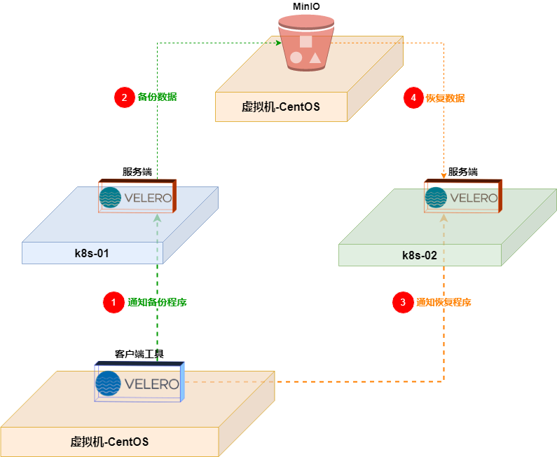

# 快速入门

## 为什么要给Kubernetes做灾备？

> kubernetes 容器治理平台，它能够保证应用程序的稳定运行，前是它还要依赖一个能够提供稳定运行的基础设施层，如果基础设施层因为一些不可抗力因素导致损坏，那么后果是无法弥补的，所以，面临这样的问题，我们要考虑如何解决这样的隐患。

## Velero是什么？

> Velero是一个**开源的Kubernetes`备份`和`恢复`工具**，最初由`Heptio`开发。 Velero旨在提供一种简单且可靠的方法来备份和恢复Kubernetes资源和卷，并且可以**跨不同的Kubernetes集群进行`移植`**。 在`2018`年，`Heptio` `被VMware收购`，Velero也随之成为了VMware的一部分。 Velero仍然是一个开源项目，并且在VMware的支持下，持续不断地发展和推广。 VMware继续支持和推广Velero项目，并为其提供基础设施和资源，以便更好地满足用户的需求，并扩展其功能和生态系统。

## 一、安装部署

> 以下内容是在一台`独立的虚拟机`中进行部署客户端工具，通过远程控制来管理多个k8s集群。

### 1\. 接入k8s环境

#### 安装 kubectl

- ```shell
    cat > /etc/yum.repos.d/kubernetes.repo << ERIC
    [kubernetes]
    name=Kubernetes
    baseurl=http://mirrors.aliyun.com/kubernetes/yum/repos/kubernetes-el7-x86_64
    enabled=1
    gpgcheck=0
    repo_gpgcheck=0
    gpgkey=http://mirrors.aliyun.com/kubernetes/yum/doc/yum-key.gpg
         http://mirrors.aliyun.com/kubernetes/yum/doc/rpm-package-key.gpg
    ERIC
    
    
    yum install -y kubectl-1.24.0
    ```
    

#### 生成集群配置文件

> 获取远程kubernetes的`./kube/conf`文件

- ```shell
    ./generate-kube-config.sh \
      k8s_01=192.168.101.54 \
      k8s_02=192.168.101.58
      && source /etc/profile
    EOF
    
    source /etc/profile
    
    
    ## 查看信息
    kubectl config get-contexts
    
    CURRENT   NAME     CLUSTER   AUTHINFO   NAMESPACE
    *         k8s_01   k8s_01    k8s_01
            k8s_02   k8s_02    k8s_02
    
    ```
    

### 2\. 部署 Minio

#### 编写配置文件

- ```shell
    cat > docker-compose.yaml << ERIC
    version: '3.6'
    
    services:
    
    minio:
      image: docker.io/bitnami/minio:2023
      container_name: minio
      ports:
        # 服务端-端口
        - 9000:9000
        # 客户端-端口
        - 9001:9001
      environment:
        # 客户端用户名、密码，密码长度最少8位数
        MINIO_ROOT_USER: minio-root
        MINIO_ROOT_PASSWORD: 12345678
        # 创建一个默认桶 velero-bucket
        MINIO_DEFAULT_BUCKETS: velero-bucket
      volumes:
        - ./config/minio_data:/data
    
    ERIC
    
    mkdir -pm 777 config/minio_data/
    docker-compose up -d
    
    ```
    

#### 查看信息

- ```shell
    [root@centos-01 (10:59:57) /data/siyu.mao/minio]
    └─# docker-compose exec minio mc admin info local
    
    ●  localhost:9000
     Uptime: 24 seconds
     Version: 2023-03-24T21:41:23Z
     Network: 1/1 OK
     Drives: 1/1 OK
     Pool: 1
    
    Pools:
     1st, Erasure sets: 1, Drives per erasure set: 1
    
    1 drive online, 0 drives offline
    
    
    
    
    ## 查看所在服务器IP地址
    [root@centos-01 (10:59:57) /data/siyu.mao/minio]
    └─# ip a show ens192 | grep inet
      inet 192.168.101.62/22 brd 192.168.103.255 scope global noprefixroute ens192
    
    ```
    

### 3\. 安装-Velero

#### 安装-Velero终端工具

[下载地址](https://github.com/vmware-tanzu/velero/releases/tag/v1.10.2)

- ```shell
    wget https://github.com/vmware-tanzu/velero/releases/download/v1.10.2/velero-v1.10.2-linux-amd64.tar.gz
    
    ## 解压
    tar -zxvf velero-v1.10.2-linux-amd64.tar.gz
    
    ## 查看文件
    [root@centos-01 (16:56:50) /data/siyu.mao/velero]
    └─# tree velero-v1.10.2-linux-amd64
    velero-v1.10.2-linux-amd64
    ├── examples
    │   ├── minio
    │   │   └── 00-minio-deployment.yaml  # 在k8s中安装 MinIO
    │   ├── nginx-app                     # 应该是测试用的
    │   │   ├── base.yaml
    │   │   ├── README.md
    │   │   └── with-pv.yaml
    │   └── README.md
    ├── LICENSE
    └── velero                            # 二进制客户端工具
    
    
    ## 加入全局
    cp velero-v1.10.2-linux-amd64/velero /usr/local/bin/
    
    ```
    

#### 部署-Velero服务端

创建连接s3凭证(我们使用`s3`的协议链接`MinIO`)

- ```shell
    ## 通过使用Web界面创建令牌 【Create access key】
    http://192.168.101.62:9001/access-keys
    
    
    
    ## 添加令牌配置文件
    cat > credentials-velero  << ERIC
    [default]
    aws_access_key_id = uWF9ApiM0EsvtJWs
    aws_secret_access_key = uz0niHFcLZVTq0sz9uy9f3gm02n7ecq3
    ERIC
    
    ```
    
- ```shell
    ## 开始部署
    
    ## 在k8s中部署【Velero】并使用外部的【MinIO】做为它的文件存储
    #velero -n velero-ns install \
    #    --provider aws \
    #    --plugins velero/velero-plugin-for-aws:v1.1.0 \
    #    --bucket velero-bucket \                            # 存储桶的名称
    #    --secret-file ./credentials-velero \                # 访问MinIO服务端的令牌
    #    --use-volume-snapshots=false \
    #    --backup-location-config region=minio,s3ForcePathStyle="true",s3Url=http://192.168.101.62:9000
    
    velero -n velero-ns install \
      --provider aws \
      --plugins velero/velero-plugin-for-aws:v1.1.0 \
      --bucket velero-bucket \
      --secret-file ./credentials-velero \
      --use-volume-snapshots=false \
      --backup-location-config region=minio,s3ForcePathStyle="true",s3Url=http://192.168.101.62:9000
    
    
    
    
    ## 成功后输出信息
    ......
    Namespace/velero-ns: attempting to create resource
    Namespace/velero-ns: attempting to create resource client
    Namespace/velero-ns: already exists, proceeding
    Namespace/velero-ns: created
    ClusterRoleBinding/velero-velero-ns: attempting to create resource
    ClusterRoleBinding/velero-velero-ns: attempting to create resource client
    ClusterRoleBinding/velero-velero-ns: created
    ServiceAccount/velero: attempting to create resource
    ServiceAccount/velero: attempting to create resource client
    ServiceAccount/velero: created
    Secret/cloud-credentials: attempting to create resource
    Secret/cloud-credentials: attempting to create resource client
    Secret/cloud-credentials: created
    BackupStorageLocation/default: attempting to create resource
    BackupStorageLocation/default: attempting to create resource client
    BackupStorageLocation/default: created
    Deployment/velero: attempting to create resource
    Deployment/velero: attempting to create resource client
    Deployment/velero: created
    Velero is installed! ⛵ Use 'kubectl logs deployment/velero -n velero-ns' to view the status.
    
    ```
    

查看k8s中的信息

- ```shell
    [root@centos-01 (11:16:22) /data/siyu.mao/velero]
    └─# kubectl -n velero-ns get all
    
    NAME                          READY   STATUS    RESTARTS   AGE
    pod/velero-5d97d687d4-fjvqx   1/1     Running   0          4m41s
    
    NAME                     READY   UP-TO-DATE   AVAILABLE   AGE
    deployment.apps/velero   1/1     1            1           4m41s
    
    NAME                                DESIRED   CURRENT   READY   AGE
    replicaset.apps/velero-5d97d687d4   1         1         1       4m41s
    
    
    ## 确认【Velero】能够链接到【MinIO】
    [root@centos-01 (11:16:22) /data/siyu.mao/velero]
    └─# velero -n velero-ns backup-location get
    
    NAME      PROVIDER   BUCKET/PREFIX   PHASE       LAST VALIDATED                  ACCESS MODE   DEFAULT
    default   aws        velero-bucket   Available   2023-04-06 13:37:11 +0800 CST   ReadWrite     true
    
    
    
    ```
    

#### 卸载-Velero服务端

- ```shell
    [root@centos-01 (11:16:22) /data/siyu.mao/velero]
    └─# velero -n velero-ns uninstall velero
    
    
    ## 成功后会输出如下信息
    You are about to uninstall Velero.
    Are you sure you want to continue (Y/N)? Y
    Waiting for velero namespace "velero-ns" to be deleted
    .................................................................
    Velero namespace "velero-ns" deleted
    Velero uninstalled ⛵
    
    ```
    

* * *

* * *

* * *

# 用户指南

## 工作原理

[](http://qiniu.dev-share.top/image/velero-01.png)

## 一、备份

### 创建测试程序

- ```shell
    kubectl create ns app-ns
    
    kubectl -n app-ns create deployment nginx-app --image=nginx:1.21.1 --port=80
    
    kubectl -n app-ns expose deployment nginx-app --port=80 --target-port=80
    
    
    ## 查看程序运行信息
    [root@centos-01 (14:01:53) /data/siyu.mao/velero]
    └─# kubectl -n app-ns get all
    
    NAME                             READY   STATUS    RESTARTS   AGE
    pod/nginx-app-7ffcb9dfc4-bqgtn   1/1     Running   0          78s
    
    NAME                TYPE        CLUSTER-IP   EXTERNAL-IP   PORT(S)   AGE
    service/nginx-app   ClusterIP   10.96.9.77   <none>        80/TCP    66s
    
    NAME                        READY   UP-TO-DATE   AVAILABLE   AGE
    deployment.apps/nginx-app   1/1     1            1           78s
    
    NAME                                   DESIRED   CURRENT   READY   AGE
    replicaset.apps/nginx-app-7ffcb9dfc4   1         1         1       78s
    
    ```
    

### 创建备份

- > 备份`app-ns`命名空间下的所有应用程序 备份名称为:`app-ns-backup`
    
- ```shell
    ## 开始备份
    velero -n velero-ns backup create app-ns-backup \
    --include-namespaces app-ns
    
    
    ## 成功的提示信息
    Backup request "app-ns-backup" submitted successfully.
    Run `velero backup describe app-ns-backup` or `velero backup logs app-ns-backup` for more details.
    
    ```
    

### 查看备份

- ```shell
    velero -n velero-ns backup describe app-ns-backup
    
    
    ## 成功的提示信息
    Name:         app-ns-backup
    Namespace:    velero-ns
    Labels:       velero.io/storage-location=default
    Annotations:  velero.io/source-cluster-k8s-gitversion=v1.24.0
                velero.io/source-cluster-k8s-major-version=1
                velero.io/source-cluster-k8s-minor-version=24
    
    Phase:  Completed
    
    Errors:    0
    Warnings:  0
    
    Namespaces:
    Included:  app-ns
    Excluded:  <none>
    
    Resources:
    Included:        *
    Excluded:        <none>
    Cluster-scoped:  auto
    
    Label selector:  <none>
    
    Storage Location:  default
    
    Velero-Native Snapshot PVs:  auto
    
    TTL:  720h0m0s
    
    CSISnapshotTimeout:  10m0s
    
    Hooks:  <none>
    
    Backup Format Version:  1.1.0
    
    Started:    2023-04-06 14:03:24 +0800 CST
    Completed:  2023-04-06 14:03:46 +0800 CST
    
    Expiration:  2023-05-06 14:03:24 +0800 CST
    
    Total items to be backed up:  16
    Items backed up:              16
    
    Velero-Native Snapshots: <none included>
    
    ```
    

### 删除备份

- ```shell
    velero -n velero-ns backup delete app-ns-backup
    
    ## 提示信息
    Are you sure you want to continue (Y/N)? Y
    Request to delete backup "app-ns-backup" submitted successfully.
    The backup will be fully deleted after all associated data (disk snapshots, backup files, restores) are removed.
    
    ```
    

## 二、恢复

### 删除测试程序

- ```shell
    [root@centos-01 (14:05:21) /data/siyu.mao/velero]
    └─# kubectl delete ns app-ns
    namespace "app-ns" deleted
    
    
    ## 查看
    [root@centos-01 (14:07:19) /data/siyu.mao/velero]
    └─# kubectl -n app-ns get all
    No resources found in app-ns namespace.
    
    ```
    

### 恢复程序

- ```shell
    [root@centos-01 (14:09:07) /data/siyu.mao/velero]
    └─# velero -n velero-ns restore create --from-backup app-ns-backup --wait
    
    Restore request "app-ns-backup-20230406141003" submitted successfully.
    Waiting for restore to complete. You may safely press ctrl-c to stop waiting - your restore will continue in the background.
    
    Restore completed with status: Completed. You may check for more information using the commands `velero restore describe app-ns-backup-20230406141003` and `velero restore logs app-ns-backup-20230406141003`.
    ```
    

### 查看结果

- ```shell
    [root@centos-01 (14:10:04) /data/siyu.mao/velero]
    └─# kubectl -n app-ns get all
    
    NAME                             READY   STATUS    RESTARTS   AGE
    pod/nginx-app-7ffcb9dfc4-bqgtn   1/1     Running   0          46s
    
    NAME                TYPE        CLUSTER-IP     EXTERNAL-IP   PORT(S)   AGE
    service/nginx-app   ClusterIP   10.96.33.149   <none>        80/TCP    46s
    
    NAME                        READY   UP-TO-DATE   AVAILABLE   AGE
    deployment.apps/nginx-app   1/1     1            1           46s
    
    NAME                                   DESIRED   CURRENT   READY   AGE
    replicaset.apps/nginx-app-7ffcb9dfc4   1         1         1       46s
    
    ```
    

## 三、跨集群迁移

### 查看相关信息

- 查看集群信息
    
- ```shell
    [root@centos-01 (14:23:18) /data/siyu.mao/velero]
    └─# kubectl config get-contexts
    
    CURRENT   NAME     CLUSTER   AUTHINFO   NAMESPACE
    *         k8s_01   k8s_01    k8s_01
            k8s_02   k8s_02    k8s_02
    
    ```
    
- 查看`k8s_01`中的备份
    
- ```shell
    [root@centos-01 (14:23:22) /data/siyu.mao/velero]
    └─# kubectl -n velero-ns get backup
    
    NAME            AGE
    app-ns-backup   20m
    
    ```
    

### 切换到目标集群

- ```shell
    ## 切换集群
    [root@centos-01 (14:26:47) /data/siyu.mao/velero]
    └─# kubectl config use-context k8s_02
    Switched to context "k8s_02".
    
    
    [root@centos-01 (14:29:13) /data/siyu.mao/velero]
    └─# kubectl config get-contexts
    CURRENT   NAME     CLUSTER   AUTHINFO   NAMESPACE
            k8s_01   k8s_01    k8s_01
    *         k8s_02   k8s_02    k8s_02
    
    ```
    

### 部署-Velero服务端

- > - ##### 注意：
    >     
    >     1. 需要`重新申请`一个MinIO的`令牌`
    >     2. 要使用`同一个`MinIO的`存储桶`
    
- ```shell
    velero -n velero-ns install \
      --provider aws \
      --plugins velero/velero-plugin-for-aws:v1.1.0 \
      --bucket velero-bucket \
      --secret-file ./credentials-velero \
      --use-volume-snapshots=false \
      --backup-location-config region=minio,s3ForcePathStyle="true",s3Url=http://192.168.101.62:9000
    
    
    ## 使用同一个存储桶
    [root@centos-01 (14:58:45) /data/siyu.mao/velero]
    └─# velero -n velero-ns backup-location get
    NAME      PROVIDER   BUCKET/PREFIX   PHASE       LAST VALIDATED                  ACCESS MODE   DEFAULT
    default   aws        velero-bucket   Available   2023-04-06 15:01:38 +0800 CST   ReadWrite     true
    
    ```
    

### 查看结果

- ```shell
    [root@centos-01 (14:58:07) /data/siyu.mao/velero]
    └─# kubectl --context=k8s_02 -n app-ns get all
    
    NAME                             READY   STATUS    RESTARTS   AGE
    pod/nginx-app-7ffcb9dfc4-bqgtn   1/1     Running   0          4m47s
    
    NAME                TYPE        CLUSTER-IP    EXTERNAL-IP   PORT(S)   AGE
    service/nginx-app   ClusterIP   10.96.56.40   <none>        80/TCP    4m47s
    
    NAME                        READY   UP-TO-DATE   AVAILABLE   AGE
    deployment.apps/nginx-app   1/1     1            1           4m47s
    
    NAME                                   DESIRED   CURRENT   READY   AGE
    replicaset.apps/nginx-app-7ffcb9dfc4   1         1         1       4m47s
    
    ```
