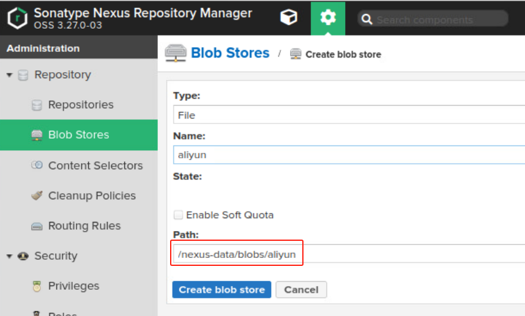
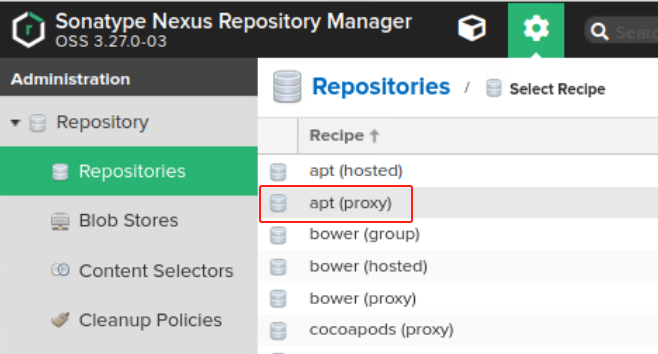
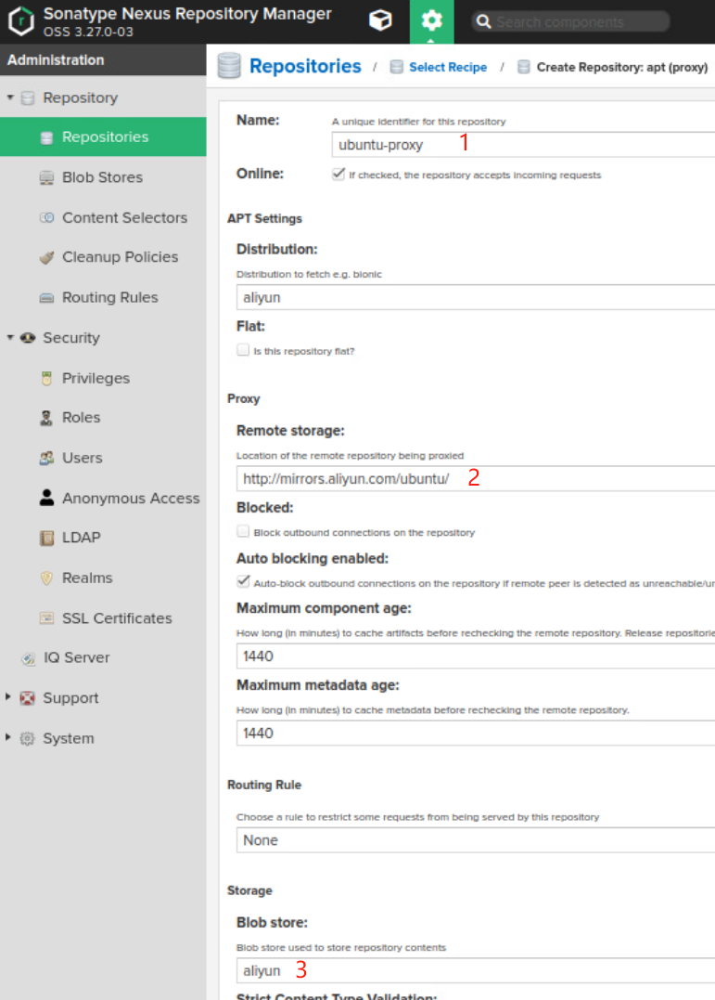
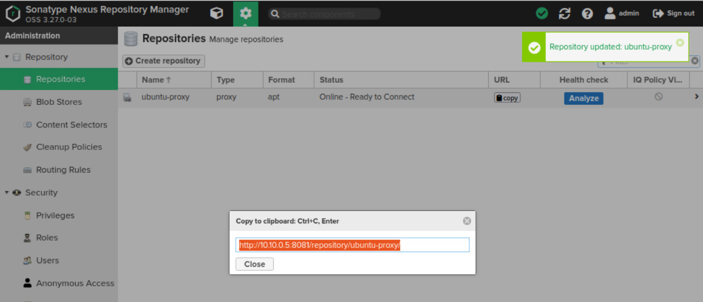
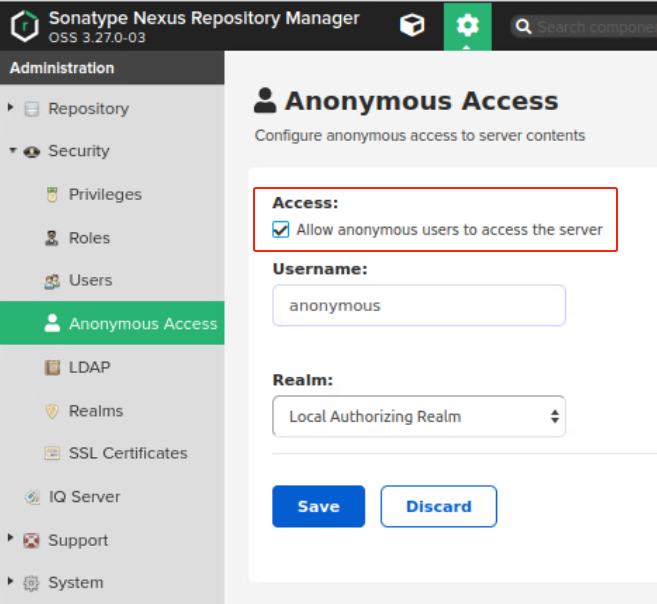

## 前置条件

### 阿里云 ubuntu 源

```ini
deb http://mirrors.aliyun.com/ubuntu/ focal main restricted universe multiverse
```

## 部署Nexus私服

```yaml
tee docker-compose.yaml << ERIC
version: '3.6'

services:

  nexus:
    image: sonatype/nexus3:3.27.0
    restart: always
    privileged: true
    user: root
    container_name: nexus
    ports:
      - 8081:8081
    volumes:
      # 容器与宿主机时间同步
      - /etc/localtime:/etc/localtime
      - ./nexus-data:/nexus-data
    environment:
      TIME_ZONE: Asia/Shanghai

ERIC
```

> ###### 访问 web页面
> 
> - URL: http://192.168.20.91:8081/
> - 账号：admin
> - 管理员密码在这个文件目录下 `./nexus-data/admin.password`

## 配置Nexus

### 创建 Blog Stores

- > 存储从远程服务器下载文件所指定的路径
    
- 
    

### 配置远程仓库代理

- 
- 
- 

### 为当前用户开启匿名访问

- 
    
- **`到此，Nexus配置完成`**
    

## 在操作系统中配置Nexus源

### 修改配置文件

- ```bash
    ## 备份是个好习惯
    sudo mv /etc/apt/sources.list /etc/apt/sources.list.bak
    
    ```
    
- ```bash
    ## 配置Nexus私服
    sudo tee /etc/apt/sources.list << ERIC
    
    # deb http://mirrors.aliyun.com/ubuntu/ focal main restricted universe multiverse
    # 将Nexus仓库地址替换为阿里云的仓库地址，后面的配置不变
    deb http://10.10.0.5:8081/repository/ubuntu-proxy/ focal main restricted universe multiverse
    
    ERIC
    
    ```
    

### 测试更新apt

- ```bash
    $ sudo apt update
    
    Hit:1 http://10.10.0.5:8081/repository/ubuntu-proxy focal InRelease
    Reading package lists... Done
    Building dependency tree... Done
    Reading state information... Done
    All packages are up to date.
    
    ```
