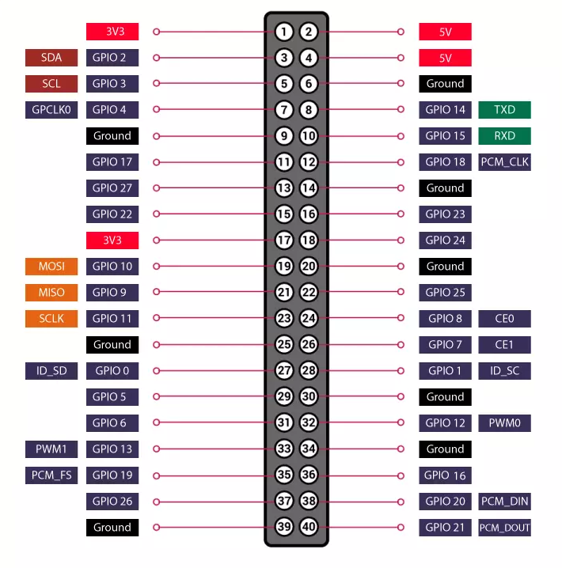

# 知识补充



> 每个传感器的接入都必须要有的两个引脚，分别是`正极引脚`和`负极引脚`
> 
> - `正极引脚`如图中的`3.3v`、`5v`
> - `负极引脚`如图中的`Ground`
> - 剩下的都是传感器的`信号引脚`
> 
> 我们编写代码时，要先给传感器`通电`，然后在从`使用的信号引脚`获取传感器数据。

* * *

* * *

# 准备环境

**[安装miniconda](%e5%ae%89%e8%a3%85miniconda "安装miniconda")**

## 创建环境

```bash
## 查看源
[siyu.mao@raspberrypi (17:20:23) ~]
└─$ conda config --show channels
channels:
  - defaults


## 配置源
[siyu.mao@raspberrypi (17:20:28) ~]
└─$ conda config --add channels https://mirrors.tuna.tsinghua.edu.cn/anaconda/pkgs/free/


## 查看源
[siyu.mao@raspberrypi (17:20:40) ~]
└─$ conda config --show channels
channels:
  - https://mirrors.tuna.tsinghua.edu.cn/anaconda/pkgs/free/
  - defaults


## 克隆环境
[siyu.mao@raspberrypi (15:36:48) ~]
└─$ conda create -n dh11 --clone base


## 激活环境
[siyu.mao@raspberrypi (21:21:33) ~]
└─$ conda activate dh11

(dh11) [siyu.mao@raspberrypi (21:21:42) ~]
└─$


## 确认pip是否安装在当前环境中
(dh11) [siyu.mao@raspberrypi (21:43:09) ~]
└─$ which pip
/home/siyu.mao/miniconda3/envs/dh11/bin/pip

```

## 安装mqtt客户端

```bash
(dh11) [siyu.mao@raspberrypi (21:30:08) ~]
└─$ pip install paho-mqtt

```

* * *

* * *

- **[温湿度传感器接](%e6%b8%a9%e6%b9%bf%e5%ba%a6%e4%bc%a0%e6%84%9f%e5%99%a8%e6%8e%a5%e5%85%a5 "温湿度传感器接")**
- **[倾斜传感器](%e5%80%be%e6%96%9c%e4%bc%a0%e6%84%9f%e5%99%a8%e6%8e%a5%e5%85%a5 "倾斜传感器")**
- **[激光头传感器](%e6%bf%80%e5%85%89%e5%a4%b4%e4%bc%a0%e6%84%9f%e5%99%a8%e6%8e%a5%e5%85%a5 "激光头传感器")**
