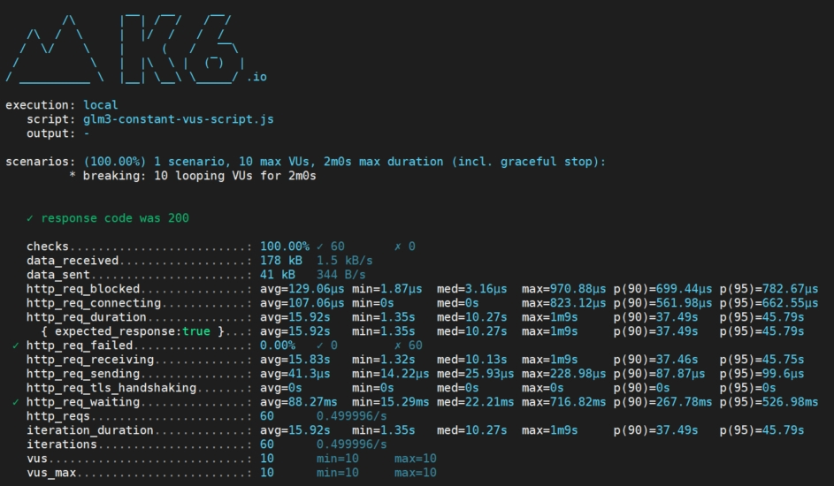

## [k6是什么？](https://k6.io/docs/#what-is-k6)

> Grafana k6 是一款开源负载测试工具，可以让工程团队轻松高效地进行性能测试。k6 是免费的、以开发人员为中心且可扩展的。 使用 k6，您可以测试系统的可靠性和性能，并尽早发现性能回归和问题。k6 将帮助您构建可扩展的弹性且高性能的应用程序。 [k6 由Grafana Labs](https://grafana.com/)和社区开发。

## Ubuntu 22.04安装

- 下载地址：https://github.com/grafana/k6/releases/tag/v0.47.0
    
- ```bash
    ## 下载离线包
    wget https://github.com/grafana/k6/releases/download/v0.47.0/k6-v0.47.0-linux-amd64.deb
    ## 或从七牛云下载
    wget http://qiniu.dev-share.top/file/k6-v0.47.0-linux-amd64.deb
    
    ## 安装
    sudo dpkg -i k6-v0.47.0-linux-amd64.deb
    
    ## 查看版本
    k6 version
    k6 v0.47.0 (commit/5ceb210056, go1.21.2, linux/amd64)
    
    ```
    

## 使用

- 编写javascript测试脚本
    
- ```javascript
    [cloud@test (13:19:50) /data/siyu.mao/k6]
    └─$ tee script.js << ERIC
    
    import http from 'k6/http';
    import { sleep } from 'k6';
    
    /**
    * 定义 VU 逻辑
    */
    export default function () {
    http.get('https://www.baidu.com/');
    sleep(1);
    }
    
    ERIC
    ```
    
- ```bash
    [cloud@test (13:19:50) /data/siyu.mao/k6]
    └─$ k6 run script.js
    
    
            /\      |‾‾| /‾‾/   /‾‾/
       /\  /  \     |  |/  /   /  /
      /  \/    \    |     (   /   ‾‾\
     /          \   |  |\  \ |  (‾)  |
    / __________ \  |__| \__\ \_____/ .io
    
    execution: local
       script: script.js
       output: -
    
    scenarios: (100.00%) 1 scenario, 1 max VUs, 10m30s max duration (incl. graceful stop):
             * default: 1 iterations for each of 1 VUs (maxDuration: 10m0s, gracefulStop: 30s)
    
       # 已接收数据量
       data_received..................: 6.7 kB 6.0 kB/s                                                                    # 在测试过程中从服务器接收的总数据量
       # 已发送数据量
       data_sent......................: 517 B  462 B/s                                                                     # 在测试过程中向服务器发送的总数据量
       # HTTP请求阻塞时间
       http_req_blocked...............: avg=95.66ms  min=95.66ms  med=95.66ms  max=95.66ms  p(90)=95.66ms  p(95)=95.66ms   # 发起请求前在阻塞状态等待空闲TCP连接插槽的时间
       # HTTP请求连接时间
       http_req_connecting............: avg=20.79ms  min=20.79ms  med=20.79ms  max=20.79ms  p(90)=20.79ms  p(95)=20.79ms   # 建立TCP连接到远程主机所花费的时间
       # HTTP请求持续时间（即总延迟）
       http_req_duration..............: avg=22.38ms  min=22.38ms  med=22.38ms  max=22.38ms  p(90)=22.38ms  p(95)=22.38ms   # 请求的总时间，包括发送数据、等待响应和接收响应的时间
         # 期望响应时间
         { expected_response:true }...: avg=22.38ms  min=22.38ms  med=22.38ms  max=22.38ms  p(90)=22.38ms  p(95)=22.38ms   # 期望响应为true的HTTP请求的平均持续时间
       # 失败请求总数
       http_req_failed................: 0.00%  ✓ 0        ✗ 1                                                              # 根据setResponseCallback定义的失败请求的比率
       # HTTP请求接收时间
       http_req_receiving.............: avg=154.38µs min=154.38µs med=154.38µs max=154.38µs p(90)=154.38µs p(95)=154.38µs  # 从远程主机接收响应数据所花费的时间
       # HTTP请求发送时间
       http_req_sending...............: avg=196.41µs min=196.41µs med=196.41µs max=196.41µs p(90)=196.41µs p(95)=196.41µs  # 将数据发送到远程主机所花费的时间
       # HTTP请求TLS握手时间
       http_req_tls_handshaking.......: avg=54.12ms  min=54.12ms  med=54.12ms  max=54.12ms  p(90)=54.12ms  p(95)=54.12ms   # 与远程主机进行TLS会话握手所花费的时间
       # HTTP请求等待时间
       http_req_waiting...............: avg=22.03ms  min=22.03ms  med=22.03ms  max=22.03ms  p(90)=22.03ms  p(95)=22.03ms   # 等待远程主机响应的时间，也称为“首字节时间”或“TTFB”
       # 总HTTP请求数
       http_reqs......................: 1      0.893821/s                                                                  # k6生成的总HTTP请求数
       # 迭代持续时间
       iteration_duration.............: avg=1.11s    min=1.11s    med=1.11s    max=1.11s    p(90)=1.11s    p(95)=1.11s     # 完成一个完整迭代所需的时间，包括在设置和拆卸中花费的时间
       # 迭代次数
       iterations.....................: 1      0.893821/s                                                                  # VUs执行JS脚本（默认函数）的总次数
    
       # 虚拟用户数
       vus............................: 1      min=1      max=1                                                            # 当前活动虚拟用户的数量
       # 最大虚拟用户数
       vus_max........................: 1      min=1      max=1                                                            # 虚拟用户资源的最大可能数量
    
    
    # 运行状态
    # 含义：测试的运行状态，包括已运行时间、当前/总VUs和已完成/中断的迭代数
    running (00m01.1s), 0/1 VUs, 1 complete and 0 interrupted iterations
    default ✓ [======================================] 1 VUs  00m01.1s/10m0s  1/1 iters, 1 per VU
    
    ```
    

## 进阶

### 编写脚本

```javascript
[cloud@test (13:19:50) /data/siyu.mao/k6]
└─$ tee script.js << ERIC

import http from 'k6/http';
import { sleep } from 'k6';

/**
 * 定义 VU 逻辑
 */
export default function () {
  http.get('https://www.baidu.com/');
  sleep(1);
}

ERIC

```

#### k6可选的压测模型

| 名称 | 值 | 描述 |
| :-- | :-- | :-- |
| 共享迭代[Shared iterations](https://k6.io/docs/using-k6/scenarios/executors/shared-iterations) | shared-iterations | `一定数量`的迭代在多个虚拟用户之间共享。 |
| 每个虚拟用户迭代[Per VU iterations](https://k6.io/docs/using-k6/scenarios/executors/per-vu-iterations) | per-vu-iterations | 每个虚拟用户执行`精确数量`的迭代。 |
| 固定虚拟用户数[Constant VUs](https://k6.io/docs/using-k6/scenarios/executors/constant-vus) | constant-vus | `固定数量`的虚拟用户在指定的时间内执行`尽可能`多的迭代。 |
| 逐步增加虚拟用户数[Ramping VUs](https://k6.io/docs/using-k6/scenarios/executors/ramping-vus) | ramping-vus | `可变数量`的虚拟用户在指定的时间内执行`尽可能`多的迭代。 |
| 固定到达率[Constant Arrival Rate](https://k6.io/docs/using-k6/scenarios/executors/constant-arrival-rate) | constant-arrival-rate | 在指定的时间段内执行`固定数量`的迭代。 |
| 逐步增加到达率[Ramping Arrival Rate](https://k6.io/docs/using-k6/scenarios/executors/ramping-arrival-rate) | ramping-arrival-rate | 在指定的时间段内执行`可变数量`的迭代。 |
| 外部控制[Externally Controlled](https://k6.io/docs/using-k6/scenarios/executors/externally-controlled) | externally-controlled | 通过k6的REST API或CLI在运行时控制和扩展执行。 |

> **执行器（Executors）** 控制着 k6 如何安排虚拟用户（VUs）和迭代。你选择的执行器取决于你测试的目标以及你想要模拟的流量类型。 在场景对象的 `executor` 键中定义执行器。值是由-字符分隔的执行器名称。

* * *

# 固定虚拟用户数`constant-vus-script.js`

> 以下示例安排 10 个 VU，持续时间为 2分钟。

```javascript
// 导入必要的模块
import { check } from "k6";
import http from "k6/http";

// Params.timeout 将影响等待服务器在 SSE 连接上发送事件的最长时间。
let sseTimeout = '2m';
// 所以这里将压测的持续时间与Timeout时间相等，因为SSE是长连接，如果timeout设置过短会中断链接
let duration = sseTimeout;

/**
 * 配置 k6 执行参数
 */
export const options = {
  // 设置阈值，最后做check的时候会用到
  thresholds: {
    // 设置HTTP等待服务器响应的时间的阈值：95%的请求应在3秒以内完成响应
    http_req_waiting: ['p(95)<3000'],

    // 设置HTTP请求失败的阈值：错误率应小于1%
    http_req_failed: ['rate<0.01'],
  },
  // 定义场景
  scenarios: {
    // 定义名为“breaking”的场景
    breaking: {
      executor: 'constant-vus',
      vus: 10, // 设置虚拟用户数
      duration: duration, // 设置压测持续时间
      gracefulStop: '0s', // 设置优雅退出时间
    },
  },
};


/**
 * 定义 VU 逻辑
 */
export default function () {
  // 定义URL和请求体
  let url = 'http://10.10.0.2:7861/chat/knowledge_base_chat';
  let randomIndex = Math.floor(Math.random() * questions.length);

  // 通过随机索引获取随机问题
  let randomQuestion = questions[randomIndex];
  let payload = JSON.stringify({
        "query": randomQuestion,
        "knowledge_base_name": "sectest",
        "top_k": 3,
        "score_threshold": 1,
        "history": [
            {
                "role": "user",
                "content": "我们来玩成语接龙，我先来，生龙活虎"
            },
            {
                "role": "assistant",
                "content": "虎头虎脑"
            }
        ],
        "stream": true,
        "model_name": "chatglm3-6b-32k",
        "temperature": 0.7,
        "prompt_name": "knowledge_base_chat",
        "local_doc_url": false
    });
  let params = {
    headers: {
      "accept": "application/json",
      "Content-Type": "application/json",
    },
    timeout: sseTimeout
  };

  // 发送POST请求并将响应保存为变量
  let res = http.post(url, payload, params);

  // 检查响应状态码是否为200
  check(res, {
    "response code was 200": (res) => res.status == 200,
  });
}


const questions = [
    "你认为未来的交通系统会如何改变我们的生活？",
    "如何保护环境并减少碳排放？",
    "人工智能在医疗领域有哪些潜在应用？",
    "请分享一下你最喜欢的文学作品，并解释为什么喜欢它。",
    "有哪些有效的时间管理策略可以提高生产力？",
    "你如何看待社交媒体对社会交往的影响？",
    "在科技行业，未来五年内可能会涌现哪些新的趋势？",
    "你认为全球变暖对冰川和极地地区的影响会如何？",
    "请分享一下你最喜欢的旅行目的地以及为什么喜欢那里。",
    "你认为教育系统需要做出哪些改革以适应未来的需求？",
    "人工智能是否会取代部分人类工作？如果是，哪些职业受到最大影响？",
    "请描述一下你对人类探索外太空的看法。",
    "如何有效管理金融风险并保障个人资产？",
    "你对社交媒体中的隐私问题有什么看法？",
    "未来的城市规划应该考虑哪些可持续发展的因素？",
    "请分享一个你认为可以改善社会的创新性解决方案。",
    "你认为人工智能在艺术和创意领域有哪些潜在应用？",
    "在医疗保健方面，远程医疗诊断和治疗的未来如何？",
    "你对全球贸易关系的未来趋势有何看法？",
    "请分享一种你最喜欢的美食，并解释为什么喜欢它。",
    "How do you think the future transportation system will change our lives?",
    "How can we protect the environment and reduce carbon emissions?",
    "What are the potential applications of artificial intelligence in the field of healthcare?",
    "Can you share your favorite literary work and explain why you like it?",
    "What are some effective time management strategies to improve productivity?",
    "How do you view the impact of social media on social interactions?",
    "What new trends do you anticipate in the technology industry in the next five years?",
    "How do you think global warming will affect glaciers and polar regions?",
    "Can you share your favorite travel destination and why you like it?",
    "What reforms do you think the education system needs to adapt to future demands?",
    "Will artificial intelligence replace some human jobs, and if so, which professions will be most affected?",
    "What are your thoughts on human exploration of outer space?",
    "How can one effectively manage financial risks and protect personal assets?",
    "What are your views on privacy issues on social media?",
    "What sustainable development factors should be considered in future urban planning?",
    "Can you share an innovative solution you think could improve society?",
    "What are the potential applications of artificial intelligence in the arts and creative fields?",
    "What does the future hold for telemedicine in terms of diagnosis and treatment in healthcare?",
    "What are your views on the future trends in global trade relationships?",
    "Can you share your favorite cuisine and explain why you like it?"
];

```

#### 开始测试



* * *

# 逐步增加虚拟用户数`ramping-vus-script.js`

```javascript
// 导入必要的模块
import { check } from "k6";
import http from "k6/http";


/**
 * 配置 k6 执行参数
 */
export const options = {
  // 设置阈值，最后做check的时候会用到
  thresholds: {
    // 设置HTTP请求持续时间的阈值：95%的请求应在200毫秒以下
    http_req_duration: ['p(95)<200'],

    // 设置HTTP请求失败的阈值：错误率应小于1%
    http_req_failed: ['rate<0.01'],
  },
  // 定义场景
  scenarios: {
    // 定义名为“breaking”的场景
    breaking: {
      // 使用“ramping-vus”执行器，逐步增加虚拟用户数
      // 可选参数：如下图表
      executor: "ramping-vus",
      // 在“breaking”场景中，设置了不同阶段的持续时间和目标虚拟用户数。
      stages: [
        // 第一个阶段：持续10秒，目标虚拟用户数为20
        { duration: "10s", target: 20 },

        // 第二个阶段：持续50秒，目标虚拟用户数仍为20
        { duration: "50s", target: 20 },

        // 第三个阶段：在 10 秒内减少到 0 虚拟用户
        { duration: '10s', target: 0 },
      ],
    },
  },
};


/**
 * 定义 VU 逻辑
 */
export default function () {
  // 定义URL和请求体
  const url = "https://test-api.k6.io/auth/basic/login/";
  const payload = JSON.stringify({
    username: "test_case",
    password: "1234",
  });
  const params = {
    headers: {
      "accept": "application/json",
      "Content-Type": "application/json",
    },
  };

  // 发送POST请求并将响应保存为变量
  const res = http.post(url, payload, params);

  // 检查响应状态码是否为200
  check(res, {
    "response code was 200": (res) => res.status == 200,
  });
}

```

# 使用`xk6-dashboard`

### docker-compose.yaml

```yaml
ted docker-compose.yaml > ERIC

version: '3.6'
services:
  xk6-dashboard:
    image: cnagent/xk6-dashboard:0.6.1
    command: run --out=dashboard /scripts/script.js
    volumes:
      - "./scripts:/scripts"
    ports:
      - "5665:5665"
    stdin_open: true
    tty: true
    restart: unless-stopped

ERIC

```
