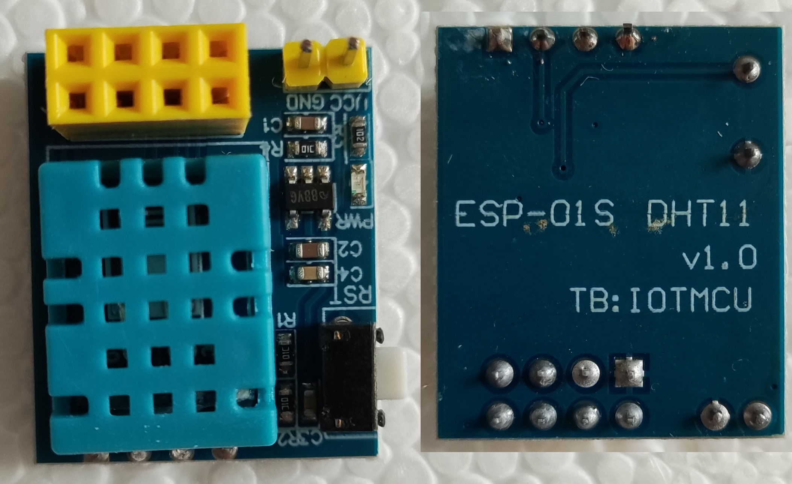
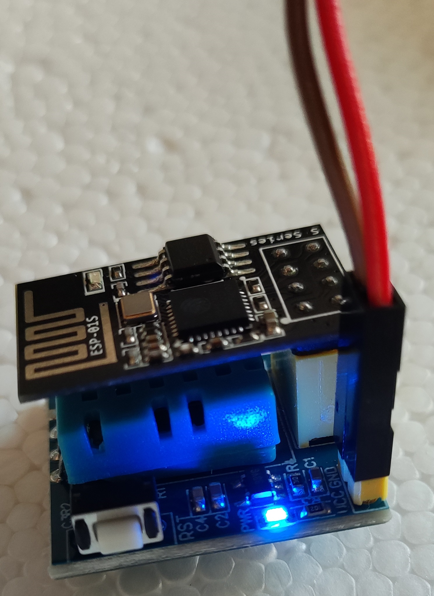
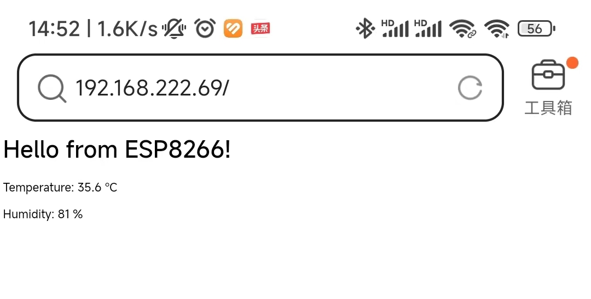
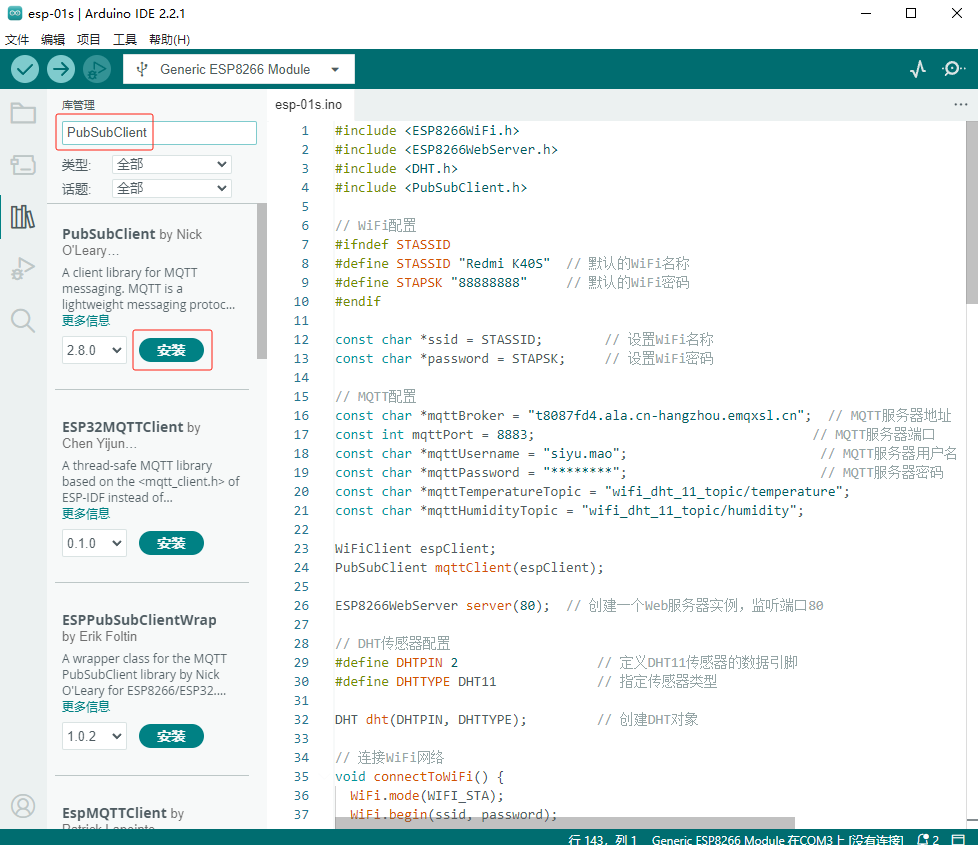

# WIFI温湿度传感器接入

## [要掌握的知识](esp8266-%e5%9b%ba%e4%bb%b6%e5%bc%80%e5%8f%91 "要掌握的知识")

* * *

## 硬件准备

- 支持WIFI的 **`温湿度传感器`** `WIFI-DHT11`
    
    - 
- 烧录器
    
    - 
- ESP8266 WIFI模块。
    
    - 

### 步骤

1. 首先编写程序，有2个功能要实现
    
    - 其一：使用代码能`连接WIFI`
    - 其二：使用代码获取`温湿度数据`
2. 通过烧录器将程序烧录到`WIFI`模块
3. 组合`WIFI-DHT11`模块与`WIFI`模块后，`WIFI`模块中的代码可以从`WIFI-DHT11`模块拉取数据
4. 为模块供电
5. 连网查看信息

### 编写代码并上传到模块

```cpp
#include <ESP8266WiFi.h>
#include <DHT.h>
#include <ESP8266WebServer.h>

// -----------------01. 连接WiFi------------------------------------------

// WiFi配置
const char *ssid = "Redmi K40S";    // 设置WiFi名称
const char *password = "88888888";  // 设置WiFi密码

// 连接WiFi网络
void connectToWiFi() {
  WiFi.mode(WIFI_STA);
  WiFi.begin(ssid, password);

  // 等待WiFi连接成功
  while (WiFi.status() != WL_CONNECTED) {
    delay(500);
    Serial.print(".");
  }

  Serial.println("");
  Serial.print("    连接到: ");
  Serial.println(ssid);
  Serial.print("    IP地址: ");
  Serial.println(WiFi.localIP());
}

// -----------------02. 配置传感器-----------------------------------------

// DHT传感器配置
#define DHTPIN 2           // 定义DHT11传感器的数据引脚
#define DHTTYPE DHT11      // 指定传感器类型
DHT dht(DHTPIN, DHTTYPE);  // 创建DHT对象

// -----------------03. 创建Web服务器--------------------------------------

// 创建一个Web服务器实例，监听端口80
ESP8266WebServer server(80);

// 处理根路径的GET请求，读取DHT传感器数据并发布到MQTT
void handleRoot() {
  // 生成HTML响应
  String html = "<!DOCTYPE html>                                                                                   "
                "<html>                                                                                            "
                "<head>                                                                                            "
                "  <meta charset='UTF-8'>                                                                          "
                "</head>                                                                                           "
                "<body>                                                                                            "
                "  <h1>Hello from ESP8266!</h1>                                                                    "
                "  <!-- 添加一个空的div用于放置温湿度数据 -->                                                         "
                "  <div id='data-container'></div>                                                                 "
                "  <!-- 添加JavaScript代码, 每秒自动更新数据 -->                                                     "
                "  <script>                                                                                        "
                "    function updateData() {                                                                       "
                "      var container = document.getElementById('data-container');                                  "
                "      fetch('/data')                                                                              "
                "        .then(response => response.json())                                                        "
                "        .then(data => {                                                                           "
                "          container.innerHTML = '<p>Temperature: <span>' + data.temperature + ' ℃</span></p>' +  "
                "                                '<p>Humidity: <span>' + data.humidity + ' %</span></p>';          "
                "        })                                                                                        "
                "        .catch(error => {                                                                         "
                "          container.innerHTML = '<p style=\"color: red;\"> Error fetching data:'             "
                "                                    + error +                                                     "
                "                                '</p>'                                                            "
                "        });                                                                                       "
                "    }                                                                                             "
                "    setInterval(updateData, 1000);  // 每1秒更新一次数据                                            "
                "  </script>                                                                                       "
                "</body>                                                                                           "
                "</html>";

  server.send(200, "text/html", html);
}

// 处理数据路径的GET请求，返回DHT传感器数据的JSON响应
void handleData() {
  float humidity = dht.readHumidity();
  float temperature = dht.readTemperature();

  String jsonData = "{\"temperature\":" + String(temperature) + ",\"humidity\":" + String(humidity) + "}";
  server.send(200, "application/json", jsonData);
}

// -------------------------------------------------------------

// 初始化设置
void setup() {
  // 连接串口
  Serial.begin(115200);

  // 01. 连接WIFI
  connectToWiFi();

  // 02. 启动DHT传感器
  dht.begin();

  // 03. 创建Web服务器
  // 处理根路径的GET请求，调用handleRoot函数
  server.on("/", HTTP_GET, handleRoot);
  // 处理数据路径的GET请求，调用handleData函数
  server.on("/data", HTTP_GET, handleData);
  // 启动Web服务器
  server.begin();
}

// 循环处理Web服务器的客户端请求和MQTT消息
void loop() {
  server.handleClient();
}

```

### 模块组合供电



### 查看实时数据



* * *

* * *

* * *

# 将数据上传到MQTT服务器

1. 安装MQTT客户端`库`
    
    - 
2. 编写代码

\`\`\` cpp #include <ESP8266WiFi.h> #include <DHT.h> #include <ESP8266WebServer.h> #include <PubSubClient.h>

<pre><code>// -----------------01. 连接WiFi------------------------------------------

// WiFi配置 const char \*ssid = "Redmi K40S"; // 设置WiFi名称 const char \*password = "88888888"; // 设置WiFi密码

// 连接WiFi网络 void connectToWiFi() { WiFi.mode(WIFI\_STA); WiFi.begin(ssid, password);

// 等待WiFi连接成功 while (WiFi.status() != WL\_CONNECTED) { delay(500); Serial.print("."); }

Serial.println(""); Serial.print(" 连接到: "); Serial.println(ssid); Serial.print(" IP地址: "); Serial.println(WiFi.localIP()); }

// -----------------02. 配置传感器-----------------------------------------

// DHT传感器配置 #define DHTPIN 2 // 定义DHT11传感器的数据引脚 #define DHTTYPE DHT11 // 指定传感器类型 DHT dht(DHTPIN, DHTTYPE); // 创建DHT对象

// -----------------03. 创建Web服务器--------------------------------------

// 创建一个Web服务器实例，监听端口80 ESP8266WebServer server(80);

// 处理根路径的GET请求，读取DHT传感器数据并发布到MQTT void handleRoot() { // 生成HTML响应 String html = "<!DOCTYPE html> " "<html> " "<head> " " <meta charset='UTF-8'> " "</head> " "<body> " " <h1>Hello from ESP8266!</h1> " " <!-- 添加一个空的div用于放置温湿度数据 --> " " <div id='data-container'></div> " " <!-- 添加JavaScript代码, 每秒自动更新数据 --> " " <script> " " function updateData() { " " var container = document.getElementById('data-container'); " " fetch('/data') " " .then(response => response.json()) " " .then(data => { " " container.innerHTML = '<p>Temperature: <span>' + data.temperature + ' ℃</span></p>' + " " '<p>Humidity: <span>' + data.humidity + ' %</span></p>'; " " }) " " .catch(error => { " " container.innerHTML = '<p style=\\"color: red;\\"> Error fetching data:' " " + error + " " '</p>' " " }); " " } " " setInterval(updateData, 30000); // 每30秒更新一次数据 " " </script> " "</body> " "</html>";

server.send(200, "text/html", html); }

// 处理数据路径的GET请求，返回DHT传感器数据的JSON响应 void handleData() { float humidity = dht.readHumidity(); float temperature = dht.readTemperature();

String jsonData = "{\\"temperature\\":" + String(temperature) + ",\\"humidity\\":" + String(humidity) + "}"; server.send(200, "application/json", jsonData); }

// -----------------04. 配置MQTT服务器-------------------------------------

// MQTT配置 const char \*mqttBroker = "broker.emqx.io"; // MQTT服务器地址 const int mqttPort = 1883; // MQTT服务器端口 const char \*mqttTemperatureTopic = "wifi\_dht\_11\_topic/temperature"; const char \*mqttHumidityTopic = "wifi\_dht\_11\_topic/humidity";

// 初始化MQTT的WIFI客户端 WiFiClient client; PubSubClient mqttClient(client);

// 连接到MQTT服务器 void connectToMQTT() { mqttClient.setServer(mqttBroker, mqttPort);

// 生成一个唯一的客户端ID，例如使用ESP8266的芯片ID String clientId = "ESP8266Client-" + String(ESP.getChipId());

// 循环等待MQTT连接成功 while (!mqttClient.connected()) { Serial.println("正在尝试连接MQTT服务器...");

// 尝试连接MQTT，使用生成的唯一客户端ID if (mqttClient.connect(clientId.c\_str())) { Serial.println(" 已连接到MQTT服务器"); } else { Serial.print("失败, rc= " + mqttClient.state()); // #define MQTT\_CONNECTION\_TIMEOUT -4 // #define MQTT\_CONNECTION\_LOST -3 // #define MQTT\_CONNECT\_FAILED -2 // #define MQTT\_DISCONNECTED -1 // #define MQTT\_CONNECTED 0 // #define MQTT\_CONNECT\_BAD\_PROTOCOL 1 // #define MQTT\_CONNECT\_BAD\_CLIENT\_ID 2 // #define MQTT\_CONNECT\_UNAVAILABLE 3 // #define MQTT\_CONNECT\_BAD\_CREDENTIALS 4 // #define MQTT\_CONNECT\_UNAUTHORIZED 5 Serial.println(" \[5秒\]后重新连接"); delay(5000); } } }

// -------------------------------------------------------------

// 初始化设置 void setup() { // 连接串口 Serial.begin(115200);

// 01. 连接WIFI connectToWiFi();

// 02. 启动DHT传感器 dht.begin();

// 03. 创建Web服务器 // 处理根路径的GET请求，调用handleRoot函数 server.on("/", HTTP\_GET, handleRoot); // 处理数据路径的GET请求，调用handleData函数 server.on("/data", HTTP\_GET, handleData); // 启动Web服务器 server.begin();

// 04. 连接EMQX服务器 connectToMQTT(); }

// 循环处理Web服务器的客户端请求和MQTT消息 void loop() {

// 获取温湿度数据 String tempString = String(dht.readHumidity()); String humString = String(dht.readTemperature());

// 发布温湿度数据到MQTT mqttClient.publish(mqttTemperatureTopic, tempString.c\_str()); mqttClient.publish(mqttHumidityTopic, humString.c\_str());

server.handleClient(); mqttClient.loop();

// 每隔5秒再执行 delay(5000); }

\`\`\` \[!\[\](http://qiniu.dev-share.top/iot/WIFI-DHT11-dev-04.png)\](http://qiniu.dev-share.top/iot/WIFI-DHT11-dev-04.png)

> 在模块内使用`MQTT`推送数据，是有缺点的。 1. 开发的`Web`服务器端会非常非常的卡，基本上是无法正常使用 2. 也不建议直接推送到`MQTT`服务器端，这样不好维护也不好监控 3. 推荐加一个中间服务器如：树莓派做为`WiFi`模块的统一管理
