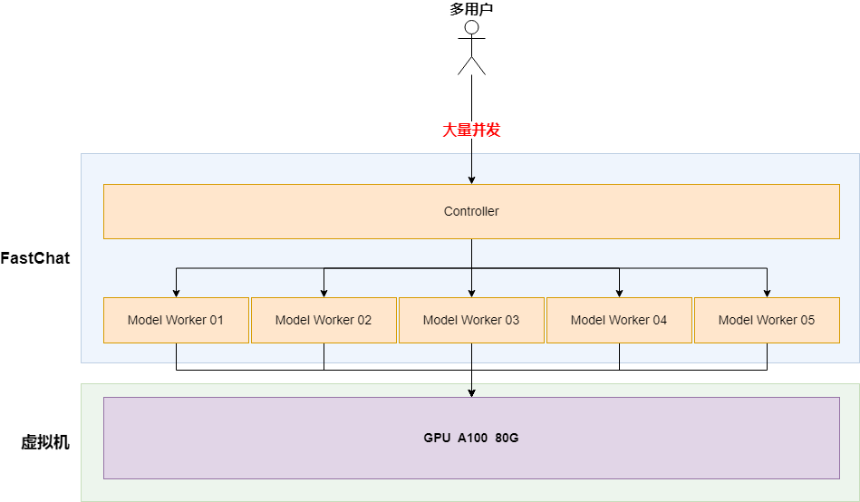
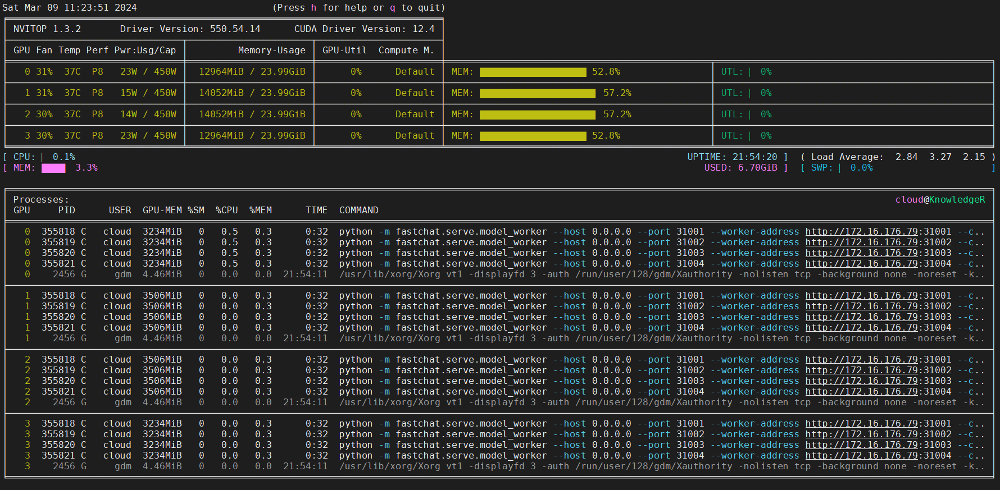
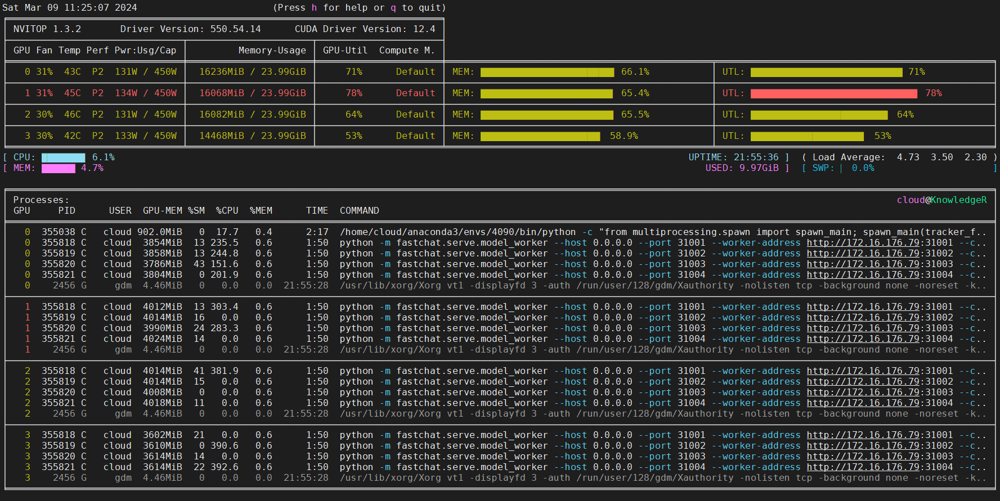
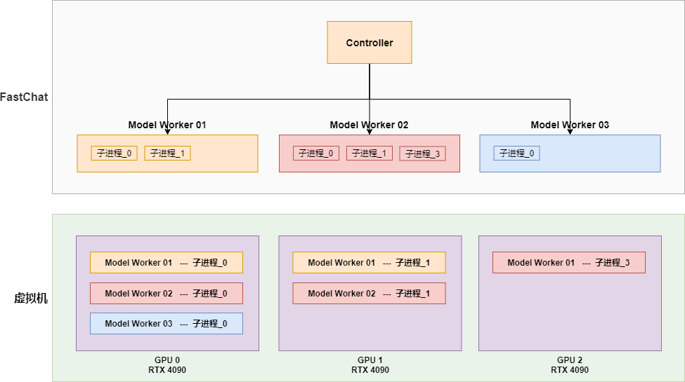
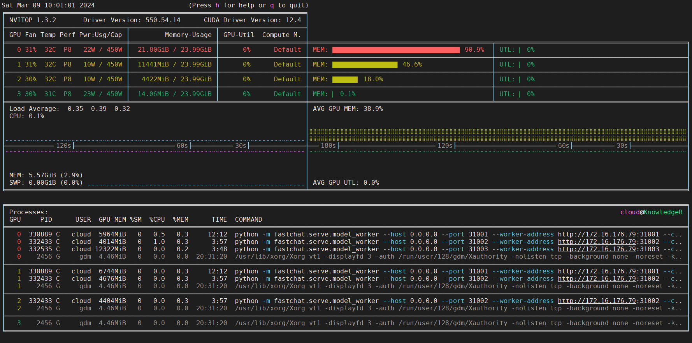

# FastChat 架构图


# 环境准备

```bash
conda create -n fastchat python==3.10 -y

conda activate fastchat
```

# 下载

```bash
git clone https://github.com/lm-sys/FastChat.git
cd FastChat

## 进入conda环境
(fastchat) [cloud@New-test1 (12:50:25) /mnt/data/siyu.mao/FastChat]
└─$


## 初始化安装包
(fastchat) [cloud@New-test1 (12:50:49) /mnt/data/siyu.mao/FastChat]
└─$ pip install -i http://mirrors.aliyun.com/pypi/simple/ --trusted-host mirrors.aliyun.com -e ".[model_worker,webui]"


## 确认环境
(fastchat) [cloud@New-test1 (13:05:30) /mnt/data/siyu.mao/FastChat]
└─$ python -V
Python 3.10.0

(fastchat) [cloud@New-test1 (13:07:19) /mnt/data/siyu.mao/FastChat]
└─$ pip -V
pip 23.3 from /home/cloud/miniconda3/envs/fastchat/lib/python3.10/site-packages/pip (python 3.10)

(fastchat) [cloud@New-test1 (13:07:22) /mnt/data/siyu.mao/FastChat]
└─$ which pip
/home/cloud/miniconda3/envs/fastchat/bin/pip

```

### 说明

#### 启动`Model Worker`接入大模型命令

> 可以同时加载一个大模型来实现并发 还可以同时加载不同的大模型

```bash
# worker 0
CUDA_VISIBLE_DEVICES=0
python -m fastchat.serve.model_worker \
        --model-path lmsys/vicuna-7b-v1.5 \
        --controller http://localhost:21001 \
        --worker http://localhost:31000 \
        --host 0.0.0.0 \
        --port 31000

# worker 1
CUDA_VISIBLE_DEVICES=1
python -m fastchat.serve.model_worker \
        --model-path lmsys/fastchat-t5-3b-v1.0 \
        --controller http://localhost:21001 \
        --worker http://localhost:31001 \
        --host 0.0.0.0 \
        --port 31001

```

- `CUDA_VISIBLE_DEVICES=0`：
    
    - 指定此模型工作器使用的 GPU 设备（索引为 0）。
- `python3 -m fastchat.serve.model_worker`：
    
    - 运行 FastChat `model_worker`模块。
- `--model-path lmsys/vicuna-7b-v1.5`：
    
    - 指定要加载的预训练模型的路径。
- `--controller http://localhost:21001`：
    
    - 指定了控制器的 URL，用于管理和协调模型工作器。控制器负责在注册的模型工作器之间分发传入的请求。
- `--port 31000`：
    
    - 指定此`model_worker`可访问的端口。
- `--worker http://localhost:31000`：
    
    - 指定此`model_worker`的 URL，**控制器将使用它与其通信**。
- `--limit-worker-concurrency`：
    
    - 用于限制模型工作者（worker）的并发请求数。
        
    - 这个参数通常用于控制系统的负载，防止一次性过多的请求导致性能下降或系统不稳定。
        
    - > 具体来说，这个参数限制一个`model_worker`同时处理的请求数量。 例如，如果设置 `--limit-worker-concurrency 5`，则每个`model_worker`最多同时处理 5 个请求。 如果有更多的请求到达，它们将排队等待`model_worker`的空闲。 这样的限制可以确保系统不会因为并发请求过多而过载，同时允许对请求进行适当的排队和处理。 根据系统的负载和性能要求，你可以根据实际情况调整这个参数的值。
        

# 测试

#### 1\. 加载大模型要先启动`controller`

```bash
(fastchat) [cloud@New-test1 (13:33:24) /mnt/data/siyu.mao/FastChat]
└─$ python -m fastchat.serve.controller --host 0.0.0.0 --port 21001
2023-11-13 13:33:39 | INFO | controller | args: Namespace(host='0.0.0.0', port=21001, dispatch_method='shortest_queue', ssl=False)
2023-11-13 13:33:39 | ERROR | stderr | INFO:     Started server process [6872]
2023-11-13 13:33:39 | ERROR | stderr | INFO:     Waiting for application startup.
2023-11-13 13:33:39 | ERROR | stderr | INFO:     Application startup complete.
2023-11-13 13:33:39 | ERROR | stderr | INFO:     Uvicorn running on http://0.0.0.0:21001 (Press CTRL+C to quit)


# 上面的ERROR目前看来是正常的，不影响使用
```

#### 2\. 加载本地`chatglm2-6b-32k`大模型（这里可以同时启动多个`moder_worker`）

```bash
(fastchat) [cloud@New-test1 (13:13:14) /mnt/data/siyu.mao/FastChat]
└─$ CUDA_VISIBLE_DEVICES=0 \
python -m fastchat.serve.model_worker \
        --model-path /mnt/data/LLM/THUDM/chatglm2-6b-32k \
        --controller http://127.0.0.1:21001 \
        --worker http://127.0.0.1:31000 \
        --host 0.0.0.0 \
        --port 31000 \
        --limit-worker-concurrency 5


2023-11-13 13:37:08 | INFO | model_worker | args: Namespace(host='0.0.0.0', port=31000, worker_address='http://127.0.0.1:31000', controller_address='http://127.0.0.1:21001', model_path='/mnt/data/LLM/THUDM/chatglm2-6b-32k', revision='main', device='cuda', gpus=None, num_gpus=1, max_gpu_memory=None, dtype=None, load_8bit=False, cpu_offloading=False, gptq_ckpt=None, gptq_wbits=16, gptq_groupsize=-1, gptq_act_order=False, awq_ckpt=None, awq_wbits=16, awq_groupsize=-1, enable_exllama=False, exllama_max_seq_len=4096, exllama_gpu_split=None, enable_xft=False, xft_max_seq_len=4096, xft_dtype=None, model_names=None, conv_template=None, embed_in_truncate=False, limit_worker_concurrency=5, stream_interval=2, no_register=False, seed=None, debug=False)
2023-11-13 13:37:08 | INFO | model_worker | Loading the model ['chatglm2-6b-32k'] on worker 8f3e0ff0 ...
Loading checkpoint shards:   0%|                                                                                                                                         | 0/7 [00:00<?, ?it/s]
Loading checkpoint shards:  14%|██████████████████▍                                                                                                              | 1/7 [00:00<00:05,  1.00it/s]
Loading checkpoint shards:  29%|████████████████████████████████████▊                                                                                            | 2/7 [00:02<00:05,  1.06s/it]
Loading checkpoint shards:  43%|███████████████████████████████████████████████████████▎                                                                         | 3/7 [00:03<00:04,  1.06s/it]
Loading checkpoint shards:  57%|█████████████████████████████████████████████████████████████████████████▋                                                       | 4/7 [00:04<00:03,  1.02s/it]
Loading checkpoint shards:  71%|████████████████████████████████████████████████████████████████████████████████████████████▏                                    | 5/7 [00:05<00:02,  1.04s/it]
Loading checkpoint shards:  86%|██████████████████████████████████████████████████████████████████████████████████████████████████████████████▌                  | 6/7 [00:06<00:01,  1.04s/it]
Loading checkpoint shards: 100%|█████████████████████████████████████████████████████████████████████████████████████████████████████████████████████████████████| 7/7 [00:06<00:00,  1.10it/s]
Loading checkpoint shards: 100%|█████████████████████████████████████████████████████████████████████████████████████████████████████████████████████████████████| 7/7 [00:06<00:00,  1.02it/s]
2023-11-13 13:37:15 | ERROR | stderr |
2023-11-13 13:37:17 | INFO | model_worker | Register to controller
2023-11-13 13:37:18 | ERROR | stderr | INFO:     Started server process [7150]
2023-11-13 13:37:18 | ERROR | stderr | INFO:     Waiting for application startup.
2023-11-13 13:37:18 | ERROR | stderr | INFO:     Application startup complete.
2023-11-13 13:37:18 | ERROR | stderr | INFO:     Uvicorn running on http://0.0.0.0:31000 (Press CTRL+C to quit)

```

### 3\. 启动`Web Server`

```bash
(fastchat) [cloud@New-test1 (13:26:46) /mnt/data/siyu.mao/FastChat]
└─$ python -m fastchat.serve.openai_api_server --host 0.0.0.0
INFO:     Started server process [6843]
INFO:     Waiting for application startup.
INFO:     Application startup complete.
INFO:     Uvicorn running on http://0.0.0.0:8000 (Press CTRL+C to quit)

```

### 4\. 测试模型是否加载成功

```bash
(fastchat) [cloud@New-test1 (13:42:24) /mnt/data/siyu.mao/FastChat]
└─$ python -m fastchat.serve.test_message --model-name chatglm2-6b-32k
Models: ['chatglm2-6b-32k']
worker_addr: http://127.0.0.1:31000
问: Tell me a story with more than 1000 words.
答: Once upon a time, in a land far, far away, there was a kingdom that was ruled by a wise and just king. The king was loved by

```

### 5\. 测试REST接口

```bash
curl -X 'POST' \
  'http://10.10.0.2:8000/api/v1/chat/completions' \
  -H 'accept: application/json' \
  -H 'Content-Type: application/json' \
  -d '{
  "model": "chatglm2-6b-32k",
  "messages": "请用中文回答，你是谁？",
  "temperature": 0.7,
  "top_p": 1,
  "top_k": 3,
  "n": 1,
  "max_tokens": 2000,
  "stop": [
    "string"
  ],
  "stream": true,
  "user": "FaWaiKuangTu_ZhangSan",
  "repetition_penalty": 1,
  "frequency_penalty": 0,
  "presence_penalty": 0
}'


data: {"id": "chatcmpl-SyrzgPsb9AofeZ2PiEFUQZ", "model": "chatglm2-6b-32k", "choices": [{"index": 0, "delta": {"role": "assistant"}, "finish_reason": null}]}

data: {"id": "chatcmpl-SyrzgPsb9AofeZ2PiEFUQZ", "model": "chatglm2-6b-32k", "choices": [{"index": 0, "delta": {"content": "我是"}, "finish_reason": null}]}

data: {"id": "chatcmpl-SyrzgPsb9AofeZ2PiEFUQZ", "model": "chatglm2-6b-32k", "choices": [{"index": 0, "delta": {"content": "人工智能"}, "finish_reason": null}]}

data: {"id": "chatcmpl-SyrzgPsb9AofeZ2PiEFUQZ", "model": "chatglm2-6b-32k", "choices": [{"index": 0, "delta": {"content": "助手"}, "finish_reason": null}]}

data: {"id": "chatcmpl-SyrzgPsb9AofeZ2PiEFUQZ", "model": "chatglm2-6b-32k", "choices": [{"index": 0, "delta": {"content": "。"}, "finish_reason": null}]}

data: {"id": "chatcmpl-SyrzgPsb9AofeZ2PiEFUQZ", "model": "chatglm2-6b-32k", "choices": [{"index": 0, "delta": {"content": "请问"}, "finish_reason": null}]}

data: {"id": "chatcmpl-SyrzgPsb9AofeZ2PiEFUQZ", "model": "chatglm2-6b-32k", "choices": [{"index": 0, "delta": {"content": "有什么"}, "finish_reason": null}]}

data: {"id": "chatcmpl-SyrzgPsb9AofeZ2PiEFUQZ", "model": "chatglm2-6b-32k", "choices": [{"index": 0, "delta": {"content": "问题"}, "finish_reason": null}]}

data: {"id": "chatcmpl-SyrzgPsb9AofeZ2PiEFUQZ", "model": "chatglm2-6b-32k", "choices": [{"index": 0, "delta": {"content": "我可以"}, "finish_reason": null}]}

data: {"id": "chatcmpl-SyrzgPsb9AofeZ2PiEFUQZ", "model": "chatglm2-6b-32k", "choices": [{"index": 0, "delta": {"content": "帮"}, "finish_reason": null}]}

data: {"id": "chatcmpl-SyrzgPsb9AofeZ2PiEFUQZ", "model": "chatglm2-6b-32k", "choices": [{"index": 0, "delta": {"content": "您"}, "finish_reason": null}]}

data: {"id": "chatcmpl-SyrzgPsb9AofeZ2PiEFUQZ", "model": "chatglm2-6b-32k", "choices": [{"index": 0, "delta": {"content": "解答"}, "finish_reason": null}]}

data: {"id": "chatcmpl-SyrzgPsb9AofeZ2PiEFUQZ", "model": "chatglm2-6b-32k", "choices": [{"index": 0, "delta": {"content": "吗"}, "finish_reason": null}]}

data: {"id": "chatcmpl-SyrzgPsb9AofeZ2PiEFUQZ", "model": "chatglm2-6b-32k", "choices": [{"index": 0, "delta": {"content": "？"}, "finish_reason": null}]}

data: {"id": "chatcmpl-SyrzgPsb9AofeZ2PiEFUQZ", "object": "chat.completion.chunk", "created": 1699854349, "model": "chatglm2-6b-32k", "choices": [{"index": 0, "delta": {}, "finish_reason": "stop"}]}

data: [DONE]

```

# 性能优化

## 多model\_worker策略




* * *

* * *

* * *

# 一机多卡配置方法

## 配置

## 启动Model Worker代码

**参数说明**

```
python -m fastchat.serve.model_worker \
        --host 0.0.0.0 \                                   # Model Worker服务的主机地址
        --port 31001 \                                     # Model Worker服务的端口号
        --worker-address http://172.16.176.79:31001 \      # Model Worker地址，用于与控制器通信
        --controller-address http://172.16.176.79:20001 \  # 控制器地址，用于与控制器通信
        --model-path /data/LLM/THUDM/chatglm3-6b-32k \     # 模型文件路径
        --device cuda \                                    # 使用的设备类型（CUDA）
        --gpus 0,1,2,3 \                                   # 指定 GPU 的索引；由于 CUDA 限制，必须包括主机上的所有 GPU
        --num-gpus 4 \                                     # FastChat 启动的 Model Worker 子进程数量；子进程使用 GPU 资源
        --max-gpu-memory 24GiB \                           # 每个 GPU 的最大内存限制
        --limit-worker-concurrency 5 \                     # 限制并发处理的工作数量
        --stream-interval 2                                # 推理间隔时间（毫秒）
```

```bash
# 启动 Model Worker 01
python -m fastchat.serve.model_worker \
        --host 0.0.0.0 \
        --port 31001 \
        --worker-address http://172.16.176.79:31001 \
        --controller-address http://172.16.176.79:20001 \
        --model-path /data/LLM/THUDM/chatglm3-6b-32k \
        --device cuda \
        --gpus 0,1,2,3 \
        --num-gpus 4 \
        --max-gpu-memory 24GiB \
        --limit-worker-concurrency 5 \
        --stream-interval 1


# 启动 Model Worker 02
python -m fastchat.serve.model_worker \
        --host 0.0.0.0 \
        --port 31002 \
        --worker-address http://172.16.176.79:31002 \
        --controller-address http://172.16.176.79:20001 \
        --model-path /data/LLM/THUDM/chatglm3-6b-32k \
        --device cuda \
        --gpus 0,1,2,3 \
        --num-gpus 4 \
        --max-gpu-memory 24GiB \
        --limit-worker-concurrency 5 \
        --stream-interval 1


# 启动 Model Worker 03
python -m fastchat.serve.model_worker \
        --host 0.0.0.0 \
        --port 31003 \
        --worker-address http://172.16.176.79:31003 \
        --controller-address http://172.16.176.79:20001 \
        --model-path /data/LLM/THUDM/chatglm3-6b-32k \
        --device cuda \
        --gpus 0,1,2,3 \
        --num-gpus 4 \
        --max-gpu-memory 24GiB \
        --limit-worker-concurrency 5 \
        --stream-interval 1


# 启动 Model Worker 04
python -m fastchat.serve.model_worker \
        --host 0.0.0.0 \
        --port 31004 \
        --worker-address http://172.16.176.79:31004 \
        --controller-address http://172.16.176.79:20001 \
        --model-path /data/LLM/THUDM/chatglm3-6b-32k \
        --device cuda \
        --gpus 0,1,2,3 \
        --num-gpus 4 \
        --max-gpu-memory 24GiB \
        --limit-worker-concurrency 5 \
        --stream-interval 1

```

* * *

### 实际效果

[](http://qiniu.dev-share.top/image/multi_model_worker_01.png)

[](http://qiniu.dev-share.top/image/multi_model_worker_02.png) **在工作时会多出一个多进程管理程序，这是正常的** `/home/cloud/anaconda3/envs/4090/bin/python -c "from multiprocessing.spawn import spawn_main; spawn_main(tracker_fd=9, pipe_handle=18)" --multiprocessing-fork`

* * *

### 工作原理解析

> - FastChat 可以通过多卡并行处理，将显存需求分散到各个子进程中，以应对单卡显存不足的情况。
> - FastChat的`Model Worker`通过为子进程分配GPU资源来工作。在一机多卡的情况下，需要预先指定所有GPU的编号。然后，你可以设定`Model Worker`启动相应数量的子进程，以便高效地利用这些GPU资源。
> - 如果期望实现高可用性的负载均衡并最大化GPU利用率，你可以启动多个`Model Worker`服务。

[](http://qiniu.dev-share.top/image/multi_model_worker_03.png)

> - 在优化资源分配时，子进程的数量是可控的。为了达到最佳性能，建议将子进程的数量与GPU的数量保持一致。

[](http://qiniu.dev-share.top/image/multi_model_worker_04.png)

* * *

* * *

* * *

# 使用`Fastchat`运行`vLLM`

## 环境准备

```bash
## 下载源码
(vllm-0.2.2) [cloud@New-test1 (20:39:36) /mnt/data/siyu.mao]
└─$ wget https://github.com/lm-sys/FastChat/archive/refs/tags/v0.2.33.zip && unzip FastChat-0.2.33.zip && rm -rf FastChat-0.2.33.zip


(vllm-0.2.2) [cloud@New-test1 (20:39:36) /mnt/data/siyu.mao]
└─$ ll
total 16
drwxrwxr-x  4 cloud cloud 4096 11月 24 20:39 ./
drwxrwxrwx 18 root  root  4096 11月 17 14:39 ../
drwxrwxr-x 11 cloud cloud 4096 11月 22 17:23 FastChat-0.2.33/
drwxrwxr-x 10 cloud cloud 4096 11月 24 18:00 vllm-0.2.2/


## 本地构建安装
(vllm-0.2.2) [cloud@New-test1 (20:40:55) /mnt/data/siyu.mao/FastChat-0.2.33]
└─$ pip install -i http://172.16.21.146:8081/repository/pypi/simple --trusted-host 172.16.21.146 --timeout 0 -e ".[model_worker,webui]"


(vllm-0.2.2) [cloud@New-test1 (20:41:51) /mnt/data/siyu.mao]
└─$ pip list | grep fschat
fschat                    0.2.33       /mnt/data/siyu.mao/FastChat-0.2.33

```

## 尝试运行

```bash
## 启动 Controller
python -m fastchat.serve.controller --host 0.0.0.0 --port 21001


## 使用Fastchat启动vLLM
CUDA_VISIBLE_DEVICES=0
python -m fastchat.serve.vllm_worker \
       --model-path /mnt/data/LLM/THUDM/chatglm2-6b-32k \
       --port 31001 \
       --worker-address http://172.16.176.60:31001 \
       --controller-address http://172.16.176.60:20001 \
       --host 172.16.176.60 \
       --num-gpus 1 \
       --block-size 16 \
       --swap-space 4 \
       --gpu-memory-utilization 0.95 \
       --limit-worker-concurrency 300 \
       --max-num-seqs 512 \
       --max-paddings 256 \
       --disable-log-requests \
       --trust-remote-code

```

### 可选（一机多卡启动Worker）

> 要注意，如果你要注册的`controller`限定了主机地址，你就不能使用`127.0.0.1`进行注册

```bash
CUDA_VISIBLE_DEVICES=1 \
python -m fastchat.serve.vllm_worker \
       --model-path /mnt/data/LLM/THUDM/chatglm2-6b-32k \
       --port 31002 \
       --worker-address http://172.16.176.60:31002 \
       --controller-address http://172.16.176.60:20001 \
       --host 172.16.176.60 \
       --num-gpus 1 \
       --block-size 16 \
       --swap-space 4 \
       --gpu-memory-utilization 0.95 \
       --limit-worker-concurrency 300 \
       --max-num-seqs 512 \
       --max-paddings 256 \
       --disable-log-requests \
       --trust-remote-code

```

#### 测试模型运行

> 先修改一下Fastchat的bug，修改如下文件 fastchat/serve/vllm\_worker.py
> 
> ```python
>         sampling_params = SamplingParams(
>             n=1,
>             temperature=temperature,
>             top_p=top_p,
>             use_beam_search=use_beam_search,
> 
> # 修改这里
> #            stop=list(stop),
>             stop=[i for i in stop if i != ""],
> 
>             max_tokens=max_new_tokens,
>             top_k=top_k,
>             presence_penalty=presence_penalty,
>             frequency_penalty=frequency_penalty,
>             best_of=best_of,
>         )
> ```

```bash
python -m fastchat.serve.test_message --model-name chatglm2-6b-32k


Models: ['chatglm2-6b-32k']
worker_addr: http://127.0.0.1:31000
问: Tell me a story with more than 1000 words.
答: Once upon a time, in a land far, far away, there was a kingdom that was ruled by a wise and just king. The king was loved by


(vllm-0.2.2) [cloud@New-test1 (10:54:08) /mnt/data/0.2.7-Langchain-Chatchat]
└─$  python -m fastchat.serve.test_message --model-name chatglm2-6b-32k --message 你是谁？ --max-new-tokens 1000
Models: ['chatglm2-6b-32k']
worker_addr: http://127.0.0.1:31001
问: 你是谁？
答: 我是一个名为 ChatGLM2-6B 的人工智能助手，是基于清华大学 KEG 实验室和智谱 AI 公司于 2023 年共同训练的语言模型开发的。我的任务是针对用户的问题和要求提供适当的答复和支持。

```
