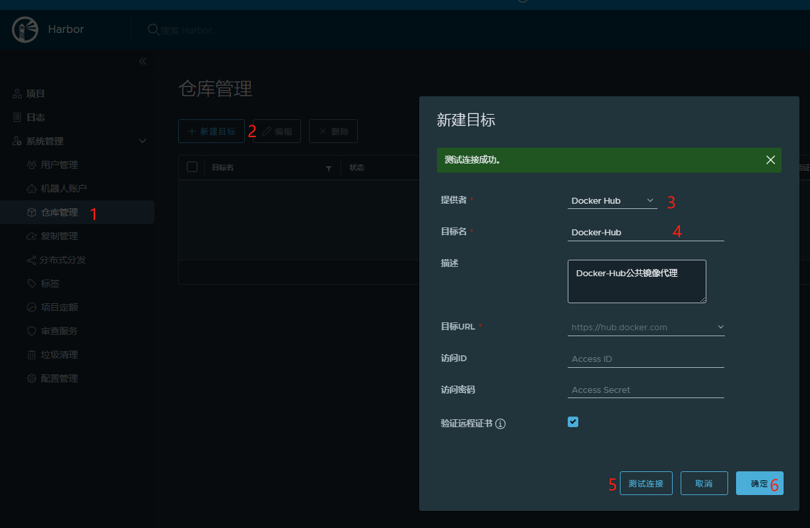
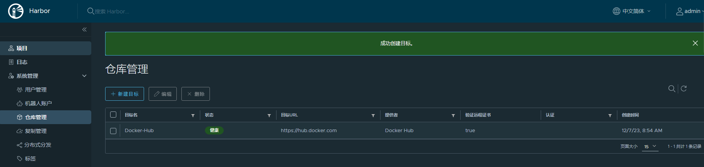
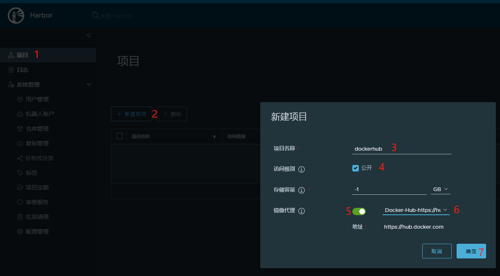
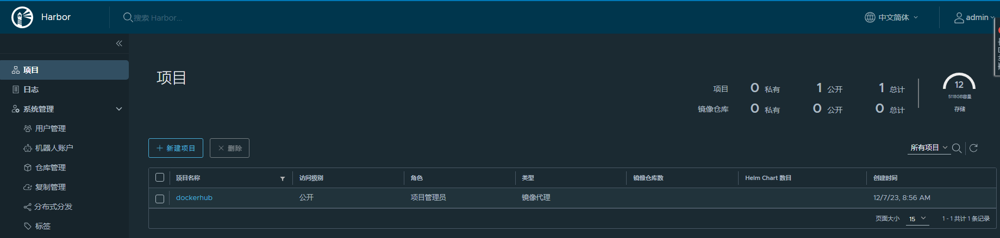

# 使用 Harbor 代理公共镜像

## 环境准备

- [安装部署Harbor](http://www.dev-share.top/2019/06/06/docker-compose-%e5%ae%89%e8%a3%85-goharbor/)

### 创建仓库

- > 亲测可用的目前是`Docker-hub`、`Github-GHCR`，这里以配置`Docker-hub`为例
    
- [](http://qiniu.dev-share.top/image/harbor-proxy-01.png)
    
- 查看结果
- [](http://qiniu.dev-share.top/image/harbor-proxy-02.png)

### 创建项目 `dockerhub`

- > 创建项目，开启镜像代理，选择已经创建的`Docker-hub`仓库
    
- [](http://qiniu.dev-share.top/image/harbor-proxy-03.png)
    
- 查看结果
- [](http://qiniu.dev-share.top/image/harbor-proxy-04.png)

## Docker客户端，使用代理服务

1. 配置服务器
    
    ```bash
    cat > /etc/docker/daemon.json << ERIC
    {
       "insecure-registries": ["http://172.16.21.146:8082"],
       "registry-mirrors": ["http://172.16.21.146:8082"]
    }
    ERIC
    
    systemctl daemon-reload && systemctl restart docker
    
    ```
    
2. 登录服务端
    
    ```bash
    docker login 172.16.21.146:8082
    ```
    
3. `关键点到了`，如何使用？
    
    ```bash
    # 从 Docker Hub 默认库下载，它的仓库名称叫做 library
    docker pull 172.16.21.146:8082/dockerhub/library/nginx:1.25-alpine
    
    # 从 Docker Hub 自己的库下载，我的仓库名称叫做 cnagent
    docker pull 172.16.21.146:8082/dockerhub/cnagent/xk6-dashboard:0.6.1
    
    # 从 Gitleb GHCR 默认库下载，它的仓库名称叫做 ghcr.io
    docker pull 172.16.21.146:8082/githubghcr/ghcr.io/grafana/xk6-dashboard:0.6.1
    ```
    

### [参考官方介绍](https://goharbor.io/docs/2.4.0/administration/configure-proxy-cache/ "参考官方介绍")
