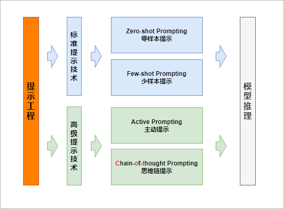
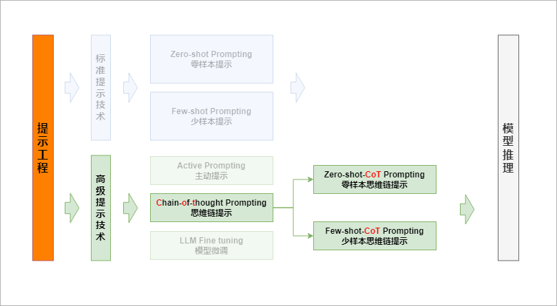
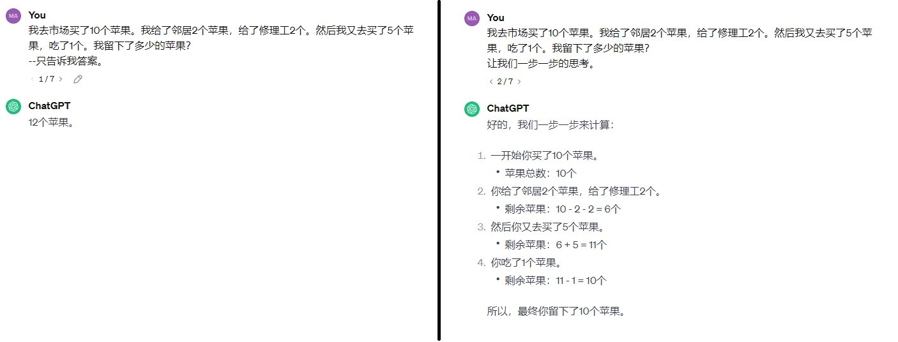
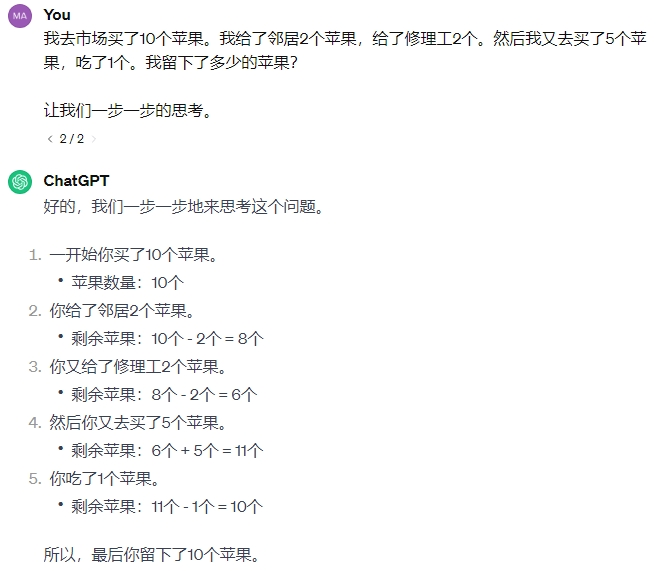
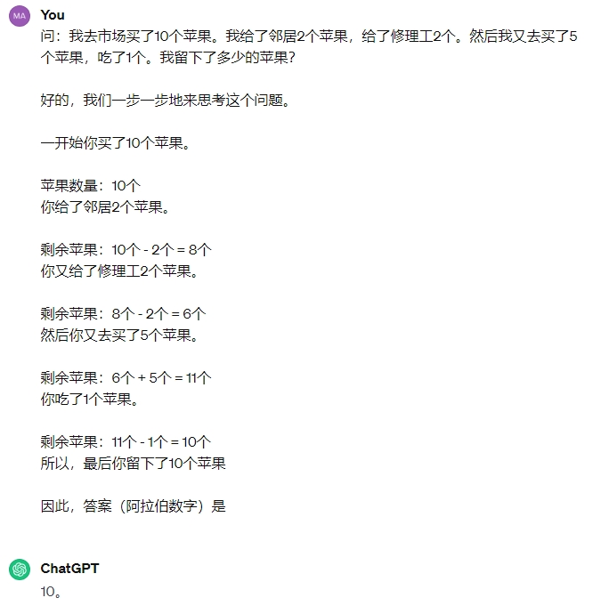
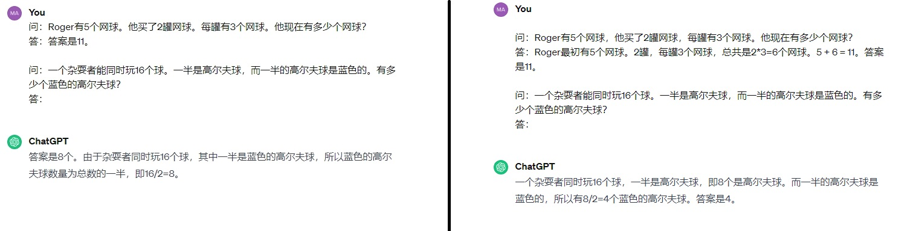
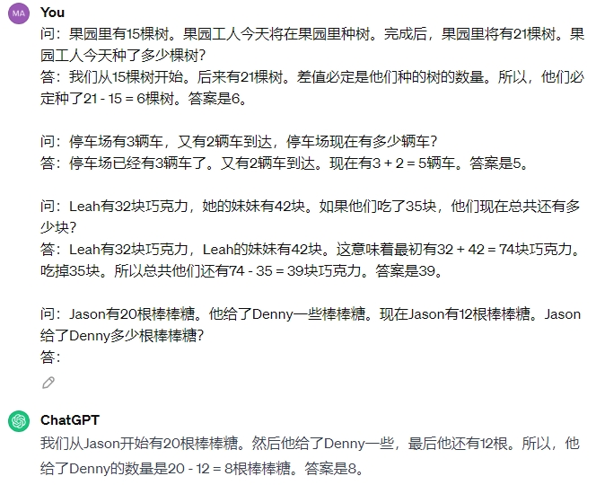

# 思维链提示综合指南-`CoT`

# 什么是提示工程？

> **提示工程是`编写结构良好且精心制作的提示`的实践**，这些提示可以通过生成式 AI 模型更好地解释。
> 
> - 提示告诉 LLM 要执行什么任务以及要生成什么样的输出。它可以包含`指令、上下文、输入数据和输出指示器`。
> - 使用提示工程，我们可以使用 LLM 来执行各种任务，从简单的问答到复杂的创意文本生成。
> - 它基于一个涌现属性，即上下文学习，允许 LLM 从提示中学习。提示工程提高了 LLM 在手头任务上的性能。如前所述，它使用`零样本`、`少样本`、`主动`和`CoT`提示。
> 
> 

### Zero-shot Prompting 零样本提示

- > 泛化：
    > 
    > - 模型的泛化能力指其对未见过数据的良好适应性，能够推广学到的知识而不仅限于训练数据。
    > - 泛化能力强的模型能够在各种情境中都表现良好，而不仅仅是在特定的训练数据上。
    > 
    > 过度拟合:
    > 
    > - 过度拟合是一个相反的概念，它指的是模型`过度适应训练数据`，而在`新数据上表现不佳`。
    > 
    > 总结：`泛化`就像是学习新东西后，能够在不同情境下灵活运用。而`过度拟合`则好比过于死记硬背，只在学习的那一套环境下表现好，到了新环境反而不行。有强泛化能力的模型就像是`灵活学习的好学生`，可以在各种情况下都表现出色。
    
- > Zero shot:
    > 
    > - Zero shot 就像是`一个学生`在`从未见过的考试中`能够凭借以前学到的一般性知识迅速作答，而不需要专门为这场考试进行特定的准备。它展示了模型具有推理和泛化到新任务的能力，无需针对特定任务进行额外的训练。就好比学生零准备、零提示，却能凭借自己的通用知识应对新的挑战一样。
    

### Few-shot Prompting 少样本提示

- > Few-shot Prompting:
    > 
    > - 少样本提示可以提供演示，以引导模型获得更好的性能。
    > - 除了提示之外，它还是一种为 LLM 提供所需输出的几个示例的技术。`这些示例有助于模型更好地理解任务`并生成更准确和信息丰富的响应。
    
- > - 我们应该**为模型提供`大量不同`的示例，而`不是多个类似`的示例**。它确保模型尽可能多地了解任务。
    > - 对于许多任务来说，标准的少样本提示是一种很好的技术，但对于复杂的推理任务来说并不可靠。因此，需要**更`高级`的`提示技术`，例如`思维链`、`主动提示`和`微调`**。
    

### Active Prompting 主动提示

- > FewActiveshot Prompting:
    
- > [主动提示](https://github.com/shizhediao/active-prompt)通过迭代向 LLM 提供有关其响应的反馈来提高 LLM 在复杂任务上的性能。这种反馈可以帮助 LLM 从错误中吸取教训，并产生更准确和信息丰富的回应。 它为 LLM 提供了提示和所需输出的几个示例。然后，LLM 生成响应。 **然后`由人工评估员评估`响应**，评估员向 LLM 提供有关响应的准确性和信息性的反馈。然后，LLM 使用此反馈来改进其响应生成能力。 这个过程不断重复，直到LLM能够生成足够准确和信息丰富的响应，以满足人类评估者的需求。
    

# 什么是思维链提示？

### Chain-of-Thought Prompting 思维链提示

- > Chain-of-Thought Prompting
    
- > - **[思维链](https://arxiv.org/pdf/2201.11903.pdf)提示是一种提示工程技术**，通过它，我们`强制 LLM 输出一系列中间步骤`，从而得出所需的答案。
    >     - 它提高了 LLM 的推理能力。这是有益的，因为它允许模型一次专注于解决一个步骤，而不必一次考虑整个问题。
    >     - 对于难以或不可能一步解决的复杂问题，它特别有用。
    >     - 它为模型的行为提供了一个可解释的窗口。我们可以看到模型是如何通过遵循它所采取的一系列步骤来得出答案的。
    > 
    > 
    

### 零样本CoT

- > #### **对比零样本与零样本CoT**
    > 
    > - 要执行`零样本思维链`提示，只需要在提示末尾附加`让我们一步一步地思考`。
    > - 这迫使模型分步思考，并分步或更小的部分分解问题。下面是一个示例，说明当不使用和使用思维链提示时会发生什么情况：
    > 
    >  在这里可以看到，没有分步思考的提示会立即导致错误的答案。 `使用思维链`能够让`LLM`返回更好、更复杂和正确的输出。
    
- > [零样本 CoT](https://arxiv.org/abs/2205.11916) 涉及在原始提示中添加`“让我们一步一步地思考”`。它使用两个提示提取推理和答案。
    > 
    > #### **推理提取**：
    > 
    > 在这一步中，语言模型思考问题并提出一系列推理，从而得出答案。为此，我们给语言模型一个提示，其中包括问题和一个触发句“`让我们一步一步地思考`”。然后，语言模型将生成一个句子，解释它是如何得出答案的。 
    > 
    > #### **答案提取**：
    > 
    > 在第二步中，我们从语言模型的响应中提取最终答案。我们将提示、生成的句子和触发句“`答案是`”连接起来。它告诉语言模型给我们答案。然后，语言模型将生成一个包含问题答案的句子。 
    

### 少样本CoT

- > #### 对比少样本与少样本CoT
    > 
    > - `Few-shot prompting` 用问题和答案`提示LLM`。为LLM提供了一些如何`解决类似问题的示例`。这些示例的呈现方式鼓励 LLM 对问题进行推理并提出导致答案的思维链。
    > - 与少样本相比，[Few-shot CoT](https://arxiv.org/abs/2305.14045) 是一种更有效的技术，可以提高 LLM 的推理能力，因为它为 LLM 提供了类似问题的示例。它可能比`Few-shot`更复杂，因为它需要创建示例提示。然而，`Few-shot CoT`的好处超过了额外的复杂性。
    > 
    > 
    > 
    > ```
    > `提升`模型推理精度
    >     |
    >     ├── 通过`模型微调`实现
    >     |
    >     |
    >     |              ┌──> 零样本 --> 在提示末尾添加`让我们一步一步思考`，使模型自行拆解步骤并生成答案
    >     └── 通过`提示词`实现
    >                    └──> 少样本 --> 添加一个解决类似问题的`示例`，让模型`按照示例`的思路去`拆解步骤`并`生成答案`
    > 
    > ```
    
- > 如果你有一个相当严格的问题，你知道`只能用一组特定的推理模式来解决`，这就是你使用`Few Shot COT`的地方。 您可以提供一些特定问题集所需的推理步骤示例，然后 LLM 将尝试使用类似的步骤解决给定的问题。或者，您可以使用此技术以特定方法为用户解决问题。 例如，如果学生要使用您的应用程序，您可能希望使用 `Few-shot-CoT` 以有趣、简单且易于理解的方式解决问题。  这些示例展示了`中间步骤`和`最终解决方案`。 一旦你开发了`思维链`的提示和例子，你可以将它们整合到模型中。 最后，测试模型并根据`思维链提示`和`例子`的表现进行迭代，直到模型的性能令人满意。
    

### CoT提示的应用场景

- > CoT提示的应用涉及多个领域
    
- > 包括`算术、常识、符号推理、自然语言推理和问答`。`CoT 提示`为 LLM 提供了解决这些领域复杂问题的能力。
    

## 参考资料

- [思路链提示综合指南 (mercity.ai)](https://www.mercity.ai/blog-post/guide-to-chain-of-thought-prompting)

## 限制

> CoT 推理是 LLM 的[一种涌现能力](https://web.stanford.edu/class/cs224v/lectures/jason-wei-emergence-talk-stanford.pdf)，可能是由于[将模型扩展到](https://arxiv.org/abs/2210.11416) 1000 亿个参数以上而产生的。它不会对较小的 LLM 的性能产生积极影响，只有在与这种规模的模型一起使用时才会产生性能提升。 这有两个原因。
> 
> - 首先，较小的 LLM 无法产生既流畅又合乎逻辑的长链思维。这会导致性能低于标准提示。
> - 其次，CoT推理对于更复杂的问题更有效。它要求LLM能够确定解决问题所涉及的关键步骤，然后产生导致解决方案的思维链。较小的 LLM 可能无法像较大的 LLM 那样有效地做到这一点。
> 
> CoT推理在大型LLM中出现的另一个原因可能是由于它们的预训练数据。较大的 LLM 通常在包含分步推理的海量数据集上进行训练，这可以帮助他们发展以思维链方式推理的能力。
> 
> - 对于CoT功能来说，指令遵循似乎不是必需的，因为`零样本`和`少样本CoT`推理是使用`未经微调`以遵循指令的LLM进行的。
> - 然而，指令遵循可能会提高 CoT 推理的质量。最终，需要更多的研究来确定大型LLM中出现CoT推理的确切原因。
> 
> 根据Wei等人的说法，**“`思维链仅在使用∼100B参数的模型时才会产生性能提升`”**。较小的模型编写了不合逻辑的思维链会导致精度比标准提示更差。通常，模型从思维链提示过程中获得性能提升的方式与模型的大小成比例。 论文地址：https://arxiv.org/abs/2201.11903
