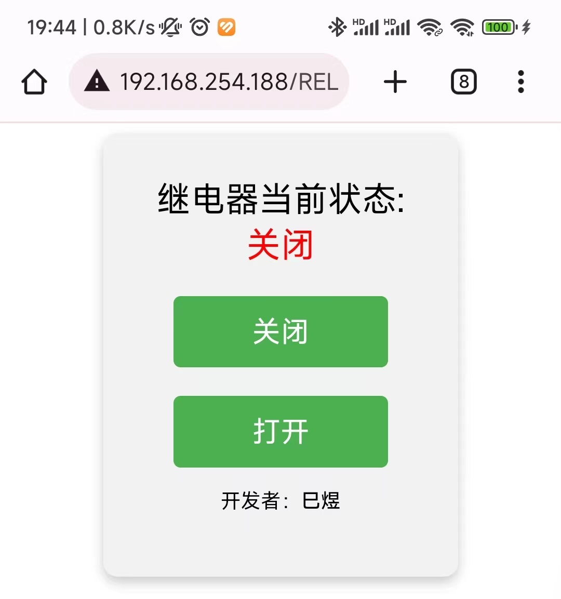
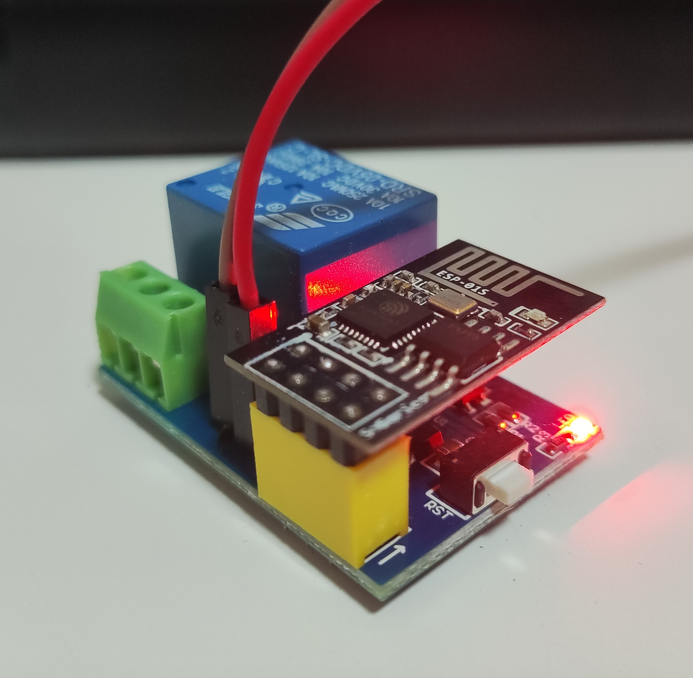
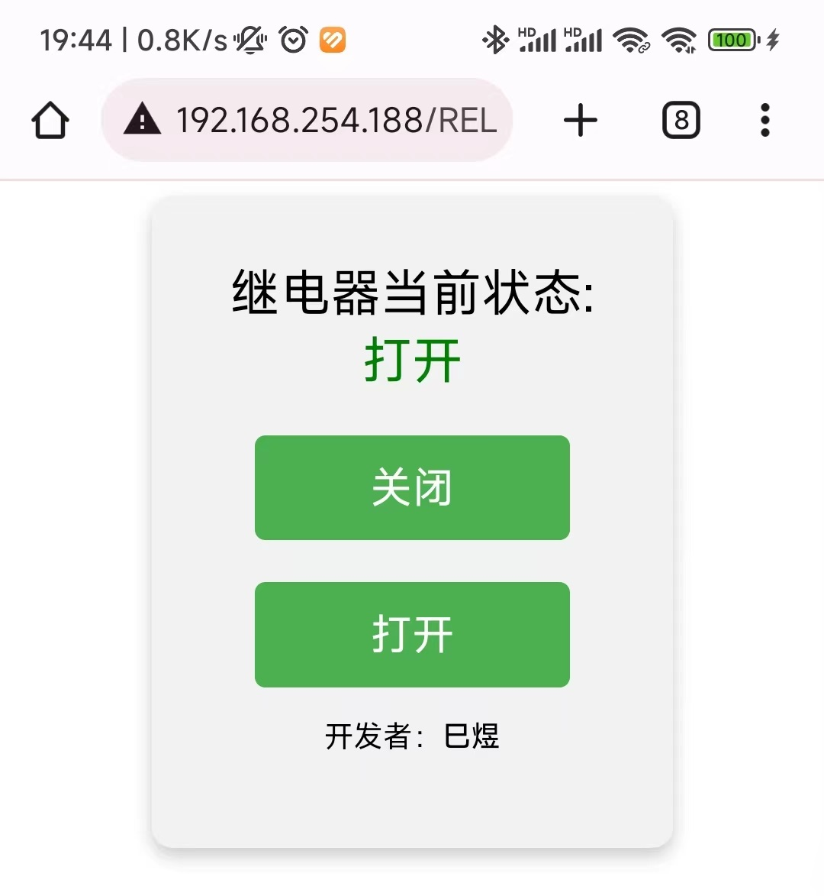
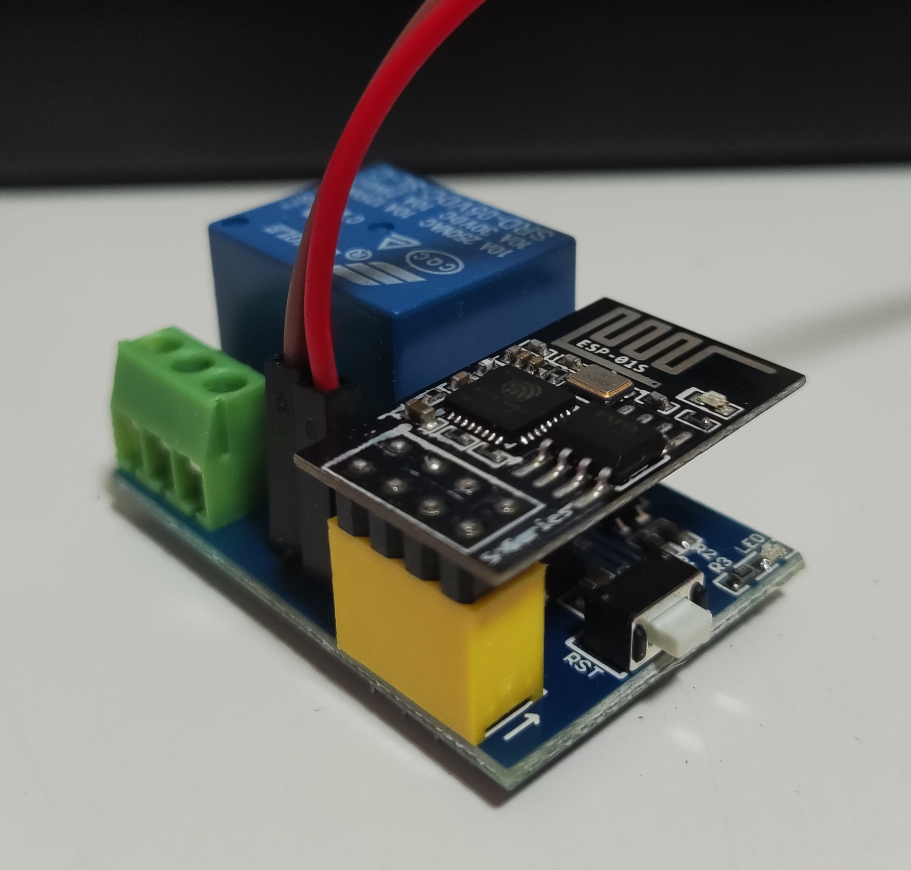

# WIFI继电器接入

## 开发
> 做法与[WIFI温湿度传感器](http://www.dev-share.top/2023/11/12/wifi%e6%b8%a9%e6%b9%bf%e5%ba%a6%e4%bc%a0%e6%84%9f%e5%99%a8%e6%8e%a5%e5%85%a5/ "WIFI温湿度传感器")开发流程一样，只是编写的代码不同。

## 代码
``` cpp
#include <ESP8266WiFi.h>

#define RELAY_PIN 0  // 连接到GPIO0

const char *ssid = "Redmi K40S";    // 在此输入您的路由器或WiFi的SSID
const char *password = "88888888";  // 在此输入您的路由器或WiFi的密码
const String hostname = "siyu_01";  // 设置模块的主机名

WiFiServer server(80);

void setup() {
  Serial.begin(115200);           // 初始化串口通信，波特率为115200
  pinMode(RELAY_PIN, OUTPUT);     // 设置GPIO0为输出模式，用于控制继电器
  digitalWrite(RELAY_PIN, HIGH);  // 将GPIO0输出电平设置为高，继电器默认关闭状态

  /* 连接到WiFi网络 */
  Serial.println("");  // 打印空行
  Serial.print("设置模块的主机名: ");
  Serial.println(hostname);
  WiFi.hostname(hostname);  // 设置模块的主机名

  Serial.println("");          // 打印空行
  Serial.print("连接到 ");     // 打印连接提示
  Serial.println(ssid);        // 打印WiFi SSID
  WiFi.begin(ssid, password);  // 尝试连接WiFi网络，使用提供的SSID和密码

  while (WiFi.status() != WL_CONNECTED) {  // 如果连接到WiFi失败，则每500毫秒重试一次
    delay(500);
    Serial.print(".");
  }

  Serial.println("");              // 打印空行
  Serial.println("WiFi已连接。");  // 打印WiFi连接成功提示

  /* 启动服务器 */
  server.begin();                    // 启动Web服务器
  Serial.println("服务器已启动。");  // 打印服务器启动提示

  /* 输出IP地址 */
  Serial.print("使用此URL进行连接: ");
  Serial.print("http://");
  Serial.print(WiFi.localIP());  // 打印设备的本地IP地址
  Serial.println("/");           // 打印URL结尾的斜杠
}

void loop() {
  WiFiClient client = server.available();  // 等待客户端连接
  if (!client)
    return;

  Serial.println("新客户端.");  // 打印新客户端连接提示
  while (!client.available())
    delay(1);

  String request = client.readStringUntil('\r');  // 读取客户端发送的HTTP请求
  Serial.println(request);                        // 打印HTTP请求
  client.flush();                                 // 清空客户端接收缓冲区

  int value = HIGH;                          // 定义变量以表示继电器状态，默认为HIGH（关闭）
  if (request.indexOf("/RELAY=ON") != -1) {  // 如果请求中包含"/RELAY=ON"，则打开继电器
    Serial.println("RELAY=ON");
    digitalWrite(RELAY_PIN, LOW);  // 设置GPIO0输出低电平，打开继电器
    value = LOW;                   // 更新继电器状态为LOW
  }
  if (request.indexOf("/RELAY=OFF") != -1) {  // 如果请求中包含"/RELAY=OFF"，则关闭继电器
    Serial.println("RELAY=OFF");
    digitalWrite(RELAY_PIN, HIGH);  // 设置GPIO0输出高电平，关闭继电器
    value = HIGH;                   // 更新继电器状态为HIGH
  }

  /* 构建HTTP响应页面 */
  String page =
    "HTTP/1.1 200 OK\r\n"
    "Content-Type: text/html; charset=UTF-8\r\n"
    "\r\n"
    "<!DOCTYPE HTML>\r\n"
    "<html>\r\n"
    "<head>\r\n"
    "<meta name='viewport' content='width=device-width, initial-scale=1'>\r\n"  // 调整视口宽度为设备宽度
    "<title>ESP8266继电器控制</title>\r\n"
    "<style>\r\n"
    "body { text-align: center; font-family: Arial, sans-serif; }\r\n"
    ".container { margin: auto; max-width: 50%; background-color: #f2f2f2; border-radius: 10px; padding: 30px; box-shadow: 0 4px 8px 0 rgba(0, 0, 0, 0.2); }\r\n"
    ".inner { font-size: 24px; }\r\n"
    "a { display: inline-block; width: 150px; height: 50px; line-height: 50px; color: #fff; background-color: #4CAF50; margin-top: 20px; text-decoration: none; border-radius: 5px; font-size: 20px; }\r\n"
    ".footer-text { font-size: 14px; }\r\n"
    ".bold-text { font-weight: bold; }\r\n"
    "</style>\r\n"
    "</head>\r\n"
    "<body>\r\n"
    "<div class='container'>\r\n"
    "<div class='inner'>\r\n"
    "继电器当前状态: ";
  page += (value == HIGH) ? "<span style='color:red;'>关闭</span>" : "<span style='color:green;'>打开</span>";
  page +=
    "<br>\r\n"
    "<a href=\"/RELAY=OFF\">关闭</a>\r\n"
    "<a href=\"/RELAY=ON\">打开</a>\r\n"
    "<div class='footer'>\r\n"
    "<p class='footer-text'>开发者：<span class='bold-text'>巳煜</span></p>\r\n"
    "</div>\r\n"
    "</div>\r\n"
    "</div>\r\n"
    "</body>\r\n"
    "</html>\r\n";

  client.print(page);  // 将HTTP响应发送回客户端
}

```

### **效果**






### **作品**

<video width="560" height="315" controls>
  <source src="http://qiniu.dev-share.top/iot/zuopin_01.mp4" type="video/mp4">
</video>

