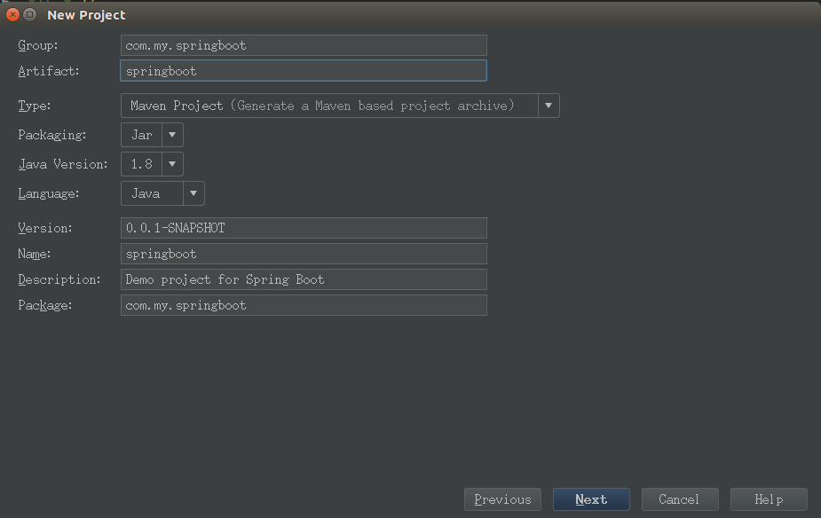
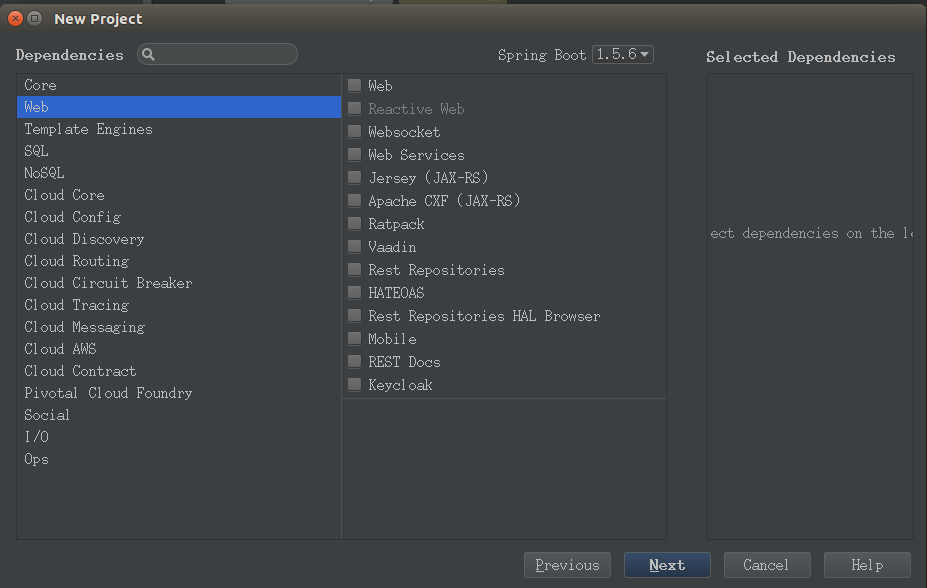
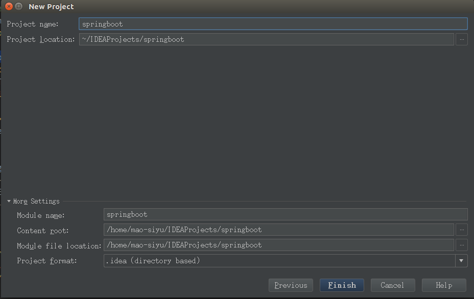
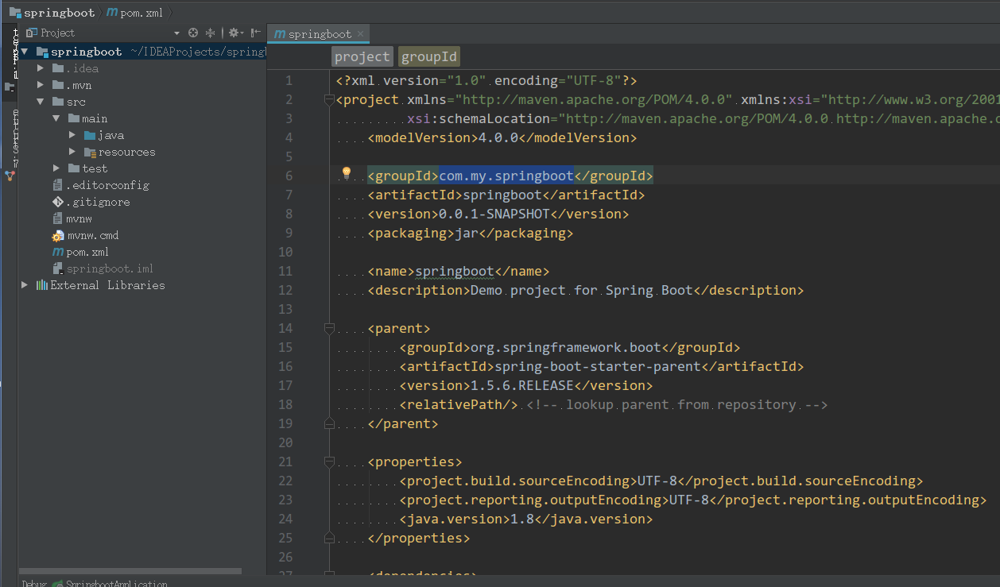

开发工具: IDEA 2017 JDK版本: 1.8 开发系统: ubuntu 16.04

### 创建项目

File --> New --> Project --> Spring Initializr --> Next

### 配置maven工程

\--> Next

### 选择 pom.xml 要加载的模块

\--> Next

### 填写项目名

\--> Finish

