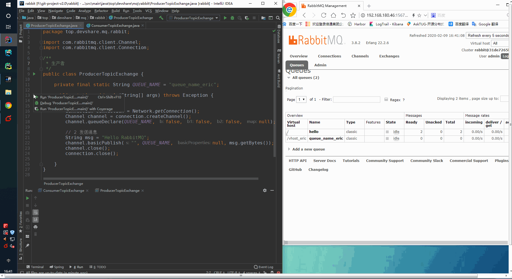

###### [安装部署RabbitMQ](http://www.dev-share.top/2020/02/09/docker-compose-%e5%ae%89%e8%a3%85-rabbitmq/ "安装部署RabbitMQ")

* * *

##### maven 项目集成MQ

###### pom.xml

```markup
<?xml version="1.0" encoding="UTF-8"?>
<project xmlns="http://maven.apache.org/POM/4.0.0" xmlns:xsi="http://www.w3.org/2001/XMLSchema-instance"
         xsi:schemaLocation="http://maven.apache.org/POM/4.0.0 https://maven.apache.org/xsd/maven-4.0.0.xsd">
    <modelVersion>4.0.0</modelVersion>
    <parent>
        <groupId>org.springframework.boot</groupId>
        <artifactId>spring-boot-starter-parent</artifactId>
        <version>2.2.4.RELEASE</version>
        <relativePath/> <!-- lookup parent from repository -->
    </parent>
    <groupId>top.devshare.mq</groupId>
    <artifactId>rabbit</artifactId>
    <version>0.0.1-SNAPSHOT</version>
    <name>rabbit</name>
    <description>Demo project for Spring Boot</description>

    <properties>
        <java.version>1.8</java.version>
        <spring-cloud.version>Hoxton.SR1</spring-cloud.version>
    </properties>

    <dependencies>
        <dependency>
            <groupId>org.springframework.cloud</groupId>
            <artifactId>spring-cloud-starter</artifactId>
        </dependency>

        <dependency>
            <groupId>org.springframework.boot</groupId>
            <artifactId>spring-boot-starter-test</artifactId>
            <scope>test</scope>
            <exclusions>
                <exclusion>
                    <groupId>org.junit.vintage</groupId>
                    <artifactId>junit-vintage-engine</artifactId>
                </exclusion>
            </exclusions>
        </dependency>

        <!-- https://mvnrepository.com/artifact/com.rabbitmq/amqp-client -->
        <dependency>
            <groupId>com.rabbitmq</groupId>
            <artifactId>amqp-client</artifactId>
            <version>5.8.0</version>
        </dependency>


    </dependencies>

    <dependencyManagement>
        <dependencies>
            <dependency>
                <groupId>org.springframework.cloud</groupId>
                <artifactId>spring-cloud-dependencies</artifactId>
                <version>${spring-cloud.version}</version>
                <type>pom</type>
                <scope>import</scope>
            </dependency>
        </dependencies>
    </dependencyManagement>

    <build>
        <plugins>
            <plugin>
                <groupId>org.springframework.boot</groupId>
                <artifactId>spring-boot-maven-plugin</artifactId>
            </plugin>
        </plugins>
    </build>

</project>

```

* * *

###### 连接服务器工具类 Network

```java
package top.devshare.mq.rabbit;

import com.rabbitmq.client.Connection;
import com.rabbitmq.client.ConnectionFactory;

import java.io.IOException;
import java.util.concurrent.TimeoutException;

public class Network {

    public static Connection getConnection() throws IOException, TimeoutException {
        //1.创建连接工厂,并进行配置
        ConnectionFactory connectionFactory = new ConnectionFactory();
        connectionFactory.setHost("192.168.180.46");
        connectionFactory.setPort(5672);
        connectionFactory.setUsername("admin");
        connectionFactory.setPassword("123456");
        connectionFactory.setVirtualHost("/vhost_eric");

        //2.创建连接
        return connectionFactory.newConnection();
    }
}
```

* * *

###### 生产者 ProducerTopicExchange.java

```java
package top.devshare.mq.rabbit;

import com.rabbitmq.client.Channel;
import com.rabbitmq.client.Connection;

/**
 * 生产者
 */
public class ProducerTopicExchange {

    private final static String QUEUE_NAME = "queue_name_eric";

    public static void main(String[] args) throws Exception {

        // 1 连接MQ服务器
        Connection connection = Network.getConnection();
        Channel channel = connection.createChannel();
        channel.queueDeclare(QUEUE_NAME, false, false, false, null);

        // 2 发送消息
        String msg = "Hello RabbitMQ";
        channel.basicPublish("", QUEUE_NAME, null, msg.getBytes());
        channel.close();
        connection.close();

    }
}
```

* * *

###### 消费者 ConsumerTopicExchange.java

```java
package top.devshare.mq.rabbit;

import com.rabbitmq.client.*;

import java.io.IOException;

/**
 * 消费者
 */
public class ConsumerTopicExchange {

    private final static String QUEUE_NAME = "queue_name_eric";

    public static void main(String[] args) throws Exception {

        Connection connection = Network.getConnection();
        Channel channel = connection.createChannel();
        channel.queueDeclare(QUEUE_NAME, false, false, false, null);

        System.out.println("+----------------------------------------------+");
        System.out.println("|               持续等待接收消息                  |");
        System.out.println("+----------------------------------------------+");

        DefaultConsumer defaultConsumer = new DefaultConsumer(channel) {
            @Override
            public void handleDelivery(String consumerTag, Envelope envelope, AMQP.BasicProperties properties, byte[] body) throws IOException {
                super.handleDelivery(consumerTag, envelope, properties, body);
                String msg = new String(body, "UTF-8");

                System.out.printf("|  您有新的消息，请注意查收:|    %s\n", msg);
                System.out.println("+----------------------------------------------+");

                // 确认消息接收(此操作会减少队列中 Unacked 里面的消息数)
                channel.basicAck(envelope.getDeliveryTag(), false);
            }
        };

        channel.basicConsume(QUEUE_NAME, defaultConsumer);
    }
}
```

* * *

###### 测试


