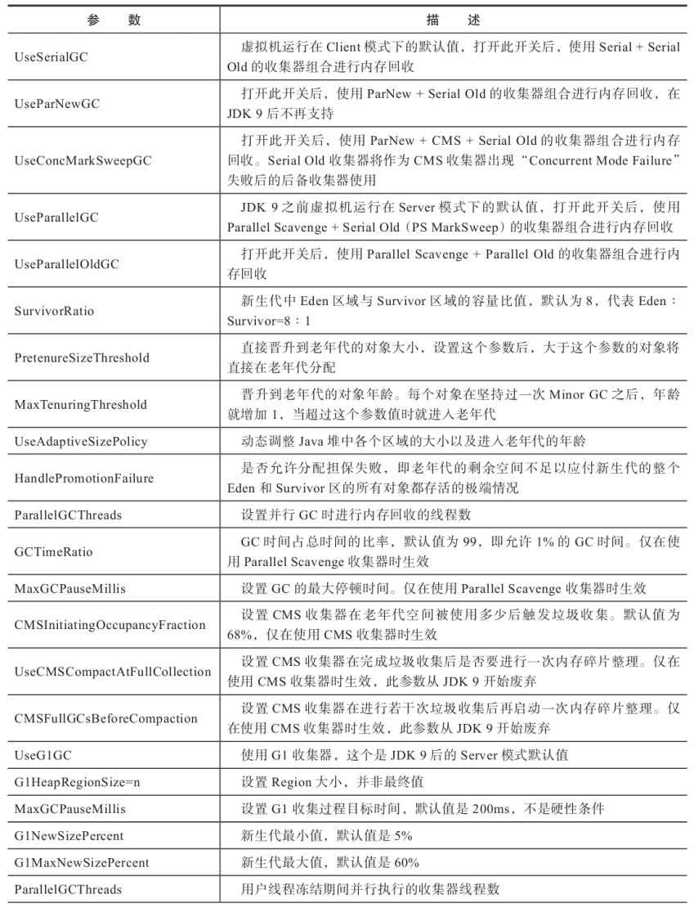
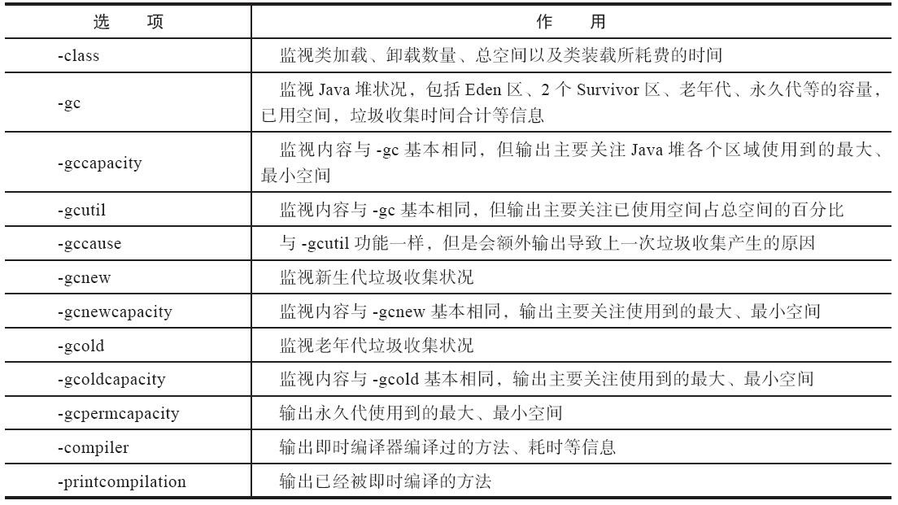

###### JVM GC参数



* * *

###### 1 JVM 参数配置

```ruby
[root@dev1 ~]# jps -l
473 sun.tools.jps.Jps
10 com.web.WebApplication
[root@dev1 ~]#
```

* * *

##### 查看jvm的各个指标情况



* * *

###### 1.1 类加载统计

```ruby
root@LXCL-App:/# jstat -class 10
Loaded  Bytes  Unloaded  Bytes     Time
 21528 48112.0      748  1093.0      16.63
root@LXCL-App:/#
```

| 列名 | 说明 |
| --- | --- |
| Loaded | 加载class的数量 |
| Bytes | 所占用空间大小 |
| Unloaded | 未加载数量 |
| Bytes | 未加载占用空间 |
| Time | 时间 |

* * *

###### 1.2 编译统计

```ruby
root@LXCL-App:/# jstat -compiler 10
Compiled Failed Invalid   Time   FailedType FailedMethod
   16778      3       0   108.14          1 org/hibernate/validator/internal/metadata/provider/AnnotationMetaDataProvider findConstraints
root@LXCL-App:/#
```

| 列名 | 说明 |
| --- | --- |
| Compiled | 编译数量 |
| Failed | 失败数量 |
| Invalid | 不可用数量 |
| Time | 时间 |
| FailedType | 失败类型 |
| FailedMethod | 失败的方法 |

* * *

###### 1.3 垃圾回收统计

```ruby
root@LXCL-App:/# jstat -gc 10
 S0C    S1C    S0U    S1U      EC       EU        OC         OU       MC     MU    CCSC   CCSU   YGC     YGCT    FGC    FGCT     GCT
77824.0 58880.0  0.0    0.0   553472.0 275182.9 1152512.0   149575.4  164160.0 158291.9 15360.0 14272.1     19    0.792   5      1.264    2.056
root@LXCL-App:/#
```

| 列名 | 说明 |
| --- | --- |
| S0C | 第一个幸存区的大小 |
| S1C | 第二个幸存区的大小 |
| S0U | 第一个幸存区的使用大小 |
| S1U | 第二个幸存区的使用大小 |
| EC | 伊甸园区的大小 |
| EU | 伊甸园区的使用大小 |
| OC | 老年代大小 |
| OU | 老年代使用大小 |
| MC | 方法区大小 |
| MU | 方法区使用大小 |
| CCSC | 压缩类空间大小 |
| CCSU | 压缩类空间使用大小 |
| YGC | 年轻代垃圾回收次数 |
| YGCT | 年轻代垃圾回收消耗时间 |
| FGC | 老年代垃圾回收次数 |
| FGCT | 老年代垃圾回收消耗时间 |
| GCT | 垃圾回收消耗总时间 |

* * *

###### 1.4 堆内存统计

```ruby
root@LXCL-App:/# jstat -gccapacity 10
 NGCMN    NGCMX     NGC     S0C   S1C       EC      OGCMN      OGCMX       OGC         OC       MCMN     MCMX      MC     CCSMN    CCSMX     CCSC    YGC    FGC
349184.0 698880.0 698880.0 77824.0 58880.0 553472.0   699392.0  1398272.0  1152512.0  1152512.0      0.0 1198080.0 164160.0      0.0 1048576.0  15360.0     19     5
root@LXCL-App:/#
```

| 列名 | 说明 |
| --- | --- |
| NGCMN | 新生代最小容量 |
| NGCMX | 新生代最大容量 |
| NGC | 当前新生代容量 |
| S0C | 第一个幸存区大小 |
| S1C | 第二个幸存区的大小 |
| EC | 伊甸园区的大小 |
| OGCMN | 老年代最小容量 |
| OGCMX | 老年代最大容量 |
| OGC | 当前老年代大小 |
| OC | 当前老年代大小 |
| MCMN | 最小元数据容量 |
| MCMX | 最大元数据容量 |
| MC | 当前元数据空间大小 |
| CCSMN | 最小压缩类空间大小 |
| CCSMX | 最大压缩类空间大小 |
| CCSC | 当前压缩类空间大小 |
| YGC | 年轻代gc次数 |
| FGC | 老年代GC次数 |

* * *

###### 1.5 新生代垃圾回收统计

```ruby
root@LXCL-App:/# jstat -gcnew 10
 S0C    S1C    S0U    S1U   TT MTT  DSS      EC       EU     YGC     YGCT
77824.0 58880.0    0.0    0.0  6  15 77824.0 553472.0 374180.5     19    0.792
root@LXCL-App:/#
```

| 列名 | 说明 |
| --- | --- |
| S0C | 第一个幸存区大小 |
| S1C | 第二个幸存区的大小 |
| S0U | 第一个幸存区的使用大小 |
| S1U | 第二个幸存区的使用大小 |
| TT | 对象在新生代存活的次数 |
| MTT | 对象在新生代存活的最大次数 |
| DSS | 期望的幸存区大小 |
| EC | 伊甸园区的大小 |
| EU | 伊甸园区的使用大小 |
| YGC | 年轻代垃圾回收次数 |
| YGCT | 年轻代垃圾回收消耗时间 |

* * *

###### 1.6 新生代内存统计

```ruby
root@LXCL-App:/# jstat -gcnewcapacity 10
  NGCMN      NGCMX       NGC      S0CMX     S0C     S1CMX     S1C       ECMX        EC      YGC   FGC
  349184.0   698880.0   698880.0 232960.0  77824.0 232960.0  58880.0   697856.0   553472.0    19     5
root@LXCL-App:/#
```

| 列名 | 说明 |
| --- | --- |
| NGCMN | 新生代最小容量 |
| NGCMX | 新生代最大容量 |
| NGC | 当前新生代容量 |
| S0CMX | 最大幸存1区大小 |
| S0C | 当前幸存1区大小 |
| S1CMX | 最大幸存2区大小 |
| S1C | 当前幸存2区大小 |
| ECMX | 最大伊甸园区大小 |
| EC | 当前伊甸园区大小 |
| YGC | 年轻代垃圾回收次数 |
| FGC | 老年代回收次数 |

* * *

###### 1.7 老年代垃圾回收统计

```ruby
root@LXCL-App:/# jstat -gcold 10
   MC       MU      CCSC     CCSU       OC          OU       YGC    FGC    FGCT     GCT
164160.0 158291.9  15360.0  14272.1   1152512.0    149575.4     19     5    1.264    2.056
root@LXCL-App:/#
```

| 列名 | 说明 |
| --- | --- |
| MC | 方法区大小 |
| MU | 方法区使用大小 |
| CCSC | 压缩类空间大小 |
| CCSU | 压缩类空间使用大小 |
| OC | 老年代大小 |
| OU | 老年代使用大小 |
| YGC | 年轻代垃圾回收次数 |
| FGC | 老年代垃圾回收次数 |
| FGCT | 老年代垃圾回收消耗时间 |
| GCT | 垃圾回收消耗总时间 |

* * *

###### 1.8 老年代内存统计

```ruby
root@LXCL-App:/# jstat -gcoldcapacity 10
   OGCMN       OGCMX        OGC         OC       YGC   FGC    FGCT     GCT
   699392.0   1398272.0   1152512.0   1152512.0    19     5    1.264    2.056
root@LXCL-App:/#
```

| 列名 | 说明 |
| --- | --- |
| OGCMN | 老年代最小容量 |
| OGCMX | 老年代最大容量 |
| OGC | 当前老年代大小 |
| OC | 老年代大小 |
| YGC | 年轻代垃圾回收次数 |
| FGC | 老年代垃圾回收次数 |
| FGCT | 老年代垃圾回收消耗时间 |
| GCT | 垃圾回收消耗总时间 |

* * *

###### 1.9 元数据空间统计

```ruby
root@LXCL-App:/# jstat -gcmetacapacity 10
   MCMN       MCMX        MC       CCSMN      CCSMX       CCSC     YGC   FGC    FGCT     GCT
       0.0  1200128.0   165720.0        0.0  1048576.0    15488.0    20     5    1.264    2.074
root@LXCL-App:/#
```

| 列名 | 说明 |
| --- | --- |
| MCMN | 最小元数据容量 |
| MCMX | 最大元数据容量 |
| MC | 当前元数据空间大小 |
| CCSMN | 最小压缩类空间大小 |
| CCSMX | 最大压缩类空间大小 |
| CCSC | 当前压缩类空间大小 |
| YGC | 年轻代垃圾回收次数 |
| FGC | 老年代垃圾回收次数 |
| FGCT | 老年代垃圾回收消耗时间 |
| GCT | 垃圾回收消耗总时间 |

* * *

###### 1.10 总结垃圾回收统计

```ruby
root@LXCL-App:/# jstat -gcutil 10
  S0     S1     E      O      M     CCS    YGC     YGCT    FGC    FGCT     GCT
  0.00  45.08  86.30  64.52  96.83  93.85     59    3.157     8    6.355    9.512
root@LXCL-App:/#
```

| 列名 | 说明 |
| --- | --- |
| S0 | 幸存1区当前使用比例 |
| S1 | 幸存2区当前使用比例 |
| E | 伊甸园区使用比例 |
| O | 老年代使用比例 |
| M | 元数据区使用比例 |
| CCS | 压缩使用比例 |
| YGC | 年轻代垃圾回收次数 |
| FGC | 老年代垃圾回收次数 |
| FGCT | 老年代垃圾回收消耗时间 |
| GCT | 垃圾回收消耗总时间 |

* * *

###### 1.11 JVM编译方法统计

```ruby
root@LXCL-App:/# jstat -printcompilation 10
Compiled  Size  Type Method
   18927      4    1 java/net/URI access$1200
root@LXCL-App:/#
```

| 列名 | 说明 |
| --- | --- |
| Compiled | 最近编译方法的数量 |
| Size | 最近编译方法的字节码数量 |
| Type | 最近编译方法的编译类型 |
| Method | 方法名标识 |

* * *

* * *

* * *
