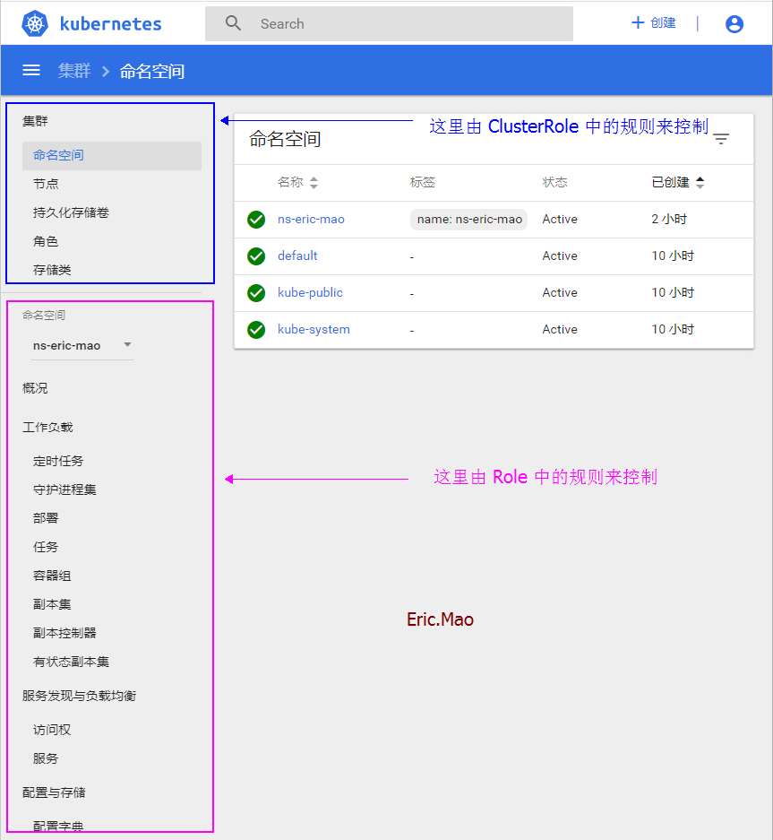

* * *

##### **[安装 K8S Dashboard](http://www.dev-share.top/2019/06/03/%E5%AE%89%E8%A3%85-k8s-%E4%BB%AA%E8%A1%A8%E7%9B%98/ "安装 K8S Dashboard")**

* * *

##### 创建命名空间

```ruby
cat > create-namespace.yaml << ERIC
---
# 创建命名空间
kind: Namespace
apiVersion: v1
metadata:
   # 不可以使用 下划线
   name: ns-eric-mao
   labels:
     name: ns-eric-mao

ERIC

```

* * *

##### 创建用户 **`eric.mao`**

```ruby
# 新建 eric.mao 限定可访问的命名空间为 ns-eric-mao
kubectl create sa eric.mao -n ns-eric-mao

# 删除
kubectl delete sa eric.mao -n ns-eric-mao
```

* * *

##### 创建角色 **`role-eric.mao`**

```ruby
cat > role-eric.mao.yaml << ERIC
---
kind: Role
apiVersion: rbac.authorization.k8s.io/v1
metadata:
  # 限定可访问的命名空间为 ns-eric-mao
  namespace: ns-eric-mao
  # 角色名称
  name: role-eric.mao

# 控制 dashboard 中 命名空间模块 中的面板是否有权限查看
rules:
- apiGroups: [""]
  resources: ["pods", "pods/log", "pods/exec", "events", "pods/attach", "pods/status", "replicationcontrollers", "services", "configmaps", "persistentvolumeclaims"]
  verbs: ["get", "watch", "list", "create", "update", "delete"]

- apiGroups: ["extensions", "apps"]
  resources: ["deployments", "daemonsets", "replicasets", "statefulsets"]
  verbs: ["get", "list", "watch", "create", "update", "patch", "delete"]

- apiGroups: ["batch"]
  resources: ["jobs", "cronjobs", ""]
  verbs: ["get", "list", "watch", "create", "update", "patch", "delete"]

ERIC

```

* * *

##### 将用户 `eric.mao` 绑定到角色 `role-eric.mao`

```ruby
cat > role-bind-eric.mao.yaml << ERIC
---
kind: RoleBinding
apiVersion: rbac.authorization.k8s.io/v1
metadata:
  # 限定可访问的命名空间为 ns-eric-mao
  namespace: ns-eric-mao
  name: role-bind-eric.mao

subjects:
- kind: ServiceAccount
  # 指定为 ns-eric-mao 命名空间下的 ServiceAccount
  namespace: ns-eric-mao
  # 用户名称
  name: eric.mao

roleRef:
  kind: Role
  # 角色名称
  name: role-eric.mao
  apiGroup: rbac.authorization.k8s.io

ERIC

```

* * *

##### 执行

```ruby
kubectl apply -f role-eric.mao.yaml -f role-bind-eric.mao.yaml
```

* * *

* * *

* * *

##### 创建 k8s 集群角色

```ruby
cat > cluster-role-eric.mao.yaml << ERIC
---
kind: ClusterRole
apiVersion: rbac.authorization.k8s.io/v1beta1
metadata:
  # namespace 被省略，因为ClusterRoles没有名称空间
  name: cluster-role-eric.mao

# 控制 dashboard 中 集群模块 中的面板是否有权限查看
rules:
- apiGroups: [""]
  resources: ["secrets"]
  verbs: ["get", "watch", "list"]

- apiGroups: [""]
  resources: ["namespaces", "nodes"]
  verbs: ["get", "watch", "list", "create", "update", "delete"]

- apiGroups: ["rbac.authorization.k8s.io"]
  resources: ["roles", "clusterroles"]
  verbs: ["get", "watch", "list", "create", "update", "delete"]

- apiGroups: ["storage.k8s.io"]
  resources: ["storageclasses"]
  verbs: ["get", "watch", "list", "create", "update", "delete"]

ERIC

```

* * *

##### 将用户 `eric.mao` 绑定到 集群角色 `cluster-role-eric.mao`

```ruby
cat > cluster-role-bind-eric.mao.yaml << ERIC
---
kind: ClusterRoleBinding
apiVersion: rbac.authorization.k8s.io/v1beta1
metadata:
  # 限定可访问的命名空间为 ns-eric-mao
  namespace: ns-eric-mao
  name: cluster-role-bind-eric.mao

subjects:
- kind: ServiceAccount
  # 指定为 ns-eric-mao 命名空间下的 ServiceAccount
  namespace: ns-eric-mao
  # 用户名称
  name: eric.mao

roleRef:
  kind: ClusterRole
  # 集群角色名称
  name: cluster-role-eric.mao
  apiGroup: rbac.authorization.k8s.io

ERIC

```

* * *

##### 执行

```ruby
kubectl apply -f cluster-role-eric.mao.yaml -f cluster-role-bind-eric.mao.yaml
```

* * *

##### 获取用户 `eric.mao` 的 `token`

```ruby
kubectl describe secret eric.mao -n ns-eric-mao | grep token:
```

* * *

###### 访问 dashboard，使用token登录

**https://apiserver:6443/api/v1/namespaces/ns-eric-mao/services/https:kubernetes-dashboard:/proxy/#!/overview?namespace=`要访问的命名空间`** **然后输入 token**

* * *

* * *

* * *



* * *

* * *

* * *

##### 脚本实现

```ruby
cat > create_user.sh << EOF

#!/bin/bash
# @Time    : 2020/04/21
# @Author  : Eric.Mao

if [ ! \$2 ]; then
    echo 参数错误，请按照如下命令执行
    echo ./create_user.sh 用户名 所属命名空间
    exit
fi

username=\$1
namespace=\$2


################################################################################################


mkdir -p /home/k8s-dashboard/create-user-\$username


################################################################################################


kubectl create sa \$username -n \$namespace


################################################################################################


cat > /home/k8s-dashboard/create-user-\$username/role-\$username.yaml << ERIC
---
kind: Role
apiVersion: rbac.authorization.k8s.io/v1
metadata:
  # 限定可访问的命名空间为 \$namespace
  namespace: \$namespace
  # 角色名称
  name: role-\$username

# 控制 dashboard 中 命名空间模块 中的面板是否有权限查看
rules:
- apiGroups: [""]
  resources: ["pods", "pods/log", "pods/exec", "events", "pods/attach", "pods/status", "replicationcontrollers", "services", "configmaps", "persistentvolumeclaims"]
  verbs: ["get", "watch", "list", "create", "update", "delete"]

- apiGroups: ["extensions", "apps"]
  resources: ["deployments", "daemonsets", "replicasets", "statefulsets"]
  verbs: ["get", "list", "watch", "create", "update", "patch", "delete"]

- apiGroups: ["batch"]
  resources: ["jobs", "cronjobs", ""]
  verbs: ["get", "list", "watch", "create", "update", "patch", "delete"]

ERIC

kubectl apply -f /home/k8s-dashboard/create-user-\$username/role-\$username.yaml

echo -e "\033[32m ------------------- (一)添加 普通用户角色 成功！ ------------------- \033[0m"


################################################################################################


cat > /home/k8s-dashboard/create-user-\$username/role-bind-\$username.yaml << ERIC
---
kind: RoleBinding
apiVersion: rbac.authorization.k8s.io/v1
metadata:
  # 限定可访问的命名空间为 \$namespace
  namespace: \$namespace
  name: role-bind-\$username

subjects:
- kind: ServiceAccount
  # 限定可访问的命名空间为 \$namespace
  namespace: \$namespace
  # 用户名称
  name: \$username

roleRef:
  kind: Role
  # 角色名称
  name: role-\$username
  apiGroup: rbac.authorization.k8s.io

ERIC

kubectl apply -f /home/k8s-dashboard/create-user-\$username/role-bind-\$username.yaml

echo -e "\033[32m ------------------- (二)绑定 普通用户角色 成功！ ----------------------------- \033[0m"


################################################################################################


cat > /home/k8s-dashboard/create-user-\$username/cluster-role-\$username.yaml << ERIC
---
kind: ClusterRole
apiVersion: rbac.authorization.k8s.io/v1beta1
metadata:
  # namespace 被省略，因为ClusterRoles没有名称空间
  name: cluster-role-\$username

# 控制 dashboard 中 集群模块 中的面板是否有权限查看
rules:
- apiGroups: [""]
  resources: ["secrets"]
  verbs: ["get", "watch", "list"]

- apiGroups: [""]
  resources: ["namespaces", "nodes"]
  verbs: ["get", "watch", "list", "create", "update", "delete"]

- apiGroups: ["rbac.authorization.k8s.io"]
  resources: ["roles", "clusterroles"]
  verbs: ["get", "watch", "list", "create", "update", "delete"]

- apiGroups: ["storage.k8s.io"]
  resources: ["storageclasses"]
  verbs: ["get", "watch", "list", "create", "update", "delete"]

ERIC

kubectl apply -f /home/k8s-dashboard/create-user-\$username/cluster-role-\$username.yaml

echo -e "\033[32m ------------------- (三)创建 集群角色 成功！ ----------------------------- \033[0m"


################################################################################################


cat > /home/k8s-dashboard/create-user-\$username/cluster-role-bind-\$username.yaml << ERIC
---
kind: ClusterRoleBinding
apiVersion: rbac.authorization.k8s.io/v1beta1
metadata:
  name: cluster-role-bind-\$username
  # 这只授予 '\$namespace' 名称空间内的权限。
  namespace: \$namespace

subjects:
- kind: ServiceAccount
  # 用户名称
  name: \$username
  namespace: \$namespace

roleRef:
  kind: ClusterRole
  # 集群角色名称
  name: cluster-role-\$username
  apiGroup: rbac.authorization.k8s.io

ERIC

kubectl apply -f /home/k8s-dashboard/create-user-\$username/cluster-role-bind-\$username.yaml

echo -e "\033[32m ------------------- (四)绑定 集群角色 成功！ ----------------------------- \033[0m"


################################################################################################


echo -e "\033[32m ------------------- (五)获取 token ---------------------------------------------- \033[0m"
echo -e "\033[36m \$(kubectl describe secret \$username -n \$namespace | grep token:) \033[0m"


################################################################################################


cat > /home/k8s-dashboard/create-user-\$username/delete_user.sh << ERIC
kubectl delete -f /home/k8s-dashboard/create-user-\$username
ERIC

chmod -R 777 /home/k8s-dashboard/create-user-\$username/delete_user.sh

echo -e "\033[32m ------------------- (六)创建删除用户脚本！ ----------------------------- \033[0m"


################################################################################################


echo -e "\033[32m ------------------- (End)测试地址 ----------------------------------------------- \033[0m"
echo -e "\033[36m \$(kubectl cluster-info | grep 'Kubernetes master' | awk '/http/ {print \$NF}')/api/v1/namespaces/kubernetes-dashboard/services/https:kubernetes-dashboard:/proxy/ \033[0m"
echo -e "\033[36m kubectl get sa -n \$namespace \033[0m"
echo -e "\033[36m 用户名: \$username \033[0m"
echo -e "\033[36m 文件目录: /home/k8s-dashboard/create-user-\$username \033[0m"

EOF

```
