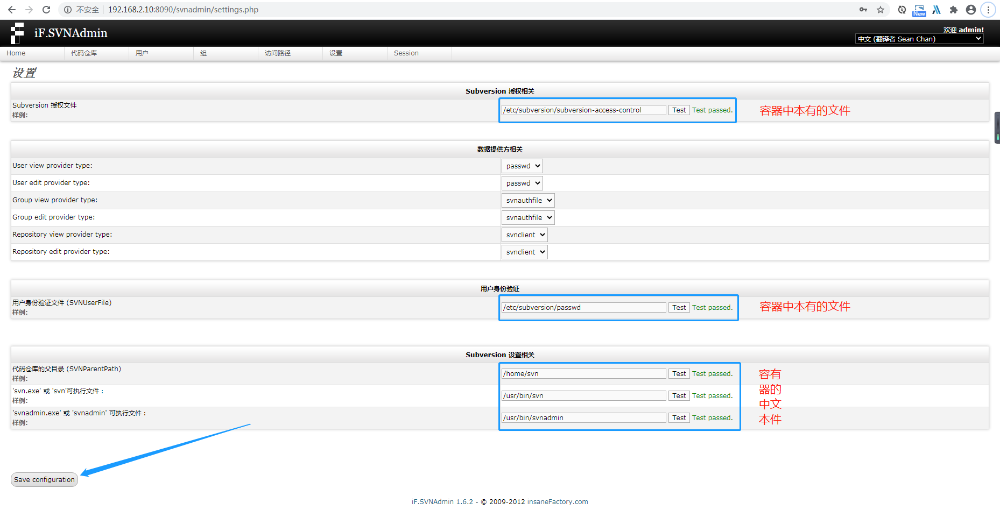
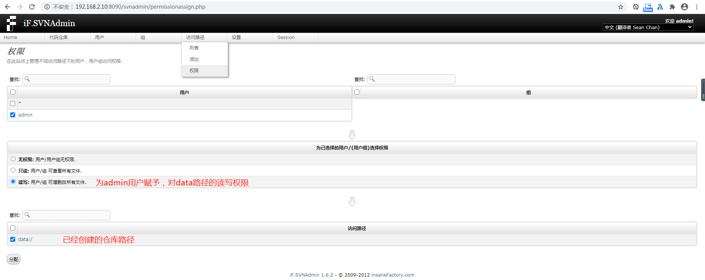

###### 服务器地址: 192.168.2.10

* * *

###### docker-compose.yaml

```ruby
cat > docker-compose.yaml << ERIC

version: '3.1'

services:

  svn:
    image: elleflorio/svn-server
    container_name: svn
    restart: always
    ports:
      - 8090:80
    volumes:
      - /etc/localtime:/etc/localtime:ro
      # 将用户权限配置文件映射到本地
      - ./config/subversion/subversion-access-control:/etc/subversion/subversion-access-control
      - ./config/subversion/passwd:/etc/subversion/passwd
      # 将代码仓库映射到本地
      - ./config/subversion/repo/:/home/svn

ERIC

```

* * *

###### 创建空文件

```ruby
mkdir -p ./config/subversion/repo/

echo "" > ./config/subversion/subversion-access-control
echo "" > ./config/subversion/passwd

# 必须 777 权限
chmod -R 777 ./config/

# 启动
docker-compose up -d

```

* * *

###### **访问管理页面**

`http://192.168.2.10:8090/svnadmin` `admin/admin`

* * *

###### 初始化配置, 创建配置文件、创建仓库目录

```ruby
/etc/subversion/subversion-access-control
/etc/subversion/passwd
/home/svn
/usr/bin/svn
/usr/bin/svnadmin
```

[](http://qiniu.dev-share.top/svn-setting.png)

* * *

###### 为路径授权

[](http://qiniu.dev-share.top/svn-auth.png)

* * *

###### **SVN Checkout 地址**

**`http://192.168.2.10:8090/svn`/data/** `admin/admin`

* * *

* * *

* * *
