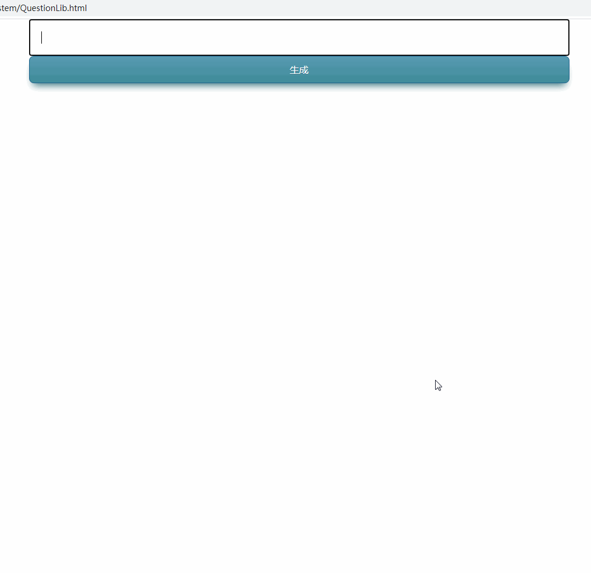

[](http://qiniu.dev-share.top/quest-answer.gif)

* * *

* * *

* * *

### 源代码

**[仓库地址](git@gitee.com:eric-mao/question-lib.git "仓库地址")**

```javascript
<!DOCTYPE html>
<html lang="en">
<head>
    <meta charset="UTF-8">
    <title>题库</title>
    <style>
        * {
            border: 0;
            margin: 0;
            padding: 0;
        }

        .box {
            display: flex;
            align-items: start;
            justify-content: center;
        }

        .box .leftArae {
            flex: 0.5;
            display: flex;
            flex-direction: column;
            justify-content: center;
        }

        .box .rightArea {
            flex: 0.5;
            display: flex;
            flex-direction: column;
            justify-content: center;
        }

        .button {
            background: #599bb3;
            background-image: -webkit-linear-gradient(top, #599bb3, #408c99);
            background-image: -moz-linear-gradient(top, #599bb3, #408c99);
            background-image: -ms-linear-gradient(top, #599bb3, #408c99);
            background-image: -o-linear-gradient(top, #599bb3, #408c99);
            background-image: linear-gradient(to bottom, #599bb3, #408c99);
            -webkit-border-radius: 8px;
            -moz-border-radius: 8px;
            border-radius: 8px;
            text-shadow: 0px 1px 0px #3d768a;
            -webkit-box-shadow: 0px 10px 14px -7px #276873;
            -moz-box-shadow: 0px 10px 14px -7px #276873;
            box-shadow: 0px 10px 14px -7px #276873;
            font-family: Arial;
            color: #ffffff;
            font-size: 16px;
            padding: 12px 30px 12px 30px;
            border: solid #1f628d 1px;
            text-decoration: none;
        }

        .button:hover {
            color: #ffffff;
            background: #408c99;
            text-decoration: none;
        }

    </style>
</head>
<body>
<div class="box">
    <!--生成题库-->
    <div class="leftArae" id="leftArae">
        <input class="button" type="button" id="generate" value="生成"/>
        <div contenteditable id="source" style="border: 1px solid #0077c5; padding: 20px;"></div>
    </div>

    <!--答题页面-->
    <div class="rightArea" id="rightArea" style="display:none;">
        <form id="formId" style="border: 1px solid #0077c5; padding: 20px 40px;">
            <input class="button" type="submit" value="提交" style="width: 100%">
            <div id="quesList"></div>
        </form>
    </div>

    <!--显示结果-->
    <div id="showResults" style="display:none;"></div>
</div>
</body>

<!--Fisher–Yates shuffle 洗牌算法-->
<script>
    Array.prototype.shuffle = function () {
        var array = this;
        var m = array.length,
            t, i;
        while (m) {
            i = Math.floor(Math.random() * m--);
            t = array[m];
            array[m] = array[i];
            array[i] = t;
        }
        return array;
    }
</script>

<!--生成题库-->
<script>
    // 生成题库按钮
    const generate = document.getElementById('generate');
    // 源数据
    const source = document.getElementById('source');
    // 问题列表
    const quesList = document.getElementById('quesList');

    /**
     * 生成26个大写字母
     */
    function getLetter() {
        let letter = [];
        for (let i = 0; i < 25; i++) {
            letter.push(String.fromCharCode((65 + i)));
        }
        return letter;
    }

    /**
     * 根据模板创建问题列表
     * @param src
     * @returns {string}
     */
    function createTemplate(src) {
        src = src.split(/\n/gi);
        const letter = getLetter();
        //  ###### 是标题与答案的分隔符
        let oneLine = src.shift().split('######');
        let title = oneLine[0];
        let answer = oneLine[1];

        // 问题选项的模板
        let item = [];
        for (let i = 0, len = src.length; i < len; i++) {
            let temp = `
            <ol>
              <label>
                <input type="checkbox" value="${letter[i]}"/>
                ${src[i]}
              </label>
            </ol>`
            item.push(temp);
        }

        // 问题标题与答案的模板
        let quest = `
        <ls>
            <label>${title}</label>
            <input type="hidden" value="${answer}"/>
            ${item.join('')}
        </ls>
        <br/>`;
        return quest;
    }

    // 生成安装点击事件， 生成题库
    generate.onclick = () => {
        let questionList = source.innerText.split(/\n\n/gi);
        // 存储生成的问题
        let items = [];
        for (let i = 0, len = questionList.length; i < len; i++) {
            items.push(createTemplate(questionList[i].trim()));
        }
        // 隐藏生成工具
        document.getElementById('leftArae').style.display = 'none';
        document.getElementById('rightArea').style.display = '';
        document.documentElement.scrollTop = 0;
        let newItems = items.shuffle();
        quesList.innerHTML = newItems.join('');
    }

</script>

<!--答题页面-->
<script>

    //
    const form = document.getElementById('formId');

    /**
     * form表单提交事件拦截
     */
    form.onsubmit = () => {
        // 最终结果
        let result = [];
        // 查找所有题目
        let lsItems = document.querySelectorAll('#quesList > ls');
        // 遍历所有题目
        for (let i = 0, len = lsItems.length; i < len; i++) {
            let lsItem = lsItems[i];
            // 获取真实答案
            let answer = lsItem.querySelector('input').value;

            // 查找题目对应的选项
            // 以lsItems为根节点，开始寻找子级， 获取checkbox
            let ckItems = lsItem.querySelectorAll('ol > label > input');
            // 题目
            let title = '';
            // 被选中的答案
            let selectAnswer = [];
            for (let j = 0, cklen = ckItems.length; j < cklen; j++) {
                // 过滤： 只获取选中的选项
                if (ckItems[j].checked) {
                    // 保存题目
                    title = title || lsItem.children[0].innerHTML;
                    // 保存选中的选项
                    selectAnswer.push(ckItems[j].value);
                }
            }

            if (title) {
                // 保存答题
                result.push({title: title, selectAnswer: selectAnswer.join(''), answer: answer});
            }
        }
        // 显示答题结果
        showResult(result);
        return false;
    }
</script>

<!--显示答题结果-->
<script>
    const showResults = document.getElementById('showResults');

    function showResult(results) {
        // 答题总数
        let total = results.length;
        // 答对{}题
        let ok = 0;

        document.getElementById('rightArea').style.display = 'none';
        document.getElementById('showResults').style.display = '';
        document.documentElement.scrollTop = 0;

        // 保存最终结果
        let resultArray = [];

        for (let i = 0, len = results.length; i < len; i++) {
            let result = results[i];
            let color = 'red';
            // 统计分数
            if(result.selectAnswer == result.answer) {
               color = 'green';
               ok++;
            }
            let item = `
                <label>${result.title}</label>
                <div style="color:${color};">你的回答： ${result.selectAnswer}</div>
                <div>正确答案： ${result.answer}</div>
                <hr>
                <br>`;
            resultArray.push(item);
        }

        let endResult = `
               <div style="color:blue;">答题总数: [${total}]</div>
               <div style="color:green;">答对[${ok}]题 </div>
               <div style="color:red;">答错[${total-ok}]题 </div>
               <br/><hr/>`;

        // 数组转成字符串后在显示
        showResults.innerHTML = endResult + resultArray.join('');
    }

</script>
</html>

```

* * *

* * *

* * *

###### 样题

样题规则：

- 标题与答案之间使用 **`######`** 隔开
- 题与题之间使用 **`两个回车`** 隔开

```txt
1. Nginx Plus 默认安装包含哪些动态模块 ######D
A  健康检查模块
B  njs 模块
C  geoip2 模块
D  以上都不是.


2. Nginx Plus 是否包含了所有社区 Nginx 版本的功能######A
A  是
B  否


3. Nginx Plus 相比社区 nginx 版本有哪些方面增强（多选） ######ABCD
A 商业模块
B 在原有模块上部分指令增强
C Dashboard
D 官方镜像仓库


4. Nginx Plus 相比社区 Nginx 是否有性能方面的优化或增强######A
A  是
B  否


5. Nginx Plus 对以下哪些常用动态模块中提供技术支持？（多选）######AB
A  GeoIP
B  Image-Filter
C  Headers-More
D  OpenTracing


6. Nginx Plus 的集群同步功能目前支持哪些运行状态的同步？（多选） ######ABC
A  Sticky learn zone
B  Request limits zone
C  Key-value storage zone
D  Upstream zone
```

* * *

* * *

* * *
