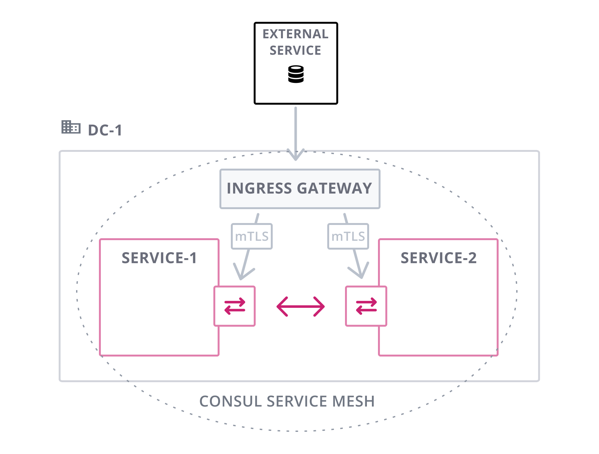
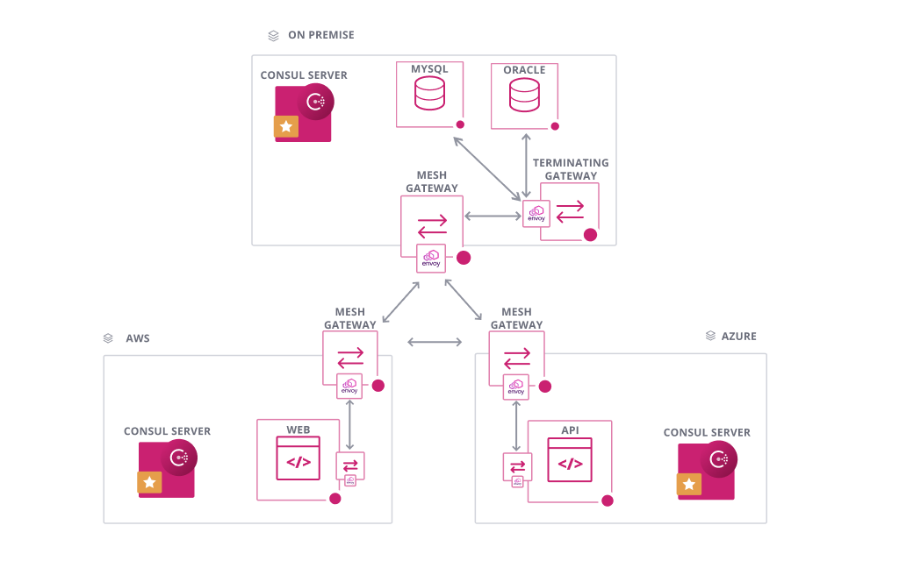
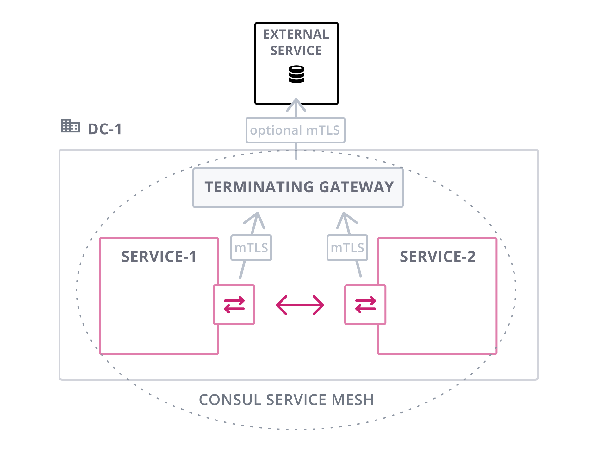
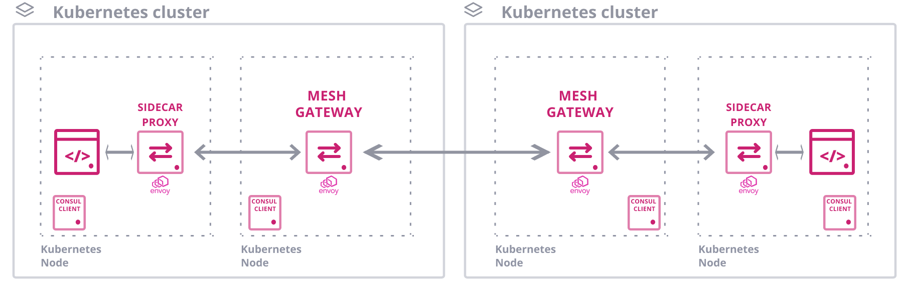
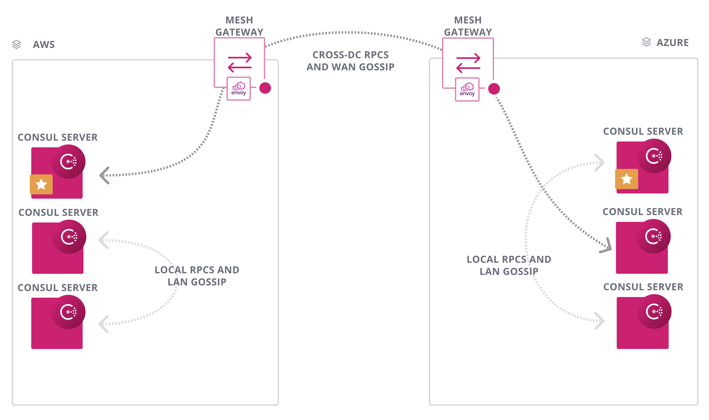

###### **[Consul 启动配置文件详解](https://github.com/hashicorp/consul/blob/v1.10.0/website/content/docs/k8s/helm.mdx "Consul 启动配置文件详解")**

* * *

###### **[consul-helm values.yaml](https://github.com/hashicorp/consul-helm/blob/master/values.yaml "consul-helm values.yaml")**

* * *

###### **[Ingress Gateways](https://www.consul.io/docs/connect/gateways/ingress-gateway#ingress-gateways "Ingress Gateways")**

###### **[Ingress Gateways on Kubernetes](https://www.consul.io/docs/k8s/connect/ingress-gateways "Ingress Gateways on Kubernetes")**

* * *

###### **[了解终端网关](https://learn.hashicorp.com/tutorials/consul/service-mesh-terminating-gateways "了解终端网关")**

###### **[Terminating Gateways](https://www.consul.io/docs/connect/gateways/terminating-gateway#terminating-gateways "Terminating Gateways")**

###### **[Terminating Gateways on Kubernetes](https://www.consul.io/docs/k8s/connect/terminating-gateways "Terminating Gateways on Kubernetes")**

* * *

###### **[Mesh Gateways](https://www.consul.io/docs/connect/gateways/mesh-gateway#mesh-gateways "Mesh Gateways")**

* * *

###### **[Secure Service Mesh Communication Across Kubernetes Clusters](https://learn.hashicorp.com/tutorials/consul/kubernetes-mesh-gateways "Secure Service Mesh Communication Across Kubernetes Clusters")**

* * *

###### **[WAN Federation Via Mesh Gateways](https://www.consul.io/docs/k8s/installation/multi-cluster#wan-federation-via-mesh-gateways "WAN Federation Via Mesh Gateways")**

* * *

###### **[Federation Between Kubernetes Clusters](https://www.consul.io/docs/k8s/installation/multi-cluster/kubernetes#federation-between-kubernetes-clusters "Federation Between Kubernetes Clusters")**

* * *

###### **[Federation Between VMs and Kubernetes](https://www.consul.io/docs/k8s/installation/multi-cluster/vms-and-kubernetes#federation-between-vms-and-kubernetes "Federation Between VMs and Kubernetes")**

* * *

###### **[Required Ports](https://www.consul.io/docs/install/ports#required-ports "Required Ports")**

* * *

###### **[Supported Versions](https://www.consul.io/docs/connect/proxies/envoy#supported-versions "Supported Versions")**

* * *

###### **[consul connect envoy](https://www.consul.io/commands/connect/envoy "consul connect envoy")**

* * *

* * *

* * *
