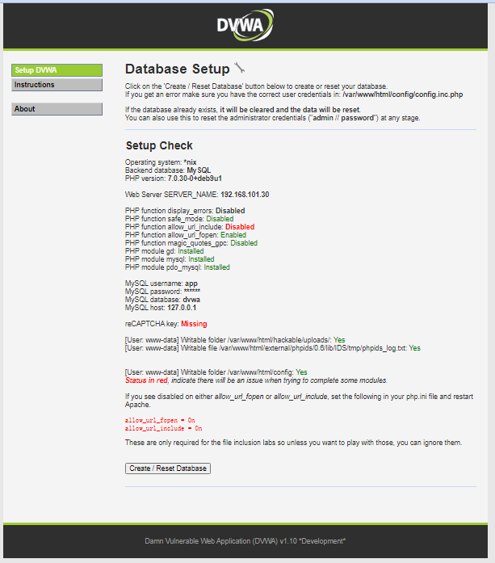
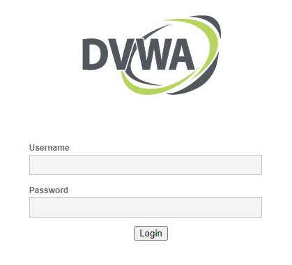
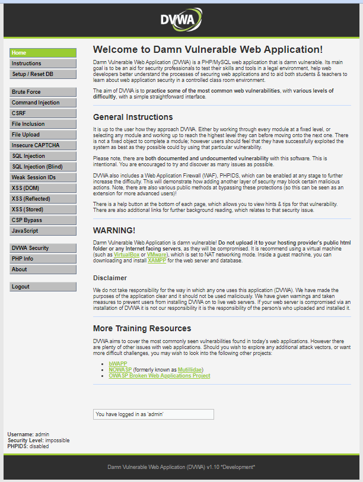
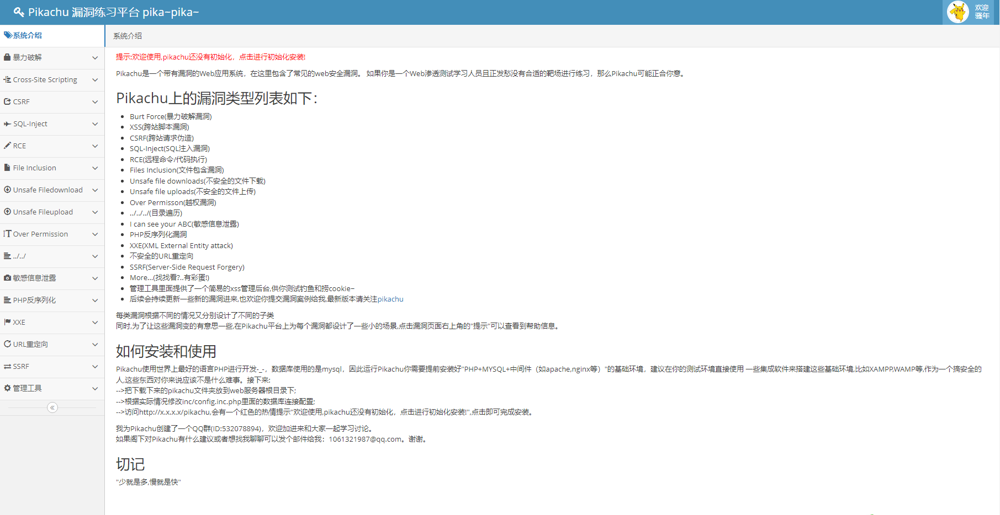

## 第一种：DVWA

### 启动服务

- ```shell
    docker run --rm -itd -p 80:80 \
      registry.cn-qingdao.aliyuncs.com/cn-aliyun/dvwa:1.0
    ```
    

1. web浏览器 打开查看 http://192.168.101.30/setup.php
    
    - [](http://qiniu.dev-share.top/image/linux/dvwa-01.png)
2. 点击 **Create/Reset Database**
    
    - 稍等一会，就会跳转到一个 登陆页面
    - [](http://qiniu.dev-share.top/image/linux/dvwa-02.png)
3. 输入用户密码 **admin/password**
    
    - [](http://qiniu.dev-share.top/image/linux/dvwa-03.png)

## 第二种：pikachu

### 启动服务

- ```shell
    docker run --rm -itd -p 81:80 \
      registry.cn-qingdao.aliyuncs.com/cn-aliyun/pikachu:1.0
    ```
    

1. web浏览器 打开查看 http://192.168.101.30:81

- [](http://qiniu.dev-share.top/image/linux/dvwa-04.png)
