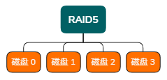
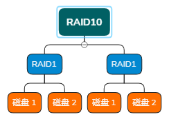

# 磁盘管理

## 硬盘分类

### 工作原理分类

- #### 机械硬盘
    
    - SAS
    - SATA
    - 等
    - **特点**
        
        - 寿命相对固态硬盘较长
        - 如果损坏/故障/方便维修
        - 读写速度慢（随机读写）
- #### 固态硬盘
    
    - SATA
    - PCI-E
    - 等
    - **特点**
        
        - 相对机械盘寿命较短/读写次数
        - 读写速度快
        - 性能高
        - 稳定性好

### 硬盘接口分类

- **SAS**
    
    - 通常服务器的接口都是 `SAS`
    - 特点是转速较高，我们常见的转速是`10k` `12k` `15k`
    - 存储容量相对小，我们常见的容量是`146G` `300G` `600G` `146` `1TB` `2TB` `3TB`
- **SATA**
    
    - 数据存储/速度慢/容量大
    - 我们常见的容量是 `1TB` `2TB` `4TB` `8TB` `300G` `12TB`
    - 我们常见的转速是`5400` `7200`
- **PCI-E**

### 硬盘尺寸分类

- **服务器硬盘**
    
    - 3.5寸
    - 2.5寸
    - 通常硬盘接口都是`SAS`

## 磁盘阵列

### 硬盘阵列组合`RAID`

- > 在组合磁盘阵列的时候需要知道两点
    > 
    > 1. 基于硬件的`阵列卡`支持，如 `Dell H310 MINI` `Dell H310P` `Dell H710P`
    >     - 高配的工作站， `RAID0/1`
    > 2. 硬盘的群组`一堆硬盘`，如 4块 6块 8块等
    >     - 1U的服务器
    >         - `R620` 2.5寸硬盘，他可以放8个
    >         - `R420` 3.5寸硬盘，他可以放4个
    
- 基本原理
    
    - 独立磁盘冗余阵列，通常我们称为`磁盘阵列`。
    - 简单的说`RAID`就是由多个独立的高性能的`磁盘驱动器(硬盘)`组成的`磁盘阵列组合`
    - 也叫一个子系统
- 为什么要用它？
    
    - 是为了获取更高的`性能`，**RAID`0`**，能够实现`容量的叠加`，例如：将两个 `1T` + `1T` 组合成 一块逻辑上看起来 `2T`的硬盘，更快的读取性能，读写速度也叠加。
    - 是为了获取更高的`容量`，**RAID`0`**，能够实现`容量的叠加`，例如：将两个 `1T` + `1T` 组合成 一块逻辑上看起来 `2T`的硬盘
    - 是为了获取更高的`冗余`，**RAID`1`**，能够实现`容量的叠加`，例如：将两个 `1T` + `1T` 组合成 一块逻辑上看起来 `2T`的硬盘
- 常见的**RAID**级别
    
    - **RAID`0`** 读写速度快，成本低，至少是`2块`物理硬盘；它是`条带式`的，没有冗余
        
        - **适用场景**：MySQL Slave
    - **RAID`5`** 具备有一定的性能，有一块盘是冗余，还可以设置一块热备，至少是`3块`硬盘，成本高、读取性能居中、奇偶校验
        
        - **适用场景**：通常存放`业务`对性能和安全要求都不是特别高的
        - 
    - **RAID`1`** 读写性能低，成本高，至少是`2块`物理硬盘；它是`镜像模式`的，100%冗余
        
        - **适用场景**：监控、系统盘、单独系统、重要
    - **RAID`10`** 读写速度快，成本极高，至少是`4块`物理硬盘，100%冗余
        
        - **适用场景**：通常存放`业务`对性能和安全要求都特别高，如：**数据库主库**、**集群的主节点**
        - 

## 常见命令

- `df -h`
    
- `df -Th`
    
- `fdisk -l` 查看磁盘分区列表
    
- `fdisk /dev/vdb` 磁盘分区
    
- `/etc/fstab`
    
    - ```shell
        [root@eric-mao (13:46:00) ~]# cat /etc/fstab
        
        # 磁盘分区的名称             挂载点   文件系统类型   默认值        文件系统参数(0~2)    文件系统参数(0~2)
                                                                          能否被dump来备份    是否开启开机检测扇区
                                                                          0 不检测            0 不检测
                                                                          1 每天备份          1 最早检测
                                                                          2 不定期备份        2 当1级完成以后再检测
        /dev/mapper/centos-root      /        xfs           defaults      0                   0
        ```
