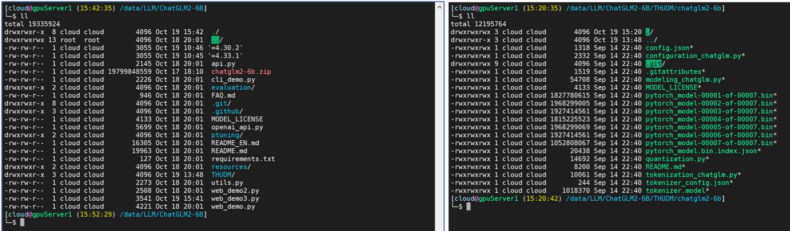
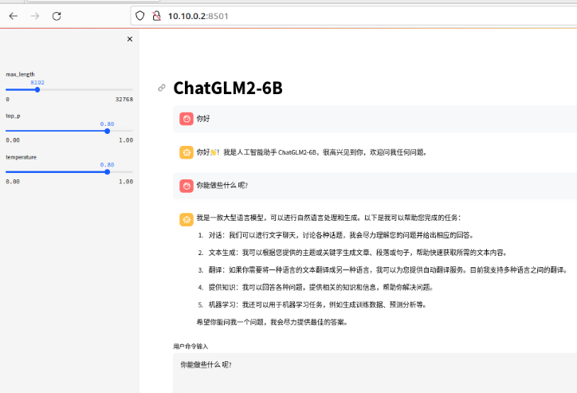

# ChatGLM2-6B调研文档

## **前置条件**

### 安装环境

- Python版本: >= 3.8.5, < 3.11
    
- Cuda版本: >= 11.7, 且能顺利安装Python
    

### **[安装conda](http://www.dev-share.top/2023/10/26/%e5%ae%89%e8%a3%85miniconda/ "安装conda")**

- 进入conda环境
    
    ```bash
    (base) [cloud@gpuServer1 (15:17:54) ~]
    └─# conda create -y -n chatglm2-6b-test python=3.10.13
    
    (base) [cloud@gpuServer1 (15:17:54) ~]
    └─# conda activate chatglm2-6b-test
    
    ```
    

* * *

### **[开发环境准备](http://www.dev-share.top/2023/10/27/%e5%ae%89%e8%a3%85-jupyter/ "开发环境准备")**

* * *

## **[ChatGLM2-6B 运行环境安装](https://github.com/THUDM/ChatGLM2-6B/tree/main#环境安装)**

- 首先需要下载本仓库：
    
    ```bash
    (chatglm2-6b-test) [cloud@gpuServer1 (15:17:54) ~]
    └─# git clone https://github.com/THUDM/ChatGLM2-6B
    
    (chatglm2-6b-test) [cloud@gpuServer1 (15:17:54) ~]
    └─# cd ChatGLM2-6B
    ```
    
- 然后使用 pip 安装依赖：
    
    ```bash
    (chatglm2-6b-test) [cloud@gpuServer1 (15:17:54) ~]
    └─# python -m pip install -r requirements.txt
    
    ## 下载下来的依赖有 5.5G
    ```
    
- 下载大模型权重
    
    ```bash
    (chatglm2-6b-test) [cloud@gpuServer1 (19:42:46) /data/LLM]
    └─# cd ChatGLM2-6B
    
    
    (chatglm2-6b-test) [cloud@gpuServer1 (19:42:46) /data/LLM/ChatGLM2-6B]
    └─# mkdir THUDM && cd THUDM/
    
    
    ## 下载chatglm2-6b到THUDM/目录中
    git lfs install
    git clone https://huggingface.co/THUDM/chatglm2-6b
    
    ```
    
- 其中 `transformers` 库版本推荐为 `4.30.2`，`torch` 推荐使用 2.0 及以上的版本，以获得最佳的推理性能。
    
- 
    

### 启动大模型Web服务

- #### `streamlit run web_demo2.py`
    
- ```bash
    (chatglm2-6b-test) [cloud@gpuServer1 (20:28:43) /data/LLM/ChatGLM2-6B]
    └─$ streamlit run web_demo2.py
    
    You can now view your Streamlit app in your browser.
    
    Local URL: http://localhost:8501
    Network URL: http://10.10.0.2:8501
    
    ```
    
- #### 使用浏览器访问
    
    - 控制台日志
        
    - ```bash
        ===================================BUG REPORT===================================
        Welcome to bitsandbytes. For bug reports, please run
        
        python -m bitsandbytes
        
        and submit this information together with your error trace to: https://github.com/TimDettmers/bitsandbytes/issues
        ================================================================================
        bin /home/cloud/.local/lib/python3.10/site-packages/bitsandbytes/libbitsandbytes_cuda121.so
        /home/cloud/.local/lib/python3.10/site-packages/bitsandbytes/cuda_setup/main.py:149: UserWarning: /home/cloud/miniconda3/envs/chatglm2-6b-tes1.0', 'libcudart.so.12.0'] as expected! Searching further paths...
        warn(msg)
        CUDA SETUP: CUDA runtime path found: /usr/local/cuda-12.1/lib64/libcudart.so
        CUDA SETUP: Highest compute capability among GPUs detected: 8.0
        CUDA SETUP: Detected CUDA version 121
        CUDA SETUP: Loading binary /home/cloud/.local/lib/python3.10/site-packages/bitsandbytes/libbitsandbytes_cuda121.so...
        Loading checkpoint shards: 100%|█████████████████████████████████████████████████████████████████████████████████████████████████████████████
        
        ```
        
    - 前端效果
        
    - 
        
- > **`注意`**：ChatGLM2-6B项目默认要求使用`CUDA`，我尝试使用`CPU`但`推理失败`了，目前原因不明，因为使用`CPU推理`也不重要，所以后来改为使用`GPU`。
    

### 只启动服务端

- ```bash
    (chatglm2-6b-test) [cloud@gpuServer1 (13:54:04) /data/LLM/ChatGLM2-6B]
    └─$ python api.py
    
    ===================================BUG REPORT===================================
    Welcome to bitsandbytes. For bug reports, please run
    
    python -m bitsandbytes
    
    and submit this information together with your error trace to: https://github.com/TimDettmers/bitsandbytes/issues
    ================================================================================
    bin /home/cloud/.local/lib/python3.10/site-packages/bitsandbytes/libbitsandbytes_cuda121.so
    /home/cloud/.local/lib/python3.10/site-packages/bitsandbytes/cuda_setup/main.py:149: UserWarning: /home/cloud/miniconda3/envs/chatglm2-6b-test did not contain ['libcudart.so', 'libcudart.so.11.0', 'libcudart.so.12.0'] as expected! Searching further paths...
    warn(msg)
    CUDA SETUP: CUDA runtime path found: /usr/local/cuda-12.1/lib64/libcudart.so
    CUDA SETUP: Highest compute capability among GPUs detected: 8.0
    CUDA SETUP: Detected CUDA version 121
    CUDA SETUP: Loading binary /home/cloud/.local/lib/python3.10/site-packages/bitsandbytes/libbitsandbytes_cuda121.so...
    Loading checkpoint shards: 100%|█████████████████████████████████████████████████████████████████████████████████████████████████████████████████████████████████| 7/7 [00:07<00:00,  1.08s/it]
    INFO:     Started server process [175595]
    INFO:     Waiting for application startup.
    INFO:     Application startup complete.
    INFO:     Uvicorn running on http://0.0.0.0:7861 (Press CTRL+C to quit)
    
    
    ```
    
- #### 使用命令行测试
    
- 部署在本地的`7861`端口(默认端口为8000)，通过 POST 方法进行调用
    
    ```bash
    (chatglm2-6b-test) [cloud@gpuServer1 (15:18:48) /data/LLM/ChatGLM2-6B]
    └─$ curl -sX POST "http://127.0.0.1:7861" \
       -H 'Content-Type: application/json' \
       -d '{"prompt": "你好", "history": []}' | jq
    
    
    ## 返回如下信息
    {
    "response": "你好👋！我是人工智能助手 ChatGLM2-6B，很高兴见到你，欢迎问我任何问题。",
    "history": [
      [
        "你好",
        "你好👋！我是人工智能助手 ChatGLM2-6B，很高兴见到你，欢迎问我任何问题。"
      ]
    ],
    "status": 200,
    "time": "2023-10-23 14:28:07"
    }
    
    ```
    

* * *

### web\_demo2.py文件说明(Streamlit)

- ```python
    # 引入必要的库
    from transformers import AutoModel, AutoTokenizer  # 用于处理模型和分词
    import streamlit as st  # 用于构建Streamlit应用
    
    # 配置Streamlit应用的标题、图标和布局
    st.set_page_config(
      page_title="ChatGLM2-6b 演示",  # 设置应用标题
      page_icon=":robot:",  # 设置应用图标
      layout='wide'  # 设置布局为宽屏
    )
    
    # 定义一个函数，用于从远程加载模型
    @st.cache_resource
    def get_model():
      tokenizer = AutoTokenizer.from_pretrained("THUDM/chatglm2-6b", trust_remote_code=True)  # 加载分词器
      model = AutoModel.from_pretrained("THUDM/chatglm2-6b", trust_remote_code=True).cuda()  # 加载模型并将其放在GPU上
      # 若要启用多显卡支持，可以使用下面的两行代码替代上一行，并根据实际显卡数量更改num_gpus的值
      # from utils import load_model_on_gpus
      # model = load_model_on_gpus("THUDM/chatglm2-6b", num_gpus=2)
      model = model.eval()  # 设置模型为评估模式
      return tokenizer, model
    
    # 获取分词器和模型
    tokenizer, model = get_model()
    
    # 设置Streamlit应用的标题
    st.title("ChatGLM2-6B")
    
    # 添加滑动条来调整参数
    max_length = st.sidebar.slider(
      'max_length', 0, 32768, 8192, step=1  # 最大长度的滑动条
    )
    top_p = st.sidebar.slider(
      'top_p', 0.0, 1.0, 0.8, step=0.01  # top_p参数的滑动条
    )
    temperature = st.sidebar.slider(
      'temperature', 0.0, 1.0, 0.8, step=0.01  # temperature参数的滑动条
    )
    
    # 初始化会话历史和过去的键值
    if 'history' not in st.session_state:
      st.session_state.history = []
    
    if 'past_key_values' not in st.session_state:
      st.session_state.past_key_values = None
    
    # 遍历历史消息并将其显示在聊天界面中
    for i, (query, response) in enumerate(st.session_state.history):
      with st.chat_message(name="user", avatar="user"):
          st.markdown(query)  # 显示用户的消息
      with st.chat_message(name="assistant", avatar="assistant"):
          st.markdown(response)  # 显示助手的回复
    with st.chat_message(name="user", avatar="user"):
      input_placeholder = st.empty()  # 显示用户输入消息的区域
    with st.chat_message(name="assistant", avatar="assistant"):
      message_placeholder = st.empty()  # 显示助手回复的区域
    
    # 获取用户输入
    prompt_text = st.text_area(label="用户命令输入",
                             height=100,
                             placeholder="请在这儿输入您的命令")
    
    # 添加“发送”按钮
    button = st.button("发送", key="predict")
    
    # 当按钮被点击时执行以下操作
    if button:
      input_placeholder.markdown(prompt_text)  # 在用户输入区域中显示用户的消息
      history, past_key_values = st.session_state.history, st.session_state.past_key_values
      # 使用模型生成聊天响应
      for response, history, past_key_values in model.stream_chat(tokenizer, prompt_text, history,
                                                                  past_key_values=past_key_values,
                                                                  max_length=max_length, top_p=top_p,
                                                                  temperature=temperature,
                                                                  return_past_key_values=True):
          message_placeholder.markdown(response)  # 在助手回复区域中显示聊天响应
    
      st.session_state.history = history  # 更新历史记录
      st.session_state.past_key_values = past_key_values  # 更新过去的键值
    
    ```
    

### api.py文件说明(FastAPI)

- ```python
    # 引入必要的库
    from fastapi import FastAPI, Request  # 用于构建FastAPI应用和处理HTTP请求
    from transformers import AutoTokenizer, AutoModel  # 用于处理模型和分词
    import uvicorn  # 用于运行FastAPI应用
    import json  # 用于处理JSON数据
    import datetime  # 用于处理日期和时间
    import torch  # 用于处理PyTorch模型
    
    # 设置GPU设备和ID
    DEVICE = "cuda"
    DEVICE_ID = "0"
    CUDA_DEVICE = f"{DEVICE}:{DEVICE_ID}" if DEVICE_ID else DEVICE
    
    # 清理GPU内存
    def torch_gc():
      if torch.cuda.is_available():
          with torch.cuda.device(CUDA_DEVICE):
              torch.cuda.empty_cache()
              torch.cuda.ipc_collect()
    
    # 创建FastAPI应用
    app = FastAPI()
    
    # 创建POST请求处理函数
    @app.post("/")
    async def create_item(request: Request):
      global model, tokenizer
      json_post_raw = await request.json()  # 从HTTP请求中提取JSON数据
      json_post = json.dumps(json_post_raw)  # 将JSON数据转换为字符串
      json_post_list = json.loads(json_post)  # 将JSON字符串解析为Python字典
      prompt = json_post_list.get('prompt')  # 获取用户输入的提示信息
      history = json_post_list.get('history')  # 获取聊天历史记录
      max_length = json_post_list.get('max_length')  # 获取最大生成文本长度
      top_p = json_post_list.get('top_p')  # 获取top_p参数
      temperature = json_post_list.get('temperature')  # 获取temperature参数
    
      # 使用模型生成聊天响应
      response, history = model.chat(tokenizer,
                                     prompt,
                                     history=history,
                                     max_length=max_length if max_length else 2048,  # 设置默认的最大长度为2048
                                     top_p=top_p if top_p else 0.7,  # 设置默认的top_p值为0.7
                                     temperature=temperature if temperature else 0.95)  # 设置默认的temperature值为0.95
    
      now = datetime.datetime.now()  # 获取当前日期和时间
      time = now.strftime("%Y-%m-d %H:%M:%S")  # 将日期和时间格式化为字符串
    
      # 构建响应数据
      answer = {
          "response": response,  # 聊天模型生成的响应
          "history": history,  # 更新后的聊天历史记录
          "status": 200,  # HTTP响应状态码（成功）
          "time": time  # 生成响应的时间戳
      }
    
      # 创建日志信息
      log = "[" + time + "] " + '", prompt:"' + prompt + '", response:"' + repr(response) + '"'
    
      print(log)  # 打印日志信息到控制台
    
      torch_gc()  # 执行GPU内存清理操作
    
      return answer  # 返回响应数据
    
    # 主程序入口
    if __name__ == '__main__':
      tokenizer = AutoTokenizer.from_pretrained("THUDM/chatglm2-6b", trust_remote_code=True)  # 加载分词器
      model = AutoModel.from_pretrained("THUDM/chatglm2-6b", trust_remote_code=True).cuda()  # 加载模型并将其放在GPU上
      # 若要启用多显卡支持，可以使用下面的三行代码替代上面两行，并根据实际显卡数量更改num_gpus的值
      # model_path = "THUDM/chatglm2-6b"
      # tokenizer = AutoTokenizer.from_pretrained(model_path, trust_remote_code=True)
      # model = load_model_on_gpus(model_path, num_gpus=2)
      model.eval()  # 设置模型为评估模式
      uvicorn.run(app, host='0.0.0.0', port=7861, workers=1)  # 运行FastAPI应用
    
    ```
    
- 
