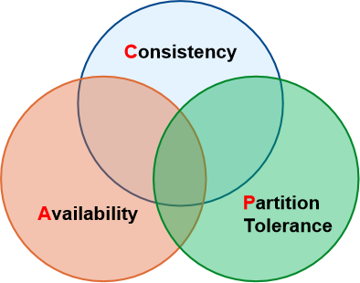
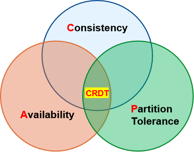
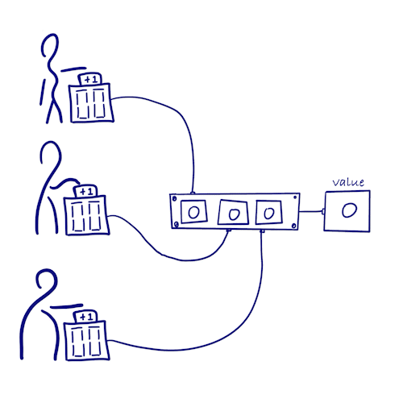

##### 前置资料

**[CRDT 简介](https://www.zxch3n.com/crdt-intro/crdt-intro/ "CRDT 简介")**

* * *

* * *

* * *

##### **分布式系统 CAP 原则** `Consistency`、`Availability`、`Partitiontolerance`

- **`C`** 一致性（Consistency） `每一次读都会收到最近的写的结果或报错；表现起来像是在访问同一份数据` 一致性不是绝对的，强调的是用户外部视角的数据一致，可以通过多副本、锁、读写阻塞等方式。
    
- **`A`** 可用性（Availability） `每次请求都能获取到非错的响应，但是不保证获取的数据为最新数据` 是指百分之百的可用性，任何情况都需要提供不可中断的服务
    
- **`P`** 分区容错性（Partition tolerance） `以实际效果而言，分区相当于对通信的时限要求` 是指网络分区容忍性，在分布式系统里由于网络分区是无法避免的，因此 **`P`** 是一定要满足的。
    

> - 因此，系统如果不能在时限内达成数据一致性，就意味着发生了分区的情况。 如果存在网络分区，则**必须在`一致性`和`可用性`之间进行`选择`**，所以「**完美的一致性**」与「**完美的可用性**」是**冲突**的。

* * *

> - **`注意`：没有分布式系统可以避免网络故障，因此通常必须容忍网络分区。**

* * *

##### 场景

| 系统 | 场景特点 | 数据库 |
| --- | --- | --- |
| CP | 发生网络分区时，保证强一致性，放弃一定可用性 | TiDB、Hbase、Zookeeper、PXC |
| AP | 发生网络分区时，优先保证可用性，不论是否一致 | DynamoDB、Cassandra、CoachDB |
| CA | 单机的数据系统 | MySQL、SqlServer |

* * *

* * *

* * *

##### CRDT

**`(conflict-free replicated data type) 无冲突复制数据类型`**

> - CRDT是一种可以在网络中的多台计算机上复制的数据结构，副本可以独立和并行地更新，不需要在副本之间进行协调，并保证不会有冲突发生。

* * *

> - **CRDT** 不提供「**完美的一致性**」，它提供了 **`强`最终一致性 `Strong` Eventual Consistency (`SEC`)** 。

* * *

> - 这代表进程 **A** 可能无法立即反映进程 **B** 上发生的状态改动，但是当 **A B** 同步消息之后它们二者就可以恢复一致性，并且**不需要解决潜在冲突**（**CRDT 在数学上就不让冲突发生**）。

* * *

> - 而「**强最终一致性**」是不与「**可用性**」和「**分区容错性**」冲突的，所以 **CRDT** 同时提供了这三者，提供了很好的 **`CAP`** 上的权衡。

* * *

`在 2012 年，CAP 定理的作者 Eric Brewer 写了一篇文章CAP Twelve Years Later: How the “Rules” Have Changed，解释了“CAP 特性三选二” 的描述其实具有误导性，实际上 CAP 只禁止了设计空间的很小一部分即存在分区时的完美可用性和一致性；而实际上在 C 和 A 之间的权衡的设计非常灵活，CRDT 就是一个很好的例子。`

* * *

###### 仅增长计数器(Grow-only Counter)

- 让每个副本只能递增自己的计数器 => 不用加锁同步 & 不会发生冲突
- 每个副本上同时保存着所有其他副本的计数值
- 发生次数 = 所有副本计数值之和
- 因为每个副本都只会更新自己的计数值，不会与其他计数器产生冲突，所以该类型在消息同步后便满足一致性

**`注意：` `CRDT计数器` 很棒，但它们不能用于模拟银行账户余额，因为合并可能会使计数器变为负数——并且在应用程序级别没有办法防止这种情况发生。换句话说，CRDT 是一种有效但微妙的最终一致性形式，不适用于固有的事务问题。**

* * *

###### 仅增长集 (Grow-only Set)

- Grow-only Set 当中的元素是只能增加不能减少的
- 将两个这样的状态合并就只需要做并集
- 因为元素只增不减，不存在冲突操作，所以该类型在消息同步后便满足一致性

* * *

* * *

* * *
