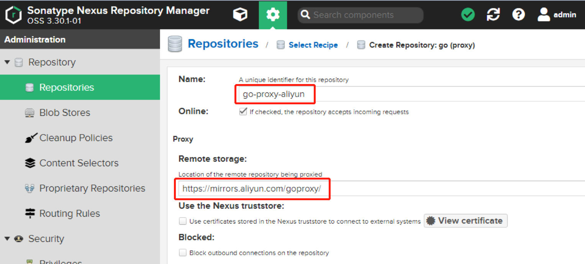
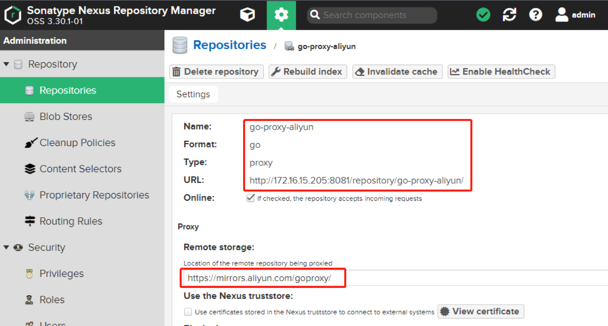
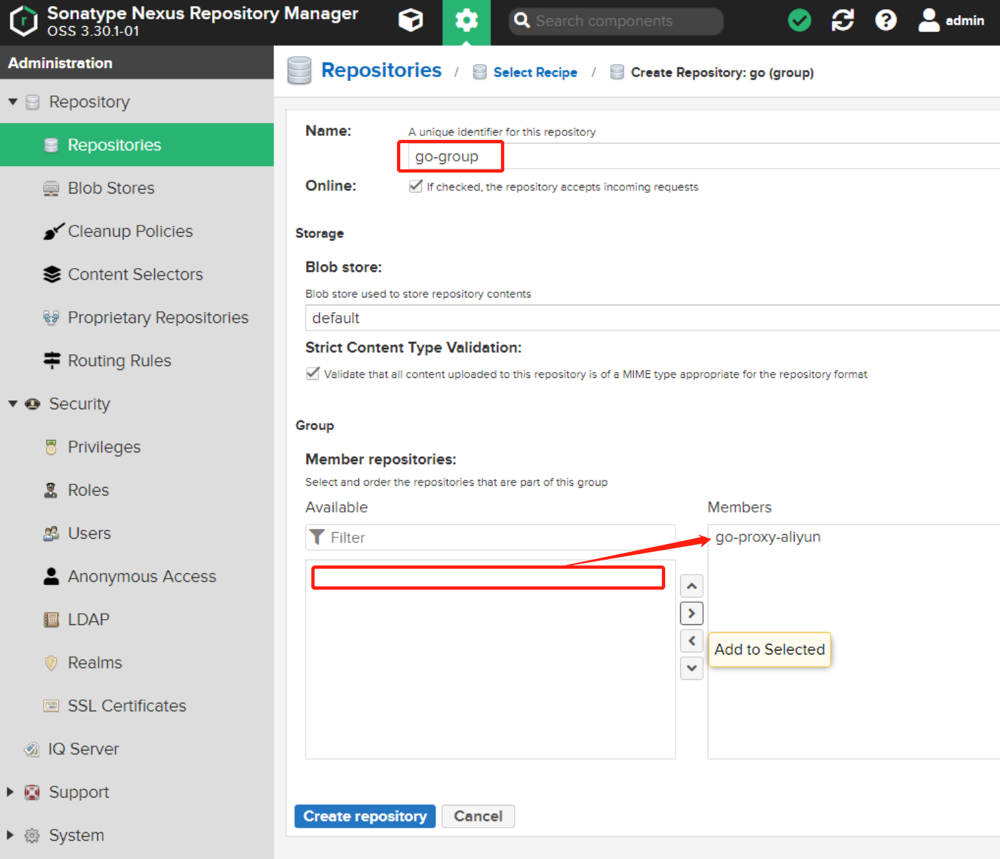
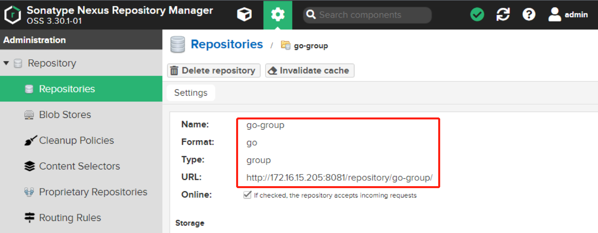

##### 前置条件

**[Docker-Compose 部署Nexus私服仓库](http://www.dev-share.top/2018/11/29/maven-%e7%b3%bb%e5%88%97%e4%ba%8c-docker-compose-%e9%83%a8%e7%bd%b2nexus%e7%a7%81%e6%9c%8d%e4%bb%93%e5%ba%93/ "Docker-Compose 部署Nexus私服仓库")**

* * *

* * *

* * *

##### Nexus 的使用思路

1. 先创建 **`代理`** 仓库，用来填写外部的代理地址
2. 再创建 **`组`** 仓库， **`组`** 仓库是给内部使用的 2.1 如果组仓库中没有依赖包，Nexus就会自动从代理仓库中配置的**外部地址**去下载

* * *

###### 新建 **`type`** 为 **`proxy`** 的 **`go repository`**




 **阿里云代理地址：https://mirrors.aliyun.com/goproxy/**

* * *

###### 新建 **`type`** 为 **`group`** 的 **`go repository`**

  **内部使用的私服地址：http://172.16.15.205:8081/repository/go-group/**

* * *

* * *

* * *

##### 设置Golang代理

```ruby
go env -w GOPROXY=http://172.16.15.205:8081/repository/go-group/
```

###### 查看

```ruby
## Win 系统查看方式
E:\maosiyu> go env find GOPROXY
http://172.16.15.205:8081/repository/go-group/


## Linux 系统查看方式
[root@maosiyu ~]# go env | grep GOPROXY
GOPROXY="http://172.16.15.205:8081/repository/go-group/"
[root@maosiyu ~]#


```

* * *

* * *

* * *
