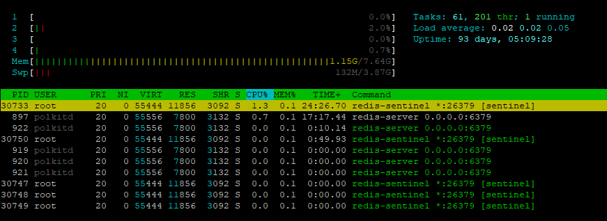

# 进程管理

## 进程属性

1. `PID` 进程ID
2. `PPID`父进程ID
3. `UID` 启动进程用户ID
4. `GID` 进程归属的组ID
5. `STAT`进程的状态。
    
    - **R** 进程正在`运行`中
    - **S** 进程正在`睡眠`
        
        - 在Linux中它主要是靠信号量来控制进程，可以靠信号来唤醒进程
        - Windows是靠队列来控制的
    - **T** 目前进程正在`侦测`或者`停止`了
    - **Z** 僵尸进程`Zombie`
        
        - 意思就是说，这个程序已经停止了，但他的父进程，没有办法杀死它
    - **D** 不可中断的进程
    - 特殊状态
        
        - **<** 表示进程运行的优先级`高`
        - **N** 表示进程运行的优先级`低`
        - **L** 表示进程有`页面文件`锁定在内存中
        - **s** 表示进程是控制进程
        - **I** 表示进程是`多线程`
        - **+** 表示当前进程运行在前台(在终端上运行，关闭终端，程序会退出)
6. \`\`进程优先级
7. \`\`进程所连接的终端名
8. \`\`进程所占用的资源，**CPU**、**内存**
9. `VSZ` 进程占用虚拟内存的大小
10. `RSS` 进程占用物理内存的大小
11. `TTY` 进程占用的终端

### PS命令查看进程

- 常用的命令参数
    
- `ps -aux`
    
    - `a` 显示当前终端关联的所有进程
    - `u` 基于用户的格式显示
    - `x` 显示所有进程，不以终端来区分
- `ps -ef`
    
    - `e` 显示所有的进程
        
    - `f` 显示完成格式的输出
        
    - ```shell
        [root@eric-mao (14:56:43) ~]# ps -ef | grep -E 'PID|redis'
        UID        PID  PPID  C STIME TTY          TIME CMD
        polkitd    897   877  0 Jan10 ?        00:11:03 redis-server 0.0.0.0:6379
        root      6913  6435  0 14:58 pts/0    00:00:00 grep --color=auto -E PID|redis
        root     30733 30712  0 Jan10 ?        00:15:43 redis-sentinel *:26379 [sentinel]
        
        ```
        
- `uptime` 系统负载
    
    - ```shell
        [root@eric-mao (16:30:02) ~]# uptime
        当前时间    系统运行时间            几个用户    系统负载平均值    1分钟平均负载，  5分钟平均负载，  15分钟平均负载      
        16:30:18   up 93 days, 4:31,    1 user,    load average:   0.06,          0.03,          0.05
        [root@eric-mao (16:30:18) ~]#
        ```
        
- `htop`
    
    - 
